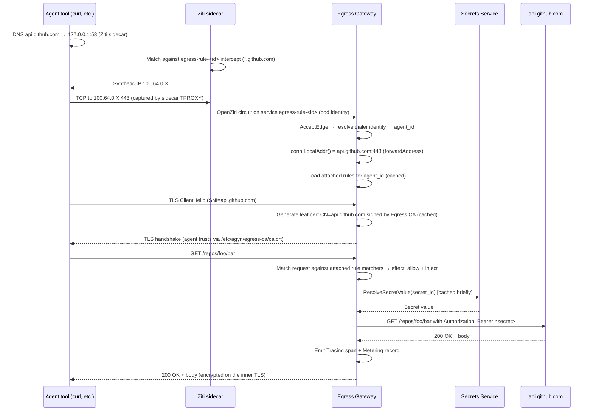

# Egress Gateway

## Overview

The Egress Gateway is a standalone service that mediates outbound HTTP and HTTPS traffic from agent workloads when that traffic targets a destination covered by an attached [Egress Rule](resource-definitions.md#egress-rule). It terminates TLS using a platform-managed CA, evaluates the rules attached to the originating agent, injects header credentials (resolving secret references via the [Secrets](secrets.md) service), and forwards the request to the upstream destination.

The gateway is reached via the OpenZiti overlay — there is no in-pod proxy and no client-side configuration. Traffic to a rule-covered destination is intercepted by the existing Ziti sidecar (using a per-rule OpenZiti service with a wildcard-hostname intercept) and tunneled to the gateway. Traffic to destinations not covered by any rule flows directly from the agent container, bypassing the gateway entirely. This is **default-allow** at the egress layer — see [Product — Egress Gateway](../product/egress-gateway/egress-gateway.md) for the user-facing model.

This document describes the **Egress Gateway** data-plane service. The control-plane companion is the [EgressRules service](egress-rules-service.md), which owns the `EgressRule` resource lifecycle, per-rule OpenZiti service provisioning, attachment policies, and reconciliation.

## What is and is not intercepted

| Class | Path | Owner |
|---|---|---|
| `.ziti` hostnames (`gateway.ziti`, `llm-proxy.ziti`, `tracing.ziti`, exposed services) | Existing OpenZiti services bound by their respective platform services | Each platform service |
| Hostnames matched by an attached rule's `matcher.domain_pattern` on a port in `matcher.ports` | Per-rule OpenZiti service → Egress Gateway → upstream | Egress Gateway |
| Hostnames not matched by any attached rule | Direct from the agent container's `eth0` to public internet (subject to NetworkPolicy) | Pod's CNI |
| Cluster-internal addresses (cluster pod CIDR, cluster service CIDR, operator-declared internal CIDRs) | Blocked by the workload-namespace NetworkPolicy installed with the [k8s-runner](k8s-runner.md#workload-egress-networkpolicy) | Cluster network policy |
| Pod-local (`localhost`, MCP sidecars on loopback) | Never leaves the pod | — |

Egress rules apply to traffic from any container in the agent's pod (agent, MCP sidecars, hooks) because they share the pod network namespace. There is no per-container scoping in v1.

## Responsibilities

| Responsibility | Description |
|---|---|
| **Connection acceptance** | Bind every per-rule Ziti service via the OpenZiti SDK; accept connections, resolve the caller's `agent_id` from the OpenZiti identity. |
| **Original destination recovery** | Read the original destination IP and port from OpenZiti connection metadata (provided by `host.v1.forwardAddress: true`). |
| **TLS termination (HTTPS)** | Peek the TLS ClientHello to recover the SNI hostname; generate a leaf certificate for that hostname signed by the [Egress CA](#egress-ca); complete the TLS handshake with the agent. |
| **HTTP parsing (HTTP)** | Read the request line and headers from a plaintext HTTP connection. |
| **Rule evaluation** | Look up the agent's attached rules; evaluate each rule's `matcher` against the request's method, host, and path; combine the matched rules' `effect` blocks. |
| **Secret resolution** | For matched rules whose `effect.inject` headers reference a secret, resolve via the [Secrets](secrets.md) service. |
| **Upstream forwarding** | Open a fresh connection to the real destination (using public CAs for upstream TLS) with the injected headers; stream the response back through the agent-facing connection. |
| **Observability** | Emit one tracing span and one metering record per request. |

## Classification

The Egress Gateway is a **data plane** service — it sits on the live request path of agent tool calls.

| Aspect | Detail |
|---|---|
| **Plane** | Data |
| **Language** | Go |
| **Repository** | `agynio/egress-gateway` |
| **API** | OpenZiti SDK bind (no external HTTP surface) |
| **State** | In-memory rule cache (invalidated via [Notifications](notifications.md)); leaf certificate cache (LRU, short TTL) |
| **External dependencies** | [EgressRules service](egress-rules-service.md) (rule lookup via `ListEgressRulesByAgent`), [Agents](agents-service.md) (`ResolveAgentIdentity`), [Secrets](secrets.md) (`ResolveSecretValue`), [Ziti Management](openziti.md) (`ResolveIdentity`), [Tracing](tracing.md), [Metering](metering.md), [Notifications](notifications.md) |

## OpenZiti Integration

The Egress Gateway binds the OpenZiti services that represent egress rules. Each rule has its own OpenZiti service named `egress-rule-<rule_id>`, provisioned and reconciled by the [EgressRules service](egress-rules-service.md). The gateway binds them all via a single `serviceRoles` policy.

| Aspect | Detail |
|---|---|
| Role attributes (gateway identity) | `["egress-gateway-hosts"]` |
| Service role (per-rule services) | `["egress-services"]` (the gateway binds by role, not by individual service) |
| Enrollment | Self-enrollment via Ziti Management at pod startup (same as Gateway and LLM Proxy) |
| SDK usage | `zitiContext.ListenWithOptions("@egress-services", ...)` (binds every service tagged `egress-services`) |

### Static Policies

Provisioned at infrastructure bootstrap:

| Policy | Type | Identity Roles | Service Roles | Purpose |
|---|---|---|---|---|
| `egress-gateway-bind` | Bind | `#egress-gateway-hosts` | `#egress-services` | The Egress Gateway hosts every per-rule egress service |

### Dynamic Per-Rule Resources

The [EgressRules service](egress-rules-service.md) owns the dynamic OpenZiti resources for each rule and each attachment. The Egress Gateway reads them but does not provision or delete them.

| Resource | Owner | Created when | Deleted when |
|---|---|---|---|
| OpenZiti service `egress-rule-<rule_id>` (with attached `intercept.v1` and `host.v1` configs) | EgressRules service | Rule is created | Rule is deleted |
| Dial policy per attachment | EgressRules service | Rule is attached to an agent | Rule is detached or deleted, or the agent is deleted |

#### Service Configs

**`intercept.v1`** — tells dialer-side Ziti sidecars which traffic to capture:

```json
{
  "protocols": ["tcp"],
  "addresses": ["<rule.matcher.domain_pattern>"],
  "portRanges": [
    { "low": <rule.matcher.ports[i]>, "high": <rule.matcher.ports[i]> }
    /* one entry per port in rule.matcher.ports (default [80, 443]) */
  ]
}
```

The sidecar's built-in DNS resolves any hostname matching `matcher.domain_pattern` to a synthetic `100.64.0.0/10` IP, intercepts connections on the listed ports, and tunnels them via OpenZiti to the gateway. Method and path matching are not expressible in `intercept.v1` — they live in the rule's `matcher.methods` and `matcher.path_pattern` and are evaluated at the gateway after the connection arrives.

**`host.v1`** — tells the gateway-side SDK to expose the original destination:

```json
{
  "protocol": "tcp",
  "forwardAddress": true,
  "forwardPort": true,
  "forwardProtocol": true,
  "allowedAddresses": ["0.0.0.0/0"],
  "allowedPortRanges": [{ "low": 1, "high": 65535 }]
}
```

With `forwardAddress: true`, the accepted SDK connection's `LocalAddr()` returns the destination IP and port the agent's connection was targeted at. The gateway uses this together with the SNI (for HTTPS) or `Host` header (for HTTP) to identify the upstream.

#### Dial Policy per Attachment

When a rule is attached to an agent, the EgressRules service issues:

```
CreateServicePolicy(
  type: Dial,
  identityRoles: ["#agent-<agent_id>"],
  serviceRoles:  ["@<openziti_service_id>"],
)
```

`<openziti_service_id>` is the actual OpenZiti service ID returned by Ziti Management and stored on the `EgressRule` row. It is not the `egress-rule-<rule_id>` service name.

The `agent-<agent_id>` role attribute is the per-agent OpenZiti role already used by [Expose Service](expose-service.md) (assigned to every agent workload at identity creation — see [OpenZiti — Identity Creation Request](openziti.md#identity-creation-request)). One Dial policy per `(rule, agent)` pair. Detaching the rule deletes the policy.

## Request Flow

End-to-end for an agent calling `https://api.github.com/repos/foo/bar`:



### Pre-TLS Access Check

On the first stage of a TLS-bearing connection, the gateway already knows the destination host (from `forwardAddress`) and port. If every attached rule that matches the host has `effect.action: deny` — even without the method and path the gateway cannot yet see — the gateway closes the connection with `403` before generating a leaf certificate or doing the TLS handshake. This is a cheap pre-filter; the full evaluation runs again after the request line is visible (when method and path are known).

### Plain HTTP

For port 80 traffic, the gateway does not perform TLS termination. It reads the HTTP request line and headers directly from the OpenZiti connection, runs the full rule match (method + host + path), applies injection, and forwards.

## Rule Evaluation

For each request (after TLS termination if HTTPS):

1. **Collect** all rules attached to the agent. Cached in memory; invalidated via [Notifications](notifications.md) (see [Caching and Invalidation](#caching-and-invalidation)).
2. **Filter by matcher** — for each rule, the request matches if all three of `matcher.domain_pattern` (against the SNI/Host), `matcher.methods` (against the HTTP method; empty = any), and `matcher.path_pattern` (against the path; empty = any) hold.
3. **Decide reachability from `effect.action`:**
   - Any matching rule with `effect.action: deny` → respond `403 Forbidden`.
   - Else continue to injection. (A request that reached the gateway is by definition covered by at least one attached rule's `intercept.v1` — the absence of a matching `effect.action: allow` is not itself a denial, since rules with `effect.action` unset are permitted to pass through for the sake of injection-only rules.)
4. **Apply `effect.inject`:**
   - For each matching rule with non-empty `effect.inject`, resolve each header's credential (literal `value`, or via [Secrets](secrets.md) for `secret_id`). If the header has a `scheme` (`bearer` / `basic`), the emitted value is `<Scheme> <credential>`; otherwise the credential is emitted verbatim. See [Resource Definitions — Header](resource-definitions.md#header).
   - Merge header sets across all matching rules. On name collision, the rule with the lexicographically later `id` wins.
   - Headers injected by rules **override** headers the agent's tool supplied for the same name — same precedence rule the LLM Proxy uses for `authMethod` injection ([llm-proxy.md:150](llm-proxy.md)).
5. **Forward** to the upstream destination over a fresh connection. TLS to the upstream uses the gateway pod's standard system CA bundle (no platform CA involvement for the upstream leg).
6. **Stream** the response (and request body for `POST`/`PUT` etc.) bidirectionally. The agent's TLS session is decrypted at the gateway, re-encrypted as needed for the upstream leg.

### Conflict Semantics

| Situation | Resolution |
|---|---|
| Two matching rules: one `effect.action: allow`, one `effect.action: deny` | Deny wins. |
| Two matching rules contribute the same header name via `effect.inject` | Lexicographically later rule `id` wins. |
| Caller supplied a header that a rule also produces via `effect.inject` | Injection wins. |

## Caching and Invalidation

| Cache | Lifetime | Invalidation |
|---|---|---|
| Attached rules per `agent_id` | In-memory, no TTL | [Notifications](notifications.md) on `egress_rule.updated` and `egress_rule_attachment.updated` |
| Resolved secret values per `secret_id` | TTL ~60s | TTL expiry; refresh on demand |
| Leaf certificates per `(SNI, ca_fingerprint)` | LRU, ~10-minute TTL | TTL expiry; capacity eviction |

Cache misses fall through to the source services (EgressRules, Secrets). Cold-cache latency for a first request to an agent's rule set is one `ListEgressRulesByAgent` call to the EgressRules service plus, if needed, one Secrets-service `ResolveSecretValue` call per injected secret-backed header.

## Propagation Timing

A rule change (create, attach, edit, detach, delete) flows through this sequence before it affects traffic:

| Step | Latency |
|---|---|
| EgressRules service writes DB, calls Ziti Management, publishes Notification | <100ms typical |
| Egress Gateway receives Notification, invalidates the affected `agent_id` cache | <1s |
| OpenZiti tunneler in the agent pod polls the Controller and picks up the new service config (or removes a deleted one) | up to 10s (`--refresh` default) |
| Next DNS query from the agent for the rule's domain returns the synthetic IP (or stops returning it on detach/delete) | immediate after tunneler update |

**SLO: rule changes are reflected in the next request within 15 seconds.** The tunneler poll interval is the dominant term. Connections established before the change continue using the previous configuration until they close on their own or are torn down by the OpenZiti policy revocation (for detachments).

## Egress CA

The Egress CA is a single root certificate authority owned by the platform. Its private key signs the per-request leaf certificates the gateway presents during TLS interception; its public certificate is installed into every agent container's trust store.

### Lifecycle

The CA is provisioned and maintained by [cert-manager](https://cert-manager.io/) in the platform cluster. Bootstrap (e.g., Terraform) installs cert-manager once and applies the following resources:

```yaml
# Self-signed Issuer
apiVersion: cert-manager.io/v1
kind: ClusterIssuer
metadata:
  name: agyn-selfsigned
spec:
  selfSigned: {}

# Egress CA Certificate
apiVersion: cert-manager.io/v1
kind: Certificate
metadata:
  name: egress-ca
  namespace: agyn-platform
spec:
  isCA: true
  commonName: agyn-egress-ca
  duration: 87600h         # 10y for v1
  renewBefore: 8760h       # 1y
  privateKey:
    algorithm: ECDSA
    size: 256
    rotationPolicy: Always
  secretName: egress-ca
  issuerRef:
    name: agyn-selfsigned
    kind: ClusterIssuer
```

The resulting Secret `egress-ca` carries `tls.crt` (public CA cert) and `tls.key` (CA private key).

| Aspect | Detail |
|---|---|
| Storage (private key + cert) | Kubernetes Secret `egress-ca` in the platform namespace, managed by cert-manager. |
| Egress Gateway access | Mounts the `egress-ca` Secret read-only at `/var/run/agyn/egress-ca/`. Reads `tls.key` for leaf signing and `tls.crt` to stamp leaves against. |
| Public cert distribution | The [Agents Orchestrator](agents-orchestrator.md) reads `tls.crt` from the same Secret and includes the bytes inline in every workload spec it sends to runners (see [CA Trust Distribution](#ca-trust-distribution-to-agent-containers)). |
| Rotation | cert-manager renews the CA per `renewBefore`. The new key + cert appear in the Secret; the gateway picks them up on next start, and new workloads pick up the new public cert. Existing workloads continue with the previously-distributed CA bytes until restarted. Operational procedure: cert-manager rotation event → drain workloads → restart. |

### Leaf Certificate Generation

For each new SNI the gateway sees:

1. Look up the `(SNI, ca_fingerprint)` pair in the LRU cache. On hit, reuse.
2. On miss, generate an in-process leaf certificate: SAN contains the SNI hostname, validity ~10 minutes, signed by the root private key. Insert into the cache.

Leaf certificates exist only in memory in the gateway pod. They are not written to disk, not transmitted to any other service, not persisted across gateway restarts.

## CA Trust Distribution to Agent Containers

The Orchestrator owns CA distribution end-to-end. **The same code path runs for in-cluster and external runners** — neither cert-manager nor any other trust-distribution machinery is required in the runner's cluster. The runner just creates pods from the spec it receives.

### Mechanism

At workload assembly:

1. The Orchestrator reads `tls.crt` from the platform-cluster `egress-ca` Secret.
2. It populates the new `inline_files` field on `StartWorkloadRequest`:

   ```
   inline_files: {
     "/etc/agyn/egress-ca/ca.crt": <PEM bytes of tls.crt>
   }
   ```

3. It sets the standard CA-trust env vars on every container (agent, MCP sidecars, hooks):

   ```
   SSL_CERT_FILE=/etc/agyn/egress-ca/ca.crt
   REQUESTS_CA_BUNDLE=/etc/agyn/egress-ca/ca.crt
   NODE_EXTRA_CA_CERTS=/etc/agyn/egress-ca/ca.crt
   CURL_CA_BUNDLE=/etc/agyn/egress-ca/ca.crt
   SSL_CERT_DIR=/etc/agyn/egress-ca
   ```

4. The runner materializes `inline_files` into per-pod Kubernetes primitives (Secret + projected volume) and mounts them read-only at the requested paths in each container the orchestrator lists (agent, MCP sidecars, hooks) — per-container, not pod-wide.

The env vars cover `curl`, Python (`requests`, `httpx`, `urllib3`), Node (`https`, `undici`, `fetch`), Go (`net/http`), and Ruby (`Net::HTTP`). They do **not** cover Java (which uses `cacerts`), .NET (per-runtime trust store), or tools that hardcode CA paths. Users whose agents need those clients install the CA into the appropriate path in their container image — see [Product — Egress Gateway — TLS interception](../product/egress-gateway/egress-gateway.md#tls-interception).

### Why a single mechanism for in-cluster and external

trust-manager (cert-manager's sibling for trust-bundle distribution) would automate ConfigMap creation in the workload namespace, but only within the cluster it runs in. Adopting it would create two code paths (in-cluster pulls from a trust-manager ConfigMap, external receives inline bytes) and would force external runners to either install trust-manager themselves or accept a different code path on the platform side. We deliberately keep external runners zero-config — they accept a pod spec and create pods; they don't need to know what cert-manager, trust-manager, or OpenZiti are. Inline bytes in the workload spec is the only mechanism the orchestrator uses, and the only mechanism the runner has to understand.

The cost is a few KB of CA cert data per workload start, which is negligible.

## Authentication

### Caller (Agent Workload)

Identity comes from the OpenZiti mTLS connection. Same path as [LLM Proxy](llm-proxy.md#authentication):

1. Gateway accepts an `edge.Conn` from the SDK.
2. `conn.GetDialerIdentityId()` returns the OpenZiti identity UUID of the agent pod's Ziti sidecar.
3. Gateway calls `ZitiManagement.ResolveIdentity` to map the OpenZiti identity to `(identity_id, identity_type, workload_id)`.
4. The `agent_id` is derived from the workload via the [Agents](agents-service.md) service (`ResolveAgentIdentity`), cached on the connection.

There is no app-level token. The agent's workload identity is the only credential needed.

### Upstream (Real Destination)

The gateway connects to upstream destinations using the gateway pod's standard CA bundle (e.g., `/etc/ssl/certs/ca-certificates.crt` from the base image). The Platform CA is not used for outbound — only inbound (agent-facing) TLS termination.

## Authorization

The Egress Gateway performs no OpenFGA checks of its own. Caller identity is established by the OpenZiti mTLS connection (see [Authentication](#authentication)); the agent's attached rules are the access-control surface, evaluated per request. The gateway's outbound calls to other services are internal-only over Istio, gated by Istio `AuthorizationPolicy` restricted to the gateway's ServiceAccount.

Rule and attachment CRUD authorization lives in the [EgressRules service](egress-rules-service.md#authorization) — see [Authorization — EgressRules Service](authz.md#egressrules-service).

## Observability

### Tracing

One span per outbound request. Span name: `egress.request`. Attributes:

| Attribute | Value |
|---|---|
| `egress.method` | HTTP method (`GET`, `POST`, …) |
| `egress.host` | Destination host (e.g., `api.github.com`) — from SNI or `Host` header |
| `egress.port` | Destination port |
| `egress.path` | Request path with query string stripped |
| `egress.outcome` | `allow`, `deny`, `upstream_error`, `tls_error` |
| `egress.matched_rule_ids` | Comma-separated UUIDs of all rules whose `effect.action` or `effect.inject` was applied |
| `agyn.agent.id` | Agent UUID resolved from the OpenZiti identity |
| `agyn.workload.id` | Workload UUID |
| `agyn.organization.id` | Organization owning the agent |
| `egress.upstream_status` | HTTP status returned by the upstream (when reached) |
| `egress.bytes_in` / `egress.bytes_out` | Request / response byte counts |

Header values, request bodies, and response bodies are not recorded.

### Metering

One `COUNT` record per request to the [Metering](metering.md) service, fire-and-forget after the response is returned.

| unit | value | labels | idempotency_key |
|---|---|---|---|
| `COUNT` | 1 | `resource=egress`, `agent_id`, `host`, `outcome` (`allow` \| `deny` \| `upstream_error`) | `request_id` |

## Configuration

| Field | Source | Description |
|---|---|---|
| `LISTEN_ADDRESS` | Deployment config | Internal admin/health HTTP listen address (not for traffic — traffic comes via OpenZiti) |
| `ZITI_MANAGEMENT_ADDRESS` | Deployment config | gRPC address of [Ziti Management](openziti.md) (`ResolveIdentity`) |
| `EGRESS_RULES_SERVICE_ADDRESS` | Deployment config | gRPC address of the [EgressRules service](egress-rules-service.md) (`ListEgressRulesByAgent`) |
| `AGENTS_SERVICE_ADDRESS` | Deployment config | gRPC address of [Agents](agents-service.md) (`ResolveAgentIdentity` — OpenZiti identity → `agent_id`) |
| `SECRETS_SERVICE_ADDRESS` | Deployment config | gRPC address of [Secrets](secrets.md) (`ResolveSecretValue`) |
| `NOTIFICATIONS_ADDRESS` | Deployment config | gRPC address of [Notifications](notifications.md) |
| `TRACING_ADDRESS` | Deployment config | gRPC address of [Tracing](tracing.md) |
| `METERING_ADDRESS` | Deployment config | gRPC address of [Metering](metering.md) |
| `EGRESS_CA_KEY_PATH` | Deployment config | Path to the Egress CA private key (mounted from `egress-ca` Secret, e.g., `/var/run/agyn/egress-ca/tls.key`) |
| `EGRESS_CA_CERT_PATH` | Deployment config | Path to the Egress CA public certificate (e.g., `/var/run/agyn/egress-ca/tls.crt`) |
| `LEAF_CERT_TTL` | Deployment config | TTL for generated leaf certificates (default 10m) |
| `LEAF_CERT_CACHE_SIZE` | Deployment config | LRU capacity for leaf certificates (default 4096) |
| `SECRET_CACHE_TTL` | Deployment config | TTL for resolved secret values (default 60s) |

## Reliability

- **Stateless** — the gateway has no persistent state. All caches are in-memory and reconstruct from source services on restart.
- **Replicas** — the gateway can run with multiple replicas. Each binds the same `egress-services` role; OpenZiti load-balances dial requests across binders. Each replica maintains its own caches and subscribes independently to Notifications; there is no shared cache state.
- **HTTP/2 support** — both legs (agent-facing and upstream) negotiate HTTP/2 via ALPN. The gateway must handle HTTP/2 frame multiplexing on the TLS termination layer. Most modern destinations (GitHub, OpenAI, Anthropic) prefer HTTP/2 by default.
- **Pod outbound** — the gateway pod makes outbound TLS connections to arbitrary upstream destinations on the public internet. The gateway pod's namespace must permit unrestricted egress (no NetworkPolicy blocking outbound, or a permissive one that allows it).
- **Graceful degradation** — if the Secrets service is unreachable, requests matched by a rule whose `effect.inject` requires secret resolution return `502 Bad Gateway` with a clear error message identifying the failure (e.g., `"failed to resolve secret: <secret_id> (timeout / not_found / unavailable)"`). Rules with `effect.inject` empty or containing only literal-valued headers continue to evaluate. If the EgressRules service is unreachable, cached rules continue to apply; new agents have no rules until cache populates.
- **Missing secrets** — if a rule's `effect.inject` references a `secret_id` that has been deleted from the Secrets service, the gateway returns `502 Bad Gateway` with `"egress rule <id> references missing secret <secret_id>"`. The rule should be detached or its `effect.inject` updated. The Secrets service refuses to delete a Secret while any active EgressRule references it (referential integrity check).
- **WebSocket / HTTP upgrade** — requests with `Upgrade: websocket` (or any other `Upgrade` header) are refused with `426 Upgrade Required`. The gateway does not proxy upgraded connections in v1.
- **CA rotation** — cert-manager rotates the CA per the `Certificate` resource's `renewBefore`. The gateway picks up the new private key and cert on its next pod restart. Live agent connections holding leaves signed by the previous CA continue until those connections close; new connections get leaves signed by the new CA. As long as both old and new CA certs remain valid trust anchors during the rotation window (cert-manager's standard rotation includes overlap), there is no break for in-flight traffic. Existing agent workloads continue to trust only the CA they were started with; agent workloads must be drained and restarted to pick up a new CA.

## Operational Notes

- **Trust binder logs, not dialer exit codes.** When debugging an "egress isn't working" issue, the authoritative signal is the gateway's logs (did the connection arrive, did rule evaluation pass, did the upstream respond) — not the agent tool's exit status. A `curl` TLS handshake error against the gateway looks identical to a routing failure; only the gateway's logs can distinguish them.
- **Rule changes propagate via Notifications.** The cache invalidation path goes EgressRules service → Notifications → gateway. If a rule change is not taking effect, confirm the gateway pod has a live subscription to the Notifications room for the rule's organization.
- **`forwardAddress: true` requires the binder to be SDK-bound.** A vanilla TCP server placed behind `ziti-edge-tunnel` in host mode does not see the original destination — that metadata exists at the OpenZiti SDK layer only. The gateway is SDK-bound; this is non-negotiable.
- **CA distribution is uniform across runners.** External runners receive the same inline CA bytes in the workload spec as in-cluster runners. trust-manager (or any other in-cluster trust-distribution tool) is intentionally not used — keeping the runner contract to "K8s + the runner agent, nothing else."

## Implementation

| Aspect | Details |
|---|---|
| Repository | `agynio/egress-gateway` |
| Language | Go |
| HTTP framework | Standard `net/http` for upstream calls and admin server |
| TLS termination | `crypto/tls` with a per-SNI `GetCertificate` callback that consults the leaf cert cache and signs on miss |
| OpenZiti | Embedded SDK (`openziti/sdk-golang`) for binding the `egress-services` role |
| Internal calls | Standard gRPC clients for Agents, Secrets, Ziti Management, Tracing, Metering, Notifications |
