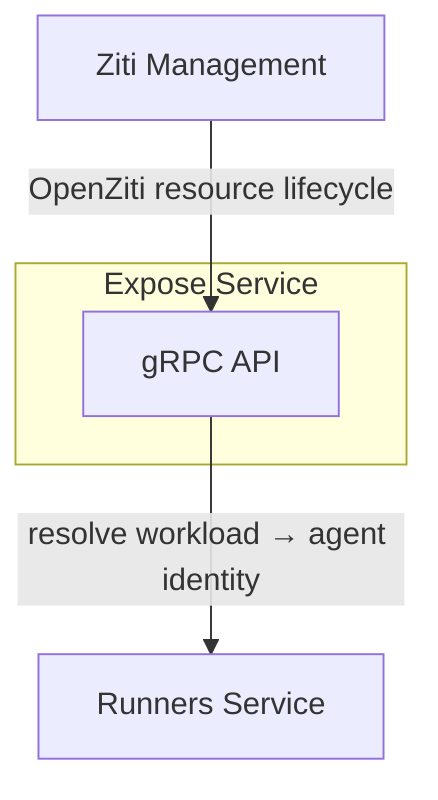
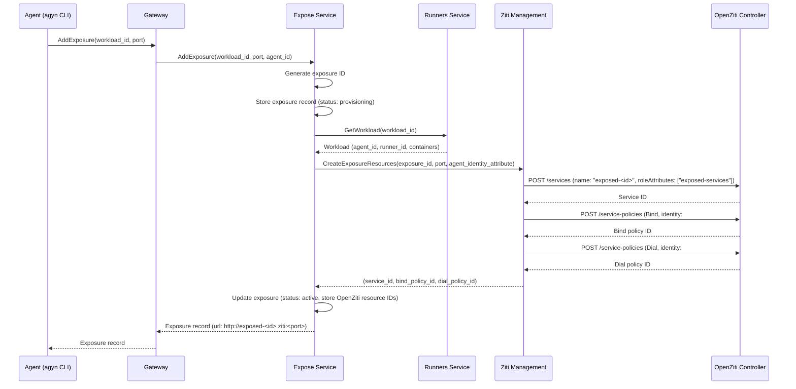
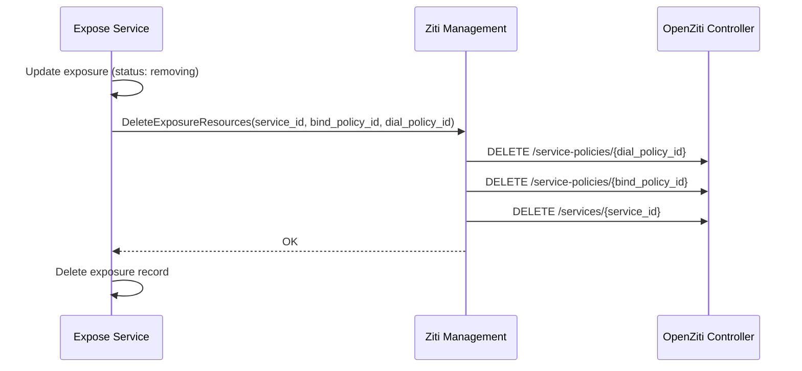
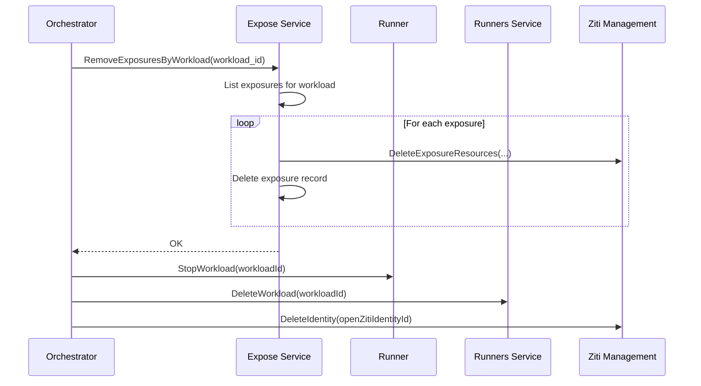
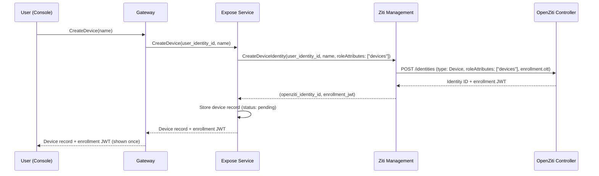

# Expose Service

## Overview

The Expose service manages the lifecycle of port exposures — making ports inside agent containers accessible to users over the [OpenZiti](openziti.md) network. When an agent exposes a port, the Expose service creates the required OpenZiti resources (service, policies) so that enrolled user devices can reach the port. When the exposure is removed or the agent stops, the service cleans up all associated resources.

## Interface

| Method | Description |
|--------|-------------|
| **AddExposure** | Expose a port on an agent workload. Creates OpenZiti resources and returns the exposure record (including the access URL) |
| **RemoveExposure** | Un-expose a port on an agent workload. Deletes the OpenZiti resources and the exposure record |
| **ListExposures** | List active exposures for an agent workload |
| **RemoveExposuresByWorkload** | Remove all exposures for a workload. Called during workload cleanup |
| **CreateDevice** | Register a user device. Creates an OpenZiti identity and returns the enrollment JWT |
| **ListDevices** | List devices for a user |
| **DeleteDevice** | Delete a device and its OpenZiti identity |

## Exposure Resource

| Field | Type | Description |
|-------|------|-------------|
| `id` | string (UUID) | Unique exposure identifier |
| `workload_id` | string (UUID) | Workload hosting the exposed port |
| `agent_id` | string (UUID) | Agent that owns the workload |
| `port` | integer | Port number inside the agent container |
| `openziti_service_id` | string | OpenZiti service ID created for this exposure |
| `openziti_bind_policy_id` | string | OpenZiti Bind service policy ID |
| `openziti_dial_policy_id` | string | OpenZiti Dial service policy ID |
| `url` | string | Access URL: `http://exposed-<id>.ziti:<port>` |
| `status` | enum | `provisioning`, `active`, `failed`, `removing` |
| `created_at` | timestamp | Creation time |

The `status` field tracks the provisioning state of OpenZiti resources. See [Provisioning and Cleanup](#provisioning-and-cleanup).

## Device Resource

| Field | Type | Description |
|-------|------|-------------|
| `id` | string (UUID) | Unique device identifier |
| `user_identity_id` | string (UUID) | Owning user's identity ID |
| `name` | string | User-provided device name |
| `openziti_identity_id` | string | OpenZiti identity ID for this device |
| `enrollment_jwt` | string (nullable) | Enrollment JWT. Stored until enrollment completes, then cleared |
| `status` | enum | `pending`, `enrolled` |
| `created_at` | timestamp | Creation time |

## Dependencies

| Dependency | Usage |
|-----------|-------|
| **[Ziti Management](openziti.md)** | Create and delete OpenZiti services, service policies, and device identities |
| **[Runners](runners.md)** | Resolve workload to agent identity (for Bind policy targeting) |

## Add Exposure Flow

When an agent calls `agyn expose add <port>`:

### OpenZiti Resources Created

For each port exposure, the Expose service creates three OpenZiti resources via [Ziti Management](openziti.md):

| Resource | Details |
|----------|---------|
| **Service** | Name: `exposed-<id>`. Role attributes: `["exposed-services"]` |
| **Bind policy** | Type: Bind. Identity roles: `#agent-<agentId>`. Service roles: `@exposed-<id>`. Grants the agent's Ziti sidecar permission to host this service |
| **Dial policy** | Type: Dial. Identity roles: `#devices`. Service roles: `@exposed-<id>`. Grants all enrolled devices permission to connect |

The Bind policy uses the `agent-<agentId>` role attribute that is already assigned to agent identities at creation time (see [OpenZiti — Identity Creation Request](openziti.md#identity-creation-request)). The Dial policy uses a `#devices` role attribute assigned to all device identities.

### Agent-Side Hosting

The agent's Ziti sidecar must host the exposed service. When the OpenZiti service and Bind policy are created, the sidecar — which is already enrolled and connected — receives the service update from the OpenZiti Controller. The sidecar is configured to host services matching its role attributes by forwarding traffic to `localhost:<port>` inside the pod. The agent process listens on the port in the shared network namespace.

### Ziti Management API Additions

| RPC | Caller | Description |
|-----|--------|-------------|
| `CreateExposureResources` | Expose Service | Create an OpenZiti service + Bind policy + Dial policy for a port exposure. Returns all three resource IDs |
| `DeleteExposureResources` | Expose Service | Delete the OpenZiti service + Bind policy + Dial policy by their IDs |
| `CreateDeviceIdentity` | Expose Service | Create an OpenZiti identity for a user device with `roleAttributes: ["devices"]` and `enrollment.ott: true`. Returns the identity ID and enrollment JWT |
| `DeleteDeviceIdentity` | Expose Service | Delete a device's OpenZiti identity |

## Remove Exposure Flow

When an agent calls `agyn expose remove <port>`, or when a workload is stopped:

Deletion order: Dial policy → Bind policy → Service. Policies reference the service, so they are deleted first.

## Workload Cleanup

When the [Agents Orchestrator](agents-orchestrator.md) stops a workload, it calls `RemoveExposuresByWorkload` on the Expose service before stopping the workload on the Runner. This removes all active exposures and their OpenZiti resources.

## Provisioning and Cleanup

Port exposure involves creating multiple OpenZiti resources (service, Bind policy, Dial policy). If any step fails, the system must not leave orphaned resources.

### Provisioning Failure

If `CreateExposureResources` fails partway through (e.g., service created but Bind policy creation fails):

1. Ziti Management attempts to delete any resources that were successfully created in the current request.
2. If cleanup within the same request also fails, Ziti Management returns the IDs of the resources that were created but not cleaned up.
3. The Expose service stores the exposure record with `status: failed` and the IDs of any created resources.
4. A background reconciliation loop in the Expose service periodically scans for `failed` exposures and retries cleanup via `DeleteExposureResources`.

### Removal Failure

If `DeleteExposureResources` fails partway through (e.g., Dial policy deleted but service deletion fails):

1. Ziti Management returns which resources were deleted and which remain.
2. The Expose service updates the exposure record with the remaining resource IDs and sets `status: failed`.
3. The background reconciliation loop retries cleanup.

### Reconciliation Loop

The Expose service runs a background loop that handles stuck or failed exposures:

1. Query for exposures with `status: failed` or `status: removing`.
2. For each, attempt to delete remaining OpenZiti resources via `DeleteExposureResources`.
3. On success, delete the exposure record.
4. On failure, leave the record for the next pass.

This ensures eventual cleanup of all OpenZiti resources regardless of transient failures.

## Device Enrollment Flow

The user copies the JWT and uses it in their Ziti tunnel client. The OpenZiti Controller handles enrollment directly — when the user's tunnel enrolls with the JWT, the Controller issues an x509 certificate. The Expose service does not participate in the enrollment step.

Device status transitions from `pending` to `enrolled` when the Ziti tunnel enrolls. The Expose service queries the OpenZiti Controller (via Ziti Management) to check enrollment status — this can be done on `ListDevices` calls or via a background check.

## Device Identity

| Field | Value |
|-------|-------|
| `name` | `device-<deviceId>` |
| `type` | `Device` |
| `roleAttributes` | `["devices"]` |
| `externalId` | `<user_identity_id>` |
| `enrollment` | `{ "ott": true }` |

The `devices` role attribute is used by Dial policies on exposed services. All enrolled devices can access all exposed services — scoped access control is not implemented in this version.

## Static Policies

One additional static policy is required at infrastructure provisioning:

| Policy | Type | Identity Roles | Service Roles | Purpose |
|--------|------|---------------|---------------|---------|
| `agents-host-exposed` | Host | `#agents` | `#exposed-services` | All agents can host exposed services (traffic forwarded to localhost by sidecar) |

**Note:** The per-exposure Bind policy uses identity role `#agent-<agentId>` to scope hosting to the specific agent. The `agents-host-exposed` Host policy is a broader fallback — it allows the Ziti sidecar to intercept exposed service traffic. The per-exposure Bind policy is the primary access control mechanism.

## Gateway Exposure

| Gateway Proto Service | Methods |
|----------------------|---------|
| `ExposeGateway` | `AddExposure`, `RemoveExposure`, `ListExposures`, `CreateDevice`, `ListDevices`, `DeleteDevice` |

`AddExposure`, `RemoveExposure`, and `ListExposures` are called by agents via `agyn` CLI. `CreateDevice`, `ListDevices`, and `DeleteDevice` are called by users via the Console.

The Gateway resolves the agent's `workload_id` from request context for exposure methods. For device methods, the Gateway passes the authenticated user's `identity_id`.

## Data Store

PostgreSQL. The Expose service owns its database with `exposures` and `devices` tables.

## Classification

| Aspect | Detail |
|--------|--------|
| **Plane** | Data — on the path for port exposure operations |
| **API** | gRPC (internal) + Gateway (external via ConnectRPC) |
| **State** | PostgreSQL |
| **Dependencies** | Ziti Management, Runners Service |
