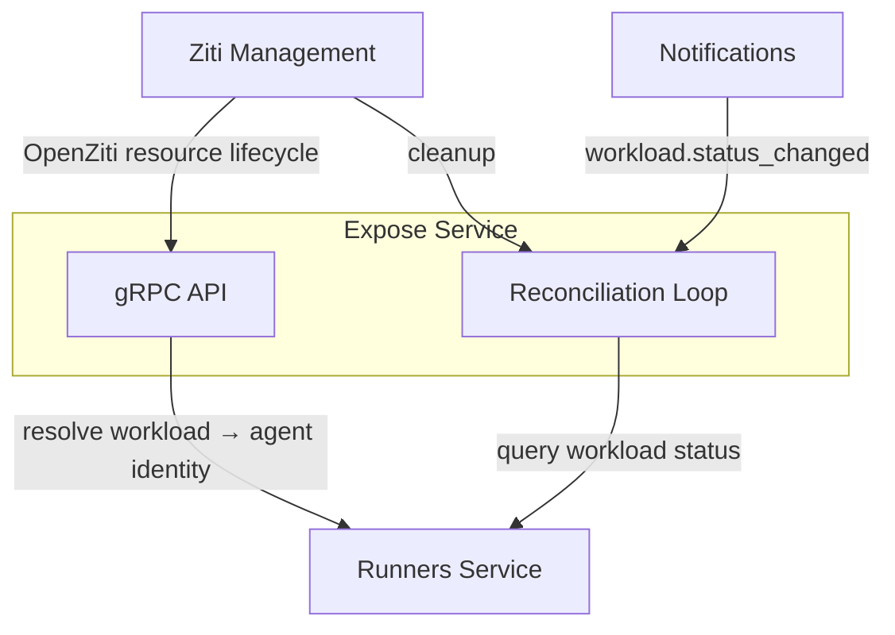
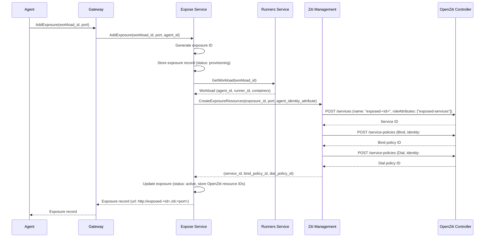
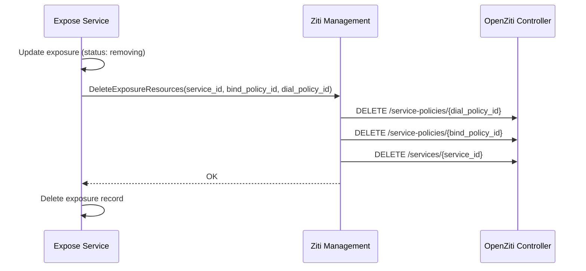
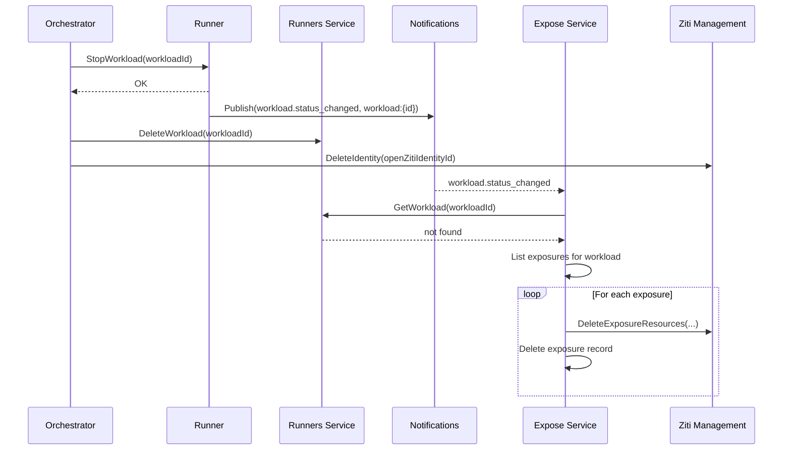

# Expose Service

## Overview

The Expose service manages the lifecycle of port exposures — making ports inside agent containers accessible to users over the [OpenZiti](openziti.md) network. When an agent exposes a port, the Expose service creates the required OpenZiti resources (service, policies) so that enrolled user devices can reach the port. When the exposure is removed or the agent stops, the service cleans up all associated resources.

The Expose service runs its own [reconciliation loop](#reconciliation) to converge actual state toward desired state. It is decoupled from the [Agents Orchestrator](agents-orchestrator.md) — it discovers workload lifecycle changes through [Notifications](notifications.md) events and the [Runners](runners.md) service, following the standard platform [pull + notifications](notifications.md#consumer-sync-protocol) pattern.

## Interface

| Method | Description |
|--------|-------------|
| **AddExposure** | Expose a port on an agent workload. Creates OpenZiti resources and returns the exposure record (including the access URL) |
| **RemoveExposure** | Un-expose a port on an agent workload. Deletes the OpenZiti resources and the exposure record |
| **ListExposures** | List active exposures for an agent workload |

## Exposure Resource

| Field | Type | Description |
|-------|------|-------------|
| `id` | string (UUID) | Unique exposure identifier |
| `workload_id` | string (UUID) | Workload hosting the exposed port |
| `agent_id` | string (UUID) | Agent that owns the workload |
| `port` | integer | Port number inside the agent container |
| `openziti_service_id` | string | OpenZiti service ID created for this exposure |
| `openziti_bind_policy_id` | string | OpenZiti Bind service policy ID |
| `openziti_dial_policy_id` | string | OpenZiti Dial service policy ID |
| `url` | string | Access URL: `http://exposed-<id>.ziti:<port>` |
| `status` | enum | `provisioning`, `active`, `failed`, `removing` |
| `created_at` | timestamp | Creation time |

The `status` field tracks the provisioning state of OpenZiti resources. See [Provisioning and Cleanup](#provisioning-and-cleanup).

## Dependencies

| Dependency | Usage |
|-----------|-------|
| **[Ziti Management](openziti.md)** | Create and delete OpenZiti services and service policies |
| **[Runners](runners.md)** | Resolve workload to agent identity (for Bind policy targeting). Query workload existence during reconciliation |
| **[Notifications](notifications.md)** | Subscribe to `workload.status_changed` events for fast reactivity on workload stop |

## Add Exposure Flow

When an agent requests a port exposure via the platform API:

### OpenZiti Resources Created

For each port exposure, the Expose service creates three OpenZiti resources via [Ziti Management](openziti.md):

| Resource | Details |
|----------|---------|
| **Service** | Name: `exposed-<id>`. Role attributes: `["exposed-services"]` |
| **Bind policy** | Type: Bind. Identity roles: `#agent-<agentId>`. Service roles: `@exposed-<id>`. Grants the agent's Ziti sidecar permission to host this service |
| **Dial policy** | Type: Dial. Identity roles: `#devices`. Service roles: `@exposed-<id>`. Grants all enrolled devices permission to connect |

The Bind policy uses the `agent-<agentId>` role attribute that is already assigned to agent identities at creation time (see [OpenZiti — Identity Creation Request](openziti.md#identity-creation-request)). The Dial policy uses a `#devices` role attribute assigned to all device identities.

### Agent-Side Hosting

The agent's Ziti sidecar must host the exposed service. When the OpenZiti service and Bind policy are created, the sidecar — which is already enrolled and connected — receives the service update from the OpenZiti Controller. The sidecar is configured to host services matching its role attributes by forwarding traffic to `localhost:<port>` inside the pod. The agent process listens on the port in the shared network namespace.

### Ziti Management API Additions

| RPC | Caller | Description |
|-----|--------|-------------|
| `CreateExposureResources` | Expose Service | Create an OpenZiti service + Bind policy + Dial policy for a port exposure. Returns all three resource IDs |
| `DeleteExposureResources` | Expose Service | Delete the OpenZiti service + Bind policy + Dial policy by their IDs |

## Remove Exposure Flow

When an agent requests removal of a port exposure via the platform API:

Deletion order: Dial policy → Bind policy → Service. Policies reference the service, so they are deleted first.

## Reconciliation

The Expose service runs its own reconciliation loop — it does not depend on the [Agents Orchestrator](agents-orchestrator.md) to trigger cleanup. It follows the standard platform [pull + notifications](notifications.md#consumer-sync-protocol) pattern.

### Triggers

| Trigger | Source | Latency |
|---------|--------|---------|
| `workload.status_changed` event | [Notifications](notifications.md) subscription on `workload:{id}` rooms | Real-time (fast path) |
| Periodic reconciliation poll | Timer-based | Configurable interval (catch-all) |

On startup, the Expose service subscribes to `workload:{id}` rooms for all workloads that have active exposures. When new exposures are created, the service subscribes to the corresponding workload room. Notifications provide fast reactivity; the periodic poll is the catch-all for missed events.

### Reconciliation Logic

Each reconciliation pass:

1. **Orphaned exposures:** For each `active` exposure, query [Runners](runners.md) to check if the workload still exists. If the workload is gone, transition the exposure to `removing` and delete its OpenZiti resources.
2. **Failed provisioning:** For each `failed` exposure, attempt to delete any remaining OpenZiti resources via `DeleteExposureResources`. On success, delete the exposure record. On failure, leave for the next pass.
3. **Stuck removals:** For each `removing` exposure, retry `DeleteExposureResources`. On success, delete the exposure record.

This ensures eventual cleanup of all OpenZiti resources regardless of transient failures or missed events.

### Workload Stop Sequence

When the Orchestrator stops a workload, the Expose service discovers this independently:

The Orchestrator and Expose service are fully decoupled. The Orchestrator does not know about exposures. The Expose service reacts to workload lifecycle changes via events and reconciliation.

## Provisioning and Cleanup

Port exposure involves creating multiple OpenZiti resources (service, Bind policy, Dial policy). If any step fails, the system must not leave orphaned resources.

### Provisioning Failure

If `CreateExposureResources` fails partway through (e.g., service created but Bind policy creation fails):

1. Ziti Management attempts to delete any resources that were successfully created in the current request.
2. If cleanup within the same request also fails, Ziti Management returns the IDs of the resources that were created but not cleaned up.
3. The Expose service stores the exposure record with `status: failed` and the IDs of any created resources.
4. The [reconciliation loop](#reconciliation) retries cleanup on the next pass.

### Removal Failure

If `DeleteExposureResources` fails partway through (e.g., Dial policy deleted but service deletion fails):

1. Ziti Management returns which resources were deleted and which remain.
2. The Expose service updates the exposure record with the remaining resource IDs and sets `status: failed`.
3. The [reconciliation loop](#reconciliation) retries cleanup on the next pass.

## Static Policies

One additional static policy is required at infrastructure provisioning:

| Policy | Type | Identity Roles | Service Roles | Purpose |
|--------|------|---------------|---------------|---------|
| `agents-host-exposed` | Host | `#agents` | `#exposed-services` | All agents can host exposed services (traffic forwarded to localhost by sidecar) |

**Note:** The per-exposure Bind policy uses identity role `#agent-<agentId>` to scope hosting to the specific agent. The `agents-host-exposed` Host policy is a broader fallback — it allows the Ziti sidecar to intercept exposed service traffic. The per-exposure Bind policy is the primary access control mechanism.

## Gateway Exposure

| Gateway Proto Service | Methods |
|----------------------|---------|
| `ExposeGateway` | `AddExposure`, `RemoveExposure`, `ListExposures` |

Called by agents via the platform API. The Gateway resolves the agent's `workload_id` from request context.

## Data Store

PostgreSQL. The Expose service owns its database with an `exposures` table.

## Classification

| Aspect | Detail |
|--------|--------|
| **Plane** | Data — on the path for port exposure operations |
| **API** | gRPC (internal) + Gateway (external via ConnectRPC) |
| **State** | PostgreSQL |
| **Dependencies** | Ziti Management, Runners Service, Notifications |
