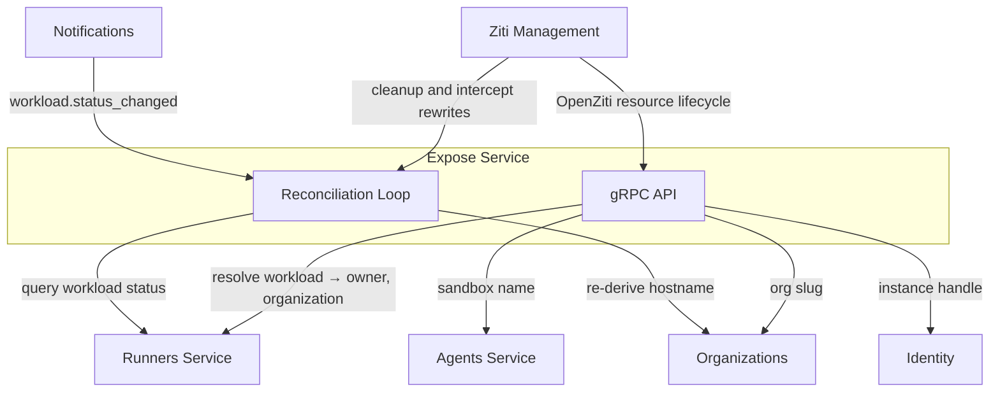
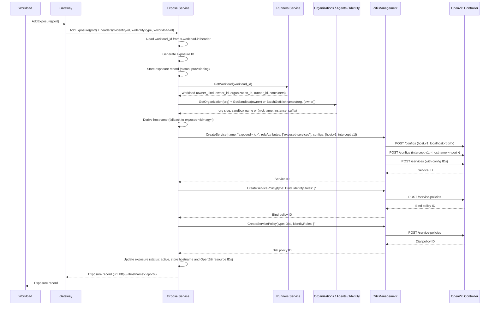
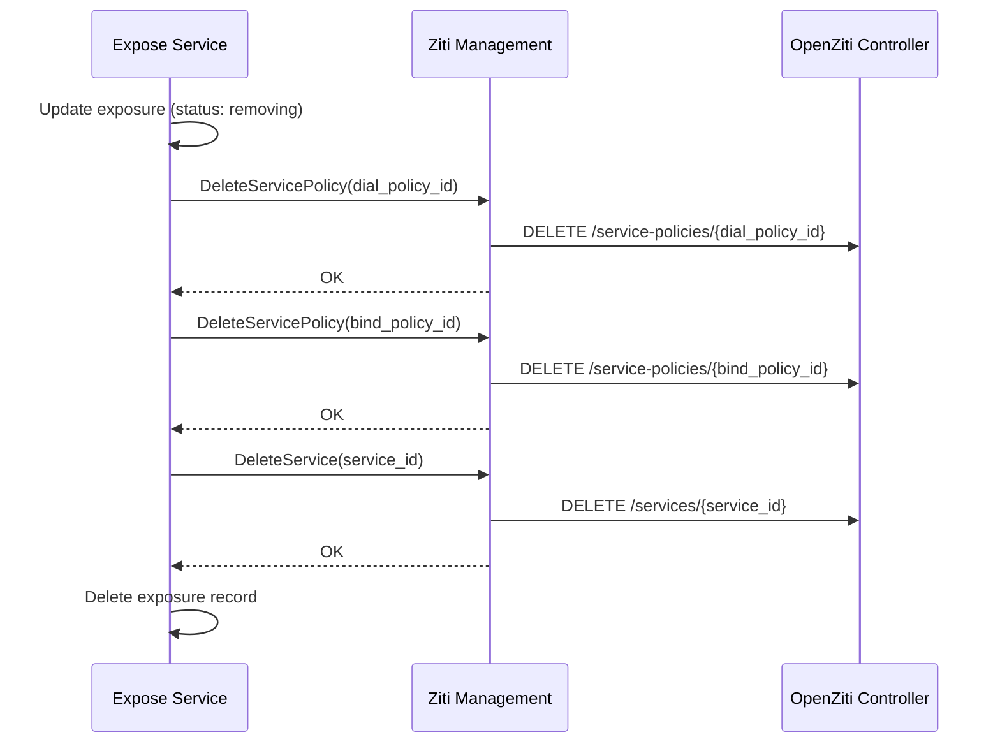
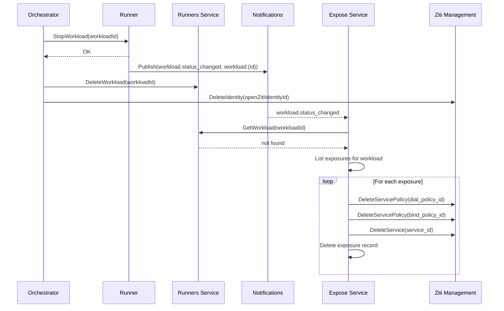

# Expose Service

## Overview

The Expose service manages the lifecycle of port exposures — making ports inside a workload accessible over the [OpenZiti](openziti.md) network. When a workload exposes a port, the Expose service creates the required OpenZiti resources (service, configs, policies) so that any identity on the OpenZiti network can reach the port. When the exposure is removed or the workload stops, the service cleans up all associated resources.

An exposure is addressed by the entity that owns the workload — a [sandbox](resource-definitions.md#sandbox) named `super-sandbox` serves its port 3000 at `http://super-sandbox.acme.agyn:3000`, and [agent instance](agent-instances.md) `@bob#research` serves its at `http://research.bob.acme.agyn:3000`. See [Hostname](#hostname).

The Expose service runs its own [reconciliation loop](#reconciliation) to converge actual state toward desired state. It is decoupled from the [Agents Orchestrator](agents-orchestrator.md) — it discovers workload lifecycle changes through [Notifications](notifications.md) events and the [Runners](runners.md) service, following the standard platform [pull + notifications](notifications.md#consumer-sync-protocol) pattern.

## Interface

| Method | Description |
|--------|-------------|
| **AddExposure** | Expose a port on a workload. Creates OpenZiti resources and returns the exposure record (including the access URL) |
| **RemoveExposure** | Un-expose a port on a workload. Deletes the OpenZiti resources and the exposure record |
| **ListExposures** | List active exposures for a workload |

### AddExposure

```
AddExposure(port, workload_id?)
```

`workload_id` is optional. When absent, the Expose service reads it from the `x-workload-id` gRPC header injected by the Gateway. This is the standard path for a workload calling on its own behalf — an agent through [`agyn expose add`](agyn-cli.md#port-exposure-commands), or a person at a shell in a sandbox running the same command.

`workload_id` may only be specified explicitly by a cluster admin. This allows administrative operations (e.g., exposing a port on behalf of a running workload). Any non-admin caller that provides `workload_id` receives a permission error.

`AddExposure` is idempotent per `(workload_id, port)`: a request for a port already exposed on that workload returns the existing exposure rather than creating a second one. Every exposure on one entity shares a [hostname](#hostname) and is distinguished only by port, so a second record for the same port would be a duplicate OpenZiti intercept rather than a second address.

## Exposure Resource

| Field | Type | Description |
|-------|------|-------------|
| `id` | string (UUID) | Unique exposure identifier |
| `workload_id` | string (UUID) | Workload hosting the exposed port |
| `owner_kind` | enum | `agent_instance` \| `sandbox`. What kind of entity the workload runs for. Read from the [workload record](runners.md#workload-resource) |
| `owner_id` | string (UUID) | The owning [agent instance](agent-instances.md) or [Sandbox](resource-definitions.md#sandbox). Names the exposure — see [Hostname](#hostname) |
| `organization_id` | string (UUID) | Organization scope, denormalized from the workload record |
| `port` | integer | Port number inside the workload's main container |
| `openziti_service_id` | string | OpenZiti service ID created for this exposure |
| `openziti_bind_policy_id` | string | OpenZiti Bind service policy ID |
| `openziti_dial_policy_id` | string | OpenZiti Dial service policy ID |
| `hostname` | string | Resolved address, e.g. `super-sandbox.acme.agyn`. Derived at creation and re-derived by [reconciliation](#reconciliation); the `intercept.v1` config is written from this field |
| `url` | string | Access URL: `http://<hostname>:<port>` |
| `status` | enum | `provisioning`, `active`, `failed`, `removing` |
| `created_at` | timestamp | Creation time |

The `status` field tracks the provisioning state of OpenZiti resources. See [Provisioning and Cleanup](#provisioning-and-cleanup).

## Hostname

An exposure's address names the entity that owns the workload. This is what a link pasted into a conversation has to communicate: which sandbox, or which agent, is sharing.

### Derivation

| Owner kind | Hostname | Example |
|---|---|---|
| `sandbox` | `<sandbox.name>.<org.slug>.agyn` | `super-sandbox.acme.agyn` |
| `agent_instance` | `<instance_suffix>.<nickname>.<org.slug>.agyn` | `research.bob.acme.agyn` |
| either, when no readable form is available | `exposed-<exposure.id>.agyn` | `exposed-7f3a2c91-….agyn` |

The instance form mirrors the [handle](agent-instances.md#handles) it names — `@bob#research` becomes `research.bob` — and an unlabeled instance carries its system-generated suffix (`7a2f.bob.acme.agyn`), which still says which agent is sharing.

The organization slug is always present. It is what puts every readable exposure address at three labels or more, so one can never collide with a platform service name (`gateway.agyn`, `llm-proxy.agyn`, `tracing.agyn`), and it is the scope within which the leading labels are unique.

### Uniqueness

Addresses cannot collide, and the guarantee comes from constraints that already exist:

| Component | Unique | Enforced by |
|---|---|---|
| `<org.slug>` | Cluster-wide | [Organizations — Slug](organizations.md#slug) |
| `<sandbox.name>` | Within the organization | [Sandbox](resource-definitions.md#sandbox) |
| `<instance_suffix>.<nickname>` | Within the organization | `UNIQUE(org_id, nickname, instance_suffix)` on the [nickname index](identity.md#nickname-index) |

Sandboxes and instances share the organization label without sharing a namespace: a sandbox occupies a single leaf (`bob.acme.agyn`) while an agent class occupies everything beneath its own label (`*.bob.acme.agyn`). A sandbox named `bob` and an agent nicknamed `@bob` coexist, and no coordination between the two namespaces is required.

Ports disambiguate within an entity, not across entities. Every exposure on one entity resolves to the same hostname and differs only in port, which satisfies OpenZiti's requirement that no two services dialable by a single identity overlap on the same address and port — provided an entity never exposes one port twice, which [`AddExposure`](#addexposure) guarantees by being idempotent.

### Derivability and fallback

Every label must be a valid DNS label — `^[a-z0-9]([a-z0-9-]*[a-z0-9])?$`, at most 63 characters. When a component is missing or does not satisfy this, the exposure takes the opaque `exposed-<id>.agyn` form instead:

- The instance's class has no [`nickname`](resource-definitions.md#agent), so nothing names the agent.
- The nickname or `instance_suffix` contains `_`, which the [nickname pattern](identity.md#nickname-index) permits and DNS does not.

Organization slugs and sandbox names are constrained to valid DNS labels where they are defined, so they never trigger the fallback.

Falling back rather than rejecting is deliberate: a missing nickname is a cosmetic gap, and refusing to expose a port over one would turn it into an outage. `agyn expose add` reports the address it got, whichever form that is.

### Stability

The hostname belongs to the entity, not to the exposure and not to the workload. An agent whose workload restarts and re-exposes port 3000 gets the same URL back, and a link shared before the restart keeps working — the practical difference from an exposure-scoped identifier, which changed on every restart.

Two things move an address:

- **A rename.** The organization slug is [mutable](organizations.md#slug), as are sandbox names and instance labels. [Reconciliation](#reconciliation) re-derives every live exposure's hostname and rewrites the `intercept.v1` config through `UpdateService` when it has drifted. Links to the old address stop resolving: a readable address is derived from mutable data, and this is the cost of that.
- **A reused name.** A terminated sandbox releases its name; a new sandbox taking that name takes the address with it, and a link held from before reaches the new sandbox. Both are in the same organization, and the window is a deliberate trade against carrying a disambiguating suffix in every address.

The resolved hostname is stored on the exposure record so that the address a caller was given and the address written into OpenZiti are the same string, and drift is something reconciliation detects rather than something each reader recomputes.

## Dependencies


```mermaid
graph TB
    subgraph "Expose Service"
        API[gRPC API]
        Reconciler[Reconciliation Loop]
    end

    ZM[Ziti Management] -->|OpenZiti resource lifecycle| API
    ZM -->|cleanup and intercept rewrites| Reconciler
    API -->|resolve workload → owner, organization| RS[Runners Service]
    Reconciler -->|query workload status| RS
    API -->|org slug| O[Organizations]
    API -->|sandbox name| AS[Agents Service]
    API -->|instance handle| I[Identity]
    Reconciler -->|re-derive hostname| O
    N[Notifications] -->|workload.status_changed| Reconciler
```

| Dependency | Usage |
|-----------|-------|
| **[Ziti Management](openziti.md)** | Create, update, and delete OpenZiti services, configs, and service policies |
| **[Runners](runners.md)** | Resolve workload to its owner (`owner_kind`, `owner_id`) and organization, and to the workload identity Bind policies target. Query workload existence during reconciliation |
| **[Organizations](organizations.md)** | `GetOrganization` for the [slug](organizations.md#slug) label |
| **[Agents](agents-service.md)** | `GetSandbox` for the sandbox name label. Sandbox-owned exposures only |
| **[Identity](identity.md)** | [`BatchGetNicknames`](identity.md#interface) for the `(nickname, instance_suffix)` labels. Agent-instance-owned exposures only |
| **[Notifications](notifications.md)** | Subscribe to `workload.status_changed` events for fast reactivity on workload stop |

The three name lookups are off the request hot path — they run once per `AddExposure` and once per exposure per reconciliation pass, never per connection. Nothing about serving traffic to an exposed port consults them: once the `intercept.v1` config exists, the address is resolved entirely inside the dialing tunneler.

## Add Exposure Flow

When a workload requests a port exposure via the platform API:


```mermaid
sequenceDiagram
    participant A as Workload
    participant GW as Gateway
    participant ES as Expose Service
    participant RS as Runners Service
    participant NM as Organizations / Agents / Identity
    participant ZM as Ziti Management
    participant ZC as OpenZiti Controller

    A->>GW: AddExposure(port)
    GW->>ES: AddExposure(port) + headers(x-identity-id, x-identity-type, x-workload-id)
    ES->>ES: Read workload_id from x-workload-id header
    ES->>ES: Generate exposure ID
    ES->>ES: Store exposure record (status: provisioning)
    ES->>RS: GetWorkload(workload_id)
    RS-->>ES: Workload (owner_kind, owner_id, organization_id, runner_id, containers)

    ES->>NM: GetOrganization(org) + GetSandbox(owner) or BatchGetNicknames(org, [owner])
    NM-->>ES: org slug, sandbox name or (nickname, instance_suffix)
    ES->>ES: Derive hostname (fallback to exposed-<id>.agyn)

    ES->>ZM: CreateService(name: "exposed-<id>", roleAttributes: ["exposed-services"], configs: [host.v1, intercept.v1])
    ZM->>ZC: POST /configs (host.v1: localhost:<port>)
    ZM->>ZC: POST /configs (intercept.v1: <hostname>:<port>)
    ZM->>ZC: POST /services (with config IDs)
    ZC-->>ZM: Service ID
    ZM-->>ES: Service ID

    ES->>ZM: CreateServicePolicy(type: Bind, identityRoles: ["#workload-<workloadId>"], serviceRoles: ["@exposed-<id>"])
    ZM->>ZC: POST /service-policies
    ZC-->>ZM: Bind policy ID
    ZM-->>ES: Bind policy ID

    ES->>ZM: CreateServicePolicy(type: Dial, identityRoles: ["#all"], serviceRoles: ["@exposed-<id>"])
    ZM->>ZC: POST /service-policies
    ZC-->>ZM: Dial policy ID
    ZM-->>ES: Dial policy ID

    ES->>ES: Update exposure (status: active, store hostname and OpenZiti resource IDs)
    ES-->>GW: Exposure record (url: http://<hostname>:<port>)
    GW-->>A: Exposure record
```

### OpenZiti Resources Created

For each port exposure, the Expose service creates three OpenZiti resources via [Ziti Management](openziti.md), calling each API individually:

| Resource | Ziti Management RPC | Details |
|----------|---------------------|---------|
| **Service** | `CreateService` | Name: `exposed-<id>`. Role attributes: `["exposed-services"]`. Attached configs: `host.v1` and `intercept.v1` (see [Service Configs](#service-configs)) |
| **Bind policy** | `CreateServicePolicy` | Type: Bind. Identity roles: `#workload-<workloadId>`. Service roles: `@exposed-<id>`. Grants the specific workload's Ziti sidecar permission to host this service |
| **Dial policy** | `CreateServicePolicy` | Type: Dial. Identity roles: `#all`. Service roles: `@exposed-<id>`. Grants all identities on the OpenZiti network permission to connect |

The Bind policy uses the `workload-<workloadId>` role attribute assigned to the specific workload's Ziti identity at creation time (see [OpenZiti — Identity Creation Request](openziti.md#identity-creation-request)). This scopes hosting to the exact workload that exposed the port — not all workloads of the same agent. The Dial policy uses `#all` — any identity connected to the OpenZiti network can access exposed services.

The Expose service manages the orchestration of these calls. Ziti Management provides generic `CreateService`, `UpdateService`, `CreateServicePolicy`, `DeleteService`, and `DeleteServicePolicy` RPCs — it has no knowledge of the exposure concept.

**The OpenZiti service name stays exposure-scoped.** `exposed-<id>` remains one object per exposure, matched by policies through `@exposed-<id>` and owned through [resource tags](openziti.md#openziti-resource-tagging). Only the `intercept.v1` address is readable. Keeping the two separate is what makes the address free to change on a rename without touching a policy, a role attribute, or an object identity — and it keeps ownership resolution independent of a name a user can edit.

### Service Configs

Each exposed service is created with two OpenZiti config objects attached. These configs tell tunnelers how to handle traffic for the service — no dynamic configuration file updates are needed.

**`host.v1`** — tells the workload's Ziti sidecar where to forward incoming traffic:

```json
{
  "protocol": "tcp",
  "address": "localhost",
  "port": <port>
}
```

The sidecar forwards connections to `localhost:<port>` inside the pod, where the dev server is listening.

**`intercept.v1`** — tells dialing tunnelers (user devices) which address to intercept:

```json
{
  "protocols": ["tcp"],
  "addresses": ["<hostname>"],
  "portRanges": [{ "low": <port>, "high": <port> }]
}
```

The user's Ziti tunnel resolves the [hostname](#hostname) via its built-in DNS and intercepts connections to that address, routing them over the OpenZiti network to the hosting sidecar.

An entity with several exposed ports produces several services carrying the same intercept address with disjoint single-port ranges. The tunneler resolves the shared name once and selects the service by destination port.

Ziti Management creates both config objects on the OpenZiti Controller (`POST /configs`) and attaches them to the service at creation time. Config objects are deleted when the service is deleted.

### Workload-Side Hosting

The workload pod's Ziti sidecar runs `ziti-edge-tunnel run`, which provides both intercepting (dial-side, for `gateway.agyn`, `llm-proxy.agyn`, etc.) and hosting (bind-side, for exposed services). When the Expose service creates the OpenZiti service with its `host.v1` config and the Bind policy, the sidecar automatically discovers the new service on its next poll of the Controller (default interval: 10 seconds, configurable via `--refresh`). No notification, restart, or configuration file update is needed — the sidecar begins hosting the service as soon as it detects the matching Bind policy and reads the `host.v1` config to learn where to forward traffic (`localhost:<port>`).

The same poll is what carries a [hostname rewrite](#reconciliation) to the dialing side: an `intercept.v1` config updated in place is picked up by every tunneler on its next refresh, with no re-enrollment and no reconnect.

Whatever process opened the port listens on it in the shared network namespace — an agent's dev server, or a command someone ran at a sandbox shell. The sidecar forwards incoming Ziti connections to `localhost:<port>` inside the pod.

## Remove Exposure Flow

When removal of a port exposure is requested via the platform API:


```mermaid
sequenceDiagram
    participant ES as Expose Service
    participant ZM as Ziti Management
    participant ZC as OpenZiti Controller

    ES->>ES: Update exposure (status: removing)
    ES->>ZM: DeleteServicePolicy(dial_policy_id)
    ZM->>ZC: DELETE /service-policies/{dial_policy_id}
    ZM-->>ES: OK
    ES->>ZM: DeleteServicePolicy(bind_policy_id)
    ZM->>ZC: DELETE /service-policies/{bind_policy_id}
    ZM-->>ES: OK
    ES->>ZM: DeleteService(service_id)
    ZM->>ZC: DELETE /services/{service_id}
    ZM-->>ES: OK
    ES->>ES: Delete exposure record
```

Deletion order: Dial policy → Bind policy → Service. Policies reference the service, so they are deleted first. Deleting the service also deletes its attached config objects.

## Reconciliation

The Expose service runs its own reconciliation loop — it does not depend on the [Agents Orchestrator](agents-orchestrator.md) to trigger cleanup. It follows the standard platform [pull + notifications](notifications.md#consumer-sync-protocol) pattern.

### Triggers

| Trigger | Source | Latency |
|---------|--------|---------|
| `workload.status_changed` event | [Notifications](notifications.md) subscription on `workload:{id}` rooms | Real-time (fast path) |
| Periodic reconciliation poll | Timer-based | Configurable interval (catch-all) |

On startup, the Expose service subscribes to `workload:{id}` rooms for all workloads that have active exposures. When new exposures are created, the service subscribes to the corresponding workload room. Notifications provide fast reactivity; the periodic poll is the catch-all for missed events.

### Reconciliation Logic

Each reconciliation pass:

1. **Orphaned exposures:** For each `active` exposure, query [Runners](runners.md) to check if the workload still exists. If the workload is gone, transition the exposure to `removing` and delete its OpenZiti resources.
2. **Hostname drift:** For each `active` exposure, re-derive the [hostname](#hostname) from its current inputs. If it differs from the stored value, update the record and rewrite the service's `intercept.v1` config through `UpdateService`. This is what carries an organization, sandbox, or instance rename through to live exposures.
3. **Failed provisioning:** For each `failed` exposure, attempt to delete any remaining OpenZiti resources via individual `DeleteService` / `DeleteServicePolicy` calls. On success, delete the exposure record. On failure, leave for the next pass.
4. **Stuck removals:** For each `removing` exposure, retry deletion of remaining OpenZiti resources. On success, delete the exposure record.

This ensures eventual cleanup of all OpenZiti resources regardless of transient failures or missed events, and eventual convergence of every live address on its entity's current name.

Renames are picked up by the periodic poll rather than by an event. Reconciliation already re-reads each live exposure, the derivation inputs are three cheap lookups, and an address that is stale for one poll interval is a cosmetic delay — not the class of problem worth a subscription to three more services. The address a caller already holds keeps working until the rewrite lands, then stops.

### Workload Stop Sequence

When the Orchestrator stops a workload, the Expose service discovers this independently:


```mermaid
sequenceDiagram
    participant O as Orchestrator
    participant R as Runner
    participant RS as Runners Service
    participant N as Notifications
    participant ES as Expose Service
    participant ZM as Ziti Management

    O->>R: StopWorkload(workloadId)
    R-->>O: OK
    R->>N: Publish(workload.status_changed, workload:{id})
    O->>RS: DeleteWorkload(workloadId)
    O->>ZM: DeleteIdentity(openZitiIdentityId)
    N-->>ES: workload.status_changed
    ES->>RS: GetWorkload(workloadId)
    RS-->>ES: not found
    ES->>ES: List exposures for workload
    loop For each exposure
        ES->>ZM: DeleteServicePolicy(dial_policy_id)
        ES->>ZM: DeleteServicePolicy(bind_policy_id)
        ES->>ZM: DeleteService(service_id)
        ES->>ES: Delete exposure record
    end
```

The Orchestrator and Expose service are fully decoupled. The Orchestrator does not know about exposures. The Expose service reacts to workload lifecycle changes via events and reconciliation.

## Provisioning and Cleanup

Port exposure involves creating multiple OpenZiti resources (service, Bind policy, Dial policy). If any step fails, the system must not leave orphaned resources.

### Provisioning Failure

If any step in the provisioning sequence fails (e.g., service created but Bind policy creation fails):

1. The Expose service attempts to delete any resources that were successfully created in the current request (in reverse order).
2. If cleanup also fails, the Expose service stores the exposure record with `status: failed` and the IDs of any created resources.
3. The [reconciliation loop](#reconciliation) retries cleanup on the next pass.

### Removal Failure

If any step in the removal sequence fails (e.g., Dial policy deleted but service deletion fails):

1. The Expose service updates the exposure record with the remaining resource IDs and sets `status: failed`.
2. The [reconciliation loop](#reconciliation) retries cleanup on the next pass.

## Static Policies

One additional static policy is required at infrastructure provisioning:

| Policy | Type | Identity Roles | Service Roles | Purpose |
|--------|------|---------------|---------------|---------|
| `agents-host-exposed` | Host | `#agents` | `#exposed-services` | Any workload can host exposed services (traffic forwarded to localhost by sidecar) |

Sandbox workload identities carry the `agents` role attribute this policy matches, so it covers them without a second rule — see [OpenZiti — Agent Access Scope](openziti.md#agent-access-scope).

**Note:** The per-exposure Bind policy uses identity role `#workload-<workloadId>` to scope hosting to the specific workload rather than to its owner. An owner runs [one workload at a time](agent-instances.md#state-and-workload), but a workload that stops and restarts is a new identity, so binding to the owner would leave a dead grant behind; scoping to the workload means the grant expires exactly when the thing hosting it does. The `agents-host-exposed` Host policy is a broader fallback — it allows the Ziti sidecar to intercept exposed service traffic. The per-exposure Bind policy is the primary access control mechanism.

## Authorization

The standard path — a workload exposing its own port — requires no OpenFGA check. The Gateway injects `x-workload-id` from the verified OpenZiti connection, so a caller arriving with that header *is* that workload. The check is header presence and record match, not a relation, and it is identical for both owner kinds: nothing here reads `owner_kind`.

| Operation | Check |
|-----------|-------|
| `AddExposure` (standard: no explicit `workload_id`) | `x-workload-id` present and resolves to a live workload — the caller is the workload |
| `AddExposure` (explicit `workload_id`, sandbox-owned workload) | `can_connect` on `sandbox:<workload.owner_id>` |
| `AddExposure` (explicit `workload_id`, any other owner) | `admin` on `cluster:global` |
| `RemoveExposure` | Caller is the workload; `can_connect` on `sandbox:<exposure.owner_id>` when the exposure is sandbox-owned; or `owner` on `organization:<exposure.organization_id>` |
| `ListExposures` | Caller is the workload, or `member` on `organization:<exposure.organization_id>` |

**Whoever can open a shell may manage that sandbox's ports.** `can_connect` grants nothing new here: a shell can run [`agyn expose add`](agyn-cli.md#port-exposure-commands) itself, so doing it from the [Sandboxes app](sandboxes-app.md) is the same capability with fewer keystrokes. A stricter gate would refuse a button to someone the terminal in the next tab obeys.

`ListExposures` needs no sandbox clause. A collaborator is necessarily a `member` of the sandbox's organization — [sharing requires it](agents-service.md#sandbox-sharing) — so the organization check already admits them.

The sandbox clause applies only when the workload's `owner_kind` is `sandbox`. An agent-instance workload has no comparable relation and no surface asking for one, so it stays cluster-admin-only on the explicit path.

Access to an exposed *port* is a separate question from access to the exposure *record*, and it is governed by the [Dial policy](#openziti-resources-created) — `#all`, every identity on the overlay. Readable addresses make an exposed port guessable where an opaque identifier did not, which changes what that policy is worth in practice. See [Port Exposure: Scoped Access Control](../open-questions.md#port-exposure-scoped-access-control).

See [Authorization — Expose Service](authz.md#expose-service) for the full reference.

## Gateway Exposure

| Gateway Proto Service | Methods |
|----------------------|---------|
| `ExposeGateway` | `AddExposure`, `RemoveExposure`, `ListExposures` |

The Gateway proto interface mirrors the Expose service interface exactly — no parameters are added or rewritten. The Gateway injects `x-identity-id`, `x-identity-type`, and `x-workload-id` as gRPC metadata headers, resolved from the authenticated OpenZiti connection. The Expose service reads these headers directly.

## Data Store

PostgreSQL. The Expose service owns its database with an `exposures` table.

## Classification

| Aspect | Detail |
|--------|--------|
| **Plane** | Data — on the path for port exposure operations |
| **API** | gRPC (internal) + Gateway (external via ConnectRPC) |
| **State** | PostgreSQL |
| **Dependencies** | Ziti Management, Runners Service, Organizations, Agents Service, Identity, Notifications |
