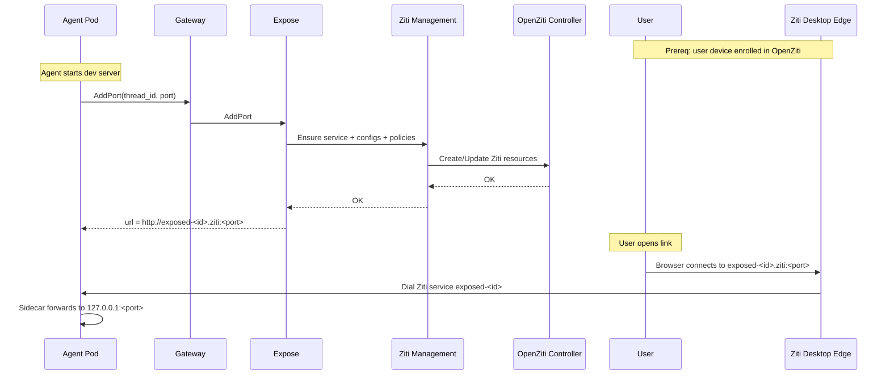

# Expose Service

## Overview

The Expose service provides **temporary access** to TCP ports inside running agent workloads from external user machines.

It is used for workflows like:

- An agent starts a development server inside its container (e.g., Vite on `5173`).
- The agent requests that port be exposed.
- The platform returns a URL like `http://exposed-<id>.ziti:5173`.
- A user with **Ziti Desktop Edge / ziti tunnel** enrolled can open the URL and reach the dev server.

Expose provisions **OpenZiti services, configs, and policies** dynamically (via [Ziti Management](openziti.md#ziti-management-service)).

**User device enrollment** (minting the enrollment token used by Ziti Desktop Edge) is owned by the [Users](users.md#ziti-user-device-enrollment) service.

## Responsibilities

- **Exposed ports** — create and revoke exposed ports for agent workloads.
- **Garbage collection** — reconcile failed provisioning and clean up orphaned exposed ports.
- **Idempotency** — ensure exposed-port provisioning and cleanup are safe to retry.

Non-goals:
- Not a general internet ingress.
- Not an HTTP reverse proxy.
- Access scope policy is TBD (see [Open Questions](../open-questions.md#openziti-exposed-ports-access-scope)).

## API

Expose is an internal gRPC service. Selected methods are exposed externally through the [Gateway](gateway.md).

| Method | Caller | Description |
|--------|--------|-------------|
| **AddPort** | Agent | Expose a local TCP port from the agent workload and return a URL (`http://exposed-<id>.ziti:<port>`) |
| **DeletePort** | Agent, User, GC loop | Revoke an exposed port and delete its OpenZiti resources |
| **DeletePortsForAgent** | Agents Orchestrator, GC loop | Revoke all ports for a given agent (workload stop cleanup) |
| **GetPort** | User (Console), internal | Fetch port status and URL |

### AddPort

Creates an exposed port bound to the calling agent.

**Request**

| Field | Type | Description |
|------|------|-------------|
| `thread_id` | string (UUID) | Thread the agent is working in |
| `port` | int32 | Local TCP port inside the agent pod (e.g., `5173`) |
| `description` | string | Optional display text (e.g., `"Vite dev server"`) |

**Response**

| Field | Type | Description |
|------|------|-------------|
| `port_id` | string | 8-character port ID |
| `url` | string | URL to open (e.g., `"http://exposed-ab12cd34.ziti:5173"`) |
| `status` | enum | `active` |

Expose resolves the calling agent identity to `agent_id` and `organization_id` via `Agents.ResolveAgentIdentity`.

### DeletePort

Revokes an exposed port.

**Request**

| Field | Type | Description |
|------|------|-------------|
| `port_id` | string | Port identifier |

**Response**

Empty.

Deletion is idempotent: deleting an already-deleted port returns success.

### DeletePortsForAgent

Revokes all exposed ports owned by a given agent.

This is primarily used as part of workload stop cleanup: when the Agents Orchestrator stops an agent workload, it calls `DeletePortsForAgent(agent_id)` so the ports are removed promptly (GC remains the backstop).

**Request**

| Field | Type | Description |
|------|------|-------------|
| `agent_id` | string (UUID) | Agent resource UUID |

**Response**

| Field | Type | Description |
|------|------|-------------|
| `results` | object[] | Per-port deletion result |

Each `results[]` entry:

| Field | Type | Description |
|------|------|-------------|
| `port_id` | string | Port identifier |
| `status` | enum | `deleted`, `failed` |
| `error` | string | Present when `status=failed` |

**Behavior**

1. Lookup all exposed ports for `agent_id` in `status in {provisioning, active, failed}`.
2. For each, run the same deletion sequence as `DeletePort`.
3. Return per-port results; any failures are retried by GC.

## ExposedPort Resource

Expose stores each exposed port as a first-class resource.

| Field | Type | Description |
|------|------|-------------|
| `port_id` | string | 8-character port ID |
| `organization_id` | string (UUID) | Owning organization (derived from agent) |
| `agent_id` | string (UUID) | Agent resource UUID |
| `thread_id` | string (UUID) | Thread where the port was exposed |
| `port` | int32 | Local TCP port inside the agent pod |
| `hostname` | string | `exposed-<port_id>.ziti` |
| `description` | string | Optional display text |
| `status` | enum | `provisioning`, `active`, `deleting`, `failed` |
| `last_error` | string | Error message when `status=failed` |
| `created_at` | timestamp | Creation time |
| `updated_at` | timestamp | Last update time |

## OpenZiti Provisioning Model

Expose provisions OpenZiti resources through [Ziti Management](openziti.md#ziti-management-service).

### Naming

All created resources use deterministic names derived from `port_id`:

| Resource | Name |
|----------|------|
| Service | `exposed-<port_id>` |
| Intercept hostname | `exposed-<port_id>.ziti` |
| Intercept config | `exposed-<port_id>-intercept-v1` |
| Host config | `exposed-<port_id>-host-v1` |
| Bind policy | `exposed-<port_id>-bind` |
| Dial policy | `exposed-<port_id>-dial` |

This makes provisioning and cleanup **idempotent**.

### Resources Created per Exposed Port

For each exposed port, Expose ensures:

1. **OpenZiti service** named `exposed-<port_id>` with role attribute `exposed-services`.
2. **Intercept config** (`intercept.v1`) matching hostname `exposed-<port_id>.ziti` and TCP port `port`.
3. **Host config** (`host.v1`) forwarding to `127.0.0.1:port` inside the agent pod network namespace.
4. **Bind service policy** granting only the agent's role attribute `agent-<agent_id>` permission to bind the service.
5. **Dial service policy** granting selected user devices permission to dial the service (see [OpenZiti: Exposed Ports Access Scope](../open-questions.md#openziti-exposed-ports-access-scope)).

### Exposed Port Flow

## Removal, Cleanup, and GC

### When exposed ports are removed

An exposed port (and its OpenZiti service/config/policy objects) should be removed when any of the following occurs:

1. **Explicit revoke** — user (Console) or agent calls `DeletePort(port_id)`.
2. **Workload stop** — when an agent workload is terminated, the control plane should revoke any remaining exposed ports for that agent.
   - Preferred: the **Agents Orchestrator** calls Expose to revoke exposed ports as part of workload stop.
   - Backstop: Expose GC detects exposed ports whose agent workload no longer exists and deletes them.
3. **Failed provisioning** — ports stuck in `failed` or `provisioning` beyond a timeout are deleted by GC.

Time-based expiry (TTL) is intentionally not specified yet; add it as a follow-up if we want automatic expiration even for long-running workloads.

### How OpenZiti resources are removed (idempotent)

Expose deletes OpenZiti resources using deterministic names. Deletion treats "not found" as success.

Recommended delete sequence for an exposed port `exposed-<port_id>`:

1. Delete dial policy `exposed-<port_id>-dial`.
2. Delete bind policy `exposed-<port_id>-bind`.
3. Delete service `exposed-<port_id>`.
4. Delete configs `exposed-<port_id>-intercept-v1` and `exposed-<port_id>-host-v1`.

OpenZiti revocation closes active connections; deleting the service/policies makes the URL stop working.

### State machine

- On delete request, set `status=deleting`.
- Attempt OpenZiti deletions.
- On success, delete the `ExposedPort` record (or mark it deleted/tombstoned; retention is implementation-defined).
- On error, keep the record, set `last_error`, and rely on GC to retry.

### Garbage collection loop

Expose runs a background reconciler that:

- retries deletion for ports stuck in `failed` or `deleting`.
- deletes exposed ports whose backing workload is no longer running (based on a control-plane workload lookup; implementation-defined).

All deletions are idempotent and may be retried safely.
