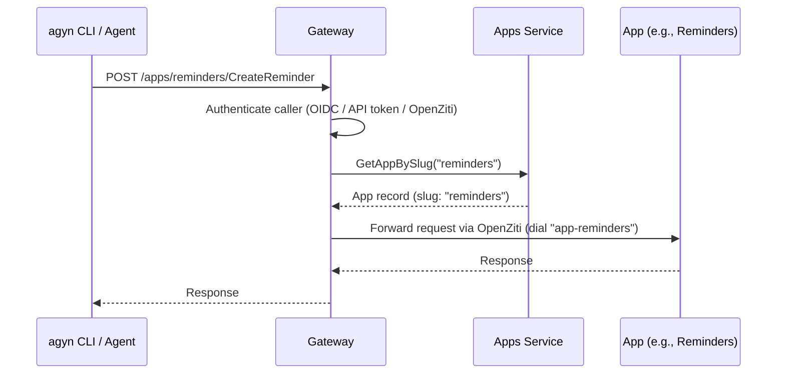

# Gateway

## Overview

The Gateway exposes platform methods for external usage. It is the entry point for external clients (web app, mobile app, integrators, agents, apps) to interact with platform services.

The gateway is accessible via two ingress paths:

| Path | Host | Prefix stripped | Use case |
|------|------|-----------------|----------|
| Subdomain | `gateway.agyn.dev` | No | Direct access, service-to-service |
| Path-based | `agyn.dev/api/` | Yes (`/api/` → `/`) | UI consumption (same origin as the web app) |

The path-based route allows the web app (platform-ui) to call gateway APIs without cross-origin requests.

## Responsibilities

- Route external API requests to internal services.
- Serve both gRPC and HTTP/JSON protocols from the same handler using [ConnectRPC](#connectrpc).
- Stream multipart file uploads to FilesService.UploadFile (client-streaming gRPC).
- Authenticate requests and resolve identity context. For OIDC users: validate the `access_token` JWT signature against the IdP's JWKS endpoint, extract the `sub` claim, and resolve identity via [Users](users.md) service (`ResolveUser` / `CreateUser`). For [API token](api-tokens.md) holders: hash the token and resolve identity via [Users](users.md) service (`ResolveAPIToken`). For OpenZiti actors: resolve identity via [Ziti Management](openziti.md). Every request is authenticated independently via the bearer token. Organization membership is validated by the [authorization model](authz.md), checked by the service performing the operation. See [Authentication](authn.md) and [Organizations — Request Flow](organizations.md#request-flow).

## ConnectRPC

The Gateway uses [ConnectRPC](https://connectrpc.com/) (`connectrpc/connect-go`) to serve the external API. ConnectRPC is an open-source library (Apache 2.0) from the Buf team that serves three wire protocols from a single handler:

| Protocol | Transport | Content-Type | Primary audience |
|----------|-----------|-------------|-----------------|
| **Connect** | HTTP/1.1 or HTTP/2, plain JSON bodies | `application/json` | Browsers, `curl`, any HTTP client |
| **gRPC** | HTTP/2, binary Protobuf with framing | `application/grpc` | Native gRPC clients (`agynd`, Terraform provider) |
| **gRPC-Web** | HTTP/1.1 or HTTP/2, binary with modified framing | `application/grpc-web` | Browser clients that need streaming |

ConnectRPC handlers are standard Go `http.Handler` — they compose with existing middleware (CORS, auth, request ID, recovery) and work with OpenZiti's `net.Listener` (which implements Go's standard `net.Listener` interface).

### Why ConnectRPC

- **Single handler, multiple protocols.** The Gateway does not need protocol-sniffing code or separate gRPC and HTTP servers. Content-Type routing is built into ConnectRPC.
- **Proto as single source of truth.** The external API is defined by proto service definitions in `agynio/api`. No separate OpenAPI specs to maintain.
- **Buf ecosystem alignment.** The project already uses Buf for proto linting, breaking change detection, and the BSR. ConnectRPC code generation (`protoc-gen-connect-go`) integrates with `buf generate`.
- **Browser-friendly without translation.** The Connect protocol serves JSON over HTTP/1.1 — browsers and `curl` can call the API directly without a REST-to-gRPC translation layer.
- **Native gRPC for agents.** `agynd` and other Go clients call the same endpoint using standard gRPC — no JSON serialization overhead.

## External API Surface

The Gateway defines its own **proto services** in `agynio/api` that describe the externally-exposed methods. These gateway proto services import and reuse message types from internal service protos — no duplication of request/response schemas.

```proto
// Example: agynio/api/gateway/v1/threads.proto
syntax = "proto3";
package agynio.api.gateway.v1;

import "agynio/api/threads/v1/threads.proto";

service ThreadsGateway {
  rpc GetMessages(agynio.api.threads.v1.GetMessagesRequest)
      returns (agynio.api.threads.v1.GetMessagesResponse);
  rpc SendMessage(agynio.api.threads.v1.SendMessageRequest)
      returns (agynio.api.threads.v1.SendMessageResponse);
}
```

Only methods intended for external use appear in gateway proto services. Internal-only methods (e.g., `RegisterIdentity`) are not listed — no handler means no access.

### Exposed Services

| Gateway Proto Service | Internal Service | Methods |
|-----------------------|-----------------|---------|
| `AgentsGateway` | [Agents](agents-service.md) | All CRUD methods for agents and sub-resources |
| `ThreadsGateway` | [Threads](threads.md) | All methods |
| `ChatGateway` | [Chat](chat.md) | All methods |
| `NotificationsGateway` | [Notifications](notifications.md) | Subscribe (server-streaming) |
| `FilesGateway` | [Files](media.md) | UploadFile (client-streaming), GetFileMetadata, GetDownloadURL, GetFileContent (server-streaming) |
| `TracingGateway` | [Tracing](tracing.md) | Ingest, Query |
| `SecretsGateway` | [Secrets](secrets.md) | ResolveSecretValue, CreateSecretProvider, GetSecretProvider, ListSecretProviders, UpdateSecretProvider, DeleteSecretProvider, CreateSecret, GetSecret, ListSecrets, UpdateSecret, DeleteSecret |
| `UsersGateway` | [Users](users.md) | GetMe, CreateAPIToken, ListAPITokens, RevokeAPIToken, CreateUser, GetUser, ListUsers, UpdateUser, DeleteUser |
| `RunnersGateway` | [Runners](runners.md) | RegisterRunner, GetRunner, ListRunners, UpdateRunner, DeleteRunner, EnrollRunner, ListWorkloads, ListWorkloadsByThread, GetWorkload |
| `OrganizationsGateway` | [Organizations](organizations.md) | CreateOrganization, GetOrganization, ListOrganizations, UpdateOrganization, DeleteOrganization, CreateMembership, AcceptMembership, DeclineMembership, RemoveMembership, UpdateMembershipRole, ListMembers, ListMyMemberships |
| `LLMGateway` | [LLM](llm.md) | CreateProvider, GetProvider, ListProviders, UpdateProvider, DeleteProvider, CreateModel, GetModel, ListModels, UpdateModel, DeleteModel |
| `TokenCountingGateway` | [Token Counting](token-counting.md) | All methods |

### Handler Implementation

Each ConnectRPC handler receives a typed proto message (regardless of wire protocol), performs authentication and authorization, calls the internal gRPC service, and returns the response:

```go
func (g *Gateway) GetMessages(
    ctx context.Context,
    req *connect.Request[threadsv1.GetMessagesRequest],
) (*connect.Response[threadsv1.GetMessagesResponse], error) {
    // Authentication, authorization
    // Call internal Threads service via standard gRPC client
    resp, err := g.threadsClient.GetMessages(ctx, req.Msg)
    if err != nil {
        return nil, err
    }
    return connect.NewResponse(resp), nil
}
```

## Classification

The Gateway is a **data plane** service — it carries live API traffic.

## Implementation

The gateway (`agynio/gateway`, Go) uses:
- `connectrpc/connect-go` for handler generation and protocol serving.
- `protoc-gen-connect-go` for server stub generation from gateway proto definitions.
- Standard gRPC clients for calling internal services.

### Ingress Routing

The gateway receives traffic through two Istio VirtualService routes (defined in `agynio/bootstrap`, `stacks/platform/main.tf`):

1. **Subdomain route** (`virtualservice_gateway`): `gateway.agyn.dev/*` → `gateway-gateway:8080`. No URI rewrite.
2. **Path-based route** (`virtualservice_platform_ui`): `agyn.dev/api/*` → `gateway-gateway:8080` with URI rewrite (`/api/` → `/`). This route is defined on the same VirtualService as the platform-ui route.

The UI uses the path-based route (`/api/`) so that the gateway API is served from the same origin as the web app, avoiding CORS overhead.

## App Proxy

The Gateway provides a generic proxy mechanism for routing requests to [apps](apps.md). This avoids registering per-app proto services in the Gateway — apps define their own API and the Gateway forwards requests opaquely.

### Routing

App requests are identified by the URL path pattern:

```
/apps/{slug}/{method}
```

For example:
- `/apps/reminders/CreateReminder`
- `/apps/reminders/ListReminders`
- `/apps/reminders/CancelReminder`

The `agyn` CLI translates `agyn app <slug> <command>` into HTTP requests to this path pattern.

### Flow



1. Gateway receives a request matching `/apps/{slug}/{method}`.
2. Gateway authenticates the caller (same as all other requests).
3. Gateway resolves the app slug via the [Apps Service](apps-service.md) (`GetAppBySlug`). The OpenZiti service name is derived from the slug as `app-{slug}`.
4. Gateway dials the app's OpenZiti service and forwards the request body.
5. Gateway returns the app's response to the caller.

### Identity Propagation

The Gateway injects the caller's identity into the forwarded request (same metadata headers as internal services: `x-identity-id`, `x-identity-type`). This allows apps to know who initiated the request (e.g., which agent created a reminder).

### Protocol

The Gateway forwards app requests as opaque HTTP/ConnectRPC calls over OpenZiti. Apps implement their own ConnectRPC services — the Gateway does not interpret request or response payloads. This means:

- Adding a new app does not require Gateway code changes.
- App API evolution does not require Gateway redeployment.
- The Gateway's only responsibilities are: authentication, app slug resolution, and transport.

### Caching

The `GetAppBySlug` lookup is cached in-memory with a short TTL. App registrations change infrequently.

### Exposed Services Table Update

| Gateway Proto Service | Internal Service | Methods |
|-----------------------|-----------------|---------|
| `AppsGateway` | [Apps Service](apps-service.md) | ListApps, GetApp |
| *(app proxy)* | *per-app via OpenZiti* | *pass-through* |
