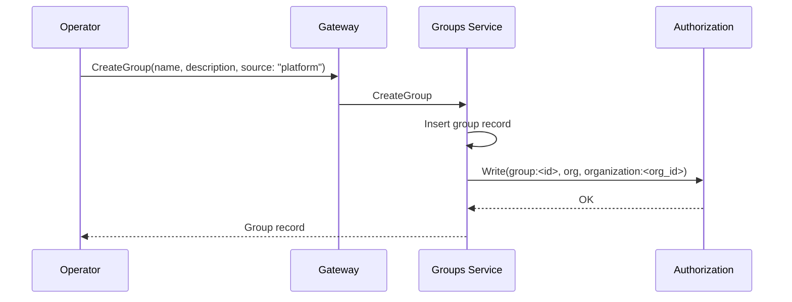

# Groups Service

## Overview

The Groups service owns `Group` and `GroupMembership` resources. Groups are organization-scoped collections of platform identities (users, agents, apps) used to grant permissions and resource access in bulk rather than one-by-one. Group membership is enforced through two channels: [Authorization](authz.md) (OpenFGA tuples on the `group` type, consumed by every other type that accepts `group#member` as a role) and [OpenZiti](openziti.md) (role attributes `group-<id>` applied to each member's network identity, consumed by per-grant Dial policies).

The service is a foundational platform primitive — groups are useful well beyond Private Networks (granting `editor` on an agent to a team, sharing a [Secret](secrets.md) to a team, ACLing a [Thread](threads.md) to a team, etc.). The first user is the [Networks service](networks-service.md), which accepts `group:<id>` as a principal on `PrivateResourceAccess` grants.

## Concepts

| Term | Definition |
|---|---|
| **Group** | An organization-scoped named collection of platform identities |
| **GroupMembership** | A `(group, member)` relationship where `member` is one of `user`, `agent`, or `app`. Runner identities are not eligible — runners are infrastructure, not actors in the access model |
| **Source of truth** | Per-group flag indicating whether the group is `platform`-managed (Console / CLI / Terraform) or `scim`-managed (synced from an external IdP). SCIM groups have user membership reconciled by the IdP; platform-added non-user members on the same group are retained across syncs |

Mixed membership is supported within a single group — an "engineering" group can contain humans, agents, and apps. See [SCIM Considerations](#scim-considerations) for how this interacts with IdP-driven sync.

Group nesting (a group as a member of another group) is **not** supported in v1, but the OpenFGA model and resource shape are designed to accept it without a breaking change. See [Future: Group Nesting](#future-group-nesting).

## Responsibilities

| Responsibility | Description |
|---|---|
| **Group CRUD** | Create, read, update, delete `Group` resources. Validate `name` uniqueness within `(organization_id, source)` |
| **GroupMembership CRUD** | Add and remove members. Validate the member exists and belongs to the same organization. Reject `runner` member type |
| **OpenFGA tuple writes** | On group create, write `group:<id>, org, organization:<org_id>`. On member add, write `identity:<member_id>, member, group:<id>`. On member remove, delete the same tuple |
| **OpenZiti role-attribute sync** | On member add, patch the member's existing OpenZiti identities to add `group-<id>` to `roleAttributes`. On member remove, patch to drop the attribute. For ephemeral identities (agent workloads), surface group memberships via internal lookup for consumers (Orchestrator) to apply at identity creation |
| **Reconciliation** | Periodic sweep to repair drift between membership records, OpenFGA tuples, and OpenZiti role attributes |
| **Change notifications** | Publish `group.updated` and `group_membership.updated` events to the organization's [Notifications](notifications.md) room |

## Classification

Control plane — CRUD with periodic reconciliation. Membership lookups are also called on the agent workload-creation path (by the [Agents Orchestrator](agents-orchestrator.md)) but the call is lightweight (a single PostgreSQL read per workload).

| Aspect | Detail |
|---|---|
| **Plane** | Control + light data (membership lookup on workload start) |
| **Language** | Go |
| **Repository** | `agynio/groups` |
| **API** | gRPC (internal) + Gateway (external via ConnectRPC) |
| **State** | PostgreSQL — `groups` and `group_memberships` tables |
| **External dependencies** | [Ziti Management](openziti.md) (role-attribute patches on member identities), [Authorization](authz.md) (OpenFGA tuple writes + permission checks), [Identity](identity.md) (existence + type checks for members), [Notifications](notifications.md) |

## API

### Group CRUD

| Method | Description |
|---|---|
| **CreateGroup** | Create a group. Writes the `group:<id>, org, organization:<org_id>` OpenFGA tuple |
| **GetGroup** | Fetch a group by ID |
| **ListGroups** | List groups in an organization. Cursor pagination |
| **UpdateGroup** | Update mutable fields (`name`, `description`). The `source` field is immutable after creation |
| **DeleteGroup** | Delete a group. Cascades through memberships and any OpenFGA tuples granting access via this group (see [Deletion Semantics](#deletion-semantics)) |

### GroupMembership CRUD

| Method | Description |
|---|---|
| **AddMember** | Add a member. Validates the member exists (via [Identity](identity.md)), belongs to the same organization, and is not of type `runner`. Writes the OpenFGA tuple and patches OpenZiti role attributes on the member's existing identities |
| **RemoveMember** | Remove a member. Deletes the OpenFGA tuple and patches OpenZiti role attributes |
| **ListMembers** | List members of a group, optionally filtered by `member_type` |
| **ListMemberGroups** | List groups a given member belongs to. Used by [Agents Orchestrator](agents-orchestrator.md) when assembling agent identity role attributes |
| **ListMemberGroupsBatch** | Internal-only. Batch variant for hot-path callers (e.g., workload-creation fan-out) |

## Resource Shapes

### Group

| Field | Type | Description |
|---|---|---|
| `id` | string (UUID) | Unique identifier |
| `organization_id` | string (UUID) | Owning organization |
| `name` | string | Human-readable, unique within `(organization_id, source)`. Pattern: `^[a-z0-9_-]+$`, max 64 chars |
| `description` | string | Free-form description |
| `source` | enum | `platform` \| `scim`. Immutable after creation |
| `external_id` | string \| null | For `source: scim`, the IdP's group identifier. Null for `platform` groups |
| `created_at`, `updated_at` | timestamp | |

### GroupMembership

| Field | Type | Description |
|---|---|---|
| `id` | string (UUID) | Unique identifier |
| `group_id` | string (UUID) | Reference to the Group |
| `member_type` | enum | `user` \| `agent` \| `app` |
| `member_id` | string (UUID) | Reference to the member identity |
| `source` | enum | `platform` \| `scim`. Indicates whether the membership row itself is IdP-managed |
| `created_at` | timestamp | |

Unique on `(group_id, member_id)`. The `source` field on the membership row is distinct from the `source` field on the parent group — a SCIM-sourced group may have additional platform-added non-user members; those memberships carry `source: platform` and are retained across IdP syncs. See [SCIM Considerations](#scim-considerations).

## OpenFGA Model

The Groups service introduces a new `group` type in the [Authorization](authz.md) model:

```
type group
  relations
    define org: [organization]
    define member: [identity]
    define admin: [identity]
    define can_view: member or member from org
    define can_edit: admin or owner from org
```

Existing types extend their roles to accept `group#member` as a principal. For example, the `agent` type:

```
type agent
  relations
    define editor: [identity, group#member]
    define owner: [identity, group#member]
    define participant: [identity, group#member]
    ...
```

A grant `group:eng-team#member, editor, agent:my-agent` resolves to `editor` for any identity holding the `member` relation on `group:eng-team`. The Check path is `Check(identity:alice, can_edit_config, agent:my-agent)` → walks through `editor` → `group:eng-team#member` → membership tuple → resolves.

For the full model and which existing types extend their roles, see [Authorization](authz.md).

## OpenZiti Role-Attribute Sync

The OpenFGA model is sufficient for application-level permission checks. For OpenZiti policy enforcement on network connections, the Groups service additionally maintains the `group-<id>` role attribute on each member's OpenZiti identity. This is what lets a per-grant Dial policy in [Private Networks](private-networks.md#dial-policy-per-access-grant) target `#group-<id>` and have it resolve to every member's network identity.

The sync strategy varies by member type because different identity types have different lifecycle characteristics:

### Apps and Runners (single persistent identity)

Apps have a single OpenZiti identity per app (see [Apps Service](apps-service.md)). On `AddMember(group_id, app_id)`, the Groups service calls `ZitiManagement.PatchIdentityRoleAttributes(identity_id, add: ["group-<group_id>"])`. On `RemoveMember`, the reciprocal.

(Runners are not eligible group members in v1, so no sync for them.)

### User Devices (per-device persistent identities)

A user may have multiple enrolled device identities (see [Users](users.md)). On group membership change, the Groups service iterates over the user's devices and patches each.

When a new device is enrolled, the Users service queries `Groups.ListMemberGroups(user_id)` and includes `group-<id>` attributes for each group in the enrollment request.

### Agent Workloads (per-workload ephemeral identities)

Agents do not have a persistent OpenZiti identity. The [Agents Orchestrator](agents-orchestrator.md) creates a fresh identity per workload (see [OpenZiti — Agent Identity Lifecycle](openziti.md#agent-identity-lifecycle)). For group memberships to take effect, the Orchestrator queries `Groups.ListMemberGroupsBatch([agent_id])` when assembling the identity creation request and includes `group-<id>` for each group the agent belongs to.

For mid-workload group membership changes (an agent added to or removed from a group while the workload is running), the Groups service patches the live workload identity directly. OpenZiti supports `PATCH /identities/{id}` on already-enrolled identities and reflects role-attribute changes within the SDK's service-list poll interval (≤15 seconds).

## Lifecycle Flows

### Group Creation



### Add Member

```mermaid
sequenceDiagram
    participant O as Operator
    participant GW as Gateway
    participant GS as Groups Service
    participant I as Identity
    participant AS as Authorization
    participant ZM as Ziti Management

    O->>GW: AddMember(group_id, member_type, member_id)
    GW->>GS: AddMember
    GS->>I: GetIdentityType(member_id)
    I-->>GS: type (validated against member_type, runner rejected)
    GS->>GS: Insert membership row
    GS->>AS: Write(identity:<member_id>, member, group:<group_id>)
    AS-->>GS: OK
    alt Member is App or User
        GS->>ZM: PatchIdentityRoleAttributes(identity_id, add: "group-<group_id>")
        Note over GS,ZM: For users, repeated per device identity
    end
    Note over GS: For agents: change reflected on next workload start; for running workloads, patched directly
    GS-->>O: GroupMembership record
```

### Remove Member

Symmetric to Add — delete the membership row, delete the OpenFGA tuple, patch role attributes to drop `group-<id>`.

## Reconciliation

The Groups service runs a periodic reconciliation loop to repair drift between persistent state, OpenFGA tuples, and OpenZiti role attributes.

### Reconciliation Logic

Each pass:

1. **OpenFGA tuple consistency.** For each `Group` and `GroupMembership` row, verify the corresponding tuples exist in OpenFGA. Write missing tuples; delete tuples without backing rows.
2. **OpenZiti role-attribute consistency.** For each App, User-device, and live Agent workload identity, verify the set of `group-<id>` attributes matches the member's current group memberships. Patch identities to add missing attributes and drop extras.
3. **Orphaned memberships.** For each `GroupMembership` row, verify the referenced member identity still exists (via [Identity](identity.md)). If the identity has been deleted (e.g., user removed from org), delete the membership.

This ensures eventual consistency without requiring synchronous error handling on every membership change.

## Deletion Semantics

| Delete | Cascades to |
|---|---|
| `Group` | All `GroupMembership` rows in the group, all OpenFGA tuples granting roles via this group (`*, *, group:<id>#member` reverse-resolved), all `group-<id>` role attributes on member identities |
| `GroupMembership` | The OpenFGA `member` tuple, the `group-<id>` attribute on the member's identities |

Deleting a group also has knock-on effects on other services (e.g., revoking access grants in the [Networks service](networks-service.md) whose principal was the deleted group). Those services are notified via the change-event subscription model and clean up their own dependent state on `group.updated` events with a deletion marker.

## Notifications

Events published to the organization's [Notifications](notifications.md) room (`organization:<org_id>`):

| Event | Emitted when |
|---|---|
| `group.updated` | A `Group` is created, updated, or deleted |
| `group_membership.updated` | A `GroupMembership` is created or deleted |

Subscribers:

- **Networks service** — invalidates cached principal resolution; reconciles dependent access grants on deletion.
- **Agents Orchestrator** — reapplies role attributes to live workload identities on membership change.
- **Console** — UI reactivity.

## Authorization

| Operation | Check |
|---|---|
| `CreateGroup`, `UpdateGroup`, `DeleteGroup` | `owner` on `organization:<org_id>` |
| `GetGroup`, `ListGroups` | `member` on `organization:<org_id>` |
| `AddMember`, `RemoveMember` | `can_edit` on `group:<group_id>` (admin of the group OR owner of the org) |
| `ListMembers` | `can_view` on `group:<group_id>` (member of the group OR member of the org) |
| `ListMemberGroups` (other identity) | `member` on `organization:<org_id>` |
| `ListMemberGroups` (self) | Authenticated; the caller may list their own group memberships |
| `ListMemberGroupsBatch` | Internal-only — gated by Istio `AuthorizationPolicy` |

See [Authorization — Groups Service](authz.md#groups-service) for the full reference.

## SCIM Considerations

The Groups service is designed to support [SCIM v2](https://datatracker.ietf.org/doc/html/rfc7644)-driven user and group provisioning from external IdPs. SCIM-specific endpoints are not part of v1, but the data model supports the eventual layer:

| Concern | Design |
|---|---|
| Group provenance | `Group.source = scim` indicates the group's name and user membership are IdP-owned. Platform users cannot edit user members of a SCIM group through normal CRUD — those changes will be overwritten by the next sync |
| Augmented membership | A SCIM group may contain platform-added non-user members (agents, apps) with `GroupMembership.source = platform`. These are retained across IdP syncs. This enables "Engineering" to have IdP-managed humans plus locally-added bots |
| Group lifecycle | Deletion of a SCIM-managed group via SCIM triggers the same cascade as a platform deletion. The augmented platform memberships are removed with the group |
| Identifier mapping | `Group.external_id` holds the IdP's group identifier (Okta group ID, Azure AD object ID, etc.) for the SCIM facade to reconcile against |
| Conflict resolution | If a SCIM sync creates a group whose `name` collides with an existing platform group, the SCIM group's name is suffixed (`engineering` → `engineering (scim)`) and an alert is raised to the org owner |

The SCIM facade itself (the `/scim/v2/Users` and `/scim/v2/Groups` REST endpoints, PATCH grammar parsing, IdP-specific quirks) lives alongside the [Users service](users.md) — it is fundamentally a user-provisioning protocol — and calls `Users.*` and `Groups.*` RPCs internally. No structural change to Groups is required when SCIM lands.

## Future: Group Nesting

OpenFGA's `group#member` relation natively supports recursion (`type group … define member: [identity, group#member]`). The v1 OpenFGA model omits the `group#member` reference to keep evaluation paths shallow, but the resource shape is forward-compatible: a future `GroupMembership` could carry `member_type: group` with `member_id` pointing at the nested group. When the model adds `group#member` to the `member` relation, nested membership resolves transitively.

The OpenZiti role-attribute sync becomes more involved with nesting — a child group's `group-<id>` attribute must be added to the parent group's effective members. This is reconcilable but adds an indirection layer per level. We will revisit when there is a real use case.

See [open-questions.md](../open-questions.md).

## Gateway Exposure

| Gateway Proto Service | Methods |
|---|---|
| `GroupsGateway` | `CreateGroup`, `GetGroup`, `ListGroups`, `UpdateGroup`, `DeleteGroup`, `AddMember`, `RemoveMember`, `ListMembers`, `ListMemberGroups` |

`ListMemberGroupsBatch` is internal-only and not exposed through the Gateway.

## Configuration

| Field | Source | Description |
|---|---|---|
| `LISTEN_ADDRESS` | Deployment config | gRPC listen address |
| `DATABASE_URL` | Deployment config | PostgreSQL connection string |
| `ZITI_MANAGEMENT_ADDRESS` | Deployment config | gRPC address of [Ziti Management](openziti.md) |
| `AUTHORIZATION_SERVICE_ADDRESS` | Deployment config | gRPC address of [Authorization](authz.md) |
| `IDENTITY_SERVICE_ADDRESS` | Deployment config | gRPC address of [Identity](identity.md) |
| `NOTIFICATIONS_ADDRESS` | Deployment config | gRPC address of [Notifications](notifications.md) |
| `RECONCILIATION_INTERVAL` | Deployment config | How often the reconciliation loop runs (default `60s`) |

## Data Store

PostgreSQL. The Groups service owns its database with `groups` and `group_memberships` tables.

## Implementation

| Aspect | Details |
|---|---|
| Repository | `agynio/groups` |
| Language | Go |
| API framework | gRPC with ConnectRPC for the Gateway-exposed surface |
| Internal calls | Standard gRPC clients for Ziti Management, Authorization, Identity, Notifications |

## Related Architecture

- [Identity](identity.md) — type-agnostic identity registry; resolves `member_id` to `member_type`
- [Authorization](authz.md) — OpenFGA `group` type and `group#member` references on other types
- [OpenZiti Integration](openziti.md) — role-attribute patches on member identities
- [Users](users.md) — device-identity lifecycle; consumes group memberships when enrolling new devices
- [Agents Orchestrator](agents-orchestrator.md) — consumes group memberships when creating per-workload identities
- [Networks Service](networks-service.md) — first downstream consumer; accepts `group:<id>` as a principal on resource access grants
