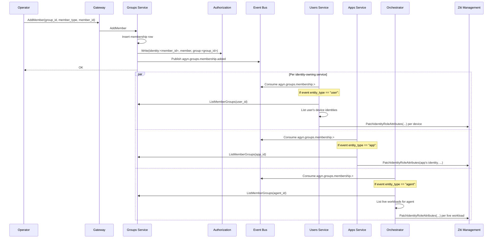
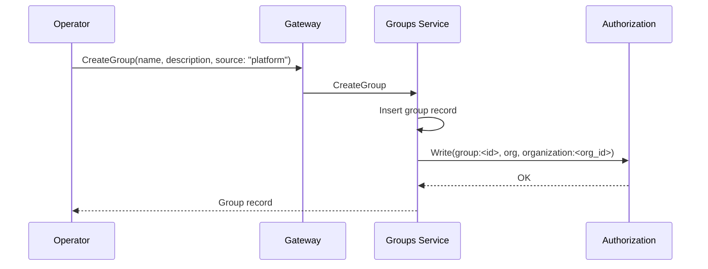
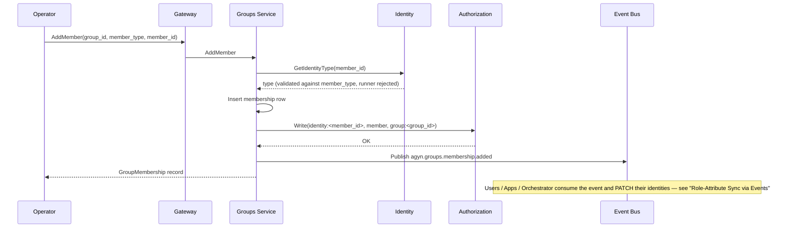

# Groups Service

## Overview

The Groups service owns `Group` and `GroupMembership` resources. Groups are organization-scoped collections of platform identities (users, agents, apps) used to grant permissions and resource access in bulk rather than one-by-one. Group membership is enforced through two channels: [Authorization](authz.md) (OpenFGA tuples on the `group` type, consumed by every other type that accepts `group#member` as a role) and [OpenZiti](openziti.md) (role attributes `group-<id>` applied to each member's network identity, consumed by per-grant Dial policies).

The service is a foundational platform primitive — groups are useful well beyond Private Networks (granting `editor` on an agent to a team, sharing a [Secret](secrets.md) to a team, ACLing a [Thread](threads.md) to a team, etc.). The first user is the [Networks service](networks-service.md), which accepts `group:<id>` as a principal on `PrivateResourceAccess` grants.

## Concepts

| Term | Definition |
|---|---|
| **Group** | An organization-scoped named collection of platform identities |
| **GroupMembership** | A `(group, member)` relationship where `member` is one of `user`, `agent`, or `app`. Runner identities are not eligible — runners are infrastructure, not actors in the access model |
| **Source of truth** | Per-group flag indicating whether the group is `platform`-managed (Console / CLI / Terraform) or `scim`-managed (synced from an external IdP). SCIM groups have user membership reconciled by the IdP; platform-added non-user members on the same group are retained across syncs |

Mixed membership is supported within a single group — an "engineering" group can contain humans, agents, and apps. See [SCIM Considerations](#scim-considerations) for how this interacts with IdP-driven sync.

Group nesting (a group as a member of another group) is **not** supported in v1, but the OpenFGA model and resource shape are designed to accept it without a breaking change. See [Future: Group Nesting](#future-group-nesting).

## Responsibilities

| Responsibility | Description |
|---|---|
| **Group CRUD** | Create, read, update, delete `Group` resources. Validate `name` uniqueness within `(organization_id, source)` |
| **GroupMembership CRUD** | Add and remove members. Validate the member exists and belongs to the same organization. Reject `runner` member type |
| **OpenFGA tuple writes** | On group create, write `group:<id>, org, organization:<org_id>`. On member add, write `identity:<member_id>, member, group:<id>`. On member remove, delete the same tuple |
| **Membership lookup** | Serve `ListMemberGroups(entity_id)` for identity-owning services to query an entity's current group memberships when creating new identities (new user devices, new agent workloads) |
| **Event publication** | Publish `agyn.groups.membership.added`, `agyn.groups.membership.removed`, and `agyn.groups.group.deleted` events via the platform [event bus](messaging.md). Identity-owning services consume these events and update their own OpenZiti identities |
| **Reconciliation** | Periodic sweep to repair drift between membership records and OpenFGA tuples |
| **Client-facing updates** | Publish `group.updated` and `group_membership.updated` events to the organization's [Notifications](notifications.md) room for Console reactivity (separate from the service-to-service event bus) |

The Groups service does **not** patch OpenZiti identities directly. Each identity-owning service ([Users](users.md), [Apps Service](apps-service.md), [Agents Orchestrator](agents-orchestrator.md)) subscribes to group events and PATCHes the identities it owns. This keeps role-attribute ownership co-located with identity lifecycle ownership — see [Group Role-Attribute Sync via Events](#group-role-attribute-sync-via-events).

## Classification

Control plane — CRUD with periodic reconciliation. Membership lookups are also called on the agent workload-creation path (by the [Agents Orchestrator](agents-orchestrator.md)) but the call is lightweight (a single PostgreSQL read per workload).

| Aspect | Detail |
|---|---|
| **Plane** | Control + light data (membership lookup on workload start) |
| **Language** | Go |
| **Repository** | `agynio/groups` |
| **API** | gRPC (internal) + Gateway (external via ConnectRPC) |
| **State** | PostgreSQL — `groups` and `group_memberships` tables |
| **External dependencies** | [Authorization](authz.md) (OpenFGA tuple writes + permission checks), [Identity](identity.md) (existence + type checks for members), [Messaging](messaging.md) (event-bus publication), [Notifications](notifications.md) (client-facing UI updates) |

## API

### Group CRUD

| Method | Description |
|---|---|
| **CreateGroup** | Create a group. Writes the `group:<id>, org, organization:<org_id>` OpenFGA tuple |
| **GetGroup** | Fetch a group by ID |
| **ListGroups** | List groups in an organization. Cursor pagination |
| **UpdateGroup** | Update mutable fields (`name`, `description`). The `source` field is immutable after creation |
| **DeleteGroup** | Delete a group. Cascades through memberships and any OpenFGA tuples granting access via this group (see [Deletion Semantics](#deletion-semantics)) |

### GroupMembership CRUD

| Method | Description |
|---|---|
| **AddMember** | Add a member. Validates the member exists (via [Identity](identity.md)), belongs to the same organization, and is not of type `runner`. Writes the OpenFGA tuple and patches OpenZiti role attributes on the member's existing identities |
| **RemoveMember** | Remove a member. Deletes the OpenFGA tuple and patches OpenZiti role attributes |
| **ListMembers** | List members of a group, optionally filtered by `member_type` |
| **ListMemberGroups** | List groups a given member belongs to. Used by [Agents Orchestrator](agents-orchestrator.md) when assembling agent identity role attributes |
| **ListMemberGroupsBatch** | Internal-only. Batch variant for hot-path callers (e.g., workload-creation fan-out) |

## Resource Shapes

### Group

| Field | Type | Description |
|---|---|---|
| `id` | string (UUID) | Unique identifier |
| `organization_id` | string (UUID) | Owning organization |
| `name` | string | Human-readable, unique within `(organization_id, source)`. Pattern: `^[a-z0-9_-]+$`, max 64 chars |
| `description` | string | Free-form description |
| `source` | enum | `platform` \| `scim`. Immutable after creation |
| `external_id` | string \| null | For `source: scim`, the IdP's group identifier. Null for `platform` groups |
| `created_at`, `updated_at` | timestamp | |

### GroupMembership

| Field | Type | Description |
|---|---|---|
| `id` | string (UUID) | Unique identifier |
| `group_id` | string (UUID) | Reference to the Group |
| `member_type` | enum | `user` \| `agent` \| `app` |
| `member_id` | string (UUID) | Reference to the member identity |
| `source` | enum | `platform` \| `scim`. Indicates whether the membership row itself is IdP-managed |
| `created_at` | timestamp | |

Unique on `(group_id, member_id)`. The `source` field on the membership row is distinct from the `source` field on the parent group — a SCIM-sourced group may have additional platform-added non-user members; those memberships carry `source: platform` and are retained across IdP syncs. See [SCIM Considerations](#scim-considerations).

## OpenFGA Model

The Groups service introduces a new `group` type in the [Authorization](authz.md) model:

```
type group
  relations
    define org: [organization]
    define member: [identity]
    define admin: [identity]
    define can_view: member or member from org
    define can_edit: admin or owner from org
```

Existing types extend their roles to accept `group#member` as a principal. For example, the `agent` type:

```
type agent
  relations
    define editor: [identity, group#member]
    define owner: [identity, group#member]
    define participant: [identity, group#member]
    ...
```

A grant `group:eng-team#member, editor, agent:my-agent` resolves to `editor` for any identity holding the `member` relation on `group:eng-team`. The Check path is `Check(identity:alice, can_edit_config, agent:my-agent)` → walks through `editor` → `group:eng-team#member` → membership tuple → resolves.

For the full model and which existing types extend their roles, see [Authorization](authz.md).

## Group Role-Attribute Sync via Events

The OpenFGA model is sufficient for application-level permission checks. For OpenZiti policy enforcement on network connections, member identities additionally need to carry the `group-<id>` role attribute so per-grant Dial policies in [Private Networks](private-networks.md#dial-policy-per-access-grant) targeting `#group-<id>` resolve to every member's network identity.

The Groups service does not patch OpenZiti identities itself. Instead, on every membership change it publishes an event via the platform [event bus](messaging.md). Each identity-owning service subscribes and PATCHes the identities it owns. This co-locates role-attribute mutation with identity lifecycle ownership and removes the Groups service's dependency on identity-storage knowledge for every member type.

### Event-driven sync flow



Each subscriber re-reads source-of-truth (`Groups.ListMemberGroups`) and reconciles its identities to match. This makes handlers idempotent by construction — receiving the same event twice produces the same end state. See [Messaging — Idempotency](messaging.md#idempotency).

### Per identity-type behavior

| Identity type | Owner service | New-identity bootstrap | Membership-change reaction |
|---|---|---|---|
| App | [Apps Service](apps-service.md) | On app enrollment, query `Groups.ListMemberGroups(app_id)` and include `group-<id>` attributes in the identity creation request | Consume `agyn.groups.membership.>` events; PATCH the app's single identity when its membership changes |
| User devices | [Users Service](users.md) | On device enrollment, query `Groups.ListMemberGroups(user_id)` and include `group-<id>` attributes | Consume `agyn.groups.membership.>` events; PATCH every device identity for the affected user |
| Agent workloads | [Agents Orchestrator](agents-orchestrator.md) | On workload creation, query `Groups.ListMemberGroups(agent_id)` and include `group-<id>` attributes | Consume `agyn.groups.membership.>` events; for each live workload of the affected agent, PATCH the identity. Workload identities are ephemeral — new workloads picked up at creation, live workloads patched on event |
| Runners | — | Not eligible group members. No sync | — |
| Tunnels | — | Tunnels are not group members. Group-based access to private resources happens via Dial policies on the **dialer** side (user/agent/app); tunnel identities only carry `network-<id>` | — |

### Reading source of truth, not trusting the event payload

The event payload contains only `{group_id, entity_type, entity_id}`. Consumers do **not** derive desired role attributes from the event payload — they call `Groups.ListMemberGroups(entity_id)` to fetch the entity's current group memberships and compute the role-attribute set from that. `Groups.ListMemberGroups` is the canonical source of truth for membership; the event is only a trigger for "re-check this entity."

This pattern:

- **Survives out-of-order delivery.** Even if an add event arrives after a later remove event, both handlers re-read current state and reach the correct end-state.
- **Handles missed events through reconciliation.** A missed event has no permanent effect — the next reconciliation pass against `Groups.ListMemberGroups` repairs the drift.
- **Eliminates per-event state tracking.** Consumers don't track "what attributes did I add for which event" — they reconcile to the desired set.
- **Avoids the publish-after-commit gap.** Per [Messaging — Producer Reliability Contract](messaging.md#producer-reliability-contract), publish is best-effort in v1; this pattern makes that acceptable because reconciliation is the correctness mechanism.

Worst-case staleness: typically <1s on a healthy cluster (event → handler → PATCH → OpenZiti SDK service-list poll); bounded by the consumer's reconciliation interval (60s) in failure scenarios. See [Messaging — Propagation Guarantees](messaging.md#propagation-guarantees).

## Lifecycle Flows

### Group Creation



### Add Member



### Remove Member

Symmetric to Add — delete the membership row, delete the OpenFGA tuple, publish `agyn.groups.membership.removed`. Identity-owning services consume the event and PATCH their identities to drop the `group-<id>` attribute.

## Reconciliation

The Groups service runs a periodic reconciliation loop to repair drift between its persistent state and OpenFGA.

### Reconciliation Logic

Each pass:

1. **OpenFGA tuple consistency.** For each `Group` and `GroupMembership` row, verify the corresponding tuples exist in OpenFGA. Write missing tuples; delete tuples without backing rows.
2. **Orphaned memberships.** For each `GroupMembership` row, verify the referenced member identity still exists (via [Identity](identity.md)). If the identity has been deleted (e.g., user removed from org), delete the membership.

OpenZiti role-attribute consistency is **not** the Groups service's concern. Each identity-owning service (Users, Apps, Orchestrator) runs its own reconciliation pass that compares its identities' `group-<id>` attributes against the current group memberships from `Groups.ListMemberGroups`. This keeps reconciliation scoped to the identities each service actually owns and avoids cross-service traversal at scale.

## Deletion Semantics

All deletions are hard — there is no soft-delete or invalid-mark state in v1. Auditability comes from service DB rows (`created_at` / `deleted_at` if a future audit log captures deletes) and from the event-bus trace, not from preserving deleted rows.

### Group deletion cascade

When a `Group` is deleted, the Groups service:

1. Reads the list of current members.
2. Within a single DB transaction: deletes the `Group` row, deletes all `GroupMembership` rows, deletes all OpenFGA tuples on `group:<id>` (the `org` relation, every `member` and `admin` tuple).
3. Publishes events to the [event bus](messaging.md):
   - One `agyn.groups.membership.removed` event **per former member** — consumed by identity-owning services to PATCH the `group-<id>` attribute off each member's identities.
   - One `agyn.groups.group.deleted` event — consumed by grant-holding services to delete rows referencing `group:<id>` as a principal.

The two-event pattern ensures clean separation of concerns:

| Event | Consumed by | Purpose |
|---|---|---|
| `agyn.groups.membership.removed` (one per former member) | Users / Apps / Orchestrator | PATCH `group-<id>` off the affected member's identities. Same handler as for normal member-remove |
| `agyn.groups.group.deleted` (one per deleted group) | Networks, future Secrets, future Agents-secondary-grants, ... | Find rows where `principal_type=group, principal_id=<deleted>`, hard-delete them and their backing OpenZiti resources |

Identity-owning services do not need to handle `group.deleted` separately — they react via the per-member `membership.removed` events. Grant-holding services do not walk identities — they only need the `group.deleted` event to find and delete their rows by group ID.

### GroupMembership deletion

| Step | Action |
|---|---|
| 1 | Delete the `GroupMembership` row |
| 2 | Delete the OpenFGA `identity:<member>, member, group:<id>` tuple |
| 3 | Publish `agyn.groups.membership.removed` |

Identity-owning services consume the event and PATCH the affected identities. See [Group Role-Attribute Sync via Events](#group-role-attribute-sync-via-events).

## Events Published

Durable service-to-service events on the platform [event bus](messaging.md). Stream: `AGYN_GROUPS`.

| Subject | Schema | Published when |
|---|---|---|
| `agyn.groups.membership.added` | `agyn.groups.v1.GroupMembershipAddedEvent` | `AddMember` RPC completes — DB row and OpenFGA tuple committed |
| `agyn.groups.membership.removed` | `agyn.groups.v1.GroupMembershipRemovedEvent` | `RemoveMember` RPC completes — DB row and OpenFGA tuple deleted |
| `agyn.groups.group.deleted` | `agyn.groups.v1.GroupDeletedEvent` | `DeleteGroup` RPC completes — DB row, memberships, and OpenFGA tuples deleted |

Known consumers (informational):

- [Users Service](users.md) — PATCHes user device identities on membership change
- [Apps Service](apps-service.md) — PATCHes app identity on membership change
- [Agents Orchestrator](agents-orchestrator.md) — PATCHes live agent workload identities on membership change
- [Networks Service](networks-service.md) — cleans up `PrivateResourceAccess` grants on `group.deleted`

## Client-Facing Updates

Separately from the service-to-service event bus, the Groups service publishes UI-facing updates to the organization's [Notifications](notifications.md) room (`organization:<org_id>`) for Console reactivity:

| Event | Emitted when |
|---|---|
| `group.updated` | A `Group` is created, updated, or deleted |
| `group_membership.updated` | A `GroupMembership` is created or deleted |

These are fire-and-forget Socket.IO-style updates for the browser — they are distinct from the durable event bus and not consumed by other services. See [Messaging — Overview](messaging.md#overview) for the distinction.

## Authorization

| Operation | Check |
|---|---|
| `CreateGroup`, `UpdateGroup`, `DeleteGroup` | `owner` on `organization:<org_id>` |
| `GetGroup`, `ListGroups` | `member` on `organization:<org_id>` |
| `AddMember`, `RemoveMember` | `can_edit` on `group:<group_id>` (admin of the group OR owner of the org) |
| `ListMembers` | `can_view` on `group:<group_id>` (member of the group OR member of the org) |
| `ListMemberGroups` (other identity) | `member` on `organization:<org_id>` |
| `ListMemberGroups` (self) | Authenticated; the caller may list their own group memberships |
| `ListMemberGroupsBatch` | Internal-only — gated by Istio `AuthorizationPolicy` |

See [Authorization — Groups Service](authz.md#groups-service) for the full reference.

## SCIM Considerations

The Groups service is designed to support [SCIM v2](https://datatracker.ietf.org/doc/html/rfc7644)-driven user and group provisioning from external IdPs. SCIM-specific endpoints are not part of v1, but the data model supports the eventual layer:

| Concern | Design |
|---|---|
| Group provenance | `Group.source = scim` indicates the group's name and user membership are IdP-owned. Platform users cannot edit user members of a SCIM group through normal CRUD — those changes will be overwritten by the next sync |
| Augmented membership | A SCIM group may contain platform-added non-user members (agents, apps) with `GroupMembership.source = platform`. These are retained across IdP syncs. This enables "Engineering" to have IdP-managed humans plus locally-added bots |
| Group lifecycle | Deletion of a SCIM-managed group via SCIM triggers the same cascade as a platform deletion. The augmented platform memberships are removed with the group |
| Identifier mapping | `Group.external_id` holds the IdP's group identifier (Okta group ID, Azure AD object ID, etc.) for the SCIM facade to reconcile against |
| Conflict resolution | If a SCIM sync creates a group whose `name` collides with an existing platform group, the SCIM group's name is suffixed (`engineering` → `engineering (scim)`) and an alert is raised to the org owner |

The SCIM facade itself (the `/scim/v2/Users` and `/scim/v2/Groups` REST endpoints, PATCH grammar parsing, IdP-specific quirks) lives alongside the [Users service](users.md) — it is fundamentally a user-provisioning protocol — and calls `Users.*` and `Groups.*` RPCs internally. No structural change to Groups is required when SCIM lands.

## Future: Group Nesting

OpenFGA's `group#member` relation natively supports recursion (`type group … define member: [identity, group#member]`). The v1 OpenFGA model omits the `group#member` reference to keep evaluation paths shallow, but the resource shape is forward-compatible: a future `GroupMembership` could carry `member_type: group` with `member_id` pointing at the nested group. When the model adds `group#member` to the `member` relation, nested membership resolves transitively.

The OpenZiti role-attribute sync becomes more involved with nesting — a child group's `group-<id>` attribute must be added to the parent group's effective members. This is reconcilable but adds an indirection layer per level. We will revisit when there is a real use case.

See [open-questions.md](../open-questions.md).

## Gateway Exposure

| Gateway Proto Service | Methods |
|---|---|
| `GroupsGateway` | `CreateGroup`, `GetGroup`, `ListGroups`, `UpdateGroup`, `DeleteGroup`, `AddMember`, `RemoveMember`, `ListMembers`, `ListMemberGroups` |

`ListMemberGroupsBatch` is internal-only and not exposed through the Gateway.

## Configuration

| Field | Source | Description |
|---|---|---|
| `LISTEN_ADDRESS` | Deployment config | gRPC listen address |
| `DATABASE_URL` | Deployment config | PostgreSQL connection string |
| `AUTHORIZATION_SERVICE_ADDRESS` | Deployment config | gRPC address of [Authorization](authz.md) |
| `IDENTITY_SERVICE_ADDRESS` | Deployment config | gRPC address of [Identity](identity.md) |
| `NATS_URL` | Deployment config | NATS connection URL for the platform [event bus](messaging.md) |
| `NOTIFICATIONS_ADDRESS` | Deployment config | gRPC address of [Notifications](notifications.md) (client-facing UI updates) |
| `RECONCILIATION_INTERVAL` | Deployment config | How often the reconciliation loop runs (default `60s`) |

## Data Store

PostgreSQL. The Groups service owns its database with `groups` and `group_memberships` tables.

## Implementation

| Aspect | Details |
|---|---|
| Repository | `agynio/groups` |
| Language | Go |
| API framework | gRPC with ConnectRPC for the Gateway-exposed surface |
| Internal calls | Standard gRPC clients for Ziti Management, Authorization, Identity, Notifications |

## Related Architecture

- [Messaging](messaging.md) — platform event bus contract for service-to-service async events
- [Identity](identity.md) — type-agnostic identity registry; resolves `member_id` to `member_type`
- [Authorization](authz.md) — OpenFGA `group` type and `group#member` references on other types
- [OpenZiti Integration](openziti.md) — `group-<id>` role attribute on identities; patches owned by identity-creating services
- [Users](users.md) — device-identity lifecycle; subscribes to group events and consumes group memberships when enrolling new devices
- [Apps Service](apps-service.md) — app-identity lifecycle; subscribes to group events
- [Agents Orchestrator](agents-orchestrator.md) — consumes group memberships when creating per-workload identities; subscribes to group events for live workloads
- [Networks Service](networks-service.md) — first downstream consumer; accepts `group:<id>` as a principal on resource access grants
