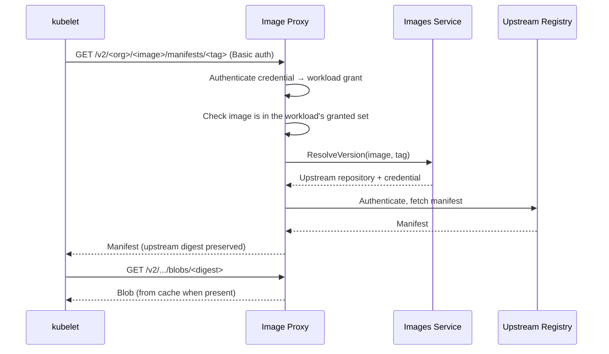

# Image Proxy

## Overview

The Image Proxy is the only path by which a workload's container images are pulled. Every image reference in a workload spec is rewritten to point at it; it authenticates to the upstream registry using the credential stored on the [Image](resource-definitions.md#image) record and streams the result back to the runner.

It exists so that **registry credentials never leave the platform**. Without it, pulling a private image means writing an organization's registry password into a Kubernetes secret in the cluster its workloads run in, readable by anyone with access to that namespace — and for a `public` image consumed by another organization, it would mean handing one organization's credential to another organization's cluster outright.

It also replaces a resource. With credentials attached to images and resolved by the proxy, the `ImagePullSecret` resource and its attachments are removed from the platform entirely: there is no longer anything for an operator to attach, and no way for two attachments to disagree about the same registry.

## Classification

| Aspect | Detail |
|---|---|
| **Plane** | Data — it is on the image pull path of every cold workload start |
| **Language** | Go |
| **Repository** | `agynio/image-proxy` |
| **API** | OCI Distribution (registry v2) over HTTPS, plus an internal gRPC surface for credential lifecycle |
| **State** | PostgreSQL — issued pull credentials. Content cache on disk or object storage; authoritative image content is always upstream |
| **External dependencies** | [Images](images-service.md) service (reference resolution), upstream container registries |

## Reference Rewriting

The [Agents Orchestrator](agents-orchestrator.md) rewrites every **catalog** image in a workload spec — the environment's workspace image and agent runtime image, and each MCP's image — to:

```
<proxy-host>/<org-slug>/<image-name>:<tag>
```

The path identifies the [Image](resource-definitions.md#image) record — by the owning organization's [slug](organizations.md#slug) and the image's name, both unique in their scope — which is what the proxy resolves to an upstream repository and credential. It does not encode the upstream repository: two records may point at the same upstream with different credentials, and a reference that named the upstream directly could not say which credential to use.

The consequence is that two records pointing at one upstream repository are two distinct references, and a node caches their content twice. That is accepted in exchange for unambiguous resolution.

Platform containers are deliberately outside this. `agynd-cli-init`, `agyn-cli-init` and the Ziti sidecar carry chart-pinned references pulled directly from a public registry, because the proxy is itself a platform component: it cannot serve the containers that must run before it is reachable, and it certainly cannot serve its own image. The proxy exists for images a user chose, which are the only ones whose credentials are an organization's rather than the platform's.

`<proxy-host>` is deployment configuration. Because the reference is an ordinary registry reference, **no node configuration is required** — no `hosts.toml`, no mirror entry, no CA distribution. The container runtime treats the proxy as it would any registry.

## Pull Credentials

Each workload is issued its own credential, valid only while that workload exists.

| Step | Behaviour |
|---|---|
| **Mint** | At workload spec assembly the Orchestrator calls `MintPullCredential(workload_id, image_ids)`. The proxy stores the grant and returns a username and a generated password |
| **Deliver** | The credential travels in the workload spec and is written by the runner into a `dockerconfigjson` secret naming the proxy host — the [existing per-workload mechanism](k8s-runner.md#image-pull-credentials), with different contents |
| **Authorize** | On each request the proxy authenticates the credential and checks that the workload it belongs to was granted the image being requested |
| **Revoke** | The Orchestrator revokes on workload stop. A TTL covering the maximum workload lifetime is a backstop, so a credential minted for a workload that never started cannot outlive it |

**Basic authentication** is used, with the generated password as the password. It is the only scheme every container runtime supports without configuration.

The credential is scoped to a workload and a set of images, not to a registry host. A pod pulling a workspace image, an agent runtime and several MCP sidecars issues several requests with the same credential; the host-keyed `auths` map identifies *which credential*, and the request path identifies *which image*. The two scopings are layered, and only the proxy sees both.

Because credentials are per-workload rather than per-registry, the conflict this replaces — two attachments carrying different credentials for one registry hostname, which the Orchestrator rejects a workload over today — cannot arise.

## Request Flow



The upstream digest is served unchanged, so the runtime's own content verification still applies end to end. The proxy is a conduit, not a re-publisher.

## Caching

The proxy caches blobs it has fetched. On the pull path of every cold start, with images that reach several hundred megabytes, a pull-through cache is part of the design rather than an optimization. It also absorbs upstream rate limits, which anonymous pulls of common public base images run into on a shared egress address.

## Reachability

Image pulls are performed by the node's container runtime, not by the workload, so they cannot be intercepted by the pod's [Ziti sidecar](openziti.md#agent-access-scope) — the sidecar operates inside the pod's network namespace and the runtime is outside it. The proxy is therefore reached over ordinary networking, at an address every runner's nodes can resolve and trust.

A per-cluster caching proxy — an in-cluster component dialling the central proxy over OpenZiti, with the runtime pulling from it locally — removes the public exposure and keeps image bytes off the public path. It is a deployment option rather than a requirement, because it needs node-level configuration that the default path does not.

## Availability

The proxy is on the critical path for any pull that is not already satisfied by the node's cache. A proxy outage does not disturb running workloads, and does not prevent a workload from starting on a node that already holds its images, but it does block cold starts. It is deployed accordingly.

## Prebuilt Environments

The [local bundle](operations/local-bundle.md) bakes every platform image into the VM's container store so a booted VM needs no registry access. Content is keyed by the reference it was pulled with, so the bake must pull using the same rewritten references the platform will later request — otherwise the first workload start misses the cache and attempts a real pull. The proxy host is deployment configuration and is known at bake time.

## Workload Namespace

Pull credentials live as secrets alongside every other workload's, in the runner's single [workload namespace](k8s-runner.md#namespace). Two properties follow and are required rather than incidental:

- Nothing may attach image pull secrets to the workload ServiceAccount. The runtime merges ServiceAccount-level pull secrets with pod-level ones, and anything attached there would apply to every workload.
- Workload pods run without a mounted ServiceAccount token, so a workload cannot read the API and enumerate its neighbours' pull credentials.

## Related Architecture

- [Images (product)](../product/images/images.md)
- [Images Service](images-service.md)
- [Agents Orchestrator](agents-orchestrator.md)
- [k8s-runner — Image Pull Credentials](k8s-runner.md#image-pull-credentials)
- [Local Bundle](operations/local-bundle.md)
