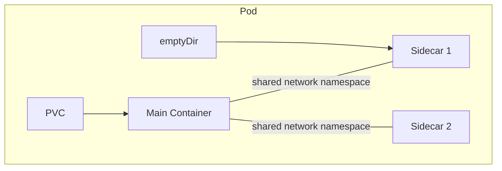

# k8s-runner

## Overview

The k8s-runner is the Kubernetes-native implementation of the [Runner](runner.md) gRPC API. It translates workload operations into Kubernetes API calls, creating Pods and PersistentVolumeClaims instead of Docker containers and named volumes.

| Aspect | Detail |
|--------|--------|
| **Plane** | Data |
| **Language** | Go |
| **Repository** | `agynio/k8s-runner` |
| **API** | gRPC (`RunnerService`) |
| **Backend** | Kubernetes API (in-cluster) |
| **Authentication** | OpenZiti network identity (SDK-embedded, service token enrollment) |

The k8s-runner runs inside the same Kubernetes cluster where it creates workload Pods.

## Workload-to-Kubernetes Mapping

The Runner [workload model](runner.md#workload-model) maps to Kubernetes primitives:

| Workload Concept | Kubernetes Primitive |
|------------------|---------------------|
| Workload | Pod |
| Main container | Pod container |
| Sidecar | Additional Pod container (shared network namespace is native to Pods) |
| Init container | Pod initContainer |
| Ephemeral volume (`persistent: false`) | `emptyDir` volume |
| Persistent volume (`persistent: true`) | PersistentVolumeClaim |
| Image pull credential | Kubernetes Secret (`kubernetes.io/dockerconfigjson`) + Pod `imagePullSecrets` |
| Labels | Pod labels |

### Pod Construction

When `StartWorkload` is called, the k8s-runner:

1. Creates any PersistentVolumeClaims required by persistent volumes (if they don't already exist).
2. Creates Kubernetes Secrets for image pull credentials (if any). See [Image Pull Credentials](#image-pull-credentials).
3. Builds a Pod spec with init containers (if any), main + sidecars, volume mounts, environment variables, resource requests/limits, `imagePullSecrets`, and labels.
4. Creates the Pod via the Kubernetes API.

Init containers run before the main and sidecar containers and can populate shared volumes (for example, `/agyn-bin`).

The Pod's `restartPolicy` is `Never` — the Agents Orchestrator owns lifecycle decisions. If a container crashes, the Runner reports the failure; it does not restart the Pod.

### PersistentVolumeClaims

Persistent volumes are backed by PVCs. The k8s-runner creates a PVC on first use and reuses it on subsequent `StartWorkload` calls that reference the same volume. PVCs outlive Pods — this is what allows an agent to be shut down and later resume with its state intact.

PVCs use the cluster's default StorageClass unless overridden by deployment configuration.

`RemoveVolume` deletes the PVC.

### Image Pull Credentials

When `StartWorkload` includes `image_pull_credentials`, the k8s-runner:

1. For each credential, creates a Kubernetes Secret of type `kubernetes.io/dockerconfigjson` in the workload namespace. The secret name is derived from the workload ID (e.g., `workload-<id>-pull-<index>`).
2. The `.dockerconfigjson` data contains a single `auths` entry with the registry hostname, username, and password from the credential.
3. All created Kubernetes Secrets are listed in the Pod's `spec.imagePullSecrets`.
4. On `StopWorkload` or `RemoveWorkload`, the k8s-runner deletes the Kubernetes Secrets it created for that workload.

Kubernetes Secrets are created per-workload. They are not shared across workloads.

## Capability Implementations

When a workload spec includes `capabilities`, the k8s-runner resolves each capability name it recognizes to a concrete set of sidecars and environment variables before building the Pod spec. Capability names are open strings — the k8s-runner implements the set listed below, but other runners may implement different or additional capabilities without any platform changes. The implementation used for each capability is selected by runner configuration (`capability_implementations` map, e.g., `docker: rootless`). Different runners on the same platform can use different implementations — a dev runner can use `privileged` while a production runner uses `rootless`.

### `docker`

Injects a DinD sidecar into the pod and sets `DOCKER_HOST=tcp://localhost:2375` in the agent container. The agent gets a full Docker daemon reachable on localhost — same behaviour regardless of implementation. The four available implementations differ only in isolation:

#### Rootless Docker *(supported)*

Runs the Docker daemon as a non-root user inside a user namespace. No `privileged: true` on the pod spec. If the inner workload runs `docker run --privileged`, that privilege is scoped to the user namespace — it cannot reach the host.

| | |
|--|--|
| **Sidecar image** | `docker:27-dind-rootless` |
| **Command** | `dockerd-rootless.sh` |
| **Pod spec change** | `spec.hostUsers: false` (Kubernetes 1.25+ user namespace support) |
| **Isolation** | User namespace — escape lands as unprivileged UID on host |
| **Shared nodes** | Safe |
| **k3d on Mac** | Works |

This is the default implementation.

#### Privileged DinD *(supported)*

Runs the Docker daemon in a standard privileged container. Full Docker compatibility, no isolation — a process that escapes the container reaches the host kernel directly.

| | |
|--|--|
| **Sidecar image** | `docker:27-dind` |
| **Command** | `dockerd --host=tcp://0.0.0.0:2375 --tls=false` |
| **Pod spec change** | `securityContext.privileged: true` on the sidecar container |
| **Isolation** | None — host escapable |
| **Shared nodes** | Unsafe. Only use on dedicated single-tenant runners |
| **k3d on Mac** | Works |

Intended for development environments and dedicated single-tenant runner node pools where the escape-to-host risk is acceptable. The workload namespace must permit privileged containers via Pod Security Admission.

#### Sysbox *(potential future option)*

Runs the Docker daemon inside a Sysbox-managed container. Sysbox uses user namespace remapping to make the container appear privileged internally while mapping all UIDs to unprivileged ranges on the host. No `privileged: true` on the pod spec.

| | |
|--|--|
| **Sidecar image** | `docker:27-dind` |
| **Pod spec change** | `runtimeClassName: sysbox-runc` |
| **Isolation** | User namespace via Sysbox daemon — cannot escalate to host |
| **Shared nodes** | Safe |
| **Node requirement** | Sysbox daemon installed on each node |
| **k3d on Mac** | Does not work (nested user namespace limitations) |

Offers similar isolation to rootless Docker without requiring a rootless-specific image. The trade-off is the operational cost of installing and maintaining the Sysbox daemon on every node.

#### Kata Containers / Firecracker *(potential future option)*

Runs the entire pod inside a lightweight microVM (Firecracker or QEMU). The DinD sidecar is a standard privileged container, but `privileged` is relative to the VM's kernel — not the host. Escape from the container reaches the VM kernel, which is fully isolated from the host and from other pods.

| | |
|--|--|
| **Sidecar image** | `docker:27-dind` |
| **Pod spec change** | `runtimeClassName: kata-fc` (Firecracker) or `kata-qemu` (QEMU) |
| **Isolation** | VM-level — hardware-enforced, separate kernel per pod |
| **Shared nodes** | Safe |
| **Node requirement** | Kata Containers runtime + `/dev/kvm` available on node |
| **k3d on Mac** | Does not work (`/dev/kvm` not available via Docker Desktop) |

Strongest isolation guarantee. Also improves isolation for all other containers in the pod, not just the DinD sidecar — each pod gets its own kernel, so kernel CVEs in one pod cannot affect another. Higher per-pod overhead (~100–200ms startup, ~50–100MB RAM per VM).

---

The implementation is a runner-level concern. The agent resource only declares `capabilities: ["docker"]`. Switching implementations requires no change to the agent definition — only runner reconfiguration. Custom runners can implement the `docker` capability differently, or introduce entirely new capability names, without any changes to the platform.

## RPC Implementation

All RPCs are defined in the shared [Runner gRPC API](runner.md#grpc-api). This section describes how the k8s-runner implements each one using the Kubernetes API.

### Workload Lifecycle

| RPC | Kubernetes Implementation |
|-----|--------------------------|
| `StartWorkload` | Create Kubernetes Secrets for image pull credentials (if any) → create PVCs (if needed) → create Pod |
| `StopWorkload` | Delete Pod (graceful termination) → delete image pull Kubernetes Secrets |
| `RemoveWorkload` | Delete Pod, optionally its PVCs, and image pull Kubernetes Secrets |
| `InspectWorkload` | Read Pod status, container statuses, volume mounts |
| `TouchWorkload` | Update a Pod annotation with the current timestamp |

### Query

| RPC | Kubernetes Implementation |
|-----|--------------------------|
| `ListWorkloads` | List all Pods in the runner's namespace. Returns Pod name as `instance_id` and the `workload_key` label set at Pod creation |
| `GetWorkloadLabels` | Read Pod labels |
| `FindWorkloadsByLabels` | List Pods with label selector |
| `ListWorkloadsByVolume` | List Pods that mount a specific PVC |

### Execution

| RPC | Kubernetes Implementation |
|-----|--------------------------|
| `Exec` | Kubernetes API exec (`/exec` subresource) with bidirectional streaming. Supports TTY, stdin, stdout/stderr separation, timeouts |
| `CancelExecution` | Terminate the exec stream |

The k8s-runner translates the gRPC bidirectional stream into the Kubernetes SPDY/WebSocket exec protocol. Timeout enforcement (wall timeout, idle timeout) and exit code extraction are handled by the k8s-runner process.

### Streaming

| RPC | Kubernetes Implementation |
|-----|--------------------------|
| `StreamWorkloadLogs` | Kubernetes API pod log streaming (`/log` subresource, `follow=true`) |
| `StreamEvents` | Watch Pod events via the Kubernetes API |

### Storage

| RPC | Kubernetes Implementation |
|-----|--------------------------|
| `PutArchive` | Exec `tar` inside the target container to extract the uploaded archive |
| `ListVolumes` | List PVCs in the runner's namespace. Returns PVC name as `instance_id` and the `volume_key` label set at PVC creation |
| `RemoveVolume` | Delete the PVC |

`PutArchive` opens an exec session to the target container, pipes the tar archive into `tar -x`, and reports success or failure.

## Namespace

All workload Pods are created in a single dedicated namespace (e.g., `agyn-workloads`). The namespace is configurable at deployment time.

## RBAC

The k8s-runner requires a Kubernetes ServiceAccount with permissions scoped to the workload namespace:

| Resource | Verbs |
|----------|-------|
| `pods` | `get`, `list`, `watch`, `create`, `delete` |
| `pods/exec` | `create` |
| `pods/log` | `get` |
| `persistentvolumeclaims` | `get`, `list`, `create`, `delete` |
| `events` | `get`, `list`, `watch` |
| `secrets` | `get`, `list`, `create`, `delete` |

These permissions are granted via a Role (not ClusterRole) bound to the workload namespace.

## Authentication

The k8s-runner embeds the [OpenZiti Go SDK](https://github.com/openziti/sdk-golang) and binds its per-runner OpenZiti service (`runner-{runnerId}`) to receive gRPC connections from the Orchestrator.

Like all runners, the k8s-runner uses the service token enrollment flow. On startup, it calls `EnrollRunner` with its service token. The Runners service validates the token, creates an OpenZiti identity via Ziti Management `CreateRunnerIdentity` (which deletes any previous identity for this runner first), and returns the enrolled identity (certificate + key) along with the service name. The k8s-runner writes the identity to disk, loads it, and binds its service. See [Runner — Authentication](runner.md#authentication) and [OpenZiti Integration — Runner Provisioning](openziti.md#runner-provisioning).

The runner does not manage OpenZiti identities for agents. It receives the enrollment JWT from the Orchestrator as opaque configuration and passes it to the agent pod's Ziti sidecar container. See [Runner](runner.md#authentication).

## Classification

| Aspect | Detail |
|--------|--------|
| **Plane** | Data |
| **API** | gRPC (`RunnerService`) |
| **State** | Kubernetes API is the source of truth (Pods, PVCs). No additional data store |
| **Scaling** | Single replica per cluster (manages workloads in its own cluster) |
| **Failure impact** | Temporary loss prevents new workload starts and exec/log streaming. Already-running Pods continue |
