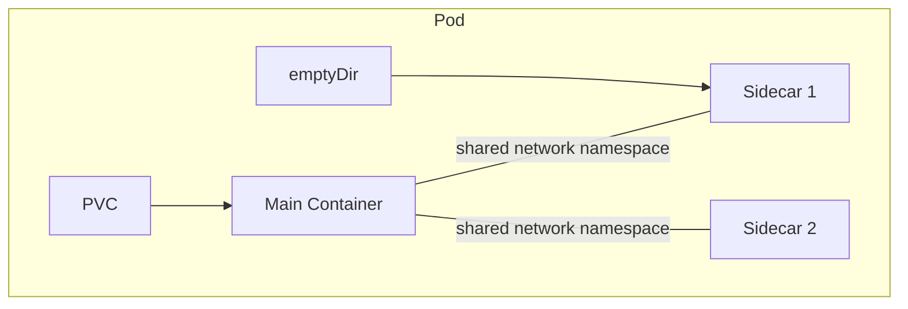

# k8s-runner

## Overview

The k8s-runner is the Kubernetes-native implementation of the [Runner](runner.md) gRPC API. It translates workload operations into Kubernetes API calls, creating Pods and PersistentVolumeClaims instead of Docker containers and named volumes.

| Aspect | Detail |
|--------|--------|
| **Plane** | Data |
| **Language** | Go |
| **Repository** | `agynio/k8s-runner` |
| **API** | gRPC (`RunnerService`) |
| **Backend** | Kubernetes API (in-cluster) |
| **Authentication** | OpenZiti network identity (SDK-embedded) |

The k8s-runner runs inside the same Kubernetes cluster where it creates workload Pods.

## Workload-to-Kubernetes Mapping

The Runner [workload model](runner.md#workload-model) maps to Kubernetes primitives:

| Workload Concept | Kubernetes Primitive |
|------------------|---------------------|
| Workload | Pod |
| Main container | Pod container |
| Sidecar | Additional Pod container (shared network namespace is native to Pods) |
| Init container | Pod initContainer |
| Ephemeral volume (`persistent: false`) | `emptyDir` volume |
| Persistent volume (`persistent: true`) | PersistentVolumeClaim |
| Labels | Pod labels |

### Pod Construction

When `StartWorkload` is called, the k8s-runner:

1. Creates any PersistentVolumeClaims required by persistent volumes (if they don't already exist).
2. Builds a Pod spec with init containers (if any), main + sidecars, volume mounts, environment variables, resource requests/limits, and labels.
3. Creates the Pod via the Kubernetes API.

Init containers run before the main and sidecar containers and can populate shared volumes (for example, `/agyn-bin`).

The Pod's `restartPolicy` is `Never` — the Agents Orchestrator owns lifecycle decisions. If a container crashes, the Runner reports the failure; it does not restart the Pod.

### PersistentVolumeClaims

Persistent volumes are backed by PVCs. The k8s-runner creates a PVC on first use and reuses it on subsequent `StartWorkload` calls that reference the same volume. PVCs outlive Pods — this is what allows an agent to be shut down and later resume with its state intact.

PVCs use the cluster's default StorageClass unless overridden by deployment configuration.

`RemoveVolume` deletes the PVC.

## RPC Implementation

All RPCs are defined in the shared [Runner gRPC API](runner.md#grpc-api). This section describes how the k8s-runner implements each one using the Kubernetes API.

### Workload Lifecycle

| RPC | Kubernetes Implementation |
|-----|--------------------------|
| `StartWorkload` | Create PVCs (if needed) → create Pod |
| `StopWorkload` | Delete Pod (graceful termination) |
| `RemoveWorkload` | Delete Pod and optionally its PVCs |
| `InspectWorkload` | Read Pod status, container statuses, volume mounts |
| `TouchWorkload` | Update a Pod annotation with the current timestamp |

### Query

| RPC | Kubernetes Implementation |
|-----|--------------------------|
| `GetWorkloadLabels` | Read Pod labels |
| `FindWorkloadsByLabels` | List Pods with label selector |
| `ListWorkloadsByVolume` | List Pods that mount a specific PVC |

### Execution

| RPC | Kubernetes Implementation |
|-----|--------------------------|
| `Exec` | Kubernetes API exec (`/exec` subresource) with bidirectional streaming. Supports TTY, stdin, stdout/stderr separation, timeouts |
| `CancelExecution` | Terminate the exec stream |

The k8s-runner translates the gRPC bidirectional stream into the Kubernetes SPDY/WebSocket exec protocol. Timeout enforcement (wall timeout, idle timeout) and exit code extraction are handled by the k8s-runner process.

### Streaming

| RPC | Kubernetes Implementation |
|-----|--------------------------|
| `StreamWorkloadLogs` | Kubernetes API pod log streaming (`/log` subresource, `follow=true`) |
| `StreamEvents` | Watch Pod events via the Kubernetes API |

### Storage

| RPC | Kubernetes Implementation |
|-----|--------------------------|
| `PutArchive` | Exec `tar` inside the target container to extract the uploaded archive |
| `RemoveVolume` | Delete the PVC |

`PutArchive` opens an exec session to the target container, pipes the tar archive into `tar -x`, and reports success or failure.

## Namespace

All workload Pods are created in a single dedicated namespace (e.g., `agyn-workloads`). The namespace is configurable at deployment time.

## RBAC

The k8s-runner requires a Kubernetes ServiceAccount with permissions scoped to the workload namespace:

| Resource | Verbs |
|----------|-------|
| `pods` | `get`, `list`, `watch`, `create`, `delete` |
| `pods/exec` | `create` |
| `pods/log` | `get` |
| `persistentvolumeclaims` | `get`, `list`, `create`, `delete` |
| `events` | `get`, `list`, `watch` |

These permissions are granted via a Role (not ClusterRole) bound to the workload namespace.

## Authentication

The k8s-runner embeds the [OpenZiti Go SDK](https://github.com/openziti/sdk-golang) and binds the `runner` OpenZiti service to receive gRPC connections from the Orchestrator.

The runner obtains its OpenZiti identity at runtime via self-enrollment — on startup, it calls Ziti Management to request an identity, writes it to ephemeral disk, and extends a lease on a timer. See [OpenZiti Integration — Internal Runners](openziti.md#internal-runners) for the full provisioning flow.

The runner does not manage OpenZiti identities for agents. It receives the enrollment JWT from the Orchestrator as opaque configuration and passes it to the agent container. See [Runner](runner.md#authentication).

## Classification

| Aspect | Detail |
|--------|--------|
| **Plane** | Data |
| **API** | gRPC (`RunnerService`) |
| **State** | Kubernetes API is the source of truth (Pods, PVCs). No additional data store |
| **Scaling** | Single replica per cluster (manages workloads in its own cluster) |
| **Failure impact** | Temporary loss prevents new workload starts and exec/log streaming. Already-running Pods continue |
