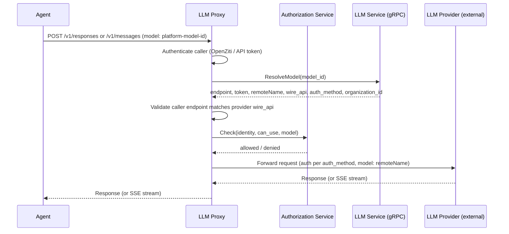

# LLM Proxy

## Overview

The LLM Proxy is a standalone HTTP service that exposes LLM API endpoints for agents. It serves two wire protocols: the OpenAI Responses API (`POST /v1/responses`) and the Anthropic Messages API (`POST /v1/messages`). It authenticates callers, resolves the requested model to an LLM provider via the [LLM service](llm.md), and forwards the request to the external provider with injected credentials using the provider's declared wire protocol and auth method. Responses — including streaming — are passed back to the caller.

Agents point their standard LLM client (OpenAI or Anthropic) at the LLM Proxy and use it like any compatible API. No custom client logic is required.

## Motivation

Agents use standard LLM client libraries that expect HTTP REST endpoints — Codex CLI and [`agn`](agn-cli.md) use the OpenAI Responses API (`POST /v1/responses`), Claude Code uses the Anthropic Messages API (`POST /v1/messages`). The platform's internal services communicate over gRPC via [ConnectRPC](gateway.md#connectrpc). Exposing the LLM proxy through the Gateway's ConnectRPC interface would require agents to use a non-standard client, defeating the goal of wrapping unmodified 3rd-party agent CLIs.

The LLM Proxy bridges this gap: it speaks the standard LLM API wire formats externally and gRPC internally.

## Responsibilities

| Responsibility | Description |
|---------------|-------------|
| **Responses API endpoint** | Serve `POST /v1/responses` with the OpenAI Responses API request/response format |
| **Messages API endpoint** | Serve `POST /v1/messages` with the Anthropic Messages API request/response format |
| **Authentication** | Authenticate callers via [OpenZiti](#openziti-identity) network identity or [API token](api-tokens.md) |
| **Authorization** | Call the [Authorization](authz.md) service to check access before forwarding |
| **Model resolution** | Call the [LLM service](llm.md) over gRPC to resolve model ID → provider endpoint, token, and remote model name |
| **Request forwarding** | Forward the request to the external LLM provider with injected credentials (Bearer or x-api-key, per the provider's auth method) and substituted model name, using the provider's declared wire protocol |
| **Streaming** | Support SSE streaming (`stream: true`) — stream the provider's response back to the caller without buffering |

## Classification

The LLM Proxy is a **data plane** service — it carries live LLM traffic on the agent execution hot path.

## Interface

### `POST /v1/responses`

Accepts an [OpenAI Responses API](https://platform.openai.com/docs/api-reference/responses/create) request. The `model` field contains the platform's internal model ID (not the provider's model name).

**Authentication:** Bearer token in the `Authorization` header. The token is either an [API token](api-tokens.md) (`agyn_...` prefix) or an OpenZiti-authenticated connection where the identity is extracted from the mTLS certificate.

**Non-streaming request example:**

```bash
curl -X POST https://llm.agyn.dev/v1/responses \
  -H "Content-Type: application/json" \
  -H "Authorization: Bearer agyn_..." \
  -d '{
    "model": "<platform-model-uuid>",
    "input": "Hello, who are you?"
  }'
```

**Streaming:** When the request includes `"stream": true`, the response is delivered as Server-Sent Events (SSE) with `Content-Type: text/event-stream`. Events follow the OpenAI Responses API streaming format (e.g., `response.created`, `response.output_text.delta`, `response.completed`).

The LLM Proxy does not interpret the request or response body beyond extracting the `model` field for resolution. The body is forwarded to the provider as-is (with the `model` field replaced by the remote model name).

### `POST /v1/messages`

Accepts an [Anthropic Messages API](https://docs.anthropic.com/en/api/messages) request. The `model` field contains the platform's internal model ID (not the provider's model name).

**Authentication:** Same as `POST /v1/responses` — the LLM Proxy checks both `Authorization: Bearer` and `x-api-key` headers, plus OpenZiti mTLS.

**Required header:** `anthropic-version` (e.g., `2023-06-01`). Forwarded to the provider as-is.

**Non-streaming request example:**

```bash
curl -X POST https://llm.agyn.dev/v1/messages \
  -H "Content-Type: application/json" \
  -H "x-api-key: agyn_..." \
  -H "anthropic-version: 2023-06-01" \
  -d '{
    "model": "<platform-model-uuid>",
    "max_tokens": 4096,
    "messages": [
      {"role": "user", "content": "Hello, Claude"}
    ]
  }'
```

**Streaming:** When the request includes `"stream": true`, the response is delivered as SSE with `Content-Type: text/event-stream`. Events follow the Anthropic Messages streaming format (e.g., `message_start`, `content_block_delta`, `message_stop`).

The LLM Proxy does not interpret the request or response body beyond extracting the `model` field for resolution and validating the provider's wire protocol. The body is forwarded to the provider as-is (with the `model` field replaced by the remote model name).

## Wire API Protocols

The LLM Proxy supports two wire protocols. The caller-facing endpoint determines which protocol the agent speaks. The provider-facing protocol is determined by the provider's [`wire_api`](providers.md#llm-provider) field returned from model resolution.

| Caller Endpoint | Agent Protocol | Provider `wire_api` | Provider Endpoint Path |
|----------------|----------------|---------------------|----------------------|
| `POST /v1/responses` | OpenAI Responses API | `responses` | `POST /v1/responses` |
| `POST /v1/messages` | Anthropic Messages API | `anthropic_messages` | `POST /v1/messages` |

The caller-facing protocol and provider-facing protocol always match: an agent calling `POST /v1/responses` uses a model whose provider has `wire_api: responses`, and an agent calling `POST /v1/messages` uses a model whose provider has `wire_api: anthropic_messages`. The LLM Proxy validates this — if a caller sends a request to `POST /v1/messages` but the resolved provider has `wire_api: responses`, the proxy returns `400 Bad Request`.

### OpenAI Responses API (`responses`)

The existing protocol. Request and response format follows the [OpenAI Responses API specification](https://platform.openai.com/docs/api-reference/responses/create). Streaming uses SSE with event types `response.created`, `response.output_text.delta`, `response.completed`, etc.

The LLM Proxy forwards the request body as-is (replacing the `model` field) and injects auth per the provider's `authMethod`.

### Anthropic Messages API (`anthropic_messages`)

Request and response format follows the [Anthropic Messages API specification](https://docs.anthropic.com/en/api/messages).

**Caller-facing endpoint:**

```bash
curl -X POST https://llm.agyn.dev/v1/messages \
  -H "Content-Type: application/json" \
  -H "x-api-key: agyn_..." \
  -H "anthropic-version: 2023-06-01" \
  -d '{
    "model": "<platform-model-uuid>",
    "max_tokens": 4096,
    "messages": [
      {"role": "user", "content": "Hello, Claude"}
    ]
  }'
```

**Authentication on the caller side:** The LLM Proxy accepts auth from agents via the `x-api-key` header (for API token `agyn_...` authentication) or via OpenZiti mTLS (for agents inside the platform). This is the same authentication as `POST /v1/responses` — the LLM Proxy checks both `Authorization: Bearer` and `x-api-key` headers on all endpoints.

**Provider-side forwarding:** The proxy forwards the request body as-is (replacing the `model` field with the remote model name) and injects auth per the provider's `authMethod` (`bearer` → `Authorization: Bearer <token>`, `x_api_key` → `x-api-key: <token>`). The `anthropic-version` header from the caller is forwarded to the provider.

**Streaming:** When the request includes `"stream": true`, the response is delivered as SSE. Events follow the Anthropic streaming format:

| SSE Event Type | Description |
|---------------|-------------|
| `message_start` | Start of the response message with metadata and usage |
| `content_block_start` | Start of a content block (text, tool_use, thinking) |
| `content_block_delta` | Incremental content update (text delta, input JSON delta, thinking delta) |
| `content_block_stop` | End of a content block |
| `message_delta` | Message-level metadata update (stop_reason, usage) |
| `message_stop` | End of the response message |
| `ping` | Keepalive |

The LLM Proxy does not interpret message content, tool definitions, thinking blocks, or any other request/response fields beyond extracting the `model` field for resolution. The body is forwarded to the provider as-is.

## Request Flow



1. Agent sends a request to the LLM Proxy (`POST /v1/responses` or `POST /v1/messages`), specifying the platform model ID.
2. LLM Proxy authenticates the caller — OpenZiti identity resolution via [Ziti Management](openziti.md), or API token hash lookup via [Users](users.md).
3. LLM Proxy calls the LLM service (`ResolveModel` gRPC method) to get the provider endpoint, token, remote model name, wire protocol, auth method, and organization ID.
4. LLM Proxy validates that the caller's endpoint matches the provider's wire protocol (e.g., `POST /v1/messages` requires `wire_api: anthropic_messages`). If mismatched, returns `400 Bad Request`.
5. LLM Proxy calls the [Authorization](authz.md) service to check whether the caller has access. If denied, returns `403 Forbidden`.
6. LLM Proxy forwards the request to the provider's endpoint, replacing the `model` field with the remote model name and injecting the provider's token using the provider's auth method (`bearer` → `Authorization: Bearer`, `x_api_key` → `x-api-key`).
7. The provider's response is returned to the agent. For streaming requests, SSE events are forwarded without buffering.

## Authentication

The LLM Proxy authenticates callers independently — it does not go through the [Gateway](gateway.md).

| Method | Mechanism | Use Case |
|--------|-----------|----------|
| **OpenZiti** | mTLS identity extracted from the connection via [Ziti Management](openziti.md) `ResolveIdentity` | Agents running inside the platform (primary path) |
| **API token** | `Authorization: Bearer agyn_...` → hash lookup via [Users](users.md) `ResolveAPIToken` | External callers, local development, CI |

When an agent connects to `llm-proxy.ziti`, the Ziti sidecar resolves the hostname to a `100.64.0.0/10` address and transparently intercepts the connection via DNS + iptables TPROXY, establishing an OpenZiti mTLS connection to the LLM Proxy on behalf of the pod. The LLM Proxy extracts the agent identity from this mTLS connection identically to how it would from an embedded-SDK connection.

Both methods resolve to an `identity_id` and `identity_type`. The `identity_id` is passed to the [Authorization](authz.md) service for permission checks.

## Authorization

The LLM Proxy delegates authorization to the [Authorization](authz.md) service, following the same pattern as all other platform services. After authentication and model resolution, the LLM Proxy calls `Check` on the Authorization service. If denied, returns `403 Forbidden`.

The authorization logic — what relationships and permissions grant access to a model — is defined in the [authorization model](authz.md#authorization-model). The LLM Proxy does not implement or interpret authorization rules.

## OpenZiti Identity

The LLM Proxy participates in the OpenZiti overlay. It obtains its identity at runtime via [self-enrollment](openziti.md#service-identity-self-enrollment) through [Ziti Management](openziti.md#ziti-management-service), the same pattern as the Gateway and Runner.

| Aspect | Detail |
|--------|--------|
| Role attributes | `["llm-proxy-hosts"]` |
| Service name | `llm-proxy` |
| Enrollment | Self-enrollment via Ziti Management at pod startup |
| SDK usage | `zitiContext.ListenWithOptions("llm-proxy", ...)` — binds the `llm-proxy` service |

### Static Policies

Two new static policies at bootstrap:

| Policy | Type | Identity Roles | Service Roles | Purpose |
|--------|------|---------------|---------------|---------|
| `agents-dial-llm-proxy` | Dial | `#agents` | `@llm-proxy` | Agents can reach LLM Proxy |
| `llm-proxy-bind` | Bind | `#llm-proxy-hosts` | `@llm-proxy` | LLM Proxy hosts the `llm-proxy` service |

## Ingress

The LLM Proxy is accessible via a public subdomain, similar to the Gateway:

| Host | Backend | Use case |
|------|---------|----------|
| `llm.agyn.dev` | `llm-proxy:8080` | Direct access for API token authentication |

Traffic from agents inside the platform goes through OpenZiti (no ingress). The public subdomain serves external callers using API tokens — local development, CI, external integrations.

The ingress route is defined as an Istio VirtualService in `agynio/bootstrap` (same pattern as the Gateway's subdomain route).

## Configuration

| Field | Source | Description |
|-------|--------|-------------|
| `LLM_SERVICE_ADDRESS` | Deployment config | gRPC address of the [LLM service](llm.md) |
| `ZITI_MANAGEMENT_ADDRESS` | Deployment config | gRPC address of the [Ziti Management](openziti.md) service |
| `USERS_SERVICE_ADDRESS` | Deployment config | gRPC address of the [Users](users.md) service (for API token resolution) |
| `AUTHORIZATION_SERVICE_ADDRESS` | Deployment config | gRPC address of the [Authorization](authz.md) service |
| `LISTEN_ADDRESS` | Deployment config | HTTP listen address (e.g., `:8080`) |

## Implementation

| Aspect | Details |
|--------|---------|
| Repository | `agynio/llm-proxy` |
| Language | Go |
| HTTP framework | Standard `net/http` |
| OpenZiti | Embedded SDK (`openziti/sdk-golang`) for binding the `llm-proxy` service and extracting caller identity |
| Internal calls | Standard gRPC clients for LLM service, Ziti Management, Users, Authorization |
