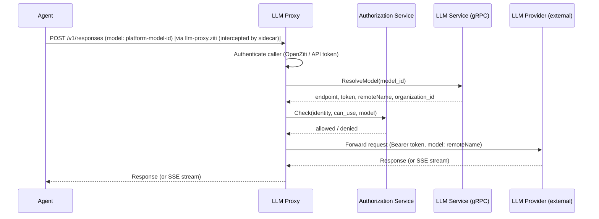

# LLM Proxy

## Overview

The LLM Proxy is a standalone HTTP service that exposes an OpenAI-compatible Responses API endpoint for agents. It authenticates callers, resolves the requested model to an LLM provider via the [LLM service](llm.md), and forwards the request to the external provider with injected credentials. Responses — including streaming — are passed back to the caller.

Agents point a standard OpenAI client at the LLM Proxy and use it like any OpenAI-compatible API. No custom client logic is required.

## Motivation

Agents (Codex CLI, Claude Code, [`agn`](agn-cli.md)) use standard OpenAI client libraries that expect an HTTP REST endpoint (`POST /v1/responses`) with Bearer token authentication. The platform's internal services communicate over gRPC via [ConnectRPC](gateway.md#connectrpc). Exposing the LLM proxy through the Gateway's ConnectRPC interface would require agents to use a non-standard client, defeating the goal of wrapping unmodified 3rd-party agent CLIs.

The LLM Proxy bridges this gap: it speaks the OpenAI Responses API wire format externally and gRPC internally.

## Responsibilities

| Responsibility | Description |
|---------------|-------------|
| **Responses API endpoint** | Serve `POST /v1/responses` with the OpenAI Responses API request/response format |
| **Authentication** | Authenticate callers via [OpenZiti](#openziti-identity) network identity or [API token](api-tokens.md) |
| **Authorization** | Call the [Authorization](authz.md) service to check access before forwarding |
| **Model resolution** | Call the [LLM service](llm.md) over gRPC to resolve model ID → provider endpoint, token, and remote model name |
| **Request forwarding** | Forward the request to the external LLM provider with injected Bearer credentials and substituted model name |
| **Streaming** | Support SSE streaming (`stream: true`) — stream the provider's response back to the caller without buffering |

## Classification

The LLM Proxy is a **data plane** service — it carries live LLM traffic on the agent execution hot path.

## Interface

### `POST /v1/responses`

Accepts an [OpenAI Responses API](https://platform.openai.com/docs/api-reference/responses/create) request. The `model` field contains the platform's internal model ID (not the provider's model name).

**Authentication:** Bearer token in the `Authorization` header. The token is either an [API token](api-tokens.md) (`agyn_...` prefix) or an OpenZiti-authenticated connection where the identity is extracted from the mTLS certificate.

**Non-streaming request example:**

```bash
curl -X POST https://llm.agyn.dev/v1/responses \
  -H "Content-Type: application/json" \
  -H "Authorization: Bearer agyn_..." \
  -d '{
    "model": "<platform-model-uuid>",
    "input": "Hello, who are you?"
  }'
```

**Streaming:** When the request includes `"stream": true`, the response is delivered as Server-Sent Events (SSE) with `Content-Type: text/event-stream`. Events follow the OpenAI Responses API streaming format (e.g., `response.created`, `response.output_text.delta`, `response.completed`).

The LLM Proxy does not interpret the request or response body beyond extracting the `model` field for resolution. The body is forwarded to the provider as-is (with the `model` field replaced by the remote model name).

## Request Flow



1. Agent sends an OpenAI Responses API request to the LLM Proxy, specifying the platform model ID.
2. LLM Proxy authenticates the caller — OpenZiti identity resolution via [Ziti Management](openziti.md), or API token hash lookup via [Users](users.md).
3. LLM Proxy calls the LLM service (`ResolveModel` gRPC method) to get the provider endpoint, token, remote model name, and organization ID.
4. LLM Proxy calls the [Authorization](authz.md) service to check whether the caller has access. If denied, returns `403 Forbidden`.
5. LLM Proxy forwards the request to the provider's endpoint, replacing the `model` field with the remote model name and injecting the provider's token as a `Bearer` authorization header.
6. The provider's response is returned to the agent. For streaming requests, SSE events are forwarded without buffering.

## Authentication

The LLM Proxy authenticates callers independently — it does not go through the [Gateway](gateway.md).

| Method | Mechanism | Use Case |
|--------|-----------|----------|
| **OpenZiti** | mTLS identity extracted from the connection via [Ziti Management](openziti.md) `ResolveIdentity` | Agents running inside the platform (primary path) |
| **API token** | `Authorization: Bearer agyn_...` → hash lookup via [Users](users.md) `ResolveAPIToken` | External callers, local development, CI |

When an agent connects to `llm-proxy.ziti`, the Ziti sidecar resolves the hostname to a `100.64.0.0/10` address and transparently intercepts the connection via DNS + iptables TPROXY, establishing an OpenZiti mTLS connection to the LLM Proxy on behalf of the pod. The LLM Proxy extracts the agent identity from this mTLS connection identically to how it would from an embedded-SDK connection.

Both methods resolve to an `identity_id` and `identity_type`. The `identity_id` is passed to the [Authorization](authz.md) service for permission checks.

## Authorization

The LLM Proxy delegates authorization to the [Authorization](authz.md) service, following the same pattern as all other platform services. After authentication and model resolution, the LLM Proxy calls `Check` on the Authorization service. If denied, returns `403 Forbidden`.

The authorization logic — what relationships and permissions grant access to a model — is defined in the [authorization model](authz.md#authorization-model). The LLM Proxy does not implement or interpret authorization rules.

## OpenZiti Identity

The LLM Proxy participates in the OpenZiti overlay. It obtains its identity at runtime via [self-enrollment](openziti.md#service-identity-self-enrollment) through [Ziti Management](openziti.md#ziti-management-service), the same pattern as the Gateway and Runner.

| Aspect | Detail |
|--------|--------|
| Role attributes | `["llm-proxy-hosts"]` |
| Service name | `llm-proxy` |
| Enrollment | Self-enrollment via Ziti Management at pod startup |
| SDK usage | `zitiContext.ListenWithOptions("llm-proxy", ...)` — binds the `llm-proxy` service |

### Static Policies

Two new static policies at bootstrap:

| Policy | Type | Identity Roles | Service Roles | Purpose |
|--------|------|---------------|---------------|---------|
| `agents-dial-llm-proxy` | Dial | `#agents` | `@llm-proxy` | Agents can reach LLM Proxy |
| `llm-proxy-bind` | Bind | `#llm-proxy-hosts` | `@llm-proxy` | LLM Proxy hosts the `llm-proxy` service |

## Ingress

The LLM Proxy is accessible via a public subdomain, similar to the Gateway:

| Host | Backend | Use case |
|------|---------|----------|
| `llm.agyn.dev` | `llm-proxy:8080` | Direct access for API token authentication |

Traffic from agents inside the platform goes through OpenZiti (no ingress). The public subdomain serves external callers using API tokens — local development, CI, external integrations.

The ingress route is defined as an Istio VirtualService in `agynio/bootstrap` (same pattern as the Gateway's subdomain route).

## Configuration

| Field | Source | Description |
|-------|--------|-------------|
| `LLM_SERVICE_ADDRESS` | Deployment config | gRPC address of the [LLM service](llm.md) |
| `ZITI_MANAGEMENT_ADDRESS` | Deployment config | gRPC address of the [Ziti Management](openziti.md) service |
| `USERS_SERVICE_ADDRESS` | Deployment config | gRPC address of the [Users](users.md) service (for API token resolution) |
| `AUTHORIZATION_SERVICE_ADDRESS` | Deployment config | gRPC address of the [Authorization](authz.md) service |
| `LISTEN_ADDRESS` | Deployment config | HTTP listen address (e.g., `:8080`) |

## Implementation

| Aspect | Details |
|--------|---------|
| Repository | `agynio/llm-proxy` |
| Language | Go |
| HTTP framework | Standard `net/http` |
| OpenZiti | Embedded SDK (`openziti/sdk-golang`) for binding the `llm-proxy` service and extracting caller identity |
| Internal calls | Standard gRPC clients for LLM service, Ziti Management, Users, Authorization |

## Agent Configuration

Agents are configured with the LLM Proxy as their LLM endpoint. The wrapper daemon ([`agynd`](agynd-cli.md)) sets the endpoint when preparing the agent environment.

**Codex CLI** uses a custom model provider in `config.toml`:

`agynd` writes `$CODEX_HOME/config.toml` with a custom provider pointing at the LLM Proxy. The custom provider avoids inheriting OpenAI-specific behavior (remote compaction via `POST /responses/compact`, realtime WebSocket) that the LLM Proxy does not implement.

```toml
model_provider = "platform"

[model_providers.platform]
name = "Agyn LLM"
base_url = "http://llm-proxy.ziti/v1"  # OpenZiti hostname intercepted by Ziti sidecar
env_key = "OPENAI_API_KEY"
wire_api = "responses"
```

`agynd` sets `OPENAI_API_KEY` in the Codex subprocess environment. When running with the Ziti sidecar, the `base_url` points to the OpenZiti hostname (`llm-proxy.ziti`), resolved by the sidecar DNS server and intercepted via TPROXY. Authentication is handled at the network level by the sidecar's mTLS — the token value is unused. Over the public endpoint (development, CI), the token must be a valid platform API token (`agyn_...`).

> **Note:** Using `OPENAI_BASE_URL` env var to override the built-in OpenAI provider does not work with `codex app-server`. The built-in provider has `name = "OpenAI"` which triggers remote compaction (`POST /responses/compact`) and has `env_key: None` which prevents the `OPENAI_API_KEY` env var from being used for Bearer authentication in the subprocess auth pipeline.

**[`agn`](agn-cli.md)** uses `llm.endpoint` in its configuration:

```yaml
llm:
  endpoint: http://llm-proxy.ziti/v1
```

Inside the platform, agents connect to the LLM Proxy using the `llm-proxy.ziti` OpenZiti hostname. The Ziti sidecar resolves the hostname to a `100.64.0.0/10` address and transparently intercepts connections via DNS + TPROXY, so agent CLI subprocesses (Codex CLI, Claude Code, `agn`) connect with standard HTTP clients — no OpenZiti SDK or special client logic required. `agynd` configures the endpoint address automatically.
