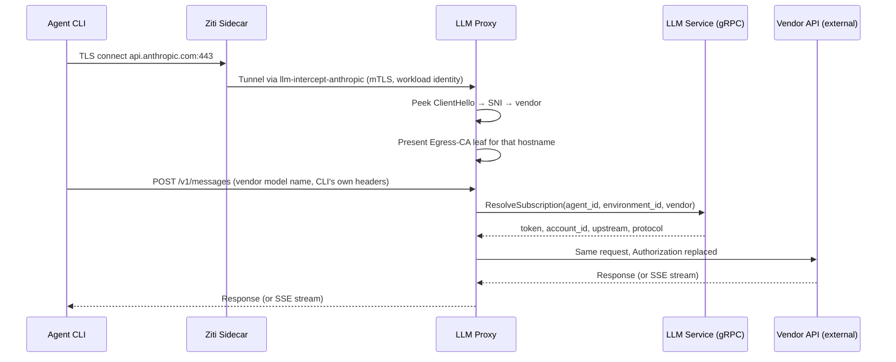
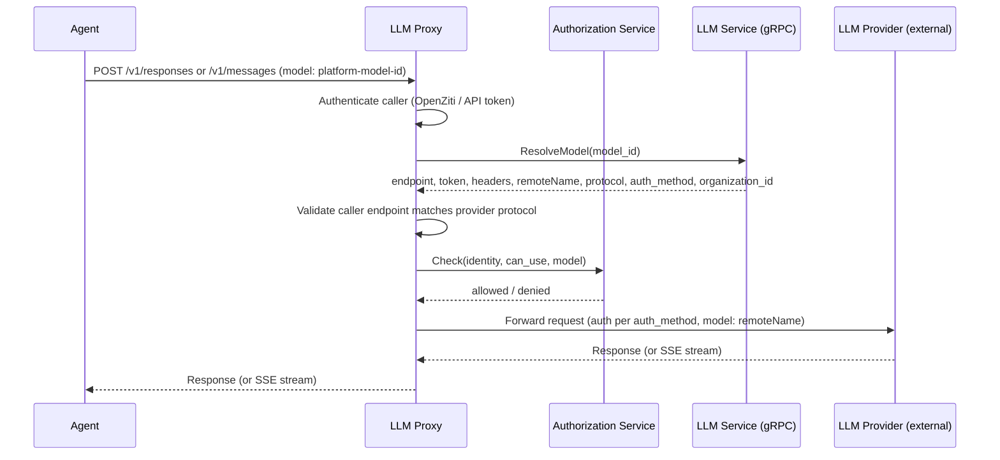

# LLM Proxy

## Overview

The LLM Proxy is a standalone HTTP service that carries every LLM call a workload makes. It serves two LLM API protocols: the OpenAI Responses API (`POST /v1/responses`) and the Anthropic Messages API (`POST /v1/messages`). It authenticates callers, resolves credentials via the [LLM service](llm.md), and forwards the request to the external provider with injected credentials. Responses — including streaming — are passed back to the caller.

Traffic reaches it two ways, corresponding to the [environment's](resource-definitions.md#environment) `llm_mode`:

| Mode | How the agent CLI is configured | How traffic arrives | What identifies the credential |
|---|---|---|---|
| `platform` | Pointed at `llm-proxy.ziti` by [`agynd`](agynd-cli.md#llm-endpoint-configuration); models are platform [Model](providers.md#model) IDs | Plain HTTP on the `llm-proxy` OpenZiti service | The `model` field in the request body |
| `native` | Not configured at all — the CLI addresses its vendor directly, with the vendor's model names | TLS on a per-vendor intercept OpenZiti service, terminated here | The caller's identity plus the vendor it addressed |

In `platform` mode agents point their standard LLM client at the proxy and use it like any compatible API. In `native` mode they point at nothing — the CLI runs in its stock configuration and never learns the proxy exists. Both land on the same forwarding, metering, and guardrail path, which is the point: there is one place that sees LLM traffic regardless of how a customer pays for it.

## Motivation

Agents use standard LLM client libraries that expect HTTP REST endpoints — Codex CLI and [`agn`](agn-cli.md) use the OpenAI Responses API (`POST /v1/responses`), Claude Code uses the Anthropic Messages API (`POST /v1/messages`). The platform's internal services communicate over gRPC via [ConnectRPC](gateway.md#connectrpc). Exposing the LLM proxy through the Gateway's ConnectRPC interface would require agents to use a non-standard client, defeating the goal of wrapping unmodified 3rd-party agent CLIs.

The LLM Proxy bridges this gap: it speaks the standard LLM API formats externally and gRPC internally.

## Responsibilities

| Responsibility | Description |
|---------------|-------------|
| **Responses API endpoint** | Serve `POST /v1/responses` with the OpenAI Responses API request/response format |
| **Messages API endpoint** | Serve `POST /v1/messages` with the Anthropic Messages API request/response format |
| **Vendor interception** | Bind one OpenZiti service per [vendor](providers.md#vendors), terminate TLS for the vendor's hostname using the [Egress CA](egress-gateway.md#egress-ca), and serve the vendor's own API surface transparently. See [Native Mode](#native-mode) |
| **Authentication** | Authenticate callers via [OpenZiti](#openziti-identity) network identity or [API token](api-tokens.md) |
| **Authorization** | In `platform` mode, call the [Authorization](authz.md) service to check access before forwarding. In `native` mode the [attachment is the authorization](llm.md#authorization) |
| **Model resolution** | In `platform` mode, call the [LLM service](llm.md) over gRPC to resolve model ID → provider endpoint, token, and remote model name |
| **Subscription resolution** | In `native` mode, call the [LLM service](llm.md) to resolve caller + vendor → token, upstream, and headers. Resolved once per connection, not per request |
| **Request forwarding** | Forward the request body and caller headers to the external LLM provider with injected credentials. See [Header Forwarding](#header-forwarding) for which caller headers are passed through |
| **Streaming** | Support SSE streaming (`stream: true`) — stream the provider's response back to the caller without buffering |

## Classification

The LLM Proxy is a **data plane** service — it carries live LLM traffic on the agent execution hot path.

## Interface

### `POST /v1/responses`

Accepts an [OpenAI Responses API](https://platform.openai.com/docs/api-reference/responses/create) request. The `model` field contains the platform's internal model ID (not the provider's model name).

**Authentication:** Bearer token in the `Authorization` header. The token is either an [API token](api-tokens.md) (`agyn_...` prefix) or an OpenZiti-authenticated connection where the identity is extracted from the mTLS certificate.

**Non-streaming request example:**

```bash
curl -X POST https://llm.agyn.dev/v1/responses \
  -H "Content-Type: application/json" \
  -H "Authorization: Bearer agyn_..." \
  -d '{
    "model": "<platform-model-uuid>",
    "input": "Hello, who are you?"
  }'
```

**Streaming:** When the request includes `"stream": true`, the response is delivered as Server-Sent Events (SSE) with `Content-Type: text/event-stream`. Events follow the OpenAI Responses API streaming format (e.g., `response.created`, `response.output_text.delta`, `response.completed`).

The LLM Proxy does not interpret the request or response body beyond extracting the `model` field for resolution. The body is forwarded to the provider as-is (with the `model` field replaced by the remote model name). Caller request headers (e.g., `openai-beta`) are forwarded per [Header Forwarding](#header-forwarding).

### `POST /v1/messages`

Accepts an [Anthropic Messages API](https://docs.anthropic.com/en/api/messages) request. The `model` field contains the platform's internal model ID (not the provider's model name).

**Authentication:** Same as `POST /v1/responses` — the LLM Proxy checks both `Authorization: Bearer` and `x-api-key` headers, plus OpenZiti mTLS.

**Required header:** `anthropic-version` (e.g., `2023-06-01`). Forwarded to the provider per [Header Forwarding](#header-forwarding), along with other caller headers such as `anthropic-beta`.

**Non-streaming request example:**

```bash
curl -X POST https://llm.agyn.dev/v1/messages \
  -H "Content-Type: application/json" \
  -H "x-api-key: agyn_..." \
  -H "anthropic-version: 2023-06-01" \
  -d '{
    "model": "<platform-model-uuid>",
    "max_tokens": 4096,
    "messages": [
      {"role": "user", "content": "Hello, Claude"}
    ]
  }'
```

**Streaming:** When the request includes `"stream": true`, the response is delivered as SSE with `Content-Type: text/event-stream`. Events follow the Anthropic Messages streaming format (e.g., `message_start`, `content_block_delta`, `message_stop`).

The LLM Proxy does not interpret the request or response body beyond extracting the `model` field for resolution and validating the provider's protocol. The body is forwarded to the provider as-is (with the `model` field replaced by the remote model name). Caller request headers are forwarded per [Header Forwarding](#header-forwarding).

## Protocols

The LLM Proxy supports two LLM API protocols. The caller-facing endpoint determines which protocol the agent speaks. The provider-facing protocol is determined by the provider's [`protocol`](providers.md#llm-provider) field returned from model resolution.

| Caller Endpoint | Agent Protocol | Provider `protocol` | Provider Endpoint Path |
|----------------|----------------|---------------------|----------------------|
| `POST /v1/responses` | OpenAI Responses API | `responses` | `POST /v1/responses` |
| `POST /v1/messages` | Anthropic Messages API | `anthropic_messages` | `POST /v1/messages` |

The caller-facing protocol and provider-facing protocol always match: an agent calling `POST /v1/responses` uses a model whose provider has `protocol: responses`, and an agent calling `POST /v1/messages` uses a model whose provider has `protocol: anthropic_messages`. The LLM Proxy validates this — if a caller sends a request to `POST /v1/messages` but the resolved provider has `protocol: responses`, the proxy returns `400 Bad Request`.

### OpenAI Responses API (`responses`)

The existing protocol. Request and response format follows the [OpenAI Responses API specification](https://platform.openai.com/docs/api-reference/responses/create). Streaming uses SSE with event types `response.created`, `response.output_text.delta`, `response.completed`, etc.

The LLM Proxy forwards the request body as-is (replacing the `model` field) and injects auth per the provider's `authMethod`. Caller request headers are forwarded per [Header Forwarding](#header-forwarding).

### Anthropic Messages API (`anthropic_messages`)

Request and response format follows the [Anthropic Messages API specification](https://docs.anthropic.com/en/api/messages).

**Caller-facing endpoint:**

```bash
curl -X POST https://llm.agyn.dev/v1/messages \
  -H "Content-Type: application/json" \
  -H "x-api-key: agyn_..." \
  -H "anthropic-version: 2023-06-01" \
  -d '{
    "model": "<platform-model-uuid>",
    "max_tokens": 4096,
    "messages": [
      {"role": "user", "content": "Hello, Claude"}
    ]
  }'
```

**Authentication on the caller side:** The LLM Proxy accepts auth from agents via the `x-api-key` header (for API token `agyn_...` authentication) or via OpenZiti mTLS (for agents inside the platform). This is the same authentication as `POST /v1/responses` — the LLM Proxy checks both `Authorization: Bearer` and `x-api-key` headers on all endpoints.

**Provider-side forwarding:** The proxy forwards the request body as-is (replacing the `model` field with the remote model name) and injects auth per the provider's `authMethod` (`bearer` → `Authorization: Bearer <token>`, `x_api_key` → `x-api-key: <token>`, `custom_headers` → each entry in the `headers` map set verbatim on the outbound request). Caller request headers — including `anthropic-version` and `anthropic-beta` — are forwarded per [Header Forwarding](#header-forwarding).

**Streaming:** When the request includes `"stream": true`, the response is delivered as SSE. Events follow the Anthropic streaming format:

| SSE Event Type | Description |
|---------------|-------------|
| `message_start` | Start of the response message with metadata and usage |
| `content_block_start` | Start of a content block (text, tool_use, thinking) |
| `content_block_delta` | Incremental content update (text delta, input JSON delta, thinking delta) |
| `content_block_stop` | End of a content block |
| `message_delta` | Message-level metadata update (stop_reason, usage) |
| `message_stop` | End of the response message |
| `ping` | Keepalive |

The LLM Proxy does not interpret message content, tool definitions, thinking blocks, or any other request/response fields beyond extracting the `model` field for resolution. The body is forwarded to the provider as-is.

## Native Mode

In `native` mode the agent CLI is left in its stock configuration. It resolves `api.anthropic.com`, opens a TLS connection, and sends the request its vendor's API expects. The platform captures that connection at the network layer and terminates it here.

### Why this exists

The `platform` path requires the CLI to accept a base-URL override and a platform model ID in place of a vendor model name. That works, but it puts the platform inside a contract it does not own: a CLI configured against a foreign endpoint may behave differently from one talking to its vendor — model pickers, quota display, and rate-limit handling are all features of the vendor relationship the override discards. Native mode removes the question. The CLI is unmodified, so its behavior is whatever it normally is.

It is also the only shape that works for a credential the CLI must believe is its own.

### How a request arrives


```mermaid
sequenceDiagram
    participant C as Agent CLI
    participant Z as Ziti Sidecar
    participant P as LLM Proxy
    participant L as LLM Service (gRPC)
    participant V as Vendor API (external)

    C->>Z: TLS connect api.anthropic.com:443
    Z->>P: Tunnel via llm-intercept-anthropic (mTLS, workload identity)
    P->>P: Peek ClientHello → SNI → vendor
    P->>P: Present Egress-CA leaf for that hostname
    C->>P: POST /v1/messages (vendor model name, CLI's own headers)
    P->>L: ResolveSubscription(agent_id, environment_id, vendor)
    L-->>P: token, account_id, upstream, protocol
    P->>V: Same request, Authorization replaced
    V-->>P: Response (or SSE stream)
    P-->>C: Response (or SSE stream)
```

1. The sidecar's DNS resolves the vendor hostname to a synthetic `100.64.0.0/10` address and tunnels the connection over the vendor's [intercept service](#static-policies) — the workload's own identity, on the connection.
2. The proxy accepts on the listener bound to that service. **The vendor is the listener's own service name** — known before the TLS handshake begins, and not derived from anything the connection asserts.
3. The proxy peeks the TLS ClientHello for the SNI, mints a leaf certificate for that hostname signed by the [Egress CA](egress-gateway.md#egress-ca), and completes the handshake. SNI is used for the certificate only; it does not select the vendor. Workload containers already trust that CA — the [Agents Orchestrator](agents-orchestrator.md) mounts it and sets the standard trust env vars into every workload.
4. On the first request of the connection, the proxy resolves the binding and holds it for the connection's life.
5. The request is forwarded to the vendor with the credential replaced.

### The mode is never inferred

The proxy does not inspect a request to decide which mode it is in, and does not read the connection to decide which vendor it is talking to. Both fall out of **which listener accepted**: `platform` on the plain-HTTP `llm-proxy` service, `native` on one listener per vendor intercept service. A connection accepted on `llm-intercept-anthropic` is an Anthropic native-mode connection by construction — before the ClientHello is parsed, and long before a byte of the body is read.

This is stronger than reading SNI. SNI is a value the client sends; the bound service is a fact about which OpenZiti service the platform's own policies routed the connection to. A workload that lies in its ClientHello changes which certificate it is offered and nothing else.

### What the proxy does and does not touch

| | `platform` | `native` |
|---|---|---|
| `model` field in the body | Replaced with the provider's `remoteName` | **Untouched** — the vendor owns the namespace |
| Caller endpoint vs. provider protocol | Validated; mismatch is `400` | Not validated — there is no Model to validate against |
| `Authorization` / `x-api-key` | Stripped, provider credential injected | Stripped, subscription token injected |
| Every other caller header | Forwarded verbatim | Forwarded verbatim |
| Request body | Forwarded as-is apart from `model` | Forwarded byte-for-byte |

Native mode is a passthrough. The proxy parses the body only to read the model name and the `usage` object — for [metering](#metering) and guardrails — and never to rewrite it.

### The container still holds a placeholder

Agent CLIs refuse to start without a credential. The [Agents Orchestrator](agents-orchestrator.md#workload-spec-assembly) therefore injects a correctly-shaped placeholder into the **container's** environment — keyed on the resolved [vendor](providers.md#vendors), not on the agent CLI — and the proxy replaces the `Authorization` header the CLI builds from it.

It has to be container-level rather than something [`agynd`](agynd-cli.md#native-mode-configuration) assembles for a subprocess. In a [sandbox](../product/sandboxes/sandboxes.md) `agynd` spawns nothing at all: the engineer's shell comes from the runner's `Exec` against the pod, which inherits the container spec's environment. A placeholder living anywhere else would be missing from precisely the session that types `claude`.

The real token never enters the workload: it cannot be read from a shell in a sandbox, and revoking it takes effect without restarting anything.

### Guardrails

Because native mode reads the model name out of the body, restricting which models a workload may use is enforced here rather than through resource permissions. A request naming a model outside the allowlist is refused by the platform with a message identifying the platform as the source, in the vendor's own error format so the CLI renders it.

The allowlist arrives as `allowed_models` on the [`ResolveSubscription`](llm.md#resolvesubscription) response, resolved from the environment by the LLM service. The proxy does not read the environment: it holds `environment_id` from the caller's identity, passes it through, and enforces what comes back. That is what keeps the [no Agents dependency on the request path](#authentication) property true — a guardrail that required the proxy to look up its own configuration would have cost exactly the property `environment_id`-on-the-identity was introduced to buy.

Because the allowlist rides on the per-connection binding, the proxy subscribes to [`environment.updated`](llm.md#change-notifications) alongside the subscription events. Tightening an allowlist takes effect on connections already open, not merely on the next one.

### Failure modes

| Condition | Result |
|---|---|
| No subscription attached for the vendor | `ResolveSubscription` returns `NOT_FOUND`; the proxy refuses the request with a platform error naming the missing vendor, rather than forwarding an unauthenticated request the vendor would reject opaquely |
| Model outside the environment's allowlist | Refused by the proxy, in the vendor's error format |
| Vendor rejects the credential | Passed through unchanged — an expired subscription must look like an expired subscription |
| Vendor rate-limits or reports quota exhaustion | Passed through unchanged, including headers, so the CLI's own handling works |

## Header Forwarding

LLM client libraries inject headers that carry API versioning and feature flags (`anthropic-version`, `anthropic-beta`, `openai-beta`, etc.). The LLM Proxy forwards all caller request headers to the provider so that these features work transparently, except for three classes that are stripped:

| Header Class | Examples | Reason |
|--------------|----------|--------|
| **Hop-by-hop / routing** | `Host`, `Content-Length`, `Connection`, `Transfer-Encoding`, `Keep-Alive`, `TE`, `Trailer`, `Upgrade`, `Proxy-*` | Recomputed by the proxy for the outbound request |
| **Proxy authentication** | `Authorization`, `x-api-key` | Authenticate the caller to the proxy. The proxy injects its own provider credentials per the provider's `authMethod` |
| **Platform-internal** | `x-agyn-*` (e.g., `x-agyn-thread-id`) | Consumed by the proxy (metering, tracing); not part of any provider API |

There is no allowlist — any header outside the three classes above is passed through verbatim.

When the proxy injects a header — provider credentials per `authMethod`, or an entry from the provider's `custom_headers` map — the injected value takes precedence over any caller-supplied value for the same header name.

## Request Flow

The `platform`-mode flow. For `native` mode see [How a request arrives](#how-a-request-arrives).


```mermaid
sequenceDiagram
    participant A as Agent
    participant P as LLM Proxy
    participant Auth as Authorization Service
    participant L as LLM Service (gRPC)
    participant E as LLM Provider (external)

    A->>P: POST /v1/responses or /v1/messages (model: platform-model-id)
    P->>P: Authenticate caller (OpenZiti / API token)
    P->>L: ResolveModel(model_id)
    L-->>P: endpoint, token, headers, remoteName, protocol, auth_method, organization_id
    P->>P: Validate caller endpoint matches provider protocol
    P->>Auth: Check(identity, can_use, model)
    Auth-->>P: allowed / denied
    P->>E: Forward request (auth per auth_method, model: remoteName)
    E-->>P: Response (or SSE stream)
    P-->>A: Response (or SSE stream)
```

1. Agent sends a request to the LLM Proxy (`POST /v1/responses` or `POST /v1/messages`), specifying the platform model ID.
2. LLM Proxy authenticates the caller — OpenZiti identity resolution via [Ziti Management](openziti.md), or API token hash lookup via [Users](users.md).
3. LLM Proxy calls the LLM service (`ResolveModel` gRPC method) to get the provider endpoint, token (or custom headers), remote model name, protocol, auth method, and organization ID.
4. LLM Proxy validates that the caller's endpoint matches the provider's protocol (e.g., `POST /v1/messages` requires `protocol: anthropic_messages`). If mismatched, returns `400 Bad Request`.
5. LLM Proxy calls the [Authorization](authz.md) service to check whether the caller has access. If denied, returns `403 Forbidden`.
6. LLM Proxy forwards the request to the provider's endpoint, replacing the `model` field with the remote model name, forwarding caller headers per [Header Forwarding](#header-forwarding), and injecting credentials per the provider's auth method (`bearer` → `Authorization: Bearer <token>`, `x_api_key` → `x-api-key: <token>`, `custom_headers` → each entry in `headers` set verbatim).
7. The provider's response is returned to the agent. For streaming requests, SSE events are forwarded without buffering.

## Authentication

The LLM Proxy authenticates callers independently — it does not go through the [Gateway](gateway.md).

| Method | Mechanism | Use Case |
|--------|-----------|----------|
| **OpenZiti** | mTLS identity extracted from the connection via [Ziti Management](openziti.md) `ResolveIdentity` | Agents running inside the platform (primary path) |
| **API token** | `Authorization: Bearer agyn_...` → hash lookup via [Users](users.md) `ResolveAPIToken` | External callers, local development, CI |

When an agent connects to `llm-proxy.ziti`, the Ziti sidecar resolves the hostname to a `100.64.0.0/10` address and transparently intercepts the connection via DNS + iptables TPROXY, establishing an OpenZiti mTLS connection to the LLM Proxy on behalf of the pod. The LLM Proxy extracts the agent identity from this mTLS connection identically to how it would from an embedded-SDK connection.

Both methods resolve to an `identity_id` and `identity_type`. The `identity_id` is passed to the [Authorization](authz.md) service for permission checks.

In `native` mode there is no caller credential to authenticate — the connection carries the CLI's placeholder, which the proxy discards. Authentication is the OpenZiti mTLS identity alone, which is why native mode is reachable only from inside the platform and not over the public [ingress](#ingress).

The proxy additionally needs the caller's **agent class and environment** to resolve a subscription. Both are returned by [`ResolveIdentity`](openziti.md#identity-resolution) for workload identities — `agent_id` empty for a sandbox, `environment_id` always set — so they are bound to the identity by the platform at identity creation rather than asserted by the workload, and the proxy gains no dependency on the [Agents](agents-service.md) service on the request path.

## Authorization

After resolving the model, the LLM Proxy checks that the caller has explicit use permission on the model resource:

```
Check(identity:<callerId>, can_use, model:<model_id>) → allowed: bool
```

If denied, returns `403 Forbidden`. The `can_use` relation is defined on the `model` type in the authorization model — see [Authorization — LLM Service](authz.md#llm-service).

## OpenZiti Identity

The LLM Proxy participates in the OpenZiti overlay. It obtains its identity at runtime via [self-enrollment](openziti.md#service-identity-self-enrollment) through [Ziti Management](openziti.md#ziti-management-service), the same pattern as the Gateway and Runner.

| Aspect | Detail |
|--------|--------|
| Role attributes | `["llm-proxy-hosts"]` |
| Service names | `llm-proxy`, plus one intercept service per [vendor](providers.md#vendors) |
| Enrollment | Self-enrollment via Ziti Management at pod startup |
| SDK usage | `zitiContext.ListenWithOptions("llm-proxy", ...)` for the platform path; `ListenWithOptions("@llm-intercept-services", ...)` to bind every vendor intercept service by role |

### Static Policies

| Policy | Type | Identity Roles | Service Roles | Purpose |
|--------|------|---------------|---------------|---------|
| `agents-dial-llm-proxy` | Dial | `#agents` | `@llm-proxy` | Agents can reach LLM Proxy |
| `llm-proxy-bind` | Bind | `#llm-proxy-hosts` | `@llm-proxy` | LLM Proxy hosts the `llm-proxy` service |
| `llm-proxy-bind-intercept` | Bind | `#llm-proxy-hosts` | `#llm-intercept-services` | LLM Proxy hosts every vendor intercept service |
| `native-anthropic-dial` | Dial | `#llm-native-anthropic` | `@llm-intercept-anthropic` | Workloads with an Anthropic subscription intercept `api.anthropic.com` |
| `native-openai-dial` | Dial | `#llm-native-openai` | `@llm-intercept-openai` | Workloads with an OpenAI subscription intercept `chatgpt.com` |

### Vendor Intercept Services

One OpenZiti service per vendor, provisioned at bootstrap alongside the policies above. Each carries an `intercept.v1` naming the vendor's hostname on port 443, and no `host.v1` — the proxy binds them through the SDK exactly as it binds `llm-proxy`:

| Service | Role attribute | Intercepts |
|---|---|---|
| `llm-intercept-anthropic` | `llm-intercept-services` | `api.anthropic.com:443` |
| `llm-intercept-openai` | `llm-intercept-services` | `chatgpt.com:443` |

The [Egress Gateway](egress-gateway.md)'s per-rule services carry a `host.v1` with `forwardAddress: true` because one gateway terminates many rules and must recover which destination each connection was aimed at. That does not apply here: a per-vendor service has exactly one upstream, fixed by the vendor, so there is no original destination to recover and nothing for `host.v1` to contribute.

**These are static, not per-rule.** The vendor set is closed, so nothing is provisioned per organization, per environment, or per attachment — unlike [egress rules](egress-rules-service.md#openziti-resources), which mint a service per rule because their destinations are user-authored. What varies per workload is only *which* of these services it may dial, and that is expressed by the `llm-native-<vendor>` role attributes the [Agents Orchestrator](agents-orchestrator.md#workload-spec-assembly) stamps on the workload identity when the environment is in `native` mode and a subscription for that vendor resolves. No dynamic OpenZiti resource exists anywhere in this feature.

A workload whose environment is in `platform` mode carries neither attribute, so its vendor traffic is not intercepted at all — it leaves the pod directly, as any unmatched destination does.

## Ingress

The LLM Proxy is accessible via a public subdomain, similar to the Gateway:

| Host | Backend | Use case |
|------|---------|----------|
| `llm.agyn.dev` | `llm-proxy:8080` | Direct access for API token authentication |

Traffic from agents inside the platform goes through OpenZiti (no ingress). The public subdomain serves external callers using API tokens — local development, CI, external integrations.

[Native mode](#native-mode) is not exposed here and has no public equivalent. It authenticates by workload identity on the OpenZiti connection alone, and a subscription credential is not something an external caller should be able to borrow by presenting an API token.

The ingress route is defined as an Istio VirtualService in `agynio/bootstrap` (same pattern as the Gateway's subdomain route).

## Metering

The LLM Proxy emits usage records to the [Metering Service](metering.md) after each completed call, once the response has been returned to the caller. Records are sent as a batch in a single fire-and-forget `Record` call.

| unit | value | labels | idempotency_key |
|------|-------|--------|-----------------|
| `TOKENS` | input token count | resource_id=model_id, resource=model, identity_id, identity_type, thread_id, kind=input | call_id+"input" |
| `TOKENS` | cached token count | resource_id=model_id, resource=model, identity_id, identity_type, thread_id, kind=cached | call_id+"cached" |
| `TOKENS` | output token count | resource_id=model_id, resource=model, identity_id, identity_type, thread_id, kind=output | call_id+"output" |
| `COUNT` | 1 | resource_id=model_id, resource=model, identity_id, identity_type, thread_id, kind=request, status=success\|failed | call_id+"request" |

The cached tokens record is omitted if the value is zero. On failure, only the `COUNT` record is emitted — no token records.

Token counts are extracted from the provider response: from the `usage` object in non-streaming responses, or from the final SSE event in streaming responses (`message_delta` for Anthropic, `response.completed` for OpenAI). This works identically in both modes — the response body is the vendor's either way.

The `thread_id` label is populated from the `x-agyn-thread-id` request header, injected by [`agynd`](agynd-cli.md) when the LLM call is made on behalf of a thread.

### Native-mode labels

A native-mode call has no [Model](providers.md#model) resource behind it, so `resource_id=model_id, resource=model` has nothing to point at. Those labels are replaced:

| Label | `platform` | `native` |
|---|---|---|
| `resource` | `model` | `subscription` |
| `resource_id` | Model UUID | Subscription UUID |
| `vendor` | absent | `anthropic` \| `openai` |
| `model_name` | absent | The vendor model name read from the request body |

`vendor` and `model_name` carry the information a Model UUID carried in the other mode — which model actually ran — so usage views stay answerable without a resource to join against.

**Native-mode token counts must not be aggregated as spend.** A subscription is a flat fee; its tokens have no marginal cost, and summing them alongside API tokens produces a bill that does not exist. The distinct `resource` value is what keeps the two apart at the aggregation layer. See [Metering](metering.md).

## Configuration

| Field | Source | Description |
|-------|--------|-------------|
| `LLM_SERVICE_ADDRESS` | Deployment config | gRPC address of the [LLM service](llm.md) |
| `ZITI_MANAGEMENT_ADDRESS` | Deployment config | gRPC address of the [Ziti Management](openziti.md) service |
| `USERS_SERVICE_ADDRESS` | Deployment config | gRPC address of the [Users](users.md) service (for API token resolution) |
| `AUTHORIZATION_SERVICE_ADDRESS` | Deployment config | gRPC address of the [Authorization](authz.md) service |
| `LISTEN_ADDRESS` | Deployment config | HTTP listen address (e.g., `:8080`) |
| `EGRESS_CA_CERT` / `EGRESS_CA_KEY` | cert-manager `egress-ca` Secret | The [Egress CA](egress-gateway.md#egress-ca) keypair, mounted for minting leaf certificates in [native mode](#native-mode). The same CA the Egress Gateway uses and the orchestrator already distributes to workloads — a second CA would mean a second trust bundle in every image for no gain |

## Implementation

| Aspect | Details |
|--------|---------|
| Repository | `agynio/llm-proxy` |
| Language | Go |
| HTTP framework | Standard `net/http` |
| OpenZiti | Embedded SDK (`openziti/sdk-golang`) for binding the `llm-proxy` service and the vendor intercept services, and extracting caller identity |
| TLS | Leaf certificates minted per SNI hostname from the [Egress CA](egress-gateway.md#egress-ca), cached LRU with a short TTL — the same approach the [Egress Gateway](egress-gateway.md#leaf-certificate-generation) uses |
| State | Per-connection subscription bindings; leaf certificate cache. Bindings are dropped on `subscription.updated` / `subscription_attachment.updated` / `environment.updated` from [Notifications](notifications.md), so a detached credential or a tightened allowlist stops applying without waiting for long-lived connections to close |
| Internal calls | Standard gRPC clients for LLM service, Ziti Management, Users, Authorization, Notifications |
