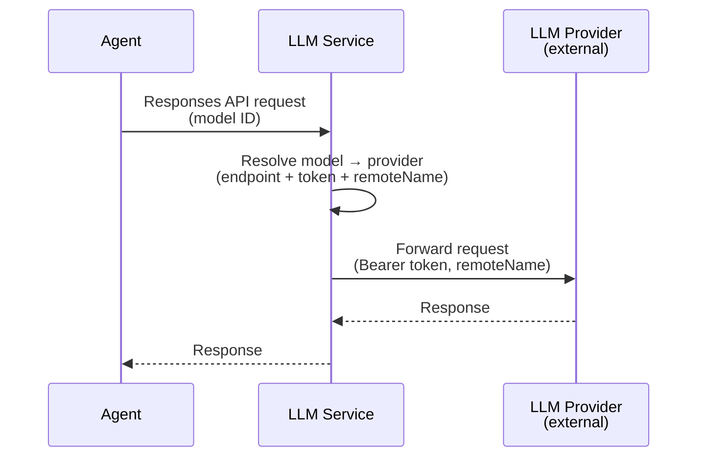

# LLM Service

## Overview

The LLM service manages LLM providers and models as internal resources, and exposes a proxy endpoint for making LLM calls. Agents do not connect to LLM providers directly — they call the LLM service, which resolves the model's provider and forwards the request with the appropriate endpoint and token.

## Responsibilities

| Responsibility | Description |
|---------------|-------------|
| **Provider CRUD** | Create, read, update, delete LLM provider resources |
| **Model CRUD** | Create, read, update, delete model resources |
| **LLM Proxy** | Accept LLM API calls from agents, resolve the model → provider chain, forward to the provider with injected credentials |

## Classification

The LLM service is a **data plane** service — it carries live LLM traffic on the agent execution hot path.

## LLM Proxy

The proxy endpoint accepts OpenAI-compatible Responses API requests. The caller specifies a model by its internal ID. The service resolves the model to its LLM provider, then forwards the request to the provider's endpoint with the provider's token injected as a Bearer token.

### Request Flow

1. Agent sends an OpenAI-compatible Responses API request to the LLM service, specifying the internal model ID.
2. The LLM service looks up the model resource to get the LLM provider reference and remote model name.
3. The LLM service looks up the LLM provider resource to get the endpoint URL and token.
4. The LLM service forwards the request to the provider's endpoint, replacing the model ID with the remote model name and injecting the token as a Bearer authorization header.
5. The provider's response is returned to the agent.

The agent is configured with the LLM service endpoint. It uses the standard OpenAI client pointed at the LLM service — no provider-specific client logic in the agent.

### Streaming

The proxy supports streaming responses. When the agent requests a streaming response, the LLM service streams the provider's response back to the agent without buffering.

## Provider Management

CRUD operations for LLM provider resources. See [Providers, Models, and Secrets](providers.md#llm-provider) for the resource definition.

### Validation

On create and update, the service validates that the endpoint is reachable and the token is accepted. A test request (e.g., a lightweight model list or health check) is sent to the provider's endpoint.

## Model Management

CRUD operations for model resources. See [Providers, Models, and Secrets](providers.md#model) for the resource definition.

### Validation

On create and update, the service validates that the referenced LLM provider exists. Optionally, a test completion request can verify that the remote model name is valid on the provider.
