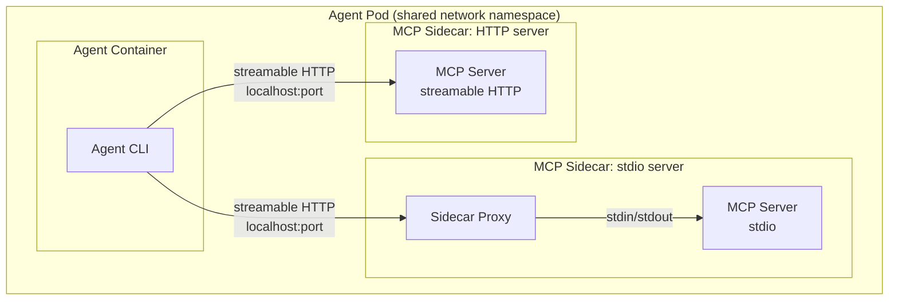
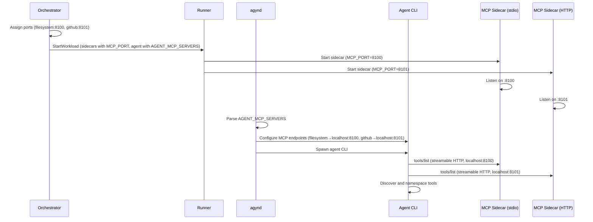

# MCP (Model Context Protocol)

## Overview

Agents use tools provided via [MCP](https://modelcontextprotocol.io/) (Model Context Protocol). MCP servers run as sidecar containers inside the agent pod, sharing the network namespace. Each MCP server exposes tools over streamable HTTP on a localhost port. The agent CLI connects to each MCP server directly — there is no aggregation proxy.

## Transports

MCP defines two standard transports. The platform supports both:

| Transport | Description | Usage |
|-----------|-------------|-------|
| **stdio** | Newline-delimited JSON-RPC 2.0 over stdin/stdout | MCP servers that only support stdio. Wrapped by the [sidecar proxy](#sidecar-proxy) to expose streamable HTTP |
| **Streamable HTTP** | JSON-RPC 2.0 over HTTP (SSE for server-to-client streaming) | MCP servers that natively support HTTP. Exposed directly on a localhost port — no proxy needed |

From the agent CLI's perspective, every MCP server is a streamable HTTP endpoint on `localhost:<port>`. The transport difference is handled at the sidecar level.

## Architecture

### Streamable HTTP MCP servers

MCP servers that natively support streamable HTTP expose their port directly. The sidecar container runs the MCP server process as its entrypoint. No proxy is involved.

### stdio MCP servers

MCP servers that only support stdio cannot accept network connections. The sidecar container runs a **sidecar proxy** that:

1. Spawns the MCP server process as a child.
2. Communicates with it over stdin/stdout (JSON-RPC 2.0).
3. Exposes a streamable HTTP endpoint on a localhost port.
4. Bridges requests and responses between HTTP and stdio.

The sidecar proxy is a generic stdio-to-HTTP adapter. It has no MCP-semantic awareness beyond transport bridging.

## Sidecar Proxy

The sidecar proxy runs inside MCP sidecar containers that host stdio-only MCP servers. It is the sidecar container's entrypoint.

| Aspect | Detail |
|--------|--------|
| Role | Bridges stdio MCP servers to streamable HTTP |
| Input | MCP server process communicating over stdin/stdout |
| Output | Streamable HTTP endpoint on a localhost port |
| Lifecycle | Spawns the MCP server process, manages health checks, restarts with backoff on failure |

The proxy does not modify, inspect, or transform MCP messages beyond transport reframing (JSON-RPC 2.0 lines ↔ HTTP request/response bodies).

## Agent CLI Connection

The agent CLI connects to each MCP server independently over streamable HTTP. `agynd` configures the agent CLI with the list of MCP endpoints (one `localhost:<port>` per server) before spawning it. The agent CLI handles:

- Tool discovery (`tools/list`) from each server
- Tool call routing to the correct server
- Tool namespacing to prevent collisions across servers

Tool namespacing is owned by each agent CLI implementation. The platform does not enforce a namespacing convention.

## Port Allocation

All MCP sidecars share the agent pod's network namespace (localhost). Each sidecar needs a unique port. The [Agents Orchestrator](agents-orchestrator.md) assigns ports at workload assembly time.

### How it works

1. The Orchestrator fetches all MCP servers for the agent from the [Agents](agents-service.md) service.
2. It sorts them by a stable key (`id`) and assigns ports starting from a base port (e.g., `8100`), incrementing by one per MCP server.
3. Each MCP sidecar receives its assigned port via the `MCP_PORT` environment variable.
4. The Orchestrator passes the full name-to-port mapping to `agynd` via the `AGENT_MCP_SERVERS` environment variable on the agent container.

### Environment variables

| Variable | Set on | Format | Example |
|----------|--------|--------|---------|
| `MCP_PORT` | Each MCP sidecar container | Single integer | `8101` |
| `AGENT_MCP_SERVERS` | Agent container (read by `agynd`) | Comma-separated `name:port` pairs | `filesystem:8100,github:8101` |

The sidecar proxy (for stdio servers) or the MCP server itself (for streamable HTTP servers) reads `MCP_PORT` and listens on that port. `agynd` parses `AGENT_MCP_SERVERS` and writes the corresponding MCP endpoint entries into the agent CLI configuration.

### Port range

Ports are assigned starting from a configurable base port (default: `8100`). The range is internal to the pod — it does not conflict with host ports since all containers share the pod's network namespace, not the host network.

## Configuration Flow

1. The [Agents Orchestrator](agents-orchestrator.md) assigns ports and assembles the workload spec.
2. The [Runner](runner.md) starts sidecar containers — each reads `MCP_PORT` and listens on its assigned port.
3. `agynd` parses `AGENT_MCP_SERVERS` and writes MCP endpoint entries into the agent CLI configuration.
4. The agent CLI connects to each endpoint, discovers tools, and begins using them.

## Resource Definition

MCP servers are defined as agent sub-resources. See [Resource Definitions — MCP](resource-definitions.md#mcp) for the schema. Each MCP resource specifies the container image, startup command, and a `name` used as the server key in agent CLI configuration. Environment variables, init scripts, and volumes are attached via their respective sub-resources.
