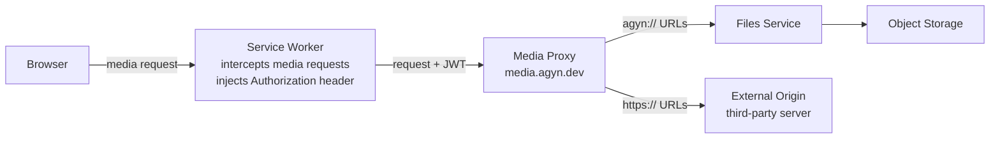
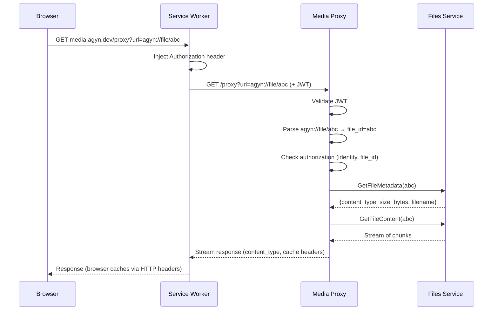

# Media Proxy

## Overview

The Media Proxy is a dedicated service that fetches media content on behalf of clients. It serves two purposes:

1. **External media** — proxy publicly available images, video, and audio so that the user's browser never contacts third-party servers directly.
2. **Platform files** — proxy files stored in the [Files](media.md) service so that object storage (MinIO / S3) is never exposed to clients.

All requests to the Media Proxy are authenticated via JWT. The service validates tokens independently using the same JWKS-based verification as the [Gateway](gateway.md) — see [Authentication](authn.md). The Media Proxy is not routed through the Gateway; it has its own ingress.

## Architecture



## Ingress

The Media Proxy is exposed via a dedicated subdomain.

| Host | Target | Description |
|------|--------|-------------|
| `media.agyn.dev` | `media-proxy:8080` | Dedicated subdomain for media proxying |

The Istio VirtualService routes `media.agyn.dev` to the Media Proxy service. Since this is a different origin from the SPA (`agyn.dev`), the Media Proxy returns CORS headers — see [CORS](#cors).

## CORS

The Media Proxy is served from `media.agyn.dev`, a different origin from the SPA at `agyn.dev`. The Service Worker changes request mode from `no-cors` to `cors` when injecting the `Authorization` header. The Media Proxy responds with the following CORS headers:

| Header | Value |
|--------|-------|
| `Access-Control-Allow-Origin` | `https://agyn.dev` |
| `Access-Control-Allow-Headers` | `Authorization, Range` |
| `Access-Control-Allow-Methods` | `GET, OPTIONS` |
| `Access-Control-Expose-Headers` | `Content-Type, Content-Range, Accept-Ranges, Content-Disposition, Content-Length` |
| `Access-Control-Max-Age` | `86400` |

The `OPTIONS` preflight response is cached for 24 hours to minimize preflight overhead.

## Supported URL Schemes

| Scheme | Source | Example |
|--------|--------|---------|
| `https://` | External public URL | `https://example.com/photo.png` |
| `http://` | External public URL (non-TLS) | `http://example.com/photo.png` |
| `agyn://file/<id>` | Platform [Files](media.md) service | `agyn://file/550e8400-e29b-41d4-a716-446655440000` |

## External Media Proxy

For external URLs (`http://`, `https://`), the Media Proxy fetches the resource from the origin server and streams it to the client.

### Security Protections

| Protection | Description |
|-----------|-------------|
| **SSRF — private network blocking** | Reject requests that resolve to RFC1918, loopback, link-local, or IPv6 ULA addresses. Blocks both direct IP URLs and DNS resolution to private ranges |
| **SSRF — DNS rebinding** | Resolve DNS before connecting. Validate the resolved address against the deny list, not just the hostname |
| **Redirect limits** | Follow at most 3 redirects. Validate each hop against the SSRF deny list |
| **Content-Type whitelist** | Only proxy `image/*`, `video/*`, and `audio/*` content types. Reject all others. This restriction applies only to external URLs — platform files are served with any content type |
| **Max response size** | Reject responses exceeding a configurable size limit |
| **Request timeout** | Abort origin requests that exceed a configurable timeout |

### Denied Networks

| Network | Description |
|---------|-------------|
| `127.0.0.0/8` | Loopback |
| `10.0.0.0/8` | RFC1918 |
| `172.16.0.0/12` | RFC1918 |
| `192.168.0.0/16` | RFC1918 |
| `169.254.0.0/16` | IPv4 link-local |
| `::1/128` | IPv6 loopback |
| `fe80::/10` | IPv6 link-local |
| `fc00::/7` | IPv6 ULA |
| `::ffff:0:0/96` | IPv4-mapped IPv6 |

## Platform File Proxy

For `agyn://file/<id>` URLs, the Media Proxy extracts the file ID and fetches content from the [Files](media.md) service via `GetFileMetadata` and `GetFileContent` RPCs.

Platform files are served with their original content type — no content-type whitelist is applied. Users can upload any file type (images, video, audio, PDFs, text files, code files, etc.), and the proxy serves them all.

### Authorization

The Media Proxy validates that the authenticated user has access to the requested file. The caller's identity (from the JWT) is checked against the [authorization model](authz.md) before fetching file content.

### Flow



## Image Downsampling

The Media Proxy supports on-the-fly image downsampling for inline display. Clients request a constrained size; the proxy resizes the image before streaming it. This reduces bandwidth for large images displayed inline in the UI.

Downsampling applies only to `image/*` content types. Video, audio, and non-media files are streamed at original quality.

### Size Parameter

| Parameter | Type | Description |
|-----------|------|-------------|
| `size` | integer | Optional. Maximum dimension in pixels. The larger of width and height is constrained to this value; aspect ratio is preserved |

When `size` is specified, the proxy resizes the image so that neither its width nor its height exceeds the given value, preserving aspect ratio. When omitted, the image is served at original resolution.

### Original File Access

To download the original (non-downsampled) file, the client omits the `size` parameter. The UI uses this for the "download original" action.

## Range Request Support

The Media Proxy supports HTTP range requests for video and audio streaming. The browser's native `<video>` and `<audio>` elements issue `Range` requests for progressive playback and seeking.

For external URLs, the Media Proxy forwards the `Range` header to the origin server and passes through the `206 Partial Content` response.

For platform files (`agyn://`), the Media Proxy translates range requests into the appropriate byte offsets when calling `GetFileContent`.

Safari sends an initial `Range: bytes=0-1` probe for video and audio. The proxy handles this correctly.

## HTTP Cache Headers

The Media Proxy sets HTTP cache headers on responses to enable browser caching:

| Header | Value | Purpose |
|--------|-------|---------|
| `Cache-Control` | `private, max-age=3600, immutable` | Cache for 1 hour, browser-only (not shared caches). `private` because responses are behind authentication |
| `Content-Type` | Forwarded from origin / Files service | Correct MIME type for rendering |
| `Content-Disposition` | `inline` | Display inline, not as download |

For range responses, the proxy also returns `Content-Range` and `Accept-Ranges: bytes`.

## Service Worker — Client-Side Auth Injection

The SPA registers a Service Worker that intercepts all requests to `media.agyn.dev` and injects the JWT `Authorization` header. This allows ``, `<video>`, and `<audio>` elements to use plain `src` attributes — the browser handles caching, range requests, and progressive loading natively.

### Registration

The SPA registers the Service Worker on startup. The worker activates immediately and takes control of all pages. On the first page load before the Service Worker is active, media requests proceed without the auth header and receive `401` — the SPA defers media loading until the Service Worker is ready.

### Fetch Interception

The Service Worker listens for fetch events. When a request matches the media proxy origin (`media.agyn.dev`), it creates a new request with the `Authorization: Bearer <token>` header injected.

The request mode is changed from `no-cors` to `cors`. Browser-initiated requests from ``, `<video>`, and `<audio>` tags arrive in `no-cors` mode, which does not allow custom headers. Changing to `cors` mode enables the `Authorization` header. Since the Media Proxy returns CORS headers for `https://agyn.dev`, this works without issues.

The original `Range` header is preserved in the new request. This is critical for video/audio seeking in all browsers, including Safari's initial `Range: bytes=0-1` probe.

Requests that do not match the media proxy origin pass through unmodified.

### Token Lifecycle

The SPA communicates the current JWT to the Service Worker via `postMessage`. The SPA sends the token:

1. After initial OIDC login.
2. After each token refresh.
3. On page load, if the Service Worker is already active (re-sends the current token).

The Service Worker stores the token in memory and uses it for all subsequent intercepted requests. If the Service Worker restarts and has no token, intercepted requests proceed without the auth header. The `401` response triggers the SPA to re-send the token and retry.

### Browser Compatibility

Service Workers are supported in all modern browsers since April 2018: Chrome, Firefox, Safari (desktop and iOS), Edge. See [Can I Use: Service Workers](https://caniuse.com/serviceworkers).

## API

The Media Proxy exposes a REST endpoint directly (not through the Gateway). It is not a proto/ConnectRPC service — it handles binary streaming with query parameters and HTTP range semantics.

### Endpoint

```
GET https://media.agyn.dev/proxy?url={url}&size={size}
```

| Parameter | Required | Description |
|-----------|----------|-------------|
| `url` | yes | URL-encoded media URL. `https://...`, `http://...`, or `agyn://file/...` |
| `size` | no | Max dimension in pixels (images only). The larger of width/height is constrained; aspect ratio preserved |

### Authentication

JWT Bearer authentication. The Media Proxy validates the `access_token` JWT signature against the IdP's JWKS endpoint, identical to the Gateway's authentication flow (see [Authentication — User Authentication](authn.md#user-authentication-oidc)). The Service Worker injects the `Authorization` header on every request to this endpoint.

### Response

| Status | Description |
|--------|-------------|
| `200 OK` | Full content response |
| `206 Partial Content` | Range response (video/audio seeking) |
| `400 Bad Request` | Missing or malformed `url` parameter |
| `401 Unauthorized` | Missing or invalid JWT |
| `403 Forbidden` | User does not have access to the requested `agyn://` file |
| `404 Not Found` | Platform file not found, or external URL returned 404 |
| `413 Content Too Large` | Response exceeds max size limit |
| `415 Unsupported Media Type` | Origin content type not in the whitelist (external URLs only) |
| `422 Unprocessable Content` | URL resolves to a denied network (SSRF) |
| `502 Bad Gateway` | Origin server error or unreachable |
| `504 Gateway Timeout` | Origin request timed out |

## Configuration

| Variable | Required | Description |
|----------|----------|-------------|
| `MAX_RESPONSE_SIZE` | no | Maximum proxied response size in bytes. Default: configurable per deployment |
| `REQUEST_TIMEOUT` | no | Timeout for origin requests. Default: configurable per deployment |
| `MAX_REDIRECTS` | no | Maximum redirect hops for external URLs. Default: 3 |
| `MAX_IMAGE_SIZE` | no | Maximum allowed `size` parameter value. Default: configurable per deployment |

## Classification

The Media Proxy is a **data plane** service — it carries live media traffic.

## Deployment

| Aspect | Detail |
|--------|--------|
| **Repository** | `agynio/media-proxy` |
| **Language** | Go |
| **Kubernetes** | Deployment + Service |
| **Ingress** | Istio VirtualService: `media.agyn.dev` → `media-proxy:8080` |
| **CI/CD** | See [CI/CD](operations/ci-cd.md) |

## Related Documents

- [Media](media.md) — file upload, storage, and the Files service
- [Gateway](gateway.md) — external API surface (Media Proxy is independent, not routed through Gateway)
- [Chat (Product)](../product/chat/chat.md) — inline media rendering in conversations
- [Inline Media (Product)](../product/chat/inline-media.md) — product spec for inline media display
- [Authentication](authn.md) — JWT authentication
- [Authorization](authz.md) — file access control
