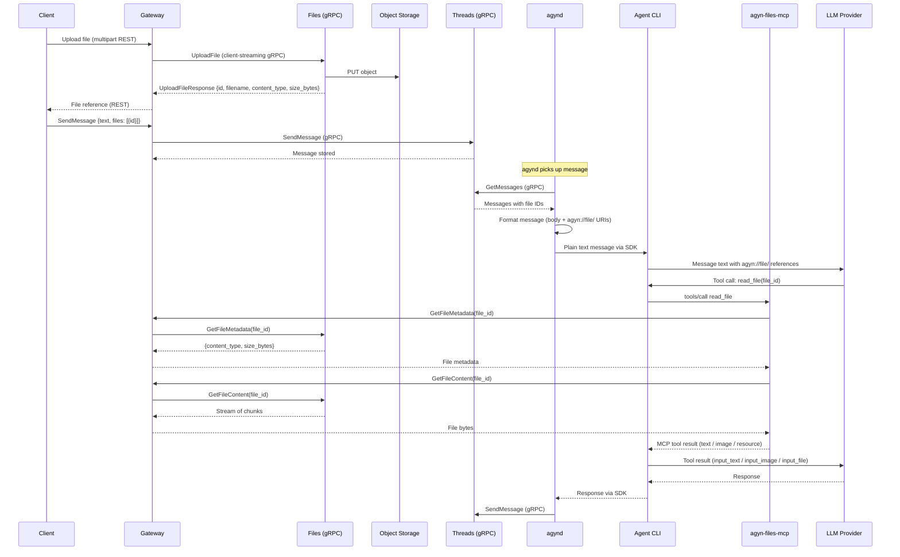

# Media Support

## Overview

Users can attach files to messages in thread conversations. Media files are stored in object storage by a dedicated **Files** service and referenced in messages by ID. The agent receives file references as part of the conversation context. The LLM can request file content on demand via an MCP tool provided by the [agyn-files-mcp](agyn-files-mcp.md) server.

## File Lifecycle



## Message Formatting for LLM

[`agynd`](agynd-cli.md) translates each thread message before feeding it to the agent CLI. When a message has file attachments, `agynd` appends `agyn://file/` URIs after the message body:

**Thread message (as stored):**
```json
{
  "body": "What's in this image?",
  "files": ["file-uuid-1", "file-uuid-2"]
}
```

**LLM input (as sent to the model):**
```
What's in this image?
agyn://file/file-uuid-1
agyn://file/file-uuid-2
```

The `agyn://` URI is a platform-internal scheme used for referencing platform resources (files, chats, etc.). It is not resolvable outside the agent's MCP environment. The agent CLI receives these as plain text — it has no knowledge of the underlying thread message structure or file IDs. The LLM sees the references and can decide whether to read the file content by calling the `read_file` tool provided by [agyn-files-mcp](agyn-files-mcp.md).

This is a **lazy, on-demand** approach — file content is only fetched when the LLM explicitly requests it. The LLM may choose not to read a file if the text context is sufficient, or may read multiple files selectively.

## Files Service

A dedicated service responsible for file upload, metadata storage, and download URL generation. Decoupled from the Threads service — Threads stores only file IDs in messages.

### Responsibilities

| Responsibility | Description |
|---------------|-------------|
| **Upload** | Accept file content, store in object storage, persist metadata |
| **Metadata** | Store and serve file metadata (filename, content_type, size_bytes) |
| **Download URLs** | Generate pre-signed URLs for file access on demand |

### File Record

| Field | Type | Description |
|-------|------|-------------|
| `id` | string (UUID) | Unique file identifier |
| `filename` | string | Original filename |
| `content_type` | string | MIME type |
| `size_bytes` | integer | File size in bytes |
| `created_at` | timestamp | Upload time |

### Classification

The Files service is a **data plane** service — it carries live file traffic.

## Object Storage

### Infrastructure

A new S3-compatible object storage backend is required. In production, this can be any S3-compatible service (AWS S3, GCS, R2, etc.). For local development, **MinIO** is deployed as part of the bootstrap cluster.

| Aspect | Details |
|--------|---------|
| Protocol | S3-compatible API |
| Local | MinIO deployed via bootstrap |
| Production | Any S3-compatible provider |

### Object Key

Files are stored with a UUID key:

```
<file_id>
```

All other metadata (filename, content type, team, thread association) is stored in the Files service database, not in the storage key.

### Access Control

No direct public access to the bucket. External clients access files via pre-signed download URLs. Internal consumers ([agyn-files-mcp](agyn-files-mcp.md)) use the `GetFileContent` RPC to stream content directly from the Files service.

| Operation | Access |
|-----------|--------|
| Upload | Files service writes to object storage directly |
| Download | Pre-signed GET URL with expiration |
| MCP read | [agyn-files-mcp](agyn-files-mcp.md) calls `GetFileContent` on the Files service; content returned to agent via MCP tool result |

Pre-signed URL expiration for external download URLs: recommended 1 hour.

## API

### Proto Definition

```protobuf
syntax = "proto3";

package agynio.api.files.v1;

import "google/protobuf/timestamp.proto";

option go_package = "github.com/agynio/api/gen/agynio/api/files/v1;filesv1";

service FilesService {
  // Client-side streaming upload. First message = metadata, subsequent = chunks.
  rpc UploadFile(stream UploadFileRequest) returns (UploadFileResponse);
  rpc GetDownloadUrl(GetDownloadUrlRequest) returns (GetDownloadUrlResponse);
  rpc GetFileMetadata(GetFileMetadataRequest) returns (GetFileMetadataResponse);
  // Server-side streaming download. Returns file content in chunks.
  rpc GetFileContent(GetFileContentRequest) returns (stream GetFileContentResponse);
}
```

### Messages

```protobuf
message UploadFileRequest {
  oneof payload {
    UploadFileMetadata metadata = 1;  // MUST be first message
    bytes chunk_data = 2;             // Subsequent messages
  }
}

message UploadFileMetadata {
  string filename = 1;
  string content_type = 2;
}

message UploadFileResponse {
  string id = 1;
  string filename = 2;
  string content_type = 3;
  int64 size_bytes = 4;
}

message GetDownloadUrlRequest {
  string file_id = 1;
}

message GetDownloadUrlResponse {
  string url = 1;
  google.protobuf.Timestamp expires_at = 2;
}

message GetFileMetadataRequest {
  string file_id = 1;
}

message GetFileMetadataResponse {
  string id = 1;
  string filename = 2;
  string content_type = 3;
  int64 size_bytes = 4;
  google.protobuf.Timestamp created_at = 5;
}

message GetFileContentRequest {
  string file_id = 1;
}

message GetFileContentResponse {
  bytes chunk_data = 1;
}
```

### Upload Streaming Protocol

1. **Message 1 (metadata):** `UploadFileRequest.metadata` with `filename` and `content_type`.
2. **Messages 2..N (chunks):** `UploadFileRequest.chunk_data` (recommended 64 KiB chunks).
3. **Stream close:** Client closes send side. Server computes `size_bytes`, writes to object storage, persists metadata, returns `UploadFileResponse`.

**Error codes:**

| Condition | gRPC Status Code |
|---|---|
| First message missing metadata | `INVALID_ARGUMENT` |
| Disallowed MIME type | `INVALID_ARGUMENT` |
| File exceeds max size | `RESOURCE_EXHAUSTED` |
| File not found (Get/Download RPCs) | `NOT_FOUND` |
| Object storage write failure | `INTERNAL` |

### Download Streaming Protocol

1. Client sends `GetFileContentRequest` with `file_id`.
2. Server reads the file from object storage and streams `GetFileContentResponse` messages, each containing a `chunk_data` bytes field (64 KiB chunks).
3. Server closes the stream when the file is fully sent.

**Error codes:**

| Condition | gRPC Status Code |
|---|---|
| File not found | `NOT_FOUND` |
| Object storage read failure | `INTERNAL` |

### Gateway Translation (External REST → Internal gRPC)

The Gateway receives `POST /files` (multipart/form-data) from external clients and translates to the `UploadFile` client-streaming gRPC call:

1. Parse multipart form, extract `filename`, `content_type`, body stream.
2. Open `UploadFile` stream, send metadata message first.
3. Read file body in 64 KiB chunks, stream as `chunk_data` messages (no full-file buffering).
4. Close stream, await response, translate to HTTP 201 JSON response.
5. Map gRPC errors → HTTP: `INVALID_ARGUMENT` → 400, `RESOURCE_EXHAUSTED` → 413, `INTERNAL` → 502.

## Threads Integration

### SendMessage Extension

The `SendMessage` request body is extended to accept file references alongside text:

**Current:**
```json
{ "text": "Hello" }
```

**New:**
```json
{
  "text": "What's in this image?",
  "files": [
    { "id": "file-uuid" }
  ]
}
```

The `files` array is optional. Each entry references a file previously uploaded via the Files service. Threads stores only the file IDs — it does not resolve or validate file metadata at write time.

### Message Data Model Extension

The Message model gains an optional `files` field:

| Field | Type | Description |
|-------|------|-------------|
| `id` | string (UUID) | Unique message identifier |
| `thread_id` | string (UUID) | Parent thread |
| `sender_id` | string (UUID) | Participant who sent the message |
| `body` | string | Text content |
| `files` | list of string (UUID) | Referenced file IDs (may be empty) |
| `created_at` | timestamp | When the message was sent |

Consumers (Gateway, [agyn-files-mcp](agyn-files-mcp.md)) resolve file IDs to metadata and download URLs by calling the Files service.

## Context Size and Summarization

Media files consume tokens that cannot be estimated from text length. When file content is loaded via the `read_file` tool, the resulting tool output messages are part of the conversation context and counted by the [Token Counting](token-counting.md) service. Token counts are stored in agent state on disk and used by the summarization reducer.

## Related Documents

- [agyn-files-mcp](agyn-files-mcp.md) — MCP server for file access
- [agynd](agynd-cli.md#message-formatting) — Thread message translation (body + `agyn://file/` URIs)
- [Agent Implementation — MCP-to-LLM Translation](agent/implementation.md#mcp-to-llm-translation) — How `agn` converts MCP tool results to OpenAI Responses API format
