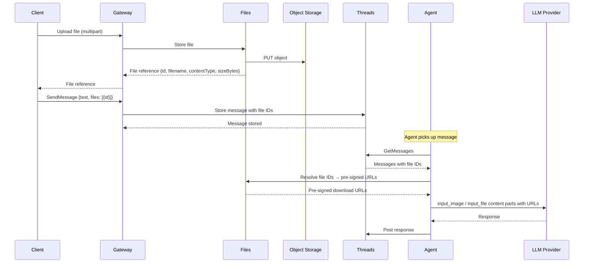

# Media Support

## Overview

Users can attach files to messages in thread conversations. Media files are stored in object storage by a dedicated **Files** service and referenced in messages by ID. The agent receives file references as part of the conversation context and forwards them to the LLM provider.

## File Lifecycle



## Files Service

A dedicated service responsible for file upload, metadata storage, and download URL generation. Decoupled from the Threads service — Threads stores only file IDs in messages.

### Responsibilities

| Responsibility | Description |
|---------------|-------------|
| **Upload** | Accept file content, store in object storage, persist metadata |
| **Metadata** | Store and serve file metadata (filename, contentType, sizeBytes) |
| **Download URLs** | Generate pre-signed URLs for file access on demand |

### File Record

| Field | Type | Description |
|-------|------|-------------|
| `id` | string (UUID) | Unique file identifier |
| `filename` | string | Original filename |
| `contentType` | string | MIME type |
| `sizeBytes` | integer | File size in bytes |
| `created_at` | timestamp | Upload time |

### Classification

The Files service is a **data plane** service — it carries live file traffic.

## Object Storage

### Infrastructure

A new S3-compatible object storage backend is required. In production, this can be any S3-compatible service (AWS S3, GCS, R2, etc.). For local development, **MinIO** is deployed as part of the bootstrap cluster.

| Aspect | Details |
|--------|---------|
| Protocol | S3-compatible API |
| Local | MinIO deployed via bootstrap_v2 |
| Production | Any S3-compatible provider |

### Object Key

Files are stored with a UUID key:

```
<file_id>
```

All other metadata (filename, content type, team, thread association) is stored in the Files service database, not in the storage key.

### Access Control

Files are accessed via **pre-signed URLs** generated by the Files service. No direct public access to the bucket.

| Operation | Access |
|-----------|--------|
| Upload | Files service writes to object storage directly |
| Download | Pre-signed GET URL with expiration |
| Agent read | Pre-signed GET URL passed as `file_url` / `image_url` to LLM provider |

Pre-signed URL expiration should be long enough for LLM provider processing (recommended: 1 hour).

## API

### Upload

```
POST /files
Content-Type: multipart/form-data
```

| Field | Type | Description |
|-------|------|-------------|
| `file` | binary | File content (multipart) |

**Response** (`201 Created`):

| Field | Type | Description |
|-------|------|-------------|
| `id` | string (UUID) | File identifier |
| `filename` | string | Original filename |
| `contentType` | string | MIME type |
| `sizeBytes` | integer | File size in bytes |

### Get Download URL

```
GET /files/{fileId}/url
```

**Response** (`200 OK`):

| Field | Type | Description |
|-------|------|-------------|
| `url` | string | Pre-signed download URL |
| `expiresAt` | timestamp | URL expiration time |

### Get File Metadata

```
GET /files/{fileId}
```

**Response** (`200 OK`):

| Field | Type | Description |
|-------|------|-------------|
| `id` | string (UUID) | File identifier |
| `filename` | string | Original filename |
| `contentType` | string | MIME type |
| `sizeBytes` | integer | File size in bytes |
| `created_at` | timestamp | Upload time |

### Constraints

| Constraint | Value |
|------------|-------|
| Max file size | TBD (recommended: 20 MB) |
| Allowed MIME types | TBD (at minimum: images, PDFs, text files, common documents) |

## Threads Integration

### SendMessage Extension

The `SendMessage` request body is extended to accept file references alongside text:

**Current:**
```json
{ "text": "Hello" }
```

**New:**
```json
{
  "text": "What's in this image?",
  "files": [
    { "id": "file-uuid" }
  ]
}
```

The `files` array is optional. Each entry references a file previously uploaded via the Files service. Threads stores only the file IDs — it does not resolve or validate file metadata at write time.

### Message Data Model Extension

The Message model gains an optional `files` field:

| Field | Type | Description |
|-------|------|-------------|
| `id` | string (UUID) | Unique message identifier |
| `thread_id` | string (UUID) | Parent thread |
| `sender_id` | string (UUID) | Participant who sent the message |
| `body` | string | Text content |
| `files` | list of string (UUID) | Referenced file IDs (may be empty) |
| `read_status` | map | Per-participant read status |
| `created_at` | timestamp | When the message was sent |

Consumers (Gateway, agent) resolve file IDs to metadata and download URLs by calling the Files service.

## Agent Integration

### Message to LLM Content Parts

When the agent reads messages with file attachments, it resolves file IDs through the Files service and maps them to OpenAI Responses API content parts:

| File contentType | OpenAI Content Part | URL field |
|------------------|-------------------|-----------|
| `image/*` | `input_image` | `image_url` (pre-signed URL) |
| All other types | `input_file` | `file_url` (pre-signed URL) |

A message with text and files becomes a multi-part content array:

```
content: [
  { type: "input_text", text: "What's in this image?" },
  { type: "input_image", image_url: "<pre-signed-url>", detail: "auto" }
]
```

For non-image files:

```
content: [
  { type: "input_text", text: "Review this document" },
  { type: "input_file", file_url: "<pre-signed-url>", filename: "spec.pdf" }
]
```

### HumanMessage Extension

`HumanMessage.fromText(text)` produces a single `input_text` content part today. A new factory is needed:

`HumanMessage.from({ text, files })` — produces a content array with `input_text` followed by `input_image` / `input_file` parts for each attached file.

## Context Size and Summarization

### Problem

The current summarization logic estimates token count from text length (`text.length / 4`). This heuristic does not account for media files, which consume tokens according to the LLM provider's internal processing (e.g., image tiles for vision models, text extraction for documents).

### Open Question: Token Counting for Media

The current approach of estimating tokens from string length cannot work for media. The planned direction is to use the **`usage.input_tokens`** value returned by the LLM provider's response to measure actual context size after each call, rather than estimating tokens before the call.

This is an **open question** — the exact mechanism and its implications for the summarization trigger are not yet decided. See [Open Questions](../open-questions.md#context-size-measurement-with-media).
