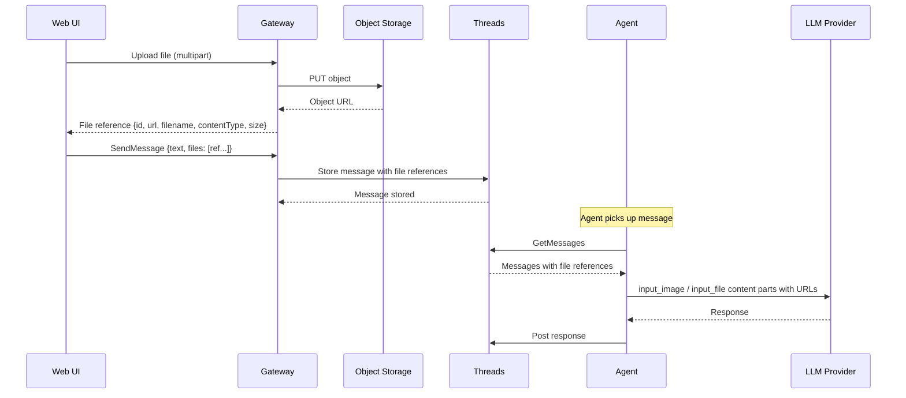

# Media Support

## Overview

Users can attach files to messages in thread conversations. Media files are stored in object storage and referenced in messages by URL. The agent receives file references as part of the conversation context and forwards them to the LLM provider.

## File Lifecycle



## Object Storage

### Infrastructure

A new S3-compatible object storage service is required. In production, this can be any S3-compatible service (AWS S3, GCS, R2, etc.). For local development, **MinIO** is deployed as part of the bootstrap cluster.

| Aspect | Details |
|--------|---------|
| Protocol | S3-compatible API |
| Local | MinIO deployed via bootstrap_v2 |
| Production | Any S3-compatible provider |
| Bucket | One bucket per team (or a shared bucket with team-prefixed keys) |

### Object Key Layout

```
<team_id>/threads/<thread_id>/<file_id>/<filename>
```

Objects are keyed by team, thread, and file ID. The original filename is preserved in the key for human readability and in the file metadata for API responses.

### Access Control

Files are accessed via **pre-signed URLs** generated by the Gateway. No direct public access to the bucket.

| Operation | Access |
|-----------|--------|
| Upload | Pre-signed PUT URL (or direct upload through Gateway) |
| Download | Pre-signed GET URL with expiration |
| Agent read | Pre-signed GET URL passed as `file_url` / `image_url` to LLM provider |

Pre-signed URL expiration should be long enough for LLM provider processing (recommended: 1 hour).

## API Changes

### Upload Endpoint

New Gateway endpoint for file uploads:

```
POST /api/threads/{threadId}/files
Content-Type: multipart/form-data
```

| Field | Type | Description |
|-------|------|-------------|
| `file` | binary | File content (multipart) |

**Response** (`201 Created`):

| Field | Type | Description |
|-------|------|-------------|
| `id` | string (UUID) | File identifier |
| `url` | string | Pre-signed download URL |
| `filename` | string | Original filename |
| `contentType` | string | MIME type |
| `sizeBytes` | integer | File size in bytes |

### SendMessage Extension

The `SendMessage` request body is extended to accept file references alongside text:

**Current:**
```json
{ "text": "Hello" }
```

**New:**
```json
{
  "text": "What's in this image?",
  "files": [
    { "id": "file-uuid" }
  ]
}
```

The `files` array is optional. Each entry references a file previously uploaded via the upload endpoint. The Threads service resolves the file ID to its stored metadata (URL, filename, contentType, size) when persisting the message.

### Message Data Model Extension

The Message model gains an optional `files` field:

| Field | Type | Description |
|-------|------|-------------|
| `id` | string (UUID) | Unique message identifier |
| `thread_id` | string (UUID) | Parent thread |
| `sender_id` | string (UUID) | Participant who sent the message |
| `body` | string | Text content |
| `files` | list | Attached file references (may be empty) |
| `read_status` | map | Per-participant read status |
| `created_at` | timestamp | When the message was sent |

Each file reference in the message:

| Field | Type | Description |
|-------|------|-------------|
| `id` | string (UUID) | File identifier |
| `filename` | string | Original filename |
| `contentType` | string | MIME type |
| `sizeBytes` | integer | File size in bytes |

File download URLs are not stored in the message — they are generated on read (pre-signed URLs with expiration).

### GetMessages Extension

When returning messages, the API generates fresh pre-signed download URLs for each file reference:

```json
{
  "id": "msg-uuid",
  "body": "What's in this image?",
  "files": [
    {
      "id": "file-uuid",
      "filename": "screenshot.png",
      "contentType": "image/png",
      "sizeBytes": 245000,
      "url": "https://storage.example.com/...?signature=..."
    }
  ]
}
```

## Agent Integration

### Message to LLM Content Parts

When the agent reads messages with file attachments, it maps them to OpenAI Responses API content parts:

| File contentType | OpenAI Content Part | URL field |
|------------------|-------------------|-----------|
| `image/*` | `input_image` | `image_url` (pre-signed URL) |
| All other types | `input_file` | `file_url` (pre-signed URL) |

A message with text and files becomes a multi-part content array:

```
content: [
  { type: "input_text", text: "What's in this image?" },
  { type: "input_image", image_url: "<pre-signed-url>", detail: "auto" }
]
```

For non-image files:

```
content: [
  { type: "input_text", text: "Review this document" },
  { type: "input_file", file_url: "<pre-signed-url>", filename: "spec.pdf" }
]
```

### HumanMessage Extension

`HumanMessage.fromText(text)` produces a single `input_text` content part today. A new factory is needed:

`HumanMessage.from({ text, files })` — produces a content array with `input_text` followed by `input_image` / `input_file` parts for each attached file.

## Context Size and Summarization

### Problem

The current summarization logic estimates token count from text length (`text.length / 4`). This heuristic does not account for media files, which consume tokens according to the LLM provider's internal processing (e.g., image tiles for vision models, text extraction for documents).

### Open Question: Token Counting for Media

The current approach of estimating tokens from string length cannot work for media. The planned direction is to use the **`usage.input_tokens`** value returned by the LLM provider's response to measure actual context size after each call, rather than estimating tokens before the call.

This is an **open question** — the exact mechanism and its implications for the summarization trigger are not yet decided. See [Open Questions](../open-questions.md#context-size-measurement-with-media).

## UI Changes

### Message Composer

The message composer gains a file attachment button:

- User clicks attach → file picker opens.
- Selected files are uploaded immediately via the upload endpoint.
- Upload progress is shown inline.
- Uploaded files appear as removable chips/thumbnails below the text input.
- On send, file IDs are included in the `SendMessage` request alongside text.

### Message Display

Messages with file attachments render file previews:

- **Images** (`image/*`): Inline thumbnail with click-to-expand.
- **Other files**: File name + size + download link.

### Constraints

| Constraint | Value |
|------------|-------|
| Max file size | TBD (recommended: 20 MB) |
| Max files per message | TBD (recommended: 10) |
| Allowed MIME types | TBD (at minimum: images, PDFs, text files, common documents) |

These limits are enforced at the Gateway upload endpoint.
