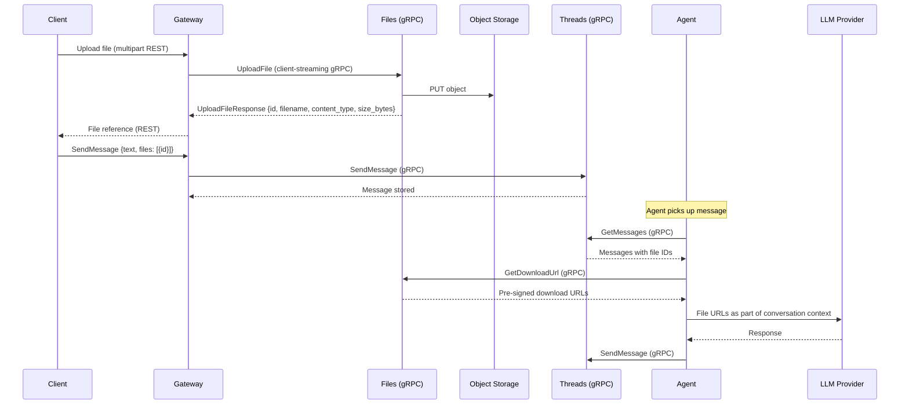

# Media Support

## Overview

Users can attach files to messages in thread conversations. Media files are stored in object storage by a dedicated **Files** service and referenced in messages by ID. The agent receives file references as part of the conversation context and forwards them to the LLM provider.

## File Lifecycle



## Files Service

A dedicated service responsible for file upload, metadata storage, and download URL generation. Decoupled from the Threads service — Threads stores only file IDs in messages.

### Responsibilities

| Responsibility | Description |
|---------------|-------------|
| **Upload** | Accept file content, store in object storage, persist metadata |
| **Metadata** | Store and serve file metadata (filename, content_type, size_bytes) |
| **Download URLs** | Generate pre-signed URLs for file access on demand |

### File Record

| Field | Type | Description |
|-------|------|-------------|
| `id` | string (UUID) | Unique file identifier |
| `filename` | string | Original filename |
| `content_type` | string | MIME type |
| `size_bytes` | integer | File size in bytes |
| `created_at` | timestamp | Upload time |

### Classification

The Files service is a **data plane** service — it carries live file traffic.

## Object Storage

### Infrastructure

A new S3-compatible object storage backend is required. In production, this can be any S3-compatible service (AWS S3, GCS, R2, etc.). For local development, **MinIO** is deployed as part of the bootstrap cluster.

| Aspect | Details |
|--------|---------|
| Protocol | S3-compatible API |
| Local | MinIO deployed via bootstrap |
| Production | Any S3-compatible provider |

### Object Key

Files are stored with a UUID key:

```
<file_id>
```

All other metadata (filename, content type, team, thread association) is stored in the Files service database, not in the storage key.

### Access Control

Files are accessed via **pre-signed URLs** generated by the Files service. No direct public access to the bucket.

| Operation | Access |
|-----------|--------|
| Upload | Files service writes to object storage directly |
| Download | Pre-signed GET URL with expiration |
| Agent read | Pre-signed GET URL passed to LLM provider |

Pre-signed URL expiration should be long enough for LLM provider processing (recommended: 1 hour).

## API

### Proto Definition

```protobuf
syntax = "proto3";

package agynio.api.files.v1;

import "google/protobuf/timestamp.proto";

option go_package = "github.com/agynio/api/gen/agynio/api/files/v1;filesv1";

service FilesService {
  // Client-side streaming upload. First message = metadata, subsequent = chunks.
  rpc UploadFile(stream UploadFileRequest) returns (UploadFileResponse);
  rpc GetDownloadUrl(GetDownloadUrlRequest) returns (GetDownloadUrlResponse);
  rpc GetFileMetadata(GetFileMetadataRequest) returns (GetFileMetadataResponse);
}
```

### Messages

```protobuf
message UploadFileRequest {
  oneof payload {
    UploadFileMetadata metadata = 1;  // MUST be first message
    bytes chunk_data = 2;             // Subsequent messages
  }
}

message UploadFileMetadata {
  string filename = 1;
  string content_type = 2;
}

message UploadFileResponse {
  string id = 1;
  string filename = 2;
  string content_type = 3;
  int64 size_bytes = 4;
}

message GetDownloadUrlRequest {
  string file_id = 1;
}

message GetDownloadUrlResponse {
  string url = 1;
  google.protobuf.Timestamp expires_at = 2;
}

message GetFileMetadataRequest {
  string file_id = 1;
}

message GetFileMetadataResponse {
  string id = 1;
  string filename = 2;
  string content_type = 3;
  int64 size_bytes = 4;
  google.protobuf.Timestamp created_at = 5;
}
```

### Upload Streaming Protocol

1. **Message 1 (metadata):** `UploadFileRequest.metadata` with `filename` and `content_type`.
2. **Messages 2..N (chunks):** `UploadFileRequest.chunk_data` (recommended 64 KiB chunks).
3. **Stream close:** Client closes send side. Server computes `size_bytes`, writes to object storage, persists metadata, returns `UploadFileResponse`.

**Error codes:**

| Condition | gRPC Status Code |
|---|---|
| First message missing metadata | `INVALID_ARGUMENT` |
| Disallowed MIME type | `INVALID_ARGUMENT` |
| File exceeds max size | `RESOURCE_EXHAUSTED` |
| File not found (Get/Download RPCs) | `NOT_FOUND` |
| Object storage write failure | `INTERNAL` |

### Gateway Translation (External REST → Internal gRPC)

The Gateway receives `POST /files` (multipart/form-data) from external clients and translates to the `UploadFile` client-streaming gRPC call:

1. Parse multipart form, extract `filename`, `content_type`, body stream.
2. Open `UploadFile` stream, send metadata message first.
3. Read file body in 64 KiB chunks, stream as `chunk_data` messages (no full-file buffering).
4. Close stream, await response, translate to HTTP 201 JSON response.
5. Map gRPC errors → HTTP: `INVALID_ARGUMENT` → 400, `RESOURCE_EXHAUSTED` → 413, `INTERNAL` → 502.

## Threads Integration

### SendMessage Extension

The `SendMessage` request body is extended to accept file references alongside text:

**Current:**
```json
{ "text": "Hello" }
```

**New:**
```json
{
  "text": "What's in this image?",
  "files": [
    { "id": "file-uuid" }
  ]
}
```

The `files` array is optional. Each entry references a file previously uploaded via the Files service. Threads stores only the file IDs — it does not resolve or validate file metadata at write time.

### Message Data Model Extension

The Message model gains an optional `files` field:

| Field | Type | Description |
|-------|------|-------------|
| `id` | string (UUID) | Unique message identifier |
| `thread_id` | string (UUID) | Parent thread |
| `sender_id` | string (UUID) | Participant who sent the message |
| `body` | string | Text content |
| `files` | list of string (UUID) | Referenced file IDs (may be empty) |
| `created_at` | timestamp | When the message was sent |

Consumers (Gateway, agent) resolve file IDs to metadata and download URLs by calling the Files service.

## Context Size and Summarization

Media files consume tokens that cannot be estimated from text length. The [Token Counting](token-counting.md) service provides accurate per-message token counts, including media content. Token counts are stored in the Agent State service and used by the summarization reducer.
