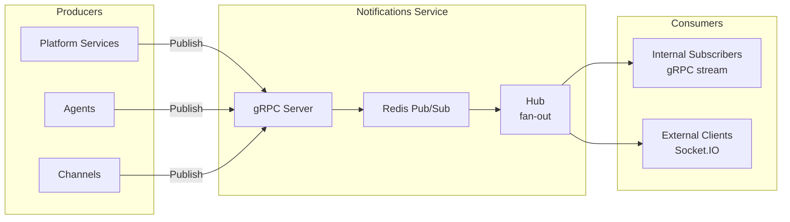

# Notifications

## Overview

The Notifications service handles real-time event delivery. It holds persistent connections (sockets) and fans out events to relevant clients.

## Architecture

## Transport

| Interface | Protocol | Direction |
|-----------|----------|-----------|
| Internal (service-to-service) | gRPC | Publish (unary) + Subscribe (server-streaming) |
| External (client-facing) | Socket.IO | Bidirectional persistent connection |

## gRPC API

Defined in `agynio/api` at `proto/agynio/api/notifications/v1/notifications.proto`.

### Publish

Producers send events to rooms:

| Field | Type | Description |
|-------|------|-------------|
| `event` | string | Stable event name (e.g., `message.created`, `job.status`) |
| `rooms` | repeated string | Target rooms (at least one required) |
| `payload` | google.protobuf.Struct | Event-specific JSON payload |
| `source` | string | Origin service identifier |

Server generates `id` (UUID v4) and `ts` (acceptance timestamp) for each envelope.

### Subscribe

Server-streaming RPC. Consumers receive all envelopes. Room filtering is handled client-side or by a gateway layer.

## Envelope

| Field | Type | Description |
|-------|------|-------------|
| `id` | string | Server-generated UUID v4 |
| `ts` | timestamp | Server-generated acceptance time |
| `source` | string | Origin service |
| `event` | string | Stable event name |
| `rooms` | repeated string | Target rooms |
| `payload` | Struct | JSON payload |

## Internal Design

- **Redis Pub/Sub** distributes envelopes across service instances.
- **Hub** fans out envelopes to registered subscribers with bounded buffers. Slow consumers are dropped (channel closed) to prevent backpressure.
- Buffer size is configurable per hub instance.
