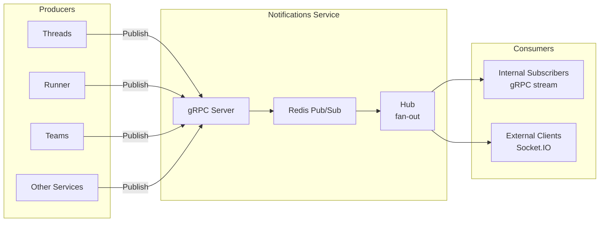

# Notifications

## Overview

The Notifications service handles real-time event delivery across the platform. It holds persistent connections (sockets) and fans out events to relevant clients. All services that produce observable state changes publish through Notifications.

Notifications is a **dumb fan-out pipe** — it routes events to rooms without understanding event semantics. Producers publish events with target rooms. Consumers subscribe to rooms. Notifications delivers matching events. The source of truth for all data remains in the owning service's database.

## Architecture

## Transport

| Interface | Protocol | Direction |
|-----------|----------|-----------|
| Internal (service-to-service) | gRPC | Publish (unary) + Subscribe (server-streaming) |
| External (client-facing) | Socket.IO | Bidirectional persistent connection |

## gRPC API

Defined in `agynio/api` at `proto/agynio/api/notifications/v1/notifications.proto`.

### Publish

Producers send events to rooms:

| Field | Type | Description |
|-------|------|-------------|
| `event` | string | Stable event name (e.g., `message.created`, `workload.status_changed`) |
| `rooms` | repeated string | Target rooms (at least one required) |
| `payload` | google.protobuf.Struct | Event-specific JSON payload |
| `source` | string | Origin service identifier |

Server generates `id` (UUID v4) and `ts` (acceptance timestamp) for each envelope.

### Subscribe

Server-streaming RPC. Consumers receive all envelopes for rooms they are subscribed to.

## Envelope

| Field | Type | Description |
|-------|------|-------------|
| `id` | string | Server-generated UUID v4 |
| `ts` | timestamp | Server-generated acceptance time |
| `source` | string | Origin service |
| `event` | string | Stable event name |
| `rooms` | repeated string | Target rooms |
| `payload` | Struct | JSON payload |

## Room Naming Convention

Rooms are scoped by resource type and ID:

| Pattern | Example | Used by |
|---------|---------|---------|
| `thread_participant:{id}` | `thread_participant:550e8400-...` | Threads → message recipients (agents, channels, users) |
| `workload:{id}` | `workload:7c9e6679-...` | Runner → workload status changes, log events |
| `agent:{id}` | `agent:f47ac10b-...` | Teams → agent resource updates |
| `threads:messages:new` | `threads:messages:new` | Threads → broadcast on every new message. Consumed by Orchestrator |
| `runner:workloads:status` | `runner:workloads:status` | Runner → broadcast on workload state transitions. Consumed by Orchestrator |

Consumers subscribe to rooms matching their identity or the resources they observe. A channel subscribes to `thread_participant:{channelId}`. A UI client displaying agent logs subscribes to `workload:{workloadId}`.

## Delivery Guarantees

Notifications provides **fire-and-forget delivery**. Events may be lost due to network issues, consumer disconnects, or slow consumer eviction. The source of truth is always the owning service's database, accessed via pull (e.g., `GetUnackedMessages`, `GetWorkload`).

### Consumer Sync Protocol

Consumers must follow this protocol to avoid duplicates and ordering races when combining notifications with pull:

1. **Subscribe** to the relevant notification room(s).
2. **Buffer** incoming events (do not process yet).
3. **Fetch** current state from the owning service (e.g., `GetUnackedMessages`).
4. **Discard** buffered events already covered by the fetch result.
5. **Apply** remaining buffered events and continue processing real-time events.

On reconnect, repeat from step 1. The fetch in step 3 guarantees no messages are lost — notifications only reduce latency between fetches.

## Internal Design

- **Redis Pub/Sub** distributes envelopes across service instances.
- **Hub** fans out envelopes to registered subscribers with bounded buffers. Slow consumers are dropped (channel closed) to prevent backpressure.
- Buffer size is configurable per hub instance.
