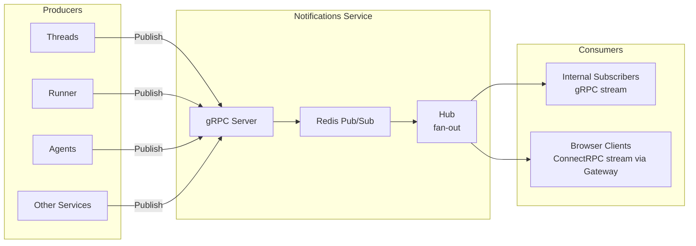

# Notifications

## Overview

The Notifications service handles real-time event delivery across the platform. It holds persistent connections (sockets) and fans out events to relevant clients. All services that produce observable state changes publish through Notifications.

Notifications is a **dumb fan-out pipe** — it routes events to rooms without understanding event semantics. Producers publish events with target rooms. Consumers subscribe to rooms. Notifications delivers matching events. The source of truth for all data remains in the owning service's database.

## Architecture

```mermaid
graph LR
    subgraph Producers
        Threads
        Runner
        Agents
        Other[Other Services]
    end

    subgraph Notifications Service
        Server[gRPC Server]
        Redis[Redis Pub/Sub]
        Hub[Hub<br/>fan-out]
    end

    subgraph Consumers
        IntSub[Internal Subscribers<br/>gRPC stream]
        ExtSub[Browser Clients<br/>ConnectRPC stream via Gateway]
    end

    Threads & Runner & Agents & Other -->|Publish| Server
    Server --> Redis
    Redis --> Hub
    Hub --> IntSub
    Hub --> ExtSub
```

## Transport

| Interface | Protocol | Direction |
|-----------|----------|-----------|
| Internal (service-to-service) | gRPC | Publish (unary) + Subscribe (server-streaming) |
| External (client-facing) | ConnectRPC server stream through the [Gateway](gateway.md) | Subscribe only, one-way after the request |

The service has no ingress of its own and no second protocol: browsers reach the
same server-streaming `Subscribe` every internal consumer does, proxied by the
Gateway on the SPA's own origin. Subscriptions are fixed at request time — a
client changing the rooms it watches opens a new stream.

## gRPC API

Defined in `agynio/api` at `proto/agynio/api/notifications/v1/notifications.proto`.

### Publish

Producers send events to rooms:

| Field | Type | Description |
|-------|------|-------------|
| `event` | string | Stable event name (e.g., `message.created`, `workload.status_changed`) |
| `rooms` | repeated string | Target rooms (at least one required) |
| `payload` | google.protobuf.Struct | Event-specific JSON payload |
| `source` | string | Origin service identifier |

Server generates `id` (UUID v4) and `ts` (acceptance timestamp) for each envelope.

### Subscribe

Server-streaming RPC. Consumers receive all envelopes for rooms they are subscribed to.

## Envelope

| Field | Type | Description |
|-------|------|-------------|
| `id` | string | Server-generated UUID v4 |
| `ts` | timestamp | Server-generated acceptance time |
| `source` | string | Origin service |
| `event` | string | Stable event name |
| `rooms` | repeated string | Target rooms |
| `payload` | Struct | JSON payload |

## Room Naming Convention

Rooms are scoped by resource type and ID:

| Pattern | Example | Used by |
|---------|---------|---------|
| `thread_participant:{id}` | `thread_participant:550e8400-...` | Threads → message recipients of type `user` or `app` |
| `instance_inbox:{id}` | `instance_inbox:9c1e6679-...` | Threads and apps → new [inbox items](agent-instances.md#inbox) for an [agent instance](agent-instances.md) |
| `workload:{id}` | `workload:7c9e6679-...` | Runner → workload status changes, log events |
| `agent:{id}` | `agent:f47ac10b-...` | Agents → agent (class) resource updates |
| `sandbox_owner:{owner_id}` | `sandbox_owner:550e8400-...` | Agents → `sandbox.updated` events for a sandbox owner's own list/detail views |
| `sandbox:{sandbox_id}` | `sandbox:3f2b1a8c-...` | Agents → `sandbox.updated` events for one sandbox, subscribed by clients displaying a sandbox shared with the caller |
| `sandbox_org:{organization_id}` | `sandbox_org:9f8e7d6c-...` | Agents → `sandbox.updated` events for organization-owner list-all views |
| `trace:{trace_id}` | `trace:5b8efff7-...` | Tracing → span created/updated events for a trace |
| `organization:{id}` | `organization:9f8e7d6c-...` | EgressRules → `egress_rule.updated` / `egress_rule_attachment.updated` events |

Consumers subscribe to rooms matching their identity or the resources they observe. A UI client displaying agent logs subscribes to `workload:{workloadId}`. `agynd` subscribes to `instance_inbox:me` (rewritten to the workload's instance id — see [Self-Subscription Sentinel](#self-subscription-sentinel)).

### Self-Subscription Sentinel

For identity-scoped rooms, the literal string `me` is reserved as the id segment and means "the calling identity". It is only valid in `Subscribe` requests — publishers always specify real ids.

| Room | Resolved to |
|------|-------------|
| `thread_participant:me` | `thread_participant:{caller.identity_id}` |
| `instance_inbox:me` | `instance_inbox:{caller.identity_id}` — only valid when the caller's identity is an `agent_instance` |

The Notifications service rewrites `:me` to the caller's `identity_id` on receipt, before authorization. Authorization rules are unchanged — the rewritten room passes the existing `id == caller.identity_id` check by construction.

`:me` lets a client subscribe to its own room without first resolving its `identity_id` through another channel. It applies only to self-addressed identity rooms (`thread_participant:`, `instance_inbox:`). `sandbox_owner:{owner_id}` is also identity-keyed, but callers subscribe with the concrete owner id because it is a UI room pattern for sandbox lists, not a self-subscription sentinel target. For `workload:`, `agent:`, `sandbox:`, `sandbox_org:`, and `trace:` the id segment is a resource id and `:me` has no meaning.

Identity ids are UUIDs, so the literal `me` cannot collide with any real id.

## Delivery Guarantees

Notifications provides **fire-and-forget delivery**. Events may be lost due to network issues, consumer disconnects, or slow consumer eviction. The source of truth is always the owning service's database, accessed via pull (e.g., `GetUnackedMessages`, `GetWorkload`).

### Consumer Sync Protocol

Consumers must follow this protocol to avoid duplicates and ordering races when combining notifications with pull:

1. **Subscribe** to the relevant notification room(s).
2. **Buffer** incoming events (do not process yet).
3. **Fetch** current state from the owning service (e.g., `GetUnackedMessages`).
4. **Discard** buffered events already covered by the fetch result.
5. **Apply** remaining buffered events and continue processing real-time events.

On reconnect, repeat from step 1. The fetch in step 3 guarantees no messages are lost — notifications only reduce latency between fetches.

## Authorization

The internal `Publish` RPC is Istio-only — only trusted platform services (Threads, Runners, Tracing, etc.) may publish events. No OpenFGA check is performed on publish.

External `Subscribe` (through the Gateway) requires an authenticated caller. Room access is validated per subscription:

| Room pattern | Access check |
|--------------|-------------|
| `thread_participant:{id}` | `id == caller.identity_id` (identity equality — only the participant subscribes to their own room). The [`:me` sentinel](#self-subscription-sentinel) is rewritten to the caller's `identity_id` before this check. |
| `instance_inbox:{id}` | `id == caller.identity_id` and `caller.identity_type == agent_instance` (only the instance itself subscribes). `:me` is rewritten before the check. |
| `workload:{id}` | `member` on `organization:<workload.org_id>` |
| `agent:{id}` | `member` on `organization:<agent.org_id>` |
| `sandbox_owner:{owner_id}` | `owner_id == caller.identity_id` (identity equality — only the sandbox owner subscribes to their own live sandbox list/detail room). `:me` is not accepted for this room pattern. |
| `sandbox:{sandbox_id}` | `can_read` on `sandbox:<sandbox_id>`. Resource-keyed rather than identity-keyed, so it reaches the identities a sandbox owner has shared with — the owner room cannot, being keyed by an owner id that is not theirs. |
| `sandbox_org:{organization_id}` | `can_list_sandboxes` on `organization:<organization_id>` (organization owners only; backs list-all sandbox views). |
| `trace:{trace_id}` | `member` on `organization:<trace.org_id>` (org resolved from stored span data) |
| `organization:{id}` | `member` on `organization:<id>` (used by the [Egress Gateway](egress-gateway.md) to receive `egress_rule.updated` / `egress_rule_attachment.updated` events published by the [EgressRules service](egress-rules-service.md); the gateway subscribes per org for which it has cached rules) |

See [Authorization — Notifications Service](authz.md#notifications-service) for the full reference.

## Internal Design

- **Redis Pub/Sub** distributes envelopes across service instances.
- **Hub** fans out envelopes to registered subscribers with bounded buffers. Slow consumers are dropped (connection closed) to prevent backpressure.
- Buffer size is configurable per hub instance.
