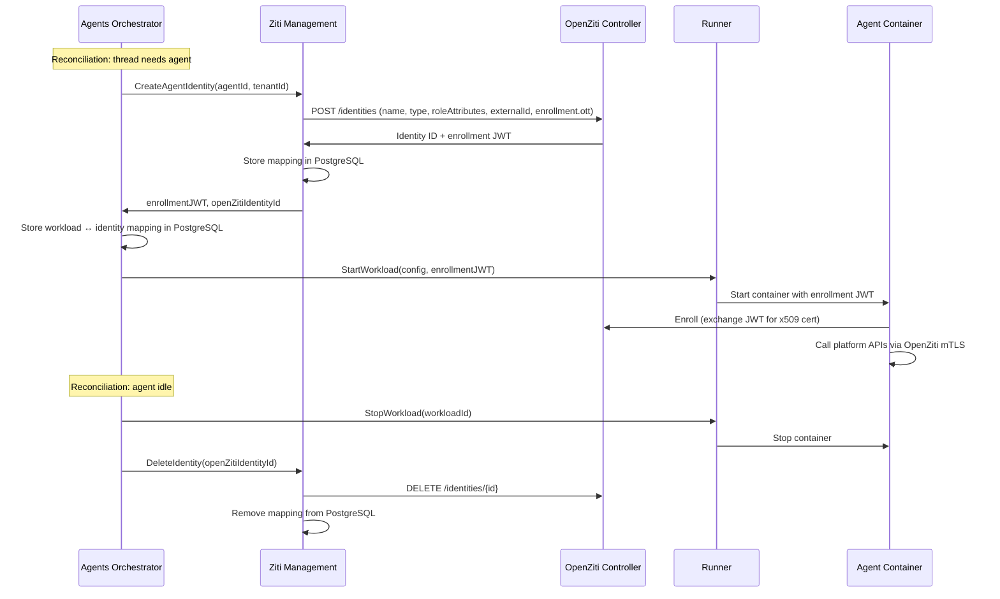
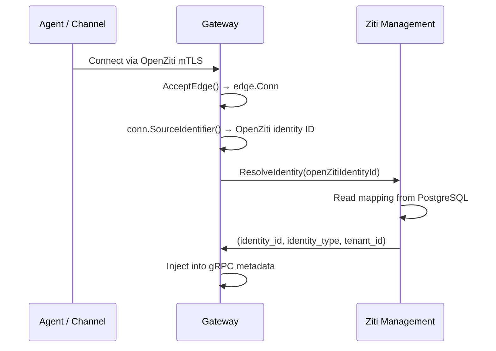

# OpenZiti Integration

## Overview

The platform uses [OpenZiti](https://openziti.io/) as its overlay network layer, providing:

- **Network-level identity** — Every agent, channel, runner, and orchestrator has a unique x509 certificate issued by the OpenZiti Controller.
- **mTLS transport** — All cross-boundary traffic uses mutual TLS. Identity is in the certificate, not in application-level tokens.
- **Service-level access control** — OpenZiti service policies determine which identities can reach which services (ABAC model using role attributes).

This document covers the **implementation** of OpenZiti integration: which service manages identities, how policies are structured, how the Gateway extracts identity, and how the Orchestrator handles identity lifecycle. For the conceptual design (identity types, enrollment flows, two-network-layer architecture), see [Authentication](authn.md).

## Ziti Management Service

All interactions with the OpenZiti Controller's Edge Management API are encapsulated in a dedicated **Ziti Management** service.

| Aspect | Detail |
|--------|--------|
| **Plane** | Data — executes operations it is told to perform, no reconciliation |
| **Consumers** | Agents Orchestrator (identity lifecycle), Gateway (identity resolution) |
| **External dependency** | OpenZiti Edge Management API (`/edge/management/v1/`) via the generated Go client (`openziti/edge-api`, package `rest_management_api_client`) |
| **Access to Controller** | Via Istio (in-cluster) — avoids circular dependency of using OpenZiti to manage OpenZiti |
| **Authentication** | Certificate-based auth using a long-lived infrastructure identity provisioned at deployment |
| **Data store** | PostgreSQL — stores identity mappings (OpenZiti identity ID ↔ platform identity ID, tenant ID, identity type) |

### Why a Separate Service

- The Orchestrator reconciles agent desired state. It calls Ziti Management as a side effect, same as it calls Runner. Isolating OpenZiti logic keeps the Orchestrator focused on lifecycle decisions.
- The Gateway needs identity resolution on the request hot path. It calls Ziti Management, which reads from PostgreSQL — no dependency on the OpenZiti Controller for every request.
- If OpenZiti's API changes, only one service changes.
- Future capabilities (user enrollment for CLI, agent-to-agent port sharing) will also route through this service, keeping all OpenZiti Controller interactions in one place.

### API Surface

| RPC | Caller | Description |
|-----|--------|-------------|
| `CreateAgentIdentity` | Orchestrator | Create an OpenZiti identity for an agent, return enrollment JWT |
| `DeleteIdentity` | Orchestrator | Delete an OpenZiti identity and its platform mapping |
| `ListManagedIdentities` | Orchestrator | List all identities managed by the platform (for reconciliation) |
| `ResolveIdentity` | Gateway | Map an OpenZiti identity ID to platform identity (identity_id, identity_type, tenant_id) |

### OpenZiti Controller Operations

| Operation | API Endpoint | When |
|-----------|-------------|------|
| Create identity | `POST /edge/management/v1/identities` | Agent start, runner/channel enrollment |
| Delete identity | `DELETE /edge/management/v1/identities/{id}` | Agent stop, identity cleanup |
| List identities | `GET /edge/management/v1/identities?filter=...` | Reconciliation |
| Update role attributes | `PATCH /edge/management/v1/identities/{id}` | Future: dynamic policy changes |
| Create service | `POST /edge/management/v1/services` | Future: agent-to-agent networking |
| Create service policy | `POST /edge/management/v1/service-policies` | Future: dynamic access grants |
| Delete service / policy | `DELETE /edge/management/v1/{type}/{id}` | Future: revoke dynamic access |

## Identity Management

### Who Manages Identities

The **Agents Orchestrator** manages the lifecycle of agent OpenZiti identities. The **Runner** is not involved in identity management — it receives the enrollment JWT as opaque configuration and passes it to the container.

This follows directly from the [Control Plane & Data Plane](control-data-plane.md) classification:

- The Orchestrator is control plane — it runs reconciliation loops and decides what should exist. Identity existence is a desired-state concern.
- The Runner is data plane — it executes what it is told. It has no reconciliation loop and no access to the OpenZiti Controller.

### Agent Identity Lifecycle



### Identity Creation Request

When Ziti Management creates an agent identity, it sends:

```json
{
  "name": "agent-<agentId>-<shortUuid>",
  "type": "Device",
  "isAdmin": false,
  "roleAttributes": ["agents", "tenant-<tenantId>", "agent-<agentId>"],
  "externalId": "<platformIdentityId>",
  "enrollment": { "ott": true }
}
```

| Field | Purpose |
|-------|---------|
| `name` | Human-readable, unique per identity. Includes agent ID for debugging |
| `type` | `Device` — represents a non-human endpoint |
| `roleAttributes` | Tags for ABAC policy matching. `agents` for static policies, `tenant-<tenantId>` and `agent-<agentId>` for future per-tenant/per-agent policies |
| `externalId` | Platform identity UUID — the link between OpenZiti identity and platform identity |
| `enrollment.ott` | One-time-token enrollment. Controller generates a JWT valid for 24 hours |

### Orphan Reconciliation

The Orchestrator's existing reconciliation loop handles orphaned identities (from Runner crashes, container crashes, or Orchestrator restarts):

1. Each reconciliation pass: Orchestrator calls `ZitiManagement.ListManagedIdentities()`.
2. Compares against active workloads from `Runner.FindWorkloadsByLabels()`.
3. Deletes OpenZiti identities that have no matching running workload via `ZitiManagement.DeleteIdentity()`.

This is the same reconciliation pattern used for agent workloads — no new mechanism needed. An orphaned identity with no running container is inert (it can't be used because the enrollment JWT has expired or the enrolled certificate is inside a stopped container), but cleanup is important for hygiene and OpenZiti Controller resource limits.

## Service Policies

OpenZiti uses an ABAC (Attribute-Based Access Control) model. Service policies match identities to services using **role attributes** (string tags). There are two policy types: **Dial** (connect to a service) and **Bind** (host a service).

### Role Attributes

| Identity Type | Role Attributes |
|---|---|
| Agent container | `["agents", "tenant-<tenantId>", "agent-<agentId>"]` |
| Channel | `["channels", "tenant-<tenantId>"]` |
| Runner | `["runners"]` |
| Orchestrator | `["orchestrators"]` |

The `tenant-<tenantId>` and `agent-<agentId>` attributes are assigned at creation time for future use in per-tenant and per-agent policies. They have no effect until matching service policies are created.

### Static Policies

Defined once at infrastructure provisioning (Terraform / bootstrap scripts). These cover baseline connectivity:

| Policy | Type | Identity Roles | Service Roles | Purpose |
|--------|------|---------------|---------------|---------|
| `agents-dial-gateway` | Dial | `#agents` | `@gateway` | All agents can reach Gateway |
| `channels-dial-gateway` | Dial | `#channels` | `@gateway` | All channels can reach Gateway |
| `orchestrators-dial-runners` | Dial | `#orchestrators` | `@runner` | Orchestrator can reach Runners |
| `gateway-bind` | Bind | `#gateway-hosts` | `@gateway` | Gateway hosts the `gateway` service |
| `runners-bind` | Bind | `#runners` | `@runner` | Runners host the `runner` service |

Edge router policies: `#all` identities → `#all` edge routers (no router-level segmentation needed).

### Dynamic Policies (Future)

The static policies above are sufficient for the current architecture. Future capabilities will require dynamic, per-agent or per-user policies managed at runtime by Ziti Management:

- **User-to-agent direct connection** — A user enrolls their machine via a CLI tool and connects directly to a specific agent over OpenZiti. Requires creating a per-agent service and scoped Dial/Bind policies at runtime.
- **Agent-to-agent private networking** — An agent exposes a port that only specific other agents can connect to. Requires creating a per-share service and scoped Dial/Bind policies at runtime.

OpenZiti supports this natively:

- **Role attributes are mutable.** `PATCH /edge/management/v1/identities/{id}` can update `roleAttributes` on an already-enrolled, connected identity. No re-enrollment needed.
- **Policy changes take effect immediately.** New service policies grant (or revoke) access for matching identities in real time.
- **Revocation closes live connections.** Removing a policy tears down existing connections, not just prevents new ones.

These capabilities mean dynamic policies can be applied to already-running agents without restart. The Ziti Management service API will be extended with RPCs for port sharing and user enrollment when these features are implemented.

## Gateway Identity Extraction

The Gateway binds an OpenZiti service and extracts the caller's identity from each incoming connection.

### Flow



### Implementation

1. Gateway starts, loads its OpenZiti identity, calls `ctx.ListenWithOptions("gateway", ...)`.
2. On each incoming connection: `conn, _ := listener.AcceptEdge()`.
3. `conn.SourceIdentifier()` returns the dialing identity's name and ID. This is set by the OpenZiti router at circuit creation time — it is not self-asserted by the client and is therefore trustworthy.
4. Gateway calls `ZitiManagement.ResolveIdentity(openZitiIdentityId)`. Ziti Management reads the mapping from PostgreSQL (written when the identity was created). Returns `(identity_id, identity_type, tenant_id)`.
5. Gateway injects these values into gRPC metadata for downstream services — same format as OIDC-authenticated user requests.

### Caching

Ziti Management can cache resolved identities in-memory with a short TTL. Identity mappings are immutable for the lifetime of an OpenZiti identity — the cache only needs invalidation when an identity is deleted.

## Tenant Metadata

OpenZiti identities do **not** carry tenant metadata for resolution purposes. The canonical resolution path is:

```
OpenZiti identity ID → ZitiManagement.ResolveIdentity() → PostgreSQL → (identity_id, identity_type, tenant_id)
```

The `tenant-<tenantId>` role attribute on identities exists for OpenZiti's own ABAC policy matching (future per-tenant policies), not for platform identity resolution.

## Internal Identity Propagation

After Gateway authenticates a request (OIDC for users, OpenZiti for agents/channels/runners), it injects the resolved identity into gRPC metadata:

| Metadata Key | Type | Description |
|-------------|------|-------------|
| `x-identity-id` | string (UUID) | Platform identity ID |
| `x-identity-type` | string | `user`, `agent`, `channel`, `runner` |
| `x-tenant-id` | string (UUID) | Tenant ID |

All internal services read these keys from incoming gRPC metadata. Services trust these values because:

- Internal traffic is Istio mTLS (only verified cluster services can call each other).
- Istio `AuthorizationPolicy` restricts which ServiceAccounts can call which services.
- The Gateway is the only service that sets these headers; internal services read and forward them.

## External Runner Enrollment

External runners use the same service token flow as internal runners. The Ziti Management service handles the OpenZiti identity creation step:

1. Admin creates a Runner resource in the platform. The system generates a service token.
2. Operator configures the external runner with the service token.
3. Runner presents the token to the platform enrollment endpoint.
4. Platform validates the token → calls `ZitiManagement.CreateRunnerIdentity(runnerId)`.
5. Ziti Management creates an OpenZiti identity with `roleAttributes: ["runners"]`, returns enrollment JWT.
6. Platform returns the JWT to the Runner. Runner enrolls with the OpenZiti Controller.
7. All subsequent communication uses mTLS. The service token is no longer needed.

Internal and external runners are identical from the platform's perspective. External runners simply have all traffic routed through the OpenZiti overlay (no Istio mesh).

## Agent Access Scope

Agents connect to the **Gateway only**, regardless of runner location (internal or external). The static service policy `agents-dial-gateway` grants all agents Dial access to the `gateway` service. No other OpenZiti services are dialable by agents.

| Connection | Layer |
|------------|-------|
| Agent → Gateway | OpenZiti |
| Gateway → internal services | Istio |

The Gateway routes agent requests to internal services (Threads, Files, etc.) via Istio. Agents never connect directly to internal services.

## OpenZiti Identities Summary

| Identity | Lifecycle | Managed By | Calls via OpenZiti |
|----------|-----------|-----------|--------------------|
| Agents Orchestrator | Persistent (enrolled once) | Infrastructure provisioning | Runner |
| Runner | Persistent (enrolled via service token) | Ziti Management (on enrollment) | — (receives work, doesn't dial) |
| Agent container | Ephemeral (per container) | Orchestrator via Ziti Management | Gateway |
| Channel | Persistent (enrolled via service token) | Ziti Management (on enrollment) | Gateway |
| Ziti Management | Persistent (enrolled once) | Infrastructure provisioning | OpenZiti Controller (via Istio, not overlay) |
| Gateway | Persistent (enrolled once) | Infrastructure provisioning | — (binds service, doesn't dial) |
