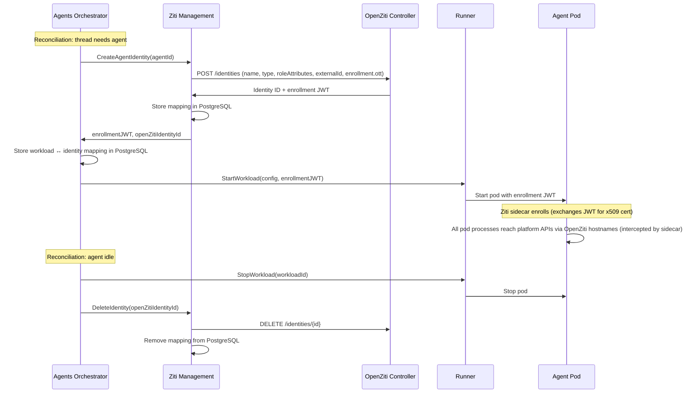
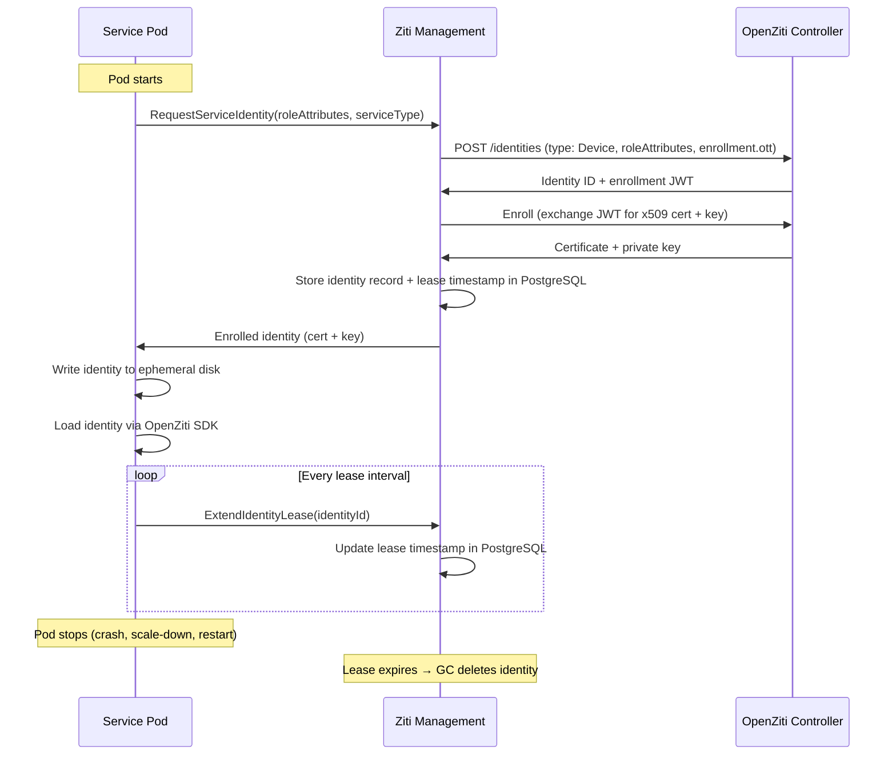
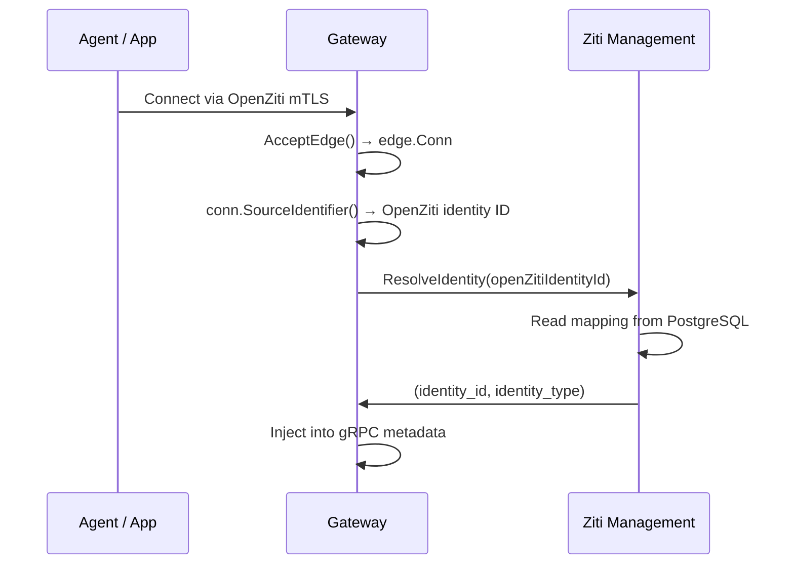
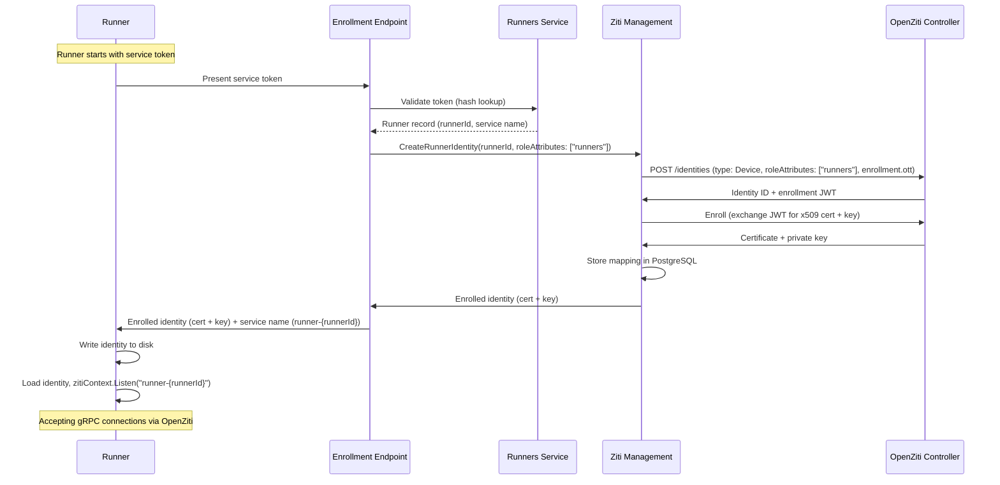
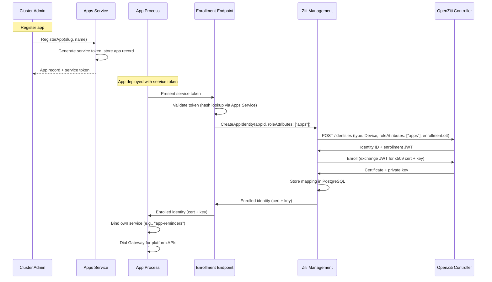

# OpenZiti Integration

## Overview

The platform uses [OpenZiti](https://openziti.io/) as its overlay network layer, providing:

- **Network-level identity** — Every agent, runner, app, and orchestrator has a unique x509 certificate issued by the OpenZiti Controller.
- **mTLS transport** — All cross-boundary traffic uses mutual TLS. Identity is in the certificate, not in application-level tokens.
- **Service-level access control** — OpenZiti service policies determine which identities can reach which services (ABAC model using role attributes).

This document covers the **implementation** of OpenZiti integration: which service manages identities, how policies are structured, how the Gateway extracts identity, and how the Orchestrator handles identity lifecycle. For the conceptual design (identity types, enrollment flows, two-network-layer architecture), see [Authentication](authn.md).

## SDK Embedding

**Infrastructure services** that participate in both the Istio mesh and the OpenZiti overlay embed the **OpenZiti Go SDK** ([`openziti/sdk-golang`](https://github.com/openziti/sdk-golang)) directly in the application process. This avoids deploying an OpenZiti sidecar alongside the Istio sidecar, which would create conflicts over outbound traffic routing.

**Agent pods** are not in the Istio mesh. They use a **Ziti sidecar container** within the pod that enrolls the agent's OpenZiti identity, runs DNS for OpenZiti service hostnames, and transparently intercepts traffic via iptables TPROXY. This makes hostnames like `gateway.ziti` and `llm-proxy.ziti` reachable as normal network addresses inside the pod. See [Agent Access Scope](#agent-access-scope).

The OpenZiti Go SDK implements Go's standard `net.Listener` and `net.Conn` interfaces. A gRPC server accepts connections from an OpenZiti listener the same way it accepts from a TCP listener. A gRPC client dials through an OpenZiti context the same way it dials a TCP address.

| Service | SDK Role | How |
|---------|----------|-----|
| **Runner** | Bind (server) | `zitiContext.Listen("runner-{runnerId}")` → `grpcServer.Serve(listener)` |
| **Agents Orchestrator** | Dial (client) | `zitiContext.Dial("runner-{runnerId}")` → gRPC client connection |
| **Gateway** | Bind (server) | `zitiContext.ListenWithOptions("gateway", ...)` → accept connections |
| **LLM Proxy** | Bind (server) | `zitiContext.ListenWithOptions("llm-proxy", ...)` → accept connections |
| **Tracing** | Bind (server) | `zitiContext.ListenWithOptions("tracing", ...)` → accept connections |

Agent pods do not embed the OpenZiti SDK. Instead, a **Ziti sidecar** runs alongside the agent process within the same pod. See [Agent Access Scope](#agent-access-scope).

The Orchestrator, Gateway, and LLM Proxy obtain their OpenZiti identities at runtime via self-enrollment through the [Ziti Management](#ziti-management-service) service. Runners and Apps obtain their identities via the service token enrollment flow — see [Runner Provisioning](#runner-provisioning) and [App Identity Lifecycle](#app-identity-lifecycle). See [Service Identity Self-Enrollment](#service-identity-self-enrollment) and [Authentication](authn.md#enrollment).

## Ziti Management Service

All interactions with the OpenZiti Controller's Edge Management API are encapsulated in a dedicated **Ziti Management** service.

| Aspect | Detail |
|--------|--------|
| **Plane** | Data — executes operations it is told to perform; runs identity lease GC |
| **Consumers** | Agents Orchestrator (agent identity lifecycle), Gateway (identity resolution), Orchestrator / Gateway (service identity self-enrollment), Enrollment endpoint (runner/app enrollment) |
| **External dependency** | OpenZiti Edge Management API (`/edge/management/v1/`) via the generated Go client (`openziti/edge-api`, package `rest_management_api_client`) |
| **Access to Controller** | Via Istio (in-cluster) — avoids circular dependency of using OpenZiti to manage OpenZiti |
| **Authentication** | Certificate-based auth using a long-lived infrastructure credential provisioned at deployment |
| **Data store** | PostgreSQL — stores identity mappings (OpenZiti identity ID ↔ platform identity ID, identity type) and lease timestamps for service identities |

### Why a Separate Service

- The Orchestrator reconciles agent desired state. It calls Ziti Management as a side effect, same as it calls Runner. Isolating OpenZiti logic keeps the Orchestrator focused on lifecycle decisions.
- The Gateway needs identity resolution on the request hot path. It calls Ziti Management, which reads from PostgreSQL — no dependency on the OpenZiti Controller for every request.
- If OpenZiti's API changes, only one service changes.
- Infrastructure services (Orchestrator, Gateway) self-enroll through Ziti Management at startup, keeping all OpenZiti Controller interactions in one place.
- The enrollment endpoint delegates identity creation to Ziti Management for runners and apps.
- Future capabilities (user enrollment for CLI, agent-to-agent port sharing) will also route through this service.

### API Surface

| RPC | Caller | Description |
|-----|--------|-------------|
| `CreateAgentIdentity` | Orchestrator | Create an OpenZiti identity for an agent, return enrollment JWT |
| `CreateRunnerIdentity` | Enrollment endpoint | Create and enroll an OpenZiti identity for a runner, return enrolled identity (cert + key) and service name |
| `CreateAppIdentity` | Enrollment endpoint | Create and enroll an OpenZiti identity for an app, return enrolled identity (cert + key) |
| `DeleteIdentity` | Orchestrator | Delete an OpenZiti identity and its platform mapping |
| `ListManagedIdentities` | Orchestrator | List all identities managed by the platform (for reconciliation) |
| `ResolveIdentity` | Gateway | Map an OpenZiti identity ID to platform identity (identity_id, identity_type) |
| `RequestServiceIdentity` | Orchestrator, Gateway | Create and enroll an OpenZiti identity for the calling service, return enrolled identity (cert + key) |
| `ExtendIdentityLease` | Orchestrator, Gateway | Extend the lease on a service identity |

### OpenZiti Controller Operations

| Operation | API Endpoint | When |
|-----------|-------------|------|
| Create identity | `POST /edge/management/v1/identities` | Agent start, service self-enrollment, runner/app enrollment |
| Enroll identity | Controller enrollment endpoint | Service identity self-enrollment, runner/app enrollment (Ziti Management enrolls on behalf of the caller) |
| Delete identity | `DELETE /edge/management/v1/identities/{id}` | Agent stop, identity cleanup, lease GC |
| List identities | `GET /edge/management/v1/identities?filter=...` | Reconciliation, lease GC |
| Update role attributes | `PATCH /edge/management/v1/identities/{id}` | Future: dynamic policy changes |
| Create service | `POST /edge/management/v1/services` | Runner registration, app registration |
| Delete service | `DELETE /edge/management/v1/services/{id}` | Runner deletion, app deletion |
| Create service policy | `POST /edge/management/v1/service-policies` | Future: dynamic access grants |
| Delete service / policy | `DELETE /edge/management/v1/{type}/{id}` | Future: revoke dynamic access |

### Identity Lease GC

Ziti Management runs a background loop that garbage-collects expired service identities:

1. Each pass: query PostgreSQL for service identities whose lease has expired (no `ExtendIdentityLease` call within the configured TTL).
2. Delete the expired OpenZiti identity on the Controller via `DELETE /edge/management/v1/identities/{id}`.
3. Remove the identity record from PostgreSQL.

This is a separate concern from the Orchestrator's agent identity reconciliation. The Orchestrator reconciles agent identities against running workloads. Ziti Management GC handles service identities (Orchestrator, Gateway) based purely on lease expiry — it does not query Runner or any other service.

Expired identities are inert — the pod that held the enrolled certificate has already stopped (otherwise it would have extended the lease). GC is important for hygiene and OpenZiti Controller resource limits.

## Identity Management

### Who Manages Identities

Three identity lifecycle patterns coexist:

- **Agent identities** — managed by the **Agents Orchestrator**. The Orchestrator creates and deletes agent identities via Ziti Management as part of its reconciliation loop. The Runner is not involved in identity management — it receives the enrollment JWT as opaque configuration and passes it to the agent pod's Ziti sidecar container.
- **Service identities** — self-managed by each infrastructure service (Orchestrator, Gateway). Each pod requests its own identity from Ziti Management at startup and extends the lease on a timer. See [Service Identity Self-Enrollment](#service-identity-self-enrollment).
- **Runner and App identities** — provisioned via the enrollment endpoint using a service token. Runners and Apps present their service token on startup, the enrollment endpoint creates the OpenZiti identity via Ziti Management, and returns the enrolled credentials. See [Runner Provisioning](#runner-provisioning) and [App Identity Lifecycle](#app-identity-lifecycle).

The agent identity pattern follows directly from the [Control Plane & Data Plane](control-data-plane.md) classification: the Orchestrator is control plane (decides what should exist), the Runner is data plane (executes what it is told).

### Agent Identity Lifecycle



### Identity Creation Request

When Ziti Management creates an agent identity, it sends:

```json
{
  "name": "agent-<agentId>-<shortUuid>",
  "type": "Device",
  "isAdmin": false,
  "roleAttributes": ["agents", "agent-<agentId>"],
  "externalId": "<platformIdentityId>",
  "enrollment": { "ott": true }
}
```

| Field | Purpose |
|-------|---------|
| `name` | Human-readable, unique per identity. Includes agent ID for debugging |
| `type` | `Device` — represents a non-human endpoint |
| `roleAttributes` | Tags for ABAC policy matching. `agents` for static policies, `agent-<agentId>` for future per-agent policies |
| `externalId` | Platform identity UUID — the link between OpenZiti identity and platform identity |
| `enrollment.ott` | One-time-token enrollment. Controller generates a JWT valid for 24 hours |

### Orphan Reconciliation

The Orchestrator's existing reconciliation loop handles orphaned identities (from Runner crashes, pod crashes, or Orchestrator restarts):

1. Each reconciliation pass: Orchestrator calls `ZitiManagement.ListManagedIdentities()`.
2. Compares against active workloads from `Runner.FindWorkloadsByLabels()`.
3. Deletes OpenZiti identities that have no matching running workload via `ZitiManagement.DeleteIdentity()`.

This is the same reconciliation pattern used for agent workloads — no new mechanism needed. An orphaned identity with no running pod is inert (it can't be used because the enrollment JWT has expired or the enrolled certificate is inside a stopped pod), but cleanup is important for hygiene and OpenZiti Controller resource limits.

## Service Identity Self-Enrollment

Infrastructure services that participate in the OpenZiti overlay (Orchestrator, Gateway) obtain their OpenZiti identities at runtime by self-enrolling through Ziti Management.

### Design

- **Ephemeral identities** — each pod gets a new OpenZiti identity on startup. The identity is not shared across replicas or preserved across restarts.
- **In-process enrollment** — the service calls Ziti Management over Istio (in-cluster gRPC). Ziti Management creates the identity on the Controller, enrolls it, and returns the enrolled identity (certificate + key) to the caller.
- **Ephemeral disk storage** — the enrolled identity is written to ephemeral disk (emptyDir or tmpfs) so the OpenZiti SDK can load it as a file. The identity does not survive pod restart.
- **Lease-based lifecycle** — the service extends its lease on a timer. Ziti Management garbage-collects identities whose lease expires. This makes the system eventually consistent — no coordination required between pods and Ziti Management beyond the heartbeat.

### Flow



### Service-Specific Behavior

| Service | Role Attributes | After enrollment |
|---------|----------------|-----------------|
| **Agents Orchestrator** | `["orchestrators"]` | `zitiContext.Dial("runner-{runnerId}")` — dials runners |
| **Gateway** | `["gateway-hosts"]` | `zitiContext.ListenWithOptions("gateway", ...)` — binds the `gateway` service |
| **LLM Proxy** | `["llm-proxy-hosts"]` | `zitiContext.ListenWithOptions("llm-proxy", ...)` — binds the `llm-proxy` service |
| **Tracing** | `["tracing-hosts"]` | `zitiContext.ListenWithOptions("tracing", ...)` — binds the `tracing` service |

## Service Policies

OpenZiti uses an ABAC (Attribute-Based Access Control) model. Service policies match identities to services using **role attributes** (string tags). There are two policy types: **Dial** (connect to a service) and **Bind** (host a service).

### Role Attributes

| Identity Type | Role Attributes |
|---|---|
| Agent pod (Ziti sidecar) | `["agents", "agent-<agentId>"]` |
| Runner | `["runners"]` |
| Orchestrator | `["orchestrators"]` |
| App | `["apps"]` |
| LLM Proxy | `["llm-proxy-hosts"]` |
| Tracing | `["tracing-hosts"]` |

The `agent-<agentId>` attribute is assigned at creation time for future use in per-agent policies. It has no effect until matching service policies are created.

### Static Policies

Defined once at infrastructure provisioning (Terraform / bootstrap scripts). These cover baseline connectivity:

| Policy | Type | Identity Roles | Service Roles | Purpose |
|--------|------|---------------|---------------|---------|
| `agents-dial-gateway` | Dial | `#agents` | `@gateway` | All agents can reach Gateway |
| `orchestrators-dial-runners` | Dial | `#orchestrators` | `#runner-services` | Orchestrator can reach any runner |
| `gateway-bind` | Bind | `#gateway-hosts` | `@gateway` | Gateway hosts the `gateway` service |
| `runners-bind` | Bind | `#runners` | `#runner-services` | Runners host their own services |
| `agents-dial-llm-proxy` | Dial | `#agents` | `@llm-proxy` | All agents can reach LLM Proxy |
| `llm-proxy-bind` | Bind | `#llm-proxy-hosts` | `@llm-proxy` | LLM Proxy hosts the `llm-proxy` service |
| `agents-dial-tracing` | Dial | `#agents` | `@tracing` | All agents can reach Tracing service |
| `tracing-bind` | Bind | `#tracing-hosts` | `@tracing` | Tracing service hosts the `tracing` service |
| `apps-dial-gateway` | Dial | `#apps` | `@gateway` | Apps can reach Gateway |
| `apps-bind` | Bind | `#apps` | `#app-services` | Apps host their own services |
| `gateway-dial-apps` | Dial | `#gateway-hosts` | `#app-services` | Gateway can reach apps |

Edge router policies: `#all` identities → `#all` edge routers (no router-level segmentation needed).

Static policies, services, and edge router policies are provisioned by Terraform at bootstrap. Identity provisioning is handled separately via [self-enrollment](#service-identity-self-enrollment) or [service token enrollment](#runner-provisioning) — policies match identities by role attributes, not by specific identity references.

### Dynamic Policies (Future)

The static policies above are sufficient for the current architecture. Future capabilities will require dynamic, per-agent or per-user policies managed at runtime by Ziti Management:

- **User-to-agent direct connection** — A user enrolls their machine via a CLI tool and connects directly to a specific agent over OpenZiti. Requires creating a per-agent service and scoped Dial/Bind policies at runtime.
- **Agent-to-agent private networking** — An agent exposes a port that only specific other agents can connect to. Requires creating a per-share service and scoped Dial/Bind policies at runtime.

OpenZiti supports this natively:

- **Role attributes are mutable.** `PATCH /edge/management/v1/identities/{id}` can update `roleAttributes` on an already-enrolled, connected identity. No re-enrollment needed.
- **Policy changes take effect immediately.** New service policies grant (or revoke) access for matching identities in real time.
- **Revocation closes live connections.** Removing a policy tears down existing connections, not just prevents new ones.

These capabilities mean dynamic policies can be applied to already-running agents without restart. The Ziti Management service API will be extended with RPCs for port sharing and user enrollment when these features are implemented.

## Gateway Identity Extraction

The Gateway binds an OpenZiti service and extracts the caller's identity from each incoming connection.

### Flow



### Implementation

1. Gateway starts, obtains its OpenZiti identity via [self-enrollment](#service-identity-self-enrollment), calls `ctx.ListenWithOptions("gateway", ...)`.
2. On each incoming connection: `conn, _ := listener.AcceptEdge()`.
3. `conn.SourceIdentifier()` returns the dialing identity's name and ID. This is set by the OpenZiti router at circuit creation time — it is not self-asserted by the client and is therefore trustworthy.
4. Gateway calls `ZitiManagement.ResolveIdentity(openZitiIdentityId)`. Ziti Management reads the mapping from PostgreSQL (written when the identity was created). Returns `(identity_id, identity_type)`.
5. Gateway injects these values into gRPC metadata for downstream services — same format as OIDC-authenticated user requests.

### Caching

Ziti Management can cache resolved identities in-memory with a short TTL. Identity mappings are immutable for the lifetime of an OpenZiti identity — the cache only needs invalidation when an identity is deleted.

## Identity Resolution

The canonical resolution path for OpenZiti identities is:

```
OpenZiti identity ID → ZitiManagement.ResolveIdentity() → PostgreSQL → (identity_id, identity_type)
```

Organization context is not part of the OpenZiti identity. Services that need organization context accept `organization_id` as a request parameter. See [Organizations — Request Flow](organizations.md#request-flow).

## Internal Identity Propagation

After Gateway authenticates a request (OIDC for users, OpenZiti for agents/runners/apps), it injects the resolved identity into gRPC metadata:

| Metadata Key | Type | Description |
|-------------|------|-------------|
| `x-identity-id` | string (UUID) | Platform identity ID |
| `x-identity-type` | string | `user`, `agent`, `runner`, `app` |

All internal services read these keys from incoming gRPC metadata. Services trust these values because:

- Internal traffic is Istio mTLS (only verified cluster services can call each other).
- Istio `AuthorizationPolicy` restricts which ServiceAccounts can call which services.
- The Gateway is the only service that sets these headers; internal services read and forward them.

## Runner Provisioning

All runners use the same provisioning model: register via Terraform provider or CLI, receive a service token, enroll on startup. There is no internal/external distinction — the protocol is uniform regardless of where the runner is deployed.

### Registration

When a runner is registered via `RegisterRunner` (Terraform provider or `agyn` CLI), the [Runners](runners.md) service:

1. Creates the runner record with a UUID.
2. Creates a per-runner OpenZiti service `runner-{runnerId}` with `roleAttributes: ["runner-services"]` via Ziti Management.
3. Registers the runner's identity in the [Identity](identity.md) service with `identity_type: runner`.
4. Writes authorization tuples granting the runner its permissions.
5. Generates a service token, stores the runner record, and returns the token.

The per-runner OpenZiti service enables callers (Orchestrator, Terminal Proxy) to dial a specific runner by service name. Static policies match the `#runner-services` role attribute — no per-runner policy creation is needed.

### Enrollment



The service token is long-lived and reusable. If the runner restarts, it re-enrolls with the same token and receives a new OpenZiti identity. The previous identity is cleaned up by Ziti Management lease GC.

The enrollment response includes the service name (`runner-{runnerId}`) that the runner must bind. The runner does not need any additional configuration to learn its service name.

### Deletion

`DeleteRunner` cleans up all associated resources:

1. Deletes the per-runner OpenZiti service (`runner-{runnerId}`) via Ziti Management.
2. Revokes the runner's OpenZiti identity via Ziti Management.
3. Removes the runner record from the Runners service database.

### Addressing

The Orchestrator and Terminal Proxy reach a specific runner by dialing its per-runner OpenZiti service:

- Orchestrator: `zitiContext.Dial("runner-{runnerId}")` — selected during workload scheduling.
- Terminal Proxy: resolves `runner_id` from the [Runners](runners.md) service workload record, then dials `runner-{runnerId}`.

## Agent Access Scope

Agents connect to the **Gateway**, the **[LLM Proxy](llm-proxy.md)**, and the **[Tracing](tracing.md)** service, regardless of runner location. The static service policies `agents-dial-gateway`, `agents-dial-llm-proxy`, and `agents-dial-tracing` grant all agents Dial access to the `gateway`, `llm-proxy`, and `tracing` services respectively. No other OpenZiti services are dialable by agents.

Agent pods run a **Ziti sidecar container** that enrolls the agent's OpenZiti identity and configures transparent access to OpenZiti services. The sidecar runs a DNS server on `127.0.0.1` that resolves OpenZiti service hostnames (for example, `gateway.ziti`, `llm-proxy.ziti`, `tracing.ziti`) to `100.64.0.0/10` addresses and installs iptables TPROXY rules that intercept those connections and tunnel them over OpenZiti. This means `agynd`, agent CLI subprocesses (Codex CLI, Claude Code, `agn`), and any other process in the pod can reach Gateway, LLM Proxy, and Tracing using standard hostnames and HTTP clients — no embedded SDK required. The sidecar handles enrollment, mTLS termination, and identity lifecycle within the pod.

| Connection | Layer |
|------------|-------|
| Agent → Gateway | OpenZiti |
| Agent → LLM Proxy | OpenZiti |
| Agent → Tracing | OpenZiti |
| Gateway → internal services | Istio |
| LLM Proxy → internal services | Istio |
| Tracing → internal services | Istio |

The Gateway routes agent requests to internal services (Threads, Files, etc.) via Istio. The LLM Proxy handles LLM API calls — it resolves models via the LLM service and forwards requests to external providers. The Tracing service receives span data from agents — the [`agynd` tracing proxy](tracing.md#agynd-tracing-proxy) enriches spans with platform context before forwarding.

## OpenZiti Identities Summary

| Identity | Lifecycle | Provisioning | Calls via OpenZiti |
|----------|-----------|--------------|--------------------|
| Agents Orchestrator | Ephemeral (per pod) | Self-enrollment via Ziti Management | Runner (dial) |
| Runner | Persistent (enrolled via service token) | Service token (Terraform/CLI → enrollment endpoint) | — (binds `runner-{runnerId}` service) |
| Agent pod (Ziti sidecar) | Ephemeral (per pod) | Orchestrator via Ziti Management | Gateway (dial), LLM Proxy (dial), Tracing (dial) |
| App | Persistent (enrolled via service token) | Service token (Terraform/CLI → enrollment endpoint) | Gateway (dial) + own service (bind) |
| Ziti Management | N/A — no OpenZiti network identity | Controller API credential (Terraform) | OpenZiti Controller (via Istio, not overlay) |
| Gateway | Ephemeral (per pod) | Self-enrollment via Ziti Management | — (binds `gateway` service) |
| LLM Proxy | Ephemeral (per pod) | Self-enrollment via Ziti Management | — (binds `llm-proxy` service) |
| Tracing | Ephemeral (per pod) | Self-enrollment via Ziti Management | — (binds `tracing` service) |

## App Identity Lifecycle

[Apps](apps.md) connect to the OpenZiti overlay to both bind their own service (receive commands from Gateway) and dial the Gateway (call platform APIs). App identities are created by the [Apps Service](apps-service.md) via Ziti Management during app registration.

### Flow



This follows the same pattern as [runner enrollment](#runner-provisioning). The service token is long-lived — if the app restarts, it re-enrolls and receives a new OpenZiti identity.

### Identity Creation Request

```json
{
  "name": "app-<slug>-<shortUuid>",
  "type": "Device",
  "isAdmin": false,
  "roleAttributes": ["apps"],
  "externalId": "<platformIdentityId>",
  "enrollment": { "ott": true }
}
```

`Device` is the standard OpenZiti type for non-human identities — same as agents and runners.

### Ziti Management API Addition

| RPC | Caller | Description |
|-----|--------|-------------|
| `CreateAppIdentity` | Enrollment endpoint | Create and enroll an OpenZiti identity for an app, return enrolled identity (cert + key) |

This follows the same pattern as runner enrollment — Ziti Management creates the identity, enrolls it on behalf of the caller, and returns the enrolled credentials.

### OpenZiti Service per App

Each app binds its own OpenZiti service (named `app-{slug}`). The service is created at registration time:

| Operation | When |
|-----------|------|
| `POST /edge/management/v1/services` | App registration — creates the app's service (e.g., `app-reminders`) with `roleAttributes: ["app-services"]` |
| `DELETE /edge/management/v1/services/{id}` | App deletion — removes the service |

### Updated Role Attributes Table

| Identity Type | Role Attributes |
|---|---|
| Agent pod (Ziti sidecar) | `["agents", "agent-<agentId>"]` |
| Runner | `["runners"]` |
| Orchestrator | `["orchestrators"]` |
| App | `["apps"]` |
| Tracing | `["tracing-hosts"]` |

### Updated Identities Summary

| Identity | Lifecycle | Provisioning | Calls via OpenZiti |
|----------|-----------|--------------|--------------------|
| App | Persistent (enrolled via service token) | Apps Service via Ziti Management | Gateway (dial) + own service (bind) |
