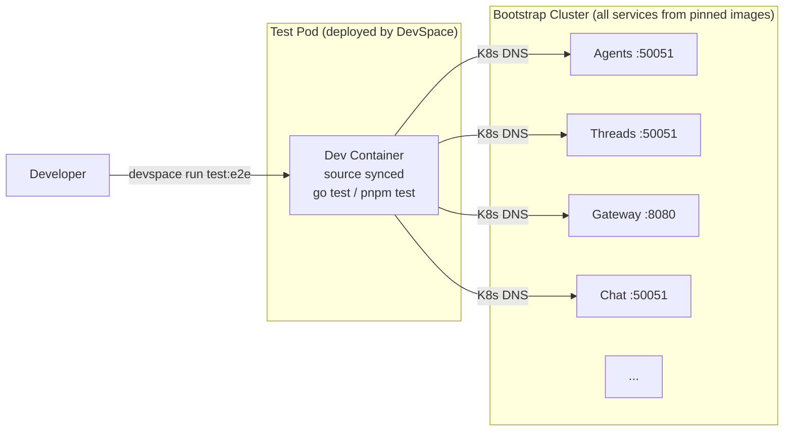

# E2E Testing

E2E tests run inside the cluster in a dedicated test pod, separate from the service. Each service repository contains tests in `test/e2e/`. DevSpace deploys a standalone test pod, syncs the test source code into it, and executes the tests there. The service pods run from their pinned release images — untouched. The test pod connects to services via Kubernetes DNS.

## How It Works

DevSpace deploys a dedicated test pod using [`component-chart`](https://devspace.sh/component-chart/docs/introduction) — a generic Helm chart provided by DevSpace for deploying containers without writing custom chart templates. This pod runs a dev container image with `sleep infinity`, giving DevSpace a target to sync source code into and exec test commands against. The service deployments managed by ArgoCD are untouched — they keep running their pinned release images.



The test process runs inside the cluster but in its own pod. It resolves services through Kubernetes DNS the same way production services do. The service pods are never patched, restarted, or modified.

## Developer Workflow

Two commands. Two separate concerns:

```bash
# Service development (existing workflow — patches service pod, syncs source, hot-reload)
devspace dev

# E2E tests (separate test pod — services run from pinned images)
devspace run test:e2e
```

`devspace dev` is the existing service development loop. It patches the service pod with a dev container, syncs source, and runs the service with hot-reload. It is not required for E2E tests.

`devspace run test:e2e` is self-contained. It deploys a test pod, syncs source, runs tests, and cleans up. The cluster runs all services from their released images — the test verifies the real deployed behavior.

## Repository Structure

Each service repository follows this structure for E2E tests:

```
agynio/<service>/
├── devspace.yaml           # DevSpace config with test:e2e command
├── test/
│   └── e2e/
│       ├── main_test.go    # TestMain: setup/teardown
│       ├── <feature>_test.go
│       └── testdata/       # Fixtures (optional)
└── ...
```

No `Dockerfile.e2e`. No Helm test hooks. No test images to build or push. DevSpace deploys a dev container, syncs test source, and runs tests directly.

## DevSpace Configuration

The `devspace.yaml` defines:
1. A `deployments.e2e-runner` section that deploys a standalone test pod using `component-chart`.
2. A `dev.e2e-runner` section that syncs source into the test pod.
3. A `pipelines.test:e2e` pipeline that orchestrates: deploy → sync → run tests → cleanup.
4. A `commands.test:e2e` command as the user-facing entrypoint.

### Go Service Example

```yaml
# devspace.yaml (Go service, e.g. agents)
version: v2beta1

vars:
  SERVICE_NAMESPACE: platform
  E2E_IMAGE: ghcr.io/agynio/devcontainer-go:1

deployments:
  e2e-runner:
    namespace: ${SERVICE_NAMESPACE}
    helm:
      chart:
        name: component-chart
        repo: https://charts.devspace.sh
      values:
        containers:
          - image: ${E2E_IMAGE}
        labels:
          app.kubernetes.io/name: agents-e2e

dev:
  e2e-runner:
    namespace: ${SERVICE_NAMESPACE}
    labelSelector:
      app.kubernetes.io/name: agents-e2e
    command: ["sleep", "infinity"]
    workingDir: /opt/app/data
    sync:
      - path: ./:/opt/app/data
        excludePaths:
          - .git/
          - .devspace/

pipelines:
  test:e2e:
    run: |-
      create_deployments e2e-runner
      start_dev e2e-runner &
      sleep 5
      exec_container \
        --label-selector "app.kubernetes.io/name=agents-e2e" \
        -n ${SERVICE_NAMESPACE} \
        -- bash -c 'cd /opt/app/data && go test -v -count=1 ./test/e2e/'
      EXIT_CODE=$?
      stop_dev e2e-runner
      purge_deployments e2e-runner
      exit $EXIT_CODE

  # Existing service dev pipeline (unchanged)
  dev: |-
    # ... (standard DevSpace dev pipeline: pause ArgoCD, patch deployment, start_dev)
```

Usage:

```bash
# Run E2E tests (self-contained — deploys test pod, runs tests, cleans up)
devspace run-pipeline test:e2e

# Run specific test
devspace run-pipeline test:e2e  # then pass args via env or override
```

For convenience, wrap in a command:

```yaml
commands:
  test:e2e: |-
    devspace run-pipeline test:e2e $@
```

Then:

```bash
devspace run test:e2e
```

### TypeScript Service Example

Same pattern, using a Node.js dev container:

```yaml
vars:
  SERVICE_NAMESPACE: platform
  E2E_IMAGE: ghcr.io/agynio/devcontainer-node:1

deployments:
  e2e-runner:
    namespace: ${SERVICE_NAMESPACE}
    helm:
      chart:
        name: component-chart
        repo: https://charts.devspace.sh
      values:
        containers:
          - image: ${E2E_IMAGE}
        labels:
          app.kubernetes.io/name: docker-runner-e2e

dev:
  e2e-runner:
    namespace: ${SERVICE_NAMESPACE}
    labelSelector:
      app.kubernetes.io/name: docker-runner-e2e
    command: ["sleep", "infinity"]
    workingDir: /opt/app/data
    sync:
      - path: ./:/opt/app/data
        excludePaths:
          - .git/
          - .devspace/
          - node_modules/

pipelines:
  test:e2e:
    run: |-
      create_deployments e2e-runner
      start_dev e2e-runner &
      sleep 5
      exec_container \
        --label-selector "app.kubernetes.io/name=docker-runner-e2e" \
        -n ${SERVICE_NAMESPACE} \
        -- bash -c 'cd /opt/app/data && pnpm install --frozen-lockfile && pnpm test:e2e'
      EXIT_CODE=$?
      stop_dev e2e-runner
      purge_deployments e2e-runner
      exit $EXIT_CODE
```

### Dev Container Image Choice

The dev container image for the test pod is not fixed — it depends on the test language and toolchain:

| Test language | Dev container image | Notes |
|--------------|-------------------|-------|
| Go | `ghcr.io/agynio/devcontainer-go:1` | Has Go toolchain, buf, air |
| TypeScript | `ghcr.io/agynio/devcontainer-node:1` | Has Node.js, pnpm, tsx |
| Playwright (UI) | Custom or `mcr.microsoft.com/playwright:*` | Needs headless Chromium |

The image is set via the `E2E_IMAGE` variable in `devspace.yaml`. Each service chooses what fits its test stack.

## Test Code

### Go Services

Go services use the standard `go test` runner with the project's existing test libraries (`testify`, gRPC client stubs generated from `buf.build/agynio/api`).

The key difference from the existing integration tests (like `agynio/agents/test/e2e/`): in-cluster E2E tests **do not** start the service process or a local database. They connect to the already-deployed service via Kubernetes DNS as pure clients.

```go
// test/e2e/main_test.go
package e2e

import (
    "os"
    "testing"
)

// Service addresses — resolved via Kubernetes DNS inside the cluster.
// Overridable via env vars for flexibility.
var (
    agentsAddr  = envOrDefault("AGENTS_ADDR", "agents:50051")
    threadsAddr = envOrDefault("THREADS_ADDR", "threads:50051")
    gatewayAddr = envOrDefault("GATEWAY_ADDR", "gateway-gateway:8080")
)

func envOrDefault(key, fallback string) string {
    if v := os.Getenv(key); v != "" {
        return v
    }
    return fallback
}

func TestMain(m *testing.M) {
    os.Exit(m.Run())
}
```

```go
// test/e2e/agents_test.go
package e2e

import (
    "context"
    "testing"
    "time"

    agentsv1 "github.com/agynio/api/gen/agynio/api/agents/v1"
    "github.com/stretchr/testify/require"
    "google.golang.org/grpc"
    "google.golang.org/grpc/credentials/insecure"
)

func TestAgentCRUD(t *testing.T) {
    ctx, cancel := context.WithTimeout(context.Background(), 30*time.Second)
    defer cancel()

    conn, err := grpc.NewClient(agentsAddr, grpc.WithTransportCredentials(insecure.NewCredentials()))
    require.NoError(t, err)
    defer conn.Close()

    client := agentsv1.NewAgentsServiceClient(conn)

    // Create
    createResp, err := client.CreateAgent(ctx, &agentsv1.CreateAgentRequest{
        // ...
    })
    require.NoError(t, err)
    agentID := createResp.GetAgent().GetId()

    // Read
    getResp, err := client.GetAgent(ctx, &agentsv1.GetAgentRequest{Id: agentID})
    require.NoError(t, err)
    require.Equal(t, agentID, getResp.GetAgent().GetId())

    // Delete
    _, err = client.DeleteAgent(ctx, &agentsv1.DeleteAgentRequest{Id: agentID})
    require.NoError(t, err)
}
```

### Terraform Provider Tests

Terraform provider E2E tests live in `agynio/terraform-provider-agyn` and use the standard `terraform-plugin-testing` framework. The dev container needs the `terraform` CLI installed (can be added to a `devcontainer-go` variant or installed via the startup script).

```go
// test/e2e/agent_resource_test.go (in agynio/terraform-provider-agyn)
func TestAccAgentResource(t *testing.T) {
    resource.Test(t, resource.TestCase{
        ProtoV6ProviderFactories: testAccProtoV6ProviderFactories,
        Steps: []resource.TestStep{
            {
                Config: `
                    resource "agyn_agent" "test" {
                        title  = "e2e-test-agent"
                        config = jsonencode({ name = "test" })
                    }
                `,
                Check: resource.ComposeAggregateTestCheckFunc(
                    resource.TestCheckResourceAttr("agyn_agent.test", "title", "e2e-test-agent"),
                    resource.TestCheckResourceAttrSet("agyn_agent.test", "id"),
                ),
            },
        },
    })
}
```

The provider connects to the Gateway at `gateway-gateway:8080` inside the cluster via gRPC. The dev override for the provider binary is configured in the startup script so `terraform` uses the locally-built binary.

## Cross-Service E2E Tests

A service's E2E tests may call other services to set up preconditions or verify side effects. For example, the Chat E2E tests might:

1. Call Agents gRPC to create an agent.
2. Call Threads gRPC to create a thread.
3. Call the Chat gRPC API under test.
4. Call Notifications gRPC to verify event delivery.

This is expected and encouraged. The test pod is inside the cluster and can reach any service. The test **lives in the service repo that owns the behavior under test** — Chat owns the chat E2E tests, even though they touch Threads and Agents as setup.

```go
// test/e2e/chat_with_agent_test.go (in agynio/chat)
func TestChatWithAgent(t *testing.T) {
    ctx := context.Background()

    // Setup: create agent via Agents service
    agentsConn, _ := grpc.NewClient(agentsAddr, grpc.WithTransportCredentials(insecure.NewCredentials()))
    defer agentsConn.Close()
    agentsClient := agentsv1.NewAgentsServiceClient(agentsConn)
    agent, _ := agentsClient.CreateAgent(ctx, &agentsv1.CreateAgentRequest{/* ... */})

    // Setup: create thread via Threads service
    threadsConn, _ := grpc.NewClient(threadsAddr, grpc.WithTransportCredentials(insecure.NewCredentials()))
    defer threadsConn.Close()
    threadsClient := threadsv1.NewThreadsServiceClient(threadsConn)
    thread, _ := threadsClient.CreateThread(ctx, &threadsv1.CreateThreadRequest{/* ... */})

    // Act: use Chat service
    chatConn, _ := grpc.NewClient(chatAddr, grpc.WithTransportCredentials(insecure.NewCredentials()))
    defer chatConn.Close()
    chatClient := chatv1.NewChatServiceClient(chatConn)
    _, err := chatClient.SendMessage(ctx, &chatv1.SendMessageRequest{
        ThreadId: thread.GetId(),
        // ...
    })
    require.NoError(t, err)

    // Assert: verify via Threads that message was persisted
    msgs, err := threadsClient.GetMessages(ctx, &threadsv1.GetMessagesRequest{
        ThreadId: thread.GetId(),
    })
    require.NoError(t, err)
    require.Len(t, msgs.GetMessages(), 1)
}
```

## Gateway E2E Tests

Gateway tests call the Gateway's ConnectRPC endpoint from inside the cluster using generated gRPC clients:

```go
// test/e2e/gateway_agents_test.go (in agynio/gateway)
func TestGatewayAgentCRUD(t *testing.T) {
    ctx, cancel := context.WithTimeout(context.Background(), 30*time.Second)
    defer cancel()

    conn, err := grpc.NewClient(gatewayAddr, grpc.WithTransportCredentials(insecure.NewCredentials()))
    require.NoError(t, err)
    defer conn.Close()

    client := gatewayv1.NewAgentsGatewayClient(conn)

    // Create agent via Gateway gRPC
    createResp, err := client.CreateAgent(ctx, &agentsv1.CreateAgentRequest{/* ... */})
    require.NoError(t, err)
    require.NotEmpty(t, createResp.GetAgent().GetId())
    // ...
}
```

## Test Selection

Go's built-in `-run` flag and build tags provide test selection without any additional framework:

### By test name pattern (`-run`)

```bash
# Run only agent-related tests
devspace run test:e2e -run TestAgent

# Run only CRUD tests
devspace run test:e2e -run CRUD
```

### By build tags

For coarser grouping, use Go build tags:

```go
//go:build e2e && smoke

package e2e
```

```go
//go:build e2e && regression

package e2e
```

### Convention: test file naming

| File pattern | Purpose |
|-------------|---------|
| `*_test.go` (no build tag) | Default — runs in all E2E executions |
| `*_smoke_test.go` (build tag `smoke`) | Smoke subset — critical paths only |
| `*_regression_test.go` (build tag `regression`) | Extended regression — nightly |

## Relationship to Unit / Integration Tests

| Layer | Scope | Runner | When |
|-------|-------|--------|------|
| Unit | Single function / method | `go test ./internal/...` | Every PR |
| Integration | Service + real DB (Docker) | `go test` with Docker containers | Every PR |
| E2E (in-cluster) | Service + all dependencies in real cluster | `devspace run test:e2e` (separate pod) | Every PR and push to `main` |

All three layers run on every PR. E2E tests also run on push to `main`. Exceptions for expensive tests (e.g., long-running regression suites) will be explicitly marked.

## Summary

| Aspect | Decision |
|--------|----------|
| Where tests live | In each service repo under `test/e2e/` |
| Where tests run | Dedicated test pod inside the cluster (not the service pod) |
| Service pods affected? | No — run pinned release images, untouched |
| How test pod is created | DevSpace `deployments` with `component-chart` |
| How source reaches test pod | DevSpace sync (`dev` section) |
| How tests are triggered | `devspace run test:e2e` |
| How tests reach services | Kubernetes DNS (`<service>:<port>`) |
| Dev container image | Per-service choice (Go, Node, Playwright, etc.) |
| Test framework (Go) | `go test` + `testify` + generated gRPC clients |
| Test framework (TS) | `vitest` or `pnpm test:e2e` |
| Test framework (Terraform) | `terraform-plugin-testing` (Go) |
| Test selection | `-run` regex + Go build tags (`smoke`, `regression`) |
| Test images to build/push | None — DevSpace syncs source, dev container has toolchain |
| Environment | Bootstrap cluster — no additional config |
