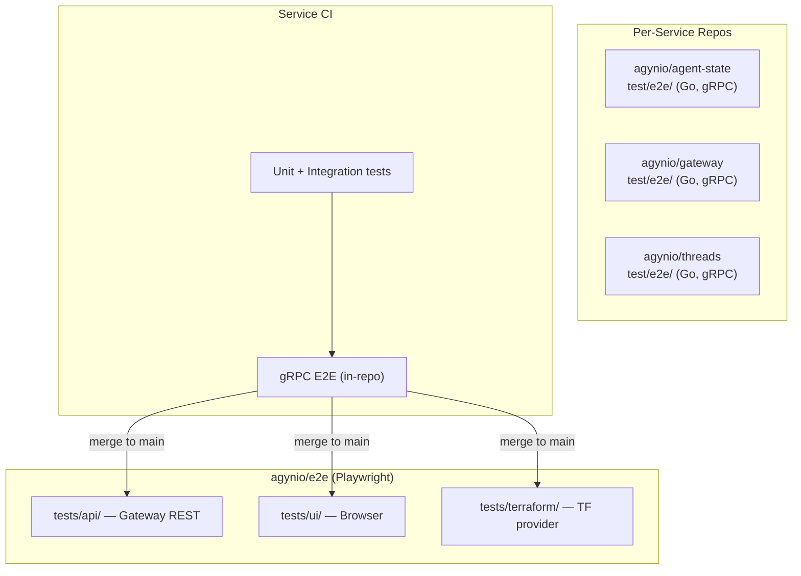

# End-to-End Testing

## Overview

Cross-system end-to-end tests live in a dedicated repository: `agynio/e2e`.

The repo covers all testable surfaces of the platform — UI, API, and Terraform provider — in a single place, with a unified tagging system that lets CI select exactly the tests affected by a given change.

## Why a Separate Repo

| Concern | In-repo `test/e2e/` | Dedicated `agynio/e2e` |
|---------|---------------------|------------------------|
| **Single-service gRPC smoke tests** | ✓ Keep here (service owns its contract) | — |
| **Cross-service / cross-surface tests** | — | ✓ Tests span UI + API + Terraform |
| **Dependency on full cluster** | Requires bootstrap anyway | Same — uses bootstrap |
| **Tag-based selective runs** | Fragmented across repos | Centralized tag taxonomy |
| **Shared fixtures / helpers** | Duplicated | Single source of truth |

**Rule of thumb:** Per-service repositories keep narrow gRPC contract tests in `test/e2e/` (as described in [New Service Development](new-service.md)). The `agynio/e2e` repo contains tests that exercise externally-visible behavior through the Gateway REST API, the platform UI, and the Terraform provider.

## Framework: Playwright

All tests in `agynio/e2e` use **Playwright** (TypeScript).

### Rationale

| Requirement | Playwright capability |
|------------|----------------------|
| UI browser tests | First-class — Chromium, Firefox, WebKit |
| API-only tests (no browser) | Built-in `request` context (`APIRequestContext`) — no browser launched |
| Terraform provider tests | Playwright test runner executes shell commands (`child_process`) that run `terraform apply/plan/destroy`; assertions use Playwright's `expect` |
| Tagging and filtering | Native `@tag` syntax + `--grep` / `--grep-invert` CLI filters |
| Parallel execution | Worker-based parallelism out of the box |
| CI integration | First-class GitHub Actions support, HTML/JSON reporters |
| Existing team familiarity | `agynio/mockauth` already uses Playwright |

### Why Not Separate Frameworks Per Surface

Using Go `testing` for API, Playwright for UI, and `terraform-plugin-testing` for Terraform would mean three test runners, three tag systems, three CI configurations, and no ability to compose a single test that navigates the UI after a Terraform apply. A single runner eliminates this fragmentation.

## Repository Structure

```
agynio/e2e/
├── playwright.config.ts        # Root config: projects, tags, env
├── package.json
├── tsconfig.json
├── .github/
│   └── workflows/
│       ├── ci.yml              # Runs on e2e repo PRs (full suite)
│       └── selective.yml       # Called by service repos (tag-filtered)
├── fixtures/
│   ├── api.fixture.ts          # Authenticated APIRequestContext
│   ├── terraform.fixture.ts    # Terraform workspace helper
│   └── auth.fixture.ts         # OIDC login via mockauth
├── helpers/
│   ├── gateway-client.ts       # Typed wrapper around Gateway REST API
│   ├── terraform-runner.ts     # Spawns terraform CLI, captures output
│   └── wait.ts                 # Polling/retry utilities
├── tests/
│   ├── api/
│   │   ├── teams/
│   │   │   ├── agents.spec.ts
│   │   │   ├── mcp-servers.spec.ts
│   │   │   ├── workspaces.spec.ts
│   │   │   └── attachments.spec.ts
│   │   ├── threads/
│   │   │   ├── messaging.spec.ts
│   │   │   └── participants.spec.ts
│   │   ├── chat/
│   │   │   └── chat-lifecycle.spec.ts
│   │   ├── files/
│   │   │   └── upload-download.spec.ts
│   │   ├── llm/
│   │   │   └── providers-models.spec.ts
│   │   └── secrets/
│   │       └── vault-resolution.spec.ts
│   ├── ui/
│   │   ├── auth/
│   │   │   └── login-logout.spec.ts
│   │   ├── agents/
│   │   │   ├── create-agent.spec.ts
│   │   │   └── agent-chat.spec.ts
│   │   ├── teams/
│   │   │   └── resource-management.spec.ts
│   │   └── threads/
│   │       └── conversation.spec.ts
│   └── terraform/
│       ├── agents/
│       │   └── agent-crud.spec.ts
│       ├── mcp-servers/
│       │   └── mcp-server-crud.spec.ts
│       ├── workspaces/
│       │   └── workspace-crud.spec.ts
│       └── attachments/
│           └── attachment-lifecycle.spec.ts
└── terraform-fixtures/
    ├── agent/
    │   └── main.tf              # Minimal HCL for agent CRUD test
    ├── mcp-server/
    │   └── main.tf
    └── workspace/
        └── main.tf
```

### Directory Conventions

| Directory | Purpose |
|-----------|---------|
| `tests/api/` | API-only tests (no browser). Use `APIRequestContext` against Gateway |
| `tests/ui/` | Browser tests against platform-ui |
| `tests/terraform/` | Terraform provider tests — apply/plan/destroy HCL fixtures |
| `fixtures/` | Playwright custom fixtures (extended `test` object) |
| `helpers/` | Pure utility code (no Playwright dependency) |
| `terraform-fixtures/` | HCL files used by Terraform tests |

## Tagging Taxonomy

Every test carries one or more tags from a controlled vocabulary. Tags are grouped into three dimensions.

### Surface Tags (what is being tested through)

| Tag | Meaning |
|-----|---------|
| `@ui` | Test drives a browser |
| `@api` | Test calls Gateway REST API directly |
| `@terraform` | Test exercises the Terraform provider |

### Domain Tags (which service / domain is under test)

| Tag | Maps to service(s) |
|-----|---------------------|
| `@teams` | Teams, Gateway (Team API) |
| `@agents` | Teams (agent resource), Agents Orchestrator, Runner |
| `@threads` | Threads |
| `@chat` | Chat, Threads |
| `@files` | Files |
| `@llm` | LLM |
| `@secrets` | Secrets |
| `@notifications` | Notifications |
| `@mcp-servers` | Teams (MCP server resource) |
| `@workspaces` | Teams (workspace resource), Runner |
| `@auth` | Gateway (OIDC), mockauth |

### Severity Tags

| Tag | Meaning |
|-----|---------|
| `@smoke` | Critical path — must pass on every deploy |
| `@regression` | Full regression — run nightly or on release |

### Applying Tags

Tags are applied via the Playwright `tag` property (not in the title string):

```typescript
// tests/api/teams/agents.spec.ts
import { test, expect } from '../../../fixtures/api.fixture';

test.describe('Agent CRUD via API', {
  tag: ['@api', '@teams', '@agents'],
}, () => {
  test('create agent with valid config', {
    tag: '@smoke',
  }, async ({ apiContext }) => {
    const res = await apiContext.post('/team/v1/agents', { data: { /* ... */ } });
    expect(res.ok()).toBe(true);
  });

  test('update agent model reference', async ({ apiContext }) => {
    // inherits @api, @teams, @agents from describe
  });
});
```

```typescript
// tests/terraform/agents/agent-crud.spec.ts
import { test, expect } from '../../../fixtures/terraform.fixture';

test.describe('Agent CRUD via Terraform', {
  tag: ['@terraform', '@teams', '@agents'],
}, () => {
  test('apply and destroy agent resource', {
    tag: '@smoke',
  }, async ({ terraform }) => {
    const result = await terraform.apply('agent');
    expect(result.exitCode).toBe(0);

    const destroy = await terraform.destroy('agent');
    expect(destroy.exitCode).toBe(0);
  });
});
```

## Playwright Configuration

```typescript
// playwright.config.ts
import { defineConfig } from '@playwright/test';

export default defineConfig({
  testDir: './tests',
  timeout: 120_000,
  expect: { timeout: 10_000 },
  retries: process.env.CI ? 2 : 0,
  workers: process.env.CI ? 4 : undefined,
  reporter: process.env.CI
    ? [['html', { open: 'never' }], ['json', { outputFile: 'results.json' }]]
    : [['list']],

  projects: [
    // --- Setup ---
    {
      name: 'setup',
      testMatch: '**/global.setup.ts',
    },

    // --- API tests (no browser) ---
    {
      name: 'api',
      testDir: './tests/api',
      dependencies: ['setup'],
      use: {
        baseURL: process.env.GATEWAY_URL ?? 'https://gateway.agyn.dev',
      },
    },

    // --- UI tests (Chromium) ---
    {
      name: 'ui',
      testDir: './tests/ui',
      dependencies: ['setup'],
      use: {
        baseURL: process.env.PLATFORM_URL ?? 'https://agyn.dev',
        screenshot: 'only-on-failure',
        trace: 'on-first-retry',
      },
    },

    // --- Terraform tests (no browser) ---
    {
      name: 'terraform',
      testDir: './tests/terraform',
      dependencies: ['setup'],
      timeout: 300_000, // Terraform operations are slow
      use: {
        baseURL: process.env.GATEWAY_URL ?? 'https://gateway.agyn.dev',
      },
    },
  ],
});
```

### Project vs Tag Filtering

Projects (`--project`) select by surface. Tags (`--grep`) select by domain or severity. They compose:

```bash
# All API tests for the teams domain
npx playwright test --project=api --grep @teams

# Smoke tests across all surfaces
npx playwright test --grep @smoke

# UI + API tests related to agents
npx playwright test --project=api --project=ui --grep @agents

# Everything related to threads (any surface)
npx playwright test --grep @threads
```

## Selective Runs from Service Repos

When a service repo (e.g., `agynio/teams`) merges a change, its CI triggers a **selective E2E run** in `agynio/e2e` with a tag expression matching the changed service.

### Service-to-Tag Mapping

Each service repo knows which E2E tags are relevant to it. This mapping is defined in the calling workflow, not in the E2E repo.

| Source repo | Tag expression | Rationale |
|-------------|---------------|-----------|
| `agynio/gateway` | `@teams\|@agents\|@auth` | Gateway routes all external traffic |
| `agynio/teams` | `@teams\|@agents\|@mcp-servers\|@workspaces` | Teams manages all team resources |
| `agynio/threads` | `@threads\|@chat` | Chat depends on Threads |
| `agynio/chat` | `@chat` | Chat surface only |
| `agynio/files` | `@files` | Isolated domain |
| `agynio/llm` | `@llm` | Isolated domain |
| `agynio/secrets` | `@secrets` | Isolated domain |
| `agynio/notifications` | `@notifications\|@chat\|@threads` | Notifications underpins real-time |
| `agynio/terraform-provider-agyn` | `@terraform` | All Terraform surface tests |
| `agynio/platform` (platform-ui) | `@ui` | All UI surface tests |

### Workflow: Calling Repo Side

Each service repo adds a job at the end of its release workflow:

```yaml
# .github/workflows/release.yml (in agynio/teams)
jobs:
  # ... existing image + helm jobs ...

  e2e:
    needs: [deploy]  # after deploy to the test environment
    uses: agynio/e2e/.github/workflows/selective.yml@main
    with:
      grep: '@teams|@agents|@mcp-servers|@workspaces'
      environment: staging
    secrets: inherit
```

### Workflow: E2E Repo Side

```yaml
# agynio/e2e/.github/workflows/selective.yml
name: Selective E2E
on:
  workflow_call:
    inputs:
      grep:
        description: 'Tag expression for --grep'
        required: true
        type: string
      environment:
        description: 'Target environment (local, staging)'
        required: false
        type: string
        default: 'local'

jobs:
  e2e:
    runs-on: ubuntu-latest
    environment: ${{ inputs.environment }}
    steps:
      - uses: actions/checkout@v4

      - uses: actions/setup-node@v4
        with:
          node-version: '22'
          cache: 'npm'

      - run: npm ci

      - run: npx playwright install --with-deps chromium

      - name: Run E2E tests
        run: npx playwright test --grep "${{ inputs.grep }}"
        env:
          GATEWAY_URL: ${{ vars.GATEWAY_URL }}
          PLATFORM_URL: ${{ vars.PLATFORM_URL }}

      - uses: actions/upload-artifact@v4
        if: always()
        with:
          name: playwright-report
          path: playwright-report/
```

### Full Suite Workflow

```yaml
# agynio/e2e/.github/workflows/ci.yml
name: Full E2E Suite
on:
  pull_request:
  schedule:
    - cron: '0 3 * * *'  # Nightly regression

jobs:
  e2e:
    runs-on: ubuntu-latest
    steps:
      - uses: actions/checkout@v4

      - uses: actions/setup-node@v4
        with:
          node-version: '22'
          cache: 'npm'

      - run: npm ci
      - run: npx playwright install --with-deps chromium

      - name: Run all E2E tests
        run: npx playwright test
        env:
          GATEWAY_URL: ${{ vars.GATEWAY_URL }}
          PLATFORM_URL: ${{ vars.PLATFORM_URL }}

      - uses: actions/upload-artifact@v4
        if: always()
        with:
          name: playwright-report
          path: playwright-report/
```

## Test Environment

Tests run against a live cluster provisioned by [bootstrap_v2](https://github.com/agynio/bootstrap_v2). There are two modes:

| Mode | When | How |
|------|------|-----|
| **Local** | Developer runs tests manually | Bootstrap provisions k3d cluster; tests target `localhost` / `*.agyn.dev` via `/etc/hosts` |
| **CI** | GitHub Actions | Workflow provisions the environment (bootstrap or pre-existing staging) and passes URLs via env vars |

Authentication in tests uses [mockauth](https://github.com/agynio/mockauth) — the mock OIDC provider is already deployed by bootstrap.

## Fixtures

### API Fixture

Provides an authenticated `APIRequestContext` targeting the Gateway:

```typescript
// fixtures/api.fixture.ts
import { test as base, APIRequestContext } from '@playwright/test';

type ApiFixtures = {
  apiContext: APIRequestContext;
};

export const test = base.extend<ApiFixtures>({
  apiContext: async ({ playwright }, use) => {
    const context = await playwright.request.newContext({
      baseURL: process.env.GATEWAY_URL,
      extraHTTPHeaders: {
        Authorization: `Bearer ${process.env.API_TOKEN}`,
      },
    });
    await use(context);
    await context.dispose();
  },
});

export { expect } from '@playwright/test';
```

### Terraform Fixture

Wraps `terraform` CLI execution with workspace isolation:

```typescript
// fixtures/terraform.fixture.ts
import { test as base } from '@playwright/test';
import { TerraformRunner } from '../helpers/terraform-runner';

type TerraformFixtures = {
  terraform: TerraformRunner;
};

export const test = base.extend<TerraformFixtures>({
  terraform: async ({}, use) => {
    const runner = new TerraformRunner({
      fixturesDir: 'terraform-fixtures',
      gatewayUrl: process.env.GATEWAY_URL!,
      apiToken: process.env.API_TOKEN!,
    });
    await use(runner);
    await runner.destroyAll(); // cleanup after test
  },
});

export { expect } from '@playwright/test';
```

### Auth Fixture

Handles OIDC login flow via mockauth for UI tests:

```typescript
// fixtures/auth.fixture.ts
import { test as base, Page } from '@playwright/test';

type AuthFixtures = {
  authenticatedPage: Page;
};

export const test = base.extend<AuthFixtures>({
  authenticatedPage: async ({ page }, use) => {
    await page.goto('/login');
    // mockauth provides a simple username-only login
    await page.getByLabel('Username').fill('e2e-test-user');
    await page.getByRole('button', { name: 'Sign in' }).click();
    await page.waitForURL('**/dashboard**');
    await use(page);
  },
});

export { expect } from '@playwright/test';
```

## Terraform Test Helpers

```typescript
// helpers/terraform-runner.ts
import { execSync, ExecSyncOptionsWithBufferEncoding } from 'child_process';
import path from 'path';
import fs from 'fs';
import os from 'os';

interface TerraformRunnerOptions {
  fixturesDir: string;
  gatewayUrl: string;
  apiToken: string;
}

interface TerraformResult {
  exitCode: number;
  stdout: string;
  stderr: string;
}

export class TerraformRunner {
  private readonly workDir: string;
  private readonly applied: string[] = [];

  constructor(private readonly options: TerraformRunnerOptions) {
    this.workDir = fs.mkdtempSync(path.join(os.tmpdir(), 'e2e-tf-'));
  }

  async apply(fixtureName: string): Promise<TerraformResult> {
    const src = path.join(this.options.fixturesDir, fixtureName);
    const dest = path.join(this.workDir, fixtureName);
    fs.cpSync(src, dest, { recursive: true });
    this.applied.push(dest);

    this.exec(dest, 'terraform init -input=false');
    return this.exec(dest, 'terraform apply -auto-approve -input=false');
  }

  async plan(fixtureName: string): Promise<TerraformResult> {
    const src = path.join(this.options.fixturesDir, fixtureName);
    const dest = path.join(this.workDir, fixtureName);
    fs.cpSync(src, dest, { recursive: true });

    this.exec(dest, 'terraform init -input=false');
    return this.exec(dest, 'terraform plan -input=false -detailed-exitcode');
  }

  async destroy(fixtureName: string): Promise<TerraformResult> {
    const dest = path.join(this.workDir, fixtureName);
    return this.exec(dest, 'terraform destroy -auto-approve -input=false');
  }

  async destroyAll(): Promise<void> {
    for (const dir of this.applied.reverse()) {
      try {
        this.exec(dir, 'terraform destroy -auto-approve -input=false');
      } catch {
        // best-effort cleanup; CI will tear down the environment
      }
    }
    fs.rmSync(this.workDir, { recursive: true, force: true });
  }

  private exec(cwd: string, command: string): TerraformResult {
    const env: Record<string, string> = {
      ...process.env as Record<string, string>,
      AGYN_GATEWAY_URL: this.options.gatewayUrl,
      AGYN_API_TOKEN: this.options.apiToken,
    };

    try {
      const stdout = execSync(command, {
        cwd,
        env,
        encoding: 'utf-8',
        stdio: ['pipe', 'pipe', 'pipe'],
      } as ExecSyncOptionsWithBufferEncoding);
      return { exitCode: 0, stdout: String(stdout), stderr: '' };
    } catch (error: unknown) {
      const err = error as { status: number; stdout: string; stderr: string };
      return { exitCode: err.status, stdout: String(err.stdout), stderr: String(err.stderr) };
    }
  }
}
```

## Relationship to Existing Tests



| Layer | Owner | What it tests | When it runs |
|-------|-------|--------------|-------------|
| Unit + integration | Service repo | Internal logic, handler contracts | Every PR |
| gRPC E2E (in-repo) | Service repo | Service's gRPC API against real DB | Every PR |
| Cross-system E2E | `agynio/e2e` | External behavior through Gateway, UI, Terraform | On merge + nightly |

## Adding Tests for a New Service

1. Create a directory under `tests/api/<service>/`.
2. Add a domain tag to the [tagging taxonomy](#domain-tags-which-service--domain-is-under-test) above.
3. Tag all new tests with the appropriate surface + domain tags.
4. If the service is exposed through Terraform, add HCL fixtures under `terraform-fixtures/<resource>/` and tests under `tests/terraform/<resource>/`.
5. If the service has UI, add tests under `tests/ui/<domain>/`.
6. Update the [service-to-tag mapping](#service-to-tag-mapping) table.
7. Add the `e2e` job to the service's release workflow with the correct `grep` expression.
