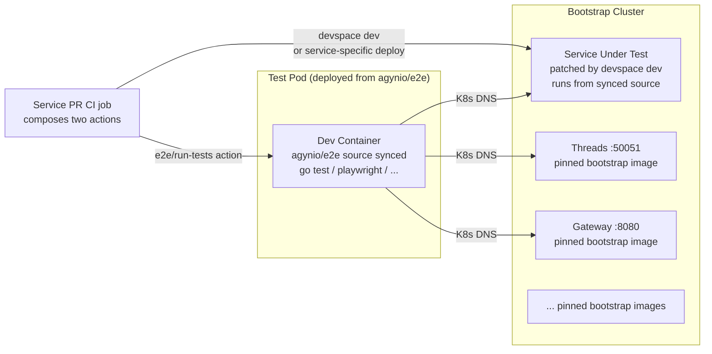
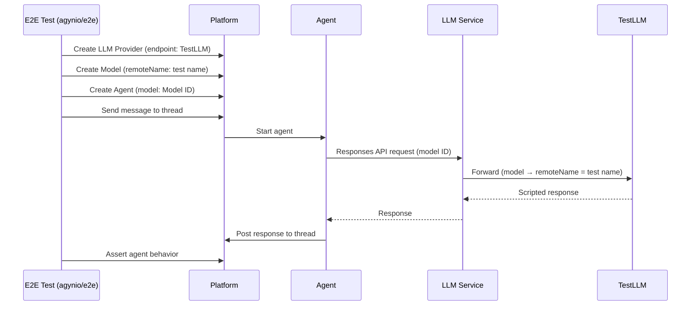

# E2E Testing

All E2E tests live in a single repository: [`agynio/e2e`](https://github.com/agynio/e2e). Tests are grouped into **suites**; each suite declares the container image it needs. A test declares the services it exercises through tags. A service repository runs E2E by composing two reusable composite actions — one from [`agynio/bootstrap`](https://github.com/agynio/bootstrap) to provision the cluster, one from `agynio/e2e` to run the tests — with its own deploy-from-source logic in between. Only suites that contain at least one test matching the service's tag are brought up. On the `agynio/e2e` repo's own `main`, the full set of suites runs against pinned bootstrap images.

## Rationale

A single E2E test typically exercises multiple services. With per-service test directories, the same scenario is duplicated across repositories, and a change in service A does not re-run tests that live in service B or C even though those tests depend on A.

Centralizing solves three problems at once:

1. **Coverage on every relevant change.** Tagging each test with the services it touches lets any one of those services' PRs re-run it.
2. **No duplication.** Cross-service scenarios have one home.
3. **Consistent test-writing conventions.** One repo, one lint config, one tagging scheme.

Organizing tests into **suites** — directories that each declare their own container image — accommodates heterogeneous test requirements without coupling them. A suite that needs the Terraform CLI declares a different image than a suite that needs headless Chromium; adding a new test runtime is adding a new suite, not patching a central pipeline.

The cost — synchronizing tests with in-flight service changes — is paid by [expand-contract](#breaking-changes) rather than by coordinating merges across repos.

## How It Works



The test pod runs inside the cluster in its own pod, separate from every service. Services the tests call — including the one under test — are reached through Kubernetes DNS exactly as production services reach each other.

## Repository Layout

`agynio/e2e` is organized as a collection of **suites**. A suite is a directory under `suites/` containing a `suite.yaml` manifest, its own package/dependency files, and its test sources. All tests inside a suite share the same container image and runner. Suites are auto-discovered by the pipeline — adding a suite means adding a directory, never editing the top-level `devspace.yaml`.

```
agynio/e2e/
├── devspace.yaml               # Top-level pipeline (suite discovery + orchestration)
├── suites/
│   ├── go-core/
│   │   ├── suite.yaml          # image + select/run commands
│   │   ├── go.mod
│   │   └── tests/
│   │       ├── main_test.go
│   │       ├── agents_crud_test.go
│   │       └── chat_with_agent_test.go
│   ├── go-terraform/
│   │   ├── suite.yaml          # image with terraform CLI
│   │   ├── go.mod
│   │   └── tests/
│   │       └── agent_resource_test.go
│   ├── playwright/
│   │   ├── suite.yaml          # Playwright image
│   │   ├── package.json
│   │   └── tests/
│   │       └── console_sign_in.spec.ts
│   └── ...
├── testdata/                   # Shared fixtures
└── README.md
```

No service repository contains a `test/e2e/` directory. Every E2E test — whether it targets a single service or spans ten — lives inside a suite here.

### `suite.yaml`

Each suite declares its image, a `select` command (prints matching test identifiers given the requested tags; empty output means nothing matches), and a `run` command (executes the matching tests). Both commands receive the requested tags via the `TAGS` environment variable as a whitespace-separated list.

```yaml
# suites/go-core/suite.yaml
image: ghcr.io/agynio/devcontainer-go:1
workdir: /opt/app/data
select: |-
  # Print a non-empty line per matching package; empty output = skip the suite.
  go list -tags "e2e ${TAGS}" ./tests/... 2>/dev/null
run: |-
  go test -v -count=1 -tags "e2e ${TAGS}" ./tests/...
```

```yaml
# suites/playwright/suite.yaml
image: mcr.microsoft.com/playwright:v1.47.0-jammy
workdir: /opt/app/data
select: |-
  GREP=$(echo "${TAGS}" | tr ' ' '\n' | sed 's/^/@/' | paste -sd'|' -)
  [ -n "${GREP}" ] && npx playwright test --list --grep "${GREP}" 2>/dev/null || npx playwright test --list
run: |-
  GREP=$(echo "${TAGS}" | tr ' ' '\n' | sed 's/^/@/' | paste -sd'|' -)
  pnpm install --frozen-lockfile
  if [ -n "${GREP}" ]; then npx playwright test --grep "${GREP}"; else npx playwright test; fi
```

When no `--tag` is passed, `TAGS` is empty and both commands run the suite's entire test set.

## Service Tagging

Each test declares which services it exercises using the native tagging mechanism of its runner. The CI pipeline selects tests by service name using these tags.

### Go build tags

One tag per service, all required. The `e2e` tag gates the whole tree:

```go
//go:build e2e && svc_threads && svc_chat

package tests
```

Selecting a subset: `go test -tags 'e2e svc_threads' ./go/tests/...` compiles and runs only tests that declare `svc_threads`.

### Playwright tags

Playwright's native `tag` argument on `describe` / `test`:

```typescript
test.describe('Console sign-in', { tag: ['@svc_console', '@svc_authn'] }, () => {
  test('redirects to chat', async ({ page }) => { /* ... */ });
});
```

Selecting a subset: `npx playwright test --grep '@svc_console'`.

### Tag vocabulary

| Tag | Meaning |
|-----|---------|
| `svc_<service>` | Test exercises `<service>` — re-run when `<service>` changes |
| `smoke` | Critical-path subset, runs on every PR regardless of service selection |
| `regression` | Extended subset, nightly |

Tags are additive. A test tagged `svc_threads`, `svc_chat`, and `smoke` runs for Threads PRs, for Chat PRs, and in the smoke subset.

### No skip conditions

Every test runs unconditionally within the selected subset. No `t.Skip()`, no `test.skip()`, no environment-variable guards, no feature flags. If a test cannot pass, it is fixed or deleted — not skipped. The only acceptable outcomes are **pass** and **fail**.

## Test Selection

`--tag` is the only filter. It can be passed multiple times, or comma-separated. The pipeline collects the tags into the `TAGS` environment variable and hands them to each suite's `select` / `run` commands.

```bash
# Run every test tagged svc_threads
devspace run test-e2e --tag svc_threads

# Run tests tagged with BOTH svc_threads AND smoke (suite-specific semantics —
# Go treats multi-tag as AND via build tags; Playwright uses regex OR by default)
devspace run test-e2e --tag svc_threads --tag smoke

# Full set of suites (used by agynio/e2e's own main)
devspace run test-e2e
```

The `service-e2e` reusable workflow translates its `service:` input into `--tag svc_<service>` when it invokes the pipeline. There is no `--service` flag on the pipeline itself — service tags are ordinary tags, and the suite's runner decides how to interpret them natively (Go build tags, Playwright `--grep`, etc.).

### Skip suites with no matching tests

Before deploying any test pod, the pipeline runs every suite's `select` command in an ephemeral container (using that suite's image) against the current `TAGS`. If `select` produces no output, the suite is skipped entirely — no pod, no sync, no run. Only suites with at least one matching test are deployed.

This means a Threads PR that only touches gRPC handlers never spins up the Playwright pod, and a Console PR never spins up the Go suites it doesn't exercise.

## Breaking Changes

`agynio/e2e`'s `main` must stay consistent with every service's `main`. This invariant is maintained by **expand-contract** — no atomic cross-repo breaks:

1. **Expand.** Service A's PR adds the new behavior alongside the old one. Old endpoint / field / version remains functional.
2. **Add new tests.** A PR to `agynio/e2e` adds tests for the new behavior, tagged with `svc_A`. Old tests continue to pass because old behavior still exists. Service A's PR can merge.
3. **Migrate consumers.** Other services and clients adopt the new behavior on their own schedule.
4. **Contract.** Once no consumer depends on the old path, a cleanup PR removes the old code in service A and the old tests in `agynio/e2e` — in that order, or in parallel PRs that can land independently.

At no point does `agynio/e2e@main` reference behavior that is absent from any service's `main`. This is what makes "green main everywhere" achievable.

If a change genuinely cannot be expressed as expand-contract (rare, e.g. a security-driven rotation), ship the new path behind a feature flag, merge everything, then flip the flag. "Merge a breaking change across N repos atomically" is not a supported workflow.

## DevSpace Configuration (`agynio/e2e`)

`agynio/e2e/devspace.yaml` is a thin orchestrator. It contains no per-suite deployments — suites are auto-discovered by scanning `suites/*/suite.yaml`. For each suite with matching tests, the pipeline dynamically creates a test pod (via `helm install component-chart`), syncs the suite's source, runs the suite's `run` command, and tears the pod down.

```yaml
# agynio/e2e/devspace.yaml
version: v2beta1

vars:
  TEST_NAMESPACE: platform

commands:
  test-e2e: |-
    devspace run-pipeline test-e2e $@

pipelines:
  test-e2e:
    flags:
      - name: tag
        description: "Filter tests by tag. Repeatable. Empty = run every suite."
        type: stringArray
    run: |-
      TAGS=$(get_flag "tag" | tr ',' ' ')
      export TAGS

      SUITES=$(find suites -mindepth 2 -maxdepth 2 -name suite.yaml | sort)
      EXIT_CODE=0

      for SUITE_MANIFEST in $SUITES; do
        SUITE_DIR=$(dirname "$SUITE_MANIFEST")
        SUITE_NAME=$(basename "$SUITE_DIR")
        IMAGE=$(yq '.image' "$SUITE_MANIFEST")
        WORKDIR=$(yq '.workdir // "/opt/app/data"' "$SUITE_MANIFEST")
        SELECT_CMD=$(yq '.select' "$SUITE_MANIFEST")
        RUN_CMD=$(yq '.run' "$SUITE_MANIFEST")

        # Pre-scan: does this suite have any matching tests? Run locally with
        # docker, using the suite's image. Skip the suite entirely if empty.
        MATCHES=$(docker run --rm \
          -v "$PWD/$SUITE_DIR:$WORKDIR" \
          -w "$WORKDIR" \
          -e TAGS \
          "$IMAGE" \
          bash -c "$SELECT_CMD" | tr -d '[:space:]')

        if [ -z "$MATCHES" ]; then
          echo "[skip] suite '$SUITE_NAME' — no tests match tags: ${TAGS:-<all>}"
          continue
        fi

        echo "[run] suite '$SUITE_NAME' with tags: ${TAGS:-<all>}"

        # Deploy the test pod for this suite.
        helm install "e2e-$SUITE_NAME" component-chart \
          --repo https://charts.devspace.sh \
          --namespace "${TEST_NAMESPACE}" \
          --set "containers[0].image=$IMAGE" \
          --set "containers[0].command[0]=sleep" \
          --set "containers[0].args[0]=infinity" \
          --set "labels.app\.kubernetes\.io/name=e2e-$SUITE_NAME" \
          --wait

        # Sync source into the pod, then execute the suite's run command.
        POD=$(kubectl get pod -n "${TEST_NAMESPACE}" \
          -l "app.kubernetes.io/name=e2e-$SUITE_NAME" \
          -o jsonpath='{.items[0].metadata.name}')
        kubectl cp "$SUITE_DIR/." "${TEST_NAMESPACE}/${POD}:${WORKDIR}"
        kubectl exec -n "${TEST_NAMESPACE}" "$POD" -- \
          bash -c "cd ${WORKDIR} && export TAGS='${TAGS}' && ${RUN_CMD}" \
          || EXIT_CODE=$?

        # Teardown.
        helm uninstall "e2e-$SUITE_NAME" --namespace "${TEST_NAMESPACE}" --wait
      done

      exit $EXIT_CODE
```

Key properties:

- No static per-suite deployments. Adding a suite means dropping a directory under `suites/` with a `suite.yaml` — the pipeline picks it up on the next run.
- Suites with no matching tests are skipped before any pod is deployed.
- Suites are run sequentially in the pipeline above for readability. The pipeline may parallelize them once stable.
- The pipeline touches only test pods. It never patches, deploys, or modifies a service pod. Service pods run whatever is currently deployed (pinned bootstrap images, or source code if a service repo called `devspace dev` first).
- `--tag <name>` is the only filter. No environment guards, no conditional skipping inside tests.

## Test Code

### Go

Go tests use standard `go test` with the project's gRPC clients generated from `buf.build/agynio/api`. Cross-service gRPC tests live in the `go-core` suite (standard Go toolchain).

```go
// agynio/e2e/suites/go-core/tests/main_test.go
//go:build e2e

package tests

import (
    "os"
    "testing"
)

var (
    agentsAddr  = envOrDefault("AGENTS_ADDR", "agents:50051")
    threadsAddr = envOrDefault("THREADS_ADDR", "threads:50051")
    gatewayAddr = envOrDefault("GATEWAY_ADDR", "gateway-gateway:8080")
    chatAddr    = envOrDefault("CHAT_ADDR", "chat:50051")
)

func envOrDefault(key, fallback string) string {
    if v := os.Getenv(key); v != "" {
        return v
    }
    return fallback
}

func TestMain(m *testing.M) { os.Exit(m.Run()) }
```

A single-service test:

```go
// agynio/e2e/suites/go-core/tests/agents_crud_test.go
//go:build e2e && svc_agents

package tests

import (
    "context"
    "testing"
    "time"

    agentsv1 "github.com/agynio/api/gen/agynio/api/agents/v1"
    "github.com/stretchr/testify/require"
    "google.golang.org/grpc"
    "google.golang.org/grpc/credentials/insecure"
)

func TestAgentCRUD(t *testing.T) {
    ctx, cancel := context.WithTimeout(context.Background(), 30*time.Second)
    defer cancel()

    conn, err := grpc.NewClient(agentsAddr, grpc.WithTransportCredentials(insecure.NewCredentials()))
    require.NoError(t, err)
    defer conn.Close()

    client := agentsv1.NewAgentsServiceClient(conn)
    createResp, err := client.CreateAgent(ctx, &agentsv1.CreateAgentRequest{ /* ... */ })
    require.NoError(t, err)
    agentID := createResp.GetAgent().GetId()

    getResp, err := client.GetAgent(ctx, &agentsv1.GetAgentRequest{Id: agentID})
    require.NoError(t, err)
    require.Equal(t, agentID, getResp.GetAgent().GetId())

    _, err = client.DeleteAgent(ctx, &agentsv1.DeleteAgentRequest{Id: agentID})
    require.NoError(t, err)
}
```

A cross-service test — tagged with every service it touches:

```go
// agynio/e2e/suites/go-core/tests/chat_with_agent_test.go
//go:build e2e && svc_agents && svc_threads && svc_chat

package tests

// Setup: create agent (agents), create thread (threads).
// Act:   post message (chat).
// Assert: message visible via threads.
```

This file runs when Agents, Threads, **or** Chat is the service under test. A PR to any of the three re-executes it.

### Playwright

```typescript
// agynio/e2e/suites/playwright/tests/console_sign_in.spec.ts
import { test, expect } from '@playwright/test';

test.describe('Console sign-in', { tag: ['@svc_console', '@svc_authn', '@smoke'] }, () => {
  test('redirects to chat on success', async ({ page }) => {
    await page.goto(process.env.CONSOLE_URL ?? 'http://console:3000');
    // ...
  });
});
```

Service URLs come from environment variables resolved through Kubernetes DNS.

### Terraform provider

Terraform provider tests live in their own suite — `suites/go-terraform/` — whose `suite.yaml` declares an image that includes the `terraform` CLI (a `devcontainer-go-tf` variant, or installed via the suite's run command). Keeping these tests in a separate suite means they don't bloat the core Go image and only deploy when a PR actually touches gateway or agents.

```go
// agynio/e2e/suites/go-terraform/tests/agent_resource_test.go
//go:build e2e && svc_gateway && svc_agents

package tests

func TestAccAgentResource(t *testing.T) {
    resource.Test(t, resource.TestCase{
        ProtoV6ProviderFactories: testAccProtoV6ProviderFactories,
        Steps: []resource.TestStep{ /* ... */ },
    })
}
```

The provider connects to the Gateway at `gateway-gateway:8080` inside the cluster. Dev override for the provider binary is configured in the suite's `run` command so `terraform` uses the locally-built binary.

## Deterministic LLM (TestLLM)

Agentic flows depend on LLM responses. Real LLMs are non-deterministic, making E2E assertions on agent behavior impossible without a deterministic substitute.

[TestLLM](https://github.com/agynio/testllm) is a standalone service exposing an OpenAI-compatible Responses API backed by predefined conversation sequences. Test infrastructure configures agents to hit TestLLM, which replays scripted responses.

### How it works

A **test** in TestLLM is an ordered sequence of items (input messages, output messages, function calls, function call outputs) following the OpenAI Responses API format. On each request, TestLLM matches the incoming `input` items against the expected prefix in the sequence. On exact match, it returns the next output items. On mismatch, it returns an error describing the divergence.

An E2E test sets up the platform to route LLM traffic through TestLLM:

1. Create an **LLM Provider** with `endpoint` pointing at the TestLLM URL.
2. Create a **Model** with `remoteName` set to the test name in TestLLM.
3. Create or configure an **Agent** to use that model.
4. Trigger the agent (e.g., send a message to a thread).
5. The agent's LLM requests flow through the [LLM Proxy](../llm-proxy.md) → [LLM Service](../llm.md) → TestLLM and receive scripted responses.
6. Assert agent behavior (messages posted, tool calls made, final state).



### Test suites repository

Test suites are managed as code in [`agynio/testllm-suites`](https://github.com/agynio/testllm-suites) using the [TestLLM Terraform provider](https://github.com/agynio/terraform-provider-testllm). Each `.tf` file defines a test suite and its tests — the full conversation sequences that agents will replay during E2E runs.

When writing an E2E test for a new agentic flow, the corresponding TestLLM test (the predefined conversation sequence) must be created first in `agynio/testllm-suites` before the E2E test that consumes it lands in `agynio/e2e`.

### Separation of concerns

TestLLM is an independent service with its own repository, deployment, and release cycle. Changes to TestLLM (the service itself, its Terraform provider, or the test suites) are managed separately — never as part of an Agyn platform feature PR. This keeps the E2E infrastructure stable and independently versioned.

| Repository | Purpose |
|-----------|---------|
| [`agynio/testllm`](https://github.com/agynio/testllm) | TestLLM service — Responses API, management UI, data model |
| [`agynio/testllm-suites`](https://github.com/agynio/testllm-suites) | Test suite definitions managed via Terraform |
| [`agynio/terraform-provider-testllm`](https://github.com/agynio/terraform-provider-testllm) | Terraform provider for TestLLM resources |

## Relationship to Unit / Integration Tests

| Layer | Scope | Location | Runner | When |
|-------|-------|----------|--------|------|
| Unit | Single function / method | Service repo | `go test ./internal/...` | Every PR (service repo) |
| Integration | Service + real DB (Docker) | Service repo | `go test` with Docker containers | Every PR (service repo) |
| E2E | Service + all dependencies in real cluster | `agynio/e2e` | `devspace run test-e2e --tag svc_<name>` | Every PR (service repo, filtered by service tag); every PR and push to main of `agynio/e2e` (every suite) |

Unit and integration tests stay in the service repo — they do not touch other services and do not benefit from centralization.

## CI Integration

CI orchestration is split into two composite actions — one per repository that owns the concern. The service's CI job composes them with its own deploy-from-source step in between.

### Service repo CI (`agynio/<service>/.github/workflows/ci.yml`)

```yaml
jobs:
  e2e:
    runs-on: ubuntu-latest
    permissions:
      contents: read
      packages: write
    steps:
      - uses: actions/checkout@v4

      # Stands up the bootstrap cluster with every service at its pinned
      # image. Exports KUBECONFIG into the job environment for subsequent
      # steps. Owned by agynio/bootstrap.
      - name: Provision bootstrap cluster
        uses: agynio/bootstrap/.github/actions/provision@main

      # Service-specific. The default for most services is `devspace dev`,
      # which patches the service pod to run from synced source. A service
      # that needs something different — loading a locally-built image into
      # k3d, running data migrations, priming fixtures — owns that logic
      # here. This step is the reason CI is not a single reusable workflow.
      - name: Deploy this service from source
        run: devspace dev

      # Runs the E2E suites tagged for this service. Owned by agynio/e2e.
      - name: Run E2E suites
        uses: agynio/e2e/.github/actions/run-tests@main
        with:
          service: <service-name>
```

Three logical blocks: **provision** (owned by bootstrap), **deploy** (owned by the service), **test** (owned by e2e). The middle block is where service-specific bring-up lives — this is exactly why there is no single wrapping workflow.

### Composite action (`agynio/bootstrap/.github/actions/provision`)

Encapsulates end-to-end cluster bring-up. Callers know nothing about stacks, scripts, or tool versions.

```yaml
# agynio/bootstrap/.github/actions/provision/action.yml
name: Provision bootstrap cluster
description: Check out bootstrap, install pinned tooling, apply all Terraform stacks, verify platform health.

inputs:
  ref:
    description: "Ref of agynio/bootstrap to use."
    required: false
    default: main

outputs:
  kubeconfig:
    description: "Absolute path to the kubeconfig written by bootstrap."
    value: ${{ steps.locate.outputs.path }}

runs:
  using: composite
  steps:
    - name: Reclaim disk space
      shell: bash
      run: |
        sudo rm -rf /usr/lib/jvm /usr/share/dotnet /usr/share/swift \
                     /opt/ghc /opt/hostedtoolcache/CodeQL

    - name: Checkout bootstrap
      uses: actions/checkout@v4
      with:
        repository: agynio/bootstrap
        ref: ${{ inputs.ref }}
        path: bootstrap

    - name: Install kubectl
      uses: azure/setup-kubectl@v4
      with:
        version: v1.28.7

    - name: Install k3d
      shell: bash
      run: |
        curl -s https://raw.githubusercontent.com/k3d-io/k3d/main/install.sh \
          | TAG=v5.7.5 bash

    - name: Install Terraform
      uses: hashicorp/setup-terraform@v3
      with:
        terraform_version: 1.6.6

    - name: Apply stacks and verify
      shell: bash
      run: |
        cd bootstrap && ./apply.sh -y && ./verify.sh

    - name: Export KUBECONFIG
      id: locate
      shell: bash
      run: |
        KC="$PWD/bootstrap/stacks/k8s/.kube/agyn-local-kubeconfig.yaml"
        echo "path=$KC" >> "$GITHUB_OUTPUT"
        echo "KUBECONFIG=$KC" >> "$GITHUB_ENV"
```

The action exports `KUBECONFIG` into the job environment via `$GITHUB_ENV` so every subsequent step — including the service's own deploy step and the `run-tests` action — picks it up automatically without passing it explicitly.

### Composite action (`agynio/e2e/.github/actions/run-tests`)

Encapsulates test execution. Callers pass the service name (or tag set) and nothing else.

```yaml
# agynio/e2e/.github/actions/run-tests/action.yml
name: Run E2E suites
description: Check out agynio/e2e, install DevSpace, run the test pipeline filtered by tags, upload artifacts.

inputs:
  service:
    description: "Service name. Translated to --tag svc_<service>. Leave empty to run every suite."
    required: false
    default: ""
  tag:
    description: "Additional tag(s) to pass. Comma-separated or repeated."
    required: false
    default: ""
  ref:
    description: "Ref of agynio/e2e to use."
    required: false
    default: main

runs:
  using: composite
  steps:
    - name: Checkout e2e
      uses: actions/checkout@v4
      with:
        repository: agynio/e2e
        ref: ${{ inputs.ref }}
        path: e2e

    - name: Install DevSpace
      shell: bash
      run: |
        curl -sL https://github.com/loft-sh/devspace/releases/download/v6.3.20/devspace-linux-amd64 \
          -o /usr/local/bin/devspace
        chmod +x /usr/local/bin/devspace

    - name: Run pipeline
      shell: bash
      run: |
        TAGS=""
        if [ -n "${{ inputs.service }}" ]; then TAGS="--tag svc_${{ inputs.service }}"; fi
        for t in $(echo "${{ inputs.tag }}" | tr ',' ' '); do
          [ -n "$t" ] && TAGS="$TAGS --tag $t"
        done
        cd e2e && devspace run test-e2e $TAGS

    - name: Upload artifacts
      if: always()
      uses: actions/upload-artifact@v4
      with:
        name: e2e-artifacts${{ inputs.service && format('-{0}', inputs.service) || '' }}
        path: |
          e2e/suites/playwright/playwright-report/
          e2e/suites/playwright/test-results/
```

### `agynio/e2e` main CI

`agynio/e2e`'s own workflow runs every suite against pinned bootstrap images by composing the same two actions in its own repo's CI:

```yaml
jobs:
  full-suite:
    runs-on: ubuntu-latest
    steps:
      - uses: actions/checkout@v4
      - uses: agynio/bootstrap/.github/actions/provision@main
      - uses: ./.github/actions/run-tests  # self-reference; no service input → full suite
```

No `devspace dev` step, no `service:` input — every service runs its pinned bootstrap image, and every suite runs.

### Why two composite actions, not one reusable workflow

Cluster provisioning and test execution are two distinct concerns owned by two different repos. Between them sits a **third** concern — how this specific service gets its source into the cluster — which is inherently service-specific:

- Most services: `devspace dev` patches the pod to run from synced source.
- A service with a custom build: build a local image, load it into k3d with `k3d image import`, then redeploy the chart pointing at the local tag.
- A service that needs data prep: run migrations or seed scripts after the pod is up but before tests start.

A single reusable workflow that wraps provision + deploy + test has to either (a) assume every service deploys the same way, or (b) accept a half-dozen optional inputs to parameterize the middle step. Both are worse than letting the service's own CI compose three explicit steps. The two actions are the primitives; the service orchestrates.

### Service repo CI (`agynio/<service>/.github/workflows/ci.yml`)

The service's e2e job is a single `uses:` call:

```yaml
jobs:
  e2e:
    uses: agynio/e2e/.github/workflows/service-e2e.yml@main
    with:
      service: <service-name>
```

That is the entire e2e-related surface in the service repo. No checkout steps, no tooling install, no DevSpace invocations. Onboarding a new service's CI is one block of YAML; cluster-provisioning changes land in `agynio/bootstrap`, E2E execution changes land in `agynio/e2e`, and both propagate to every service automatically.


## Summary

| Aspect | Decision |
|--------|----------|
| Where tests live | Single repo: [`agynio/e2e`](https://github.com/agynio/e2e), organized into suites under `suites/` |
| What is a suite | A directory with a `suite.yaml` declaring its container image, `select` command, and `run` command |
| Where tests run | Dedicated test pods inside the bootstrap cluster — one pod per executing suite |
| Service under test | Deployed from source via `devspace dev` from the service repo — no image build |
| Other services | Run from pinned bootstrap images |
| How test pods are created | Auto-discovered from `suites/*/suite.yaml`; each suite's pod is created via `helm install component-chart` at runtime |
| How source reaches test pods | `kubectl cp` of the suite directory, then the suite's `run` command inside the pod |
| How tests are triggered | `devspace run test-e2e [--tag <name>]...` |
| How tests reach services | Kubernetes DNS (`<service>:<port>`) |
| Filter mechanism | `--tag` only — repeatable, comma-separated; service selection is `--tag svc_<name>` |
| Skip-empty-suites | Suites with no tests matching the requested tags are skipped before any pod is deployed |
| Breaking-change model | Expand-contract — no atomic cross-repo changes |
| Who owns the CI job | The service repo. It composes `agynio/bootstrap/.github/actions/provision` (cluster) + its own deploy step + `agynio/e2e/.github/actions/run-tests` (execution) |
| Deterministic LLM | [TestLLM](https://github.com/agynio/testllm) — scripted conversations in [`agynio/testllm-suites`](https://github.com/agynio/testllm-suites) |
| Guards / skip conditions (inside tests) | Not allowed — every test in the selected subset runs unconditionally, or is deleted |
