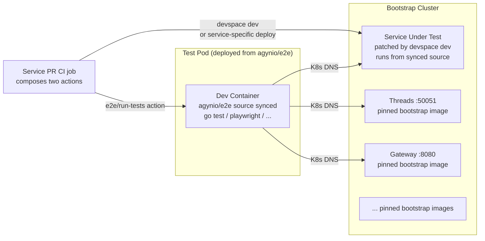
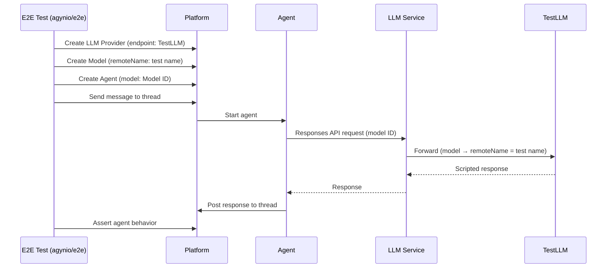

# E2E Testing

All E2E tests live in a single repository: [`agynio/e2e`](https://github.com/agynio/e2e). Tests are grouped into **suites**; each suite declares the container image it needs. A test declares the services it exercises through tags. A service repository runs E2E by composing two reusable composite actions — one from [`agynio/bootstrap`](https://github.com/agynio/bootstrap) to provision the cluster, one from `agynio/e2e` to run the tests — with its own deploy-from-source logic in between. Only suites that contain at least one test matching the service's tag are brought up. On the `agynio/e2e` repo's own `main`, the full set of suites runs against pinned bootstrap images.

## Rationale

A single E2E test typically exercises multiple services. With per-service test directories, the same scenario is duplicated across repositories, and a change in service A does not re-run tests that live in service B or C even though those tests depend on A.

Centralizing solves three problems at once:

1. **Coverage on every relevant change.** Tagging each test with the services it touches lets any one of those services' PRs re-run it.
2. **No duplication.** Cross-service scenarios have one home.
3. **Consistent test-writing conventions.** One repo, one lint config, one tagging scheme.

Organizing tests into **suites** — directories that each declare their own container image — accommodates heterogeneous test requirements without coupling them. A suite that needs the Terraform CLI declares a different image than a suite that needs headless Chromium; adding a new test runtime is adding a new suite, not patching a central pipeline.

The cost — synchronizing tests with in-flight service changes — is paid by [expand-contract](#breaking-changes) rather than by coordinating merges across repos.

## How It Works



The test pod runs inside the cluster in its own pod, separate from every service. Services the tests call — including the one under test — are reached through Kubernetes DNS exactly as production services reach each other.

## Repository Layout

`agynio/e2e` is organized as a collection of **suites**. A suite is a directory under `suites/` containing a `suite.yaml` manifest, its own package/dependency files, and its test sources. All tests inside a suite share the same container image and runner. Suites are auto-discovered by the pipeline — adding a suite means adding a directory, never editing the top-level `devspace.yaml`.

```
agynio/e2e/
├── devspace.yaml               # Top-level pipeline (suite discovery + orchestration)
├── suites/
│   ├── go-core/
│   │   ├── suite.yaml          # image + select/run commands
│   │   ├── go.mod
│   │   └── tests/
│   │       ├── main_test.go
│   │       ├── agents_crud_test.go
│   │       └── chat_with_agent_test.go
│   ├── go-terraform/
│   │   ├── suite.yaml          # image with terraform CLI
│   │   ├── go.mod
│   │   └── tests/
│   │       └── agent_resource_test.go
│   ├── playwright/
│   │   ├── suite.yaml          # Playwright image
│   │   ├── package.json
│   │   └── tests/
│   │       └── console_sign_in.spec.ts
│   └── ...
├── testdata/                   # Shared fixtures
└── README.md
```

No service repository contains a `test/e2e/` directory. Every E2E test — whether it targets a single service or spans ten — lives inside a suite here.

### `suite.yaml`

Each suite's `suite.yaml` declares four fields:

| Field | Purpose |
|-------|---------|
| `image` | Container image the suite runs in. Chosen for the suite's runtime needs (Go toolchain, Playwright, Terraform CLI, …). |
| `workdir` | Absolute path inside the image where the suite's sources land after sync. |
| `select` | Shell snippet that prints one line per matching test identifier given `TAGS`. Empty output = suite is skipped, no pod deployed. |
| `run` | Shell snippet that executes the matching tests. Must write JUnit output to `./junit.xml` inside `workdir`. |

Both commands read the requested tags from the `TAGS` environment variable (whitespace-separated). Each suite translates `TAGS` into its runner's native form — Go build tags via `||`, Playwright `--grep` alternation. Empty `TAGS` means "run every test in this suite".

Skeleton:

```yaml
image: <registry>/<image>:<tag>
workdir: /opt/app/data
select: <shell snippet that prints matching test IDs, empty if none>
run:    <shell snippet that runs tests and writes ./junit.xml>
```

## Service Tagging

Each test declares which services it exercises using the native tagging mechanism of its runner. The CI pipeline selects tests by service name using these tags.

### Go build tags

The `e2e` tag gates the whole tree. Service tags are joined with `||` so a file runs when **any** of its declared services is in the selected set:

```go
//go:build e2e && (svc_threads || svc_chat)

package tests
```

Selecting a subset: `go test -tags 'e2e svc_threads' ./tests/...` compiles files whose constraint is satisfied by that tag set — including cross-service files that list `svc_threads` as one option.

A single-service test uses one tag:

```go
//go:build e2e && svc_threads
```

### Playwright tags

Playwright's native `tag` argument on `describe` / `test`:

```typescript
test.describe('Console sign-in', { tag: ['@svc_console', '@svc_authn'] }, () => {
  test('redirects to chat', async ({ page }) => { /* ... */ });
});
```

Selecting a subset: `npx playwright test --grep '@svc_console'`.

### Tag vocabulary

| Tag | Meaning |
|-----|---------|
| `svc_<service>` | Test exercises `<service>` — re-run when `<service>` changes |
| `smoke` | Critical-path subset, runs on every PR regardless of service selection |
| `regression` | Extended subset, nightly |

Tags are additive. A test tagged `svc_threads`, `svc_chat`, and `smoke` runs for Threads PRs, for Chat PRs, and in the smoke subset.

### No skip conditions

Every test runs unconditionally within the selected subset. No `t.Skip()`, no `test.skip()`, no environment-variable guards, no feature flags. If a test cannot pass, it is fixed or deleted — not skipped. The only acceptable outcomes are **pass** and **fail**.

## Test Selection

`--tag` is the only filter. It can be passed multiple times or comma-separated. The pipeline collects the tags into the `TAGS` environment variable and hands them to each suite's `select` / `run` commands.

Tag semantics are **OR (union) at the pipeline level**: a test runs if at least one of its declared tags is in the requested set. `--tag svc_threads --tag smoke` runs every test tagged `svc_threads`, every test tagged `smoke`, and every test that carries both. Each suite's `select` / `run` commands translate `TAGS` into their runner's native form — Go build tags via `||`, Playwright `--grep` as alternation — preserving the same OR semantics.

```bash
# Run every test tagged svc_threads
devspace run test-e2e --tag svc_threads

# Run the union of svc_threads and smoke
devspace run test-e2e --tag svc_threads --tag smoke

# Full set of suites (used by agynio/e2e's own main)
devspace run test-e2e
```

The `run-tests` composite action translates its `service:` input into `--tag svc_<service>` and always appends `--tag smoke`. There is no `--service` flag on the pipeline itself — service tags are ordinary tags, and the suite's runner decides how to interpret them natively.

### Smoke on every run

`run-tests` unconditionally appends `--tag smoke`. Every service PR runs its own service tests **and** the smoke subset — smoke is the shared floor that catches regressions any service could cause (auth, sign-in, thread creation). A test joins the smoke set by declaring `smoke` alongside its service tags. Because selection is OR, tagging `smoke svc_threads svc_chat` means the test runs on Threads PRs, Chat PRs, and in any smoke run — no separate smoke-only copy.

### Skip suites with no matching tests

Before deploying any test pod, the pipeline runs every suite's `select` command in an ephemeral container (using that suite's image) against the current `TAGS`. If `select` produces no output, the suite is skipped entirely — no pod, no sync, no run. Only suites with at least one matching test are deployed.

This means a Threads PR that only touches gRPC handlers never spins up the Playwright pod, and a Console PR never spins up the Go suites it doesn't exercise.

## Breaking Changes

`agynio/e2e`'s `main` must stay consistent with every service's `main`. This invariant is maintained by **expand-contract** — no atomic cross-repo breaks:

1. **Expand.** Service A's PR adds the new behavior alongside the old one. Old endpoint / field / version remains functional.
2. **Add new tests.** A PR to `agynio/e2e` adds tests for the new behavior, tagged with `svc_A`. Old tests continue to pass because old behavior still exists. Service A's PR can merge.
3. **Migrate consumers.** Other services and clients adopt the new behavior on their own schedule.
4. **Contract.** Once no consumer depends on the old path, a cleanup PR removes the old code in service A and the old tests in `agynio/e2e` — in that order, or in parallel PRs that can land independently.

At no point does `agynio/e2e@main` reference behavior that is absent from any service's `main`. This is what makes "green main everywhere" achievable.

If a change genuinely cannot be expressed as expand-contract (rare, e.g. a security-driven rotation), ship the new path behind a feature flag, merge everything, then flip the flag. "Merge a breaking change across N repos atomically" is not a supported workflow.

## The `test-e2e` Pipeline

`agynio/e2e/devspace.yaml` exposes a single pipeline: `test-e2e`. Its contract:

| Aspect | Behavior |
|--------|----------|
| Flag | `--tag <name>` — repeatable, comma-separated. Absent = run every suite. |
| Input to suites | Requested tags exported as whitespace-separated `TAGS` env var. |
| Suite discovery | Scans `suites/*/suite.yaml` at runtime — no static registration. |
| Pre-scan | For each discovered suite, runs `select` in an ephemeral container (suite's image). Empty output → suite is skipped entirely, no pod deployed. |
| Execution | For each surviving suite, deploys a single test pod from the suite's image, syncs the suite directory into it, runs `run` inside the pod. |
| Post-run | Copies `junit.xml` (and any runner-specific report directories) back out before teardown. |
| Teardown | Unconditional — the pod is destroyed whether `run` succeeded or failed. |
| Concurrency | Suites run sequentially. May parallelize later; not a contract. |
| Exit code | Non-zero if any suite's `run` exited non-zero. |

The pipeline touches only test pods. It never patches, deploys, or modifies a service pod — service pods are whatever is currently deployed in the namespace (pinned bootstrap images, or a service running from source if a prior `devspace dev` call patched it).

Adding a suite is adding a `suites/<name>/` directory with a `suite.yaml`. No pipeline change, no central registry.

## Test Conventions

### Go

Go tests use standard `go test` with gRPC clients generated from `buf.build/agynio/api`. Cross-service gRPC tests live in the `go-core` suite. Service addresses are read from environment variables (`AGENTS_ADDR`, `THREADS_ADDR`, …), each defaulting to the in-cluster DNS name.

Tagging:

```go
//go:build e2e && svc_agents                                   // single-service
//go:build e2e && (svc_agents || svc_threads || svc_chat)      // cross-service (OR)
```

A cross-service file runs when any of its declared services is selected — a PR to Agents, Threads, **or** Chat re-executes it.

### Playwright

Playwright uses native `test.describe` tags:

```typescript
test.describe('Console sign-in', { tag: ['@svc_console', '@svc_authn', '@smoke'] }, () => { /* ... */ });
```

Service URLs come from environment variables resolved through Kubernetes DNS (e.g. `CONSOLE_URL=http://console:3000`).

### Terraform provider

Acceptance tests live in `suites/go-terraform/`. The suite's image includes the `terraform` CLI. Tests connect to the Gateway at the in-cluster DNS address and exercise the `terraform-provider-agyn` binary. How the binary gets into the suite is covered in [Non-service repos](#non-service-repos).

## Deterministic LLM (TestLLM)

Agentic flows depend on LLM responses. Real LLMs are non-deterministic, making E2E assertions on agent behavior impossible without a deterministic substitute.

[TestLLM](https://github.com/agynio/testllm) is a standalone service exposing an OpenAI-compatible Responses API backed by predefined conversation sequences. Test infrastructure configures agents to hit TestLLM, which replays scripted responses.

### How it works

A **test** in TestLLM is an ordered sequence of items (input messages, output messages, function calls, function call outputs) following the OpenAI Responses API format. On each request, TestLLM matches the incoming `input` items against the expected prefix in the sequence. On exact match, it returns the next output items. On mismatch, it returns an error describing the divergence.

An E2E test sets up the platform to route LLM traffic through TestLLM:

1. Create an **LLM Provider** with `endpoint` pointing at the TestLLM URL.
2. Create a **Model** with `remoteName` set to the test name in TestLLM.
3. Create or configure an **Agent** to use that model.
4. Trigger the agent (e.g., send a message to a thread).
5. The agent's LLM requests flow through the [LLM Proxy](../llm-proxy.md) → [LLM Service](../llm.md) → TestLLM and receive scripted responses.
6. Assert agent behavior (messages posted, tool calls made, final state).



### Test suites repository

Test suites are managed as code in [`agynio/testllm-suites`](https://github.com/agynio/testllm-suites) using the [TestLLM Terraform provider](https://github.com/agynio/terraform-provider-testllm). Each `.tf` file defines a test suite and its tests — the full conversation sequences that agents will replay during E2E runs.

When writing an E2E test for a new agentic flow, the corresponding TestLLM test (the predefined conversation sequence) must be created first in `agynio/testllm-suites` before the E2E test that consumes it lands in `agynio/e2e`.

### Separation of concerns

TestLLM is an independent service with its own repository, deployment, and release cycle. Changes to TestLLM (the service itself, its Terraform provider, or the test suites) are managed separately — never as part of an Agyn platform feature PR. This keeps the E2E infrastructure stable and independently versioned.

| Repository | Purpose |
|-----------|---------|
| [`agynio/testllm`](https://github.com/agynio/testllm) | TestLLM service — Responses API, management UI, data model |
| [`agynio/testllm-suites`](https://github.com/agynio/testllm-suites) | Test suite definitions managed via Terraform |
| [`agynio/terraform-provider-testllm`](https://github.com/agynio/terraform-provider-testllm) | Terraform provider for TestLLM resources |

## Relationship to Unit / Integration Tests

| Layer | Scope | Location | Runner | When |
|-------|-------|----------|--------|------|
| Unit | Single function / method | Service repo | `go test ./internal/...` | Every PR (service repo) |
| Integration | Service + real DB (Docker) | Service repo | `go test` with Docker containers | Every PR (service repo) |
| E2E | Service + all dependencies in real cluster | `agynio/e2e` | `devspace run test-e2e --tag svc_<name>` | Every PR (service repo, filtered by service tag); every PR and push to main of `agynio/e2e` (every suite) |

Unit and integration tests stay in the service repo — they do not touch other services and do not benefit from centralization.

## CI Integration

CI orchestration is split into two composite actions — one per repository that owns the concern. The service's CI job composes them with its own deploy-from-source step in between.

### Service CI job shape

Three explicit steps, in order:

1. **Provision** — `uses: agynio/bootstrap/.github/actions/provision@main`. Cluster comes up with all services at pinned images.
2. **Deploy** — service-owned. Default is `run: devspace dev`, which patches the service's pod to run from synced source. A service with custom bring-up (local image build + `k3d image import`, data migrations, fixture priming) replaces this step with whatever it needs.
3. **Test** — `uses: agynio/e2e/.github/actions/run-tests@main` with `service: <name>`. Runs the service's tagged subset plus smoke.

No wrapping reusable workflow. The middle step is inherently service-specific — parameterizing it away would mean either forcing every service to deploy the same way or adding a half-dozen optional inputs. Composing three primitives in the service's own `ci.yml` is simpler and keeps ownership boundaries clean: bootstrap owns provisioning, the service owns bring-up, e2e owns execution.

### Composite action: `agynio/bootstrap/.github/actions/provision`

**Responsibility.** Stand up the bootstrap cluster with every service at its pinned image, verify platform health, export `KUBECONFIG` into the job environment so subsequent steps pick it up automatically.

**Inputs.** `ref` — optional `agynio/bootstrap` ref (default `main`). Nothing else.

**Outputs.** `kubeconfig` — absolute path to the generated kubeconfig (also exported via `$GITHUB_ENV`).

**What it encapsulates (caller doesn't see).** Pinned versions of `kubectl`, `k3d`, and `terraform`; disk reclaim on the GitHub runner; the `apply.sh` / `verify.sh` invocation; the exact location of the kubeconfig file.

### Composite action: `agynio/e2e/.github/actions/run-tests`

**Responsibility.** Check out `agynio/e2e`, install DevSpace, invoke the `test-e2e` pipeline with the resolved tag set, capture JUnit + on-failure cluster diagnostics, upload everything as a single artifact.

**Inputs.**

| Input | Purpose |
|-------|---------|
| `service` | Service name. Translated to `--tag svc_<service>`. Empty = no service tag. |
| `tag` | Extra tags. Comma-separated or repeated. |
| `provider-binary` | Optional path to a prebuilt binary in the caller's workspace. Used only by repos that test a Terraform-provider-style artifact against the platform (see [Non-service repos](#non-service-repos)). |
| `ref` | `agynio/e2e` ref (default `main`). |

**Always-on behavior.**

- Appends `--tag smoke` to every invocation — smoke is the shared floor that runs on every PR regardless of service.
- Captures each suite's `junit.xml` as the primary test report.
- On failure, captures cluster state (`kubectl get pods`, `describe pods`, `logs --all-containers --prefix`, events) and uploads alongside test reports.
- Artifact is named `e2e-artifacts[-<service>]` so parallel jobs don't collide.

**What it encapsulates.** DevSpace version, tag concatenation rules, artifact glob, diagnostic capture.

### `agynio/e2e` main CI

`agynio/e2e`'s own workflow composes the same two actions with no deploy step in between: provision → run-tests (no `service:` input, so no service tag is added; the pipeline runs every suite). Every suite executes against a cluster where every service is running its pinned bootstrap image.

### Secrets

Composite actions cannot read `${{ secrets.* }}` directly — secrets must be piped in by the caller. The convention:

- **`agynio/bootstrap/.github/actions/provision`** — needs nothing beyond `GITHUB_TOKEN` (pulls from public GHCR for bootstrap images; private images, if any, are fetched via the runner's login from the workflow step). The action itself does not declare secret inputs.
- **`agynio/e2e/.github/actions/run-tests`** — needs no secrets. TestLLM, the only external dependency in the happy path, runs inside the cluster and is reached over in-cluster DNS. If a future suite needs an external credential (e.g. a third-party API key), the action grows an explicit input rather than reading a well-known secret name; the caller maps `${{ secrets.X }}` → that input.
- **Service deploy step (middle)** — owned by the service; secrets are injected via the `env:` block on that step, scoped to that step alone.

Neither `agynio/bootstrap` nor `agynio/e2e` stores secrets. Any credentials that E2E needs live as organization-level GitHub Actions secrets in the calling repo's org, referenced by name from the service's workflow. This keeps the two library repos free of credential contracts.

## Non-service repos

The convention for repos that are not a deployable service:

| Repo | E2E on PR | Why |
|------|-----------|-----|
| [`agynio/api`](https://github.com/agynio/api) | Full suite | A proto change can break any consumer |
| [`agynio/base-chart`](https://github.com/agynio/base-chart) | Smoke only | Chart changes exercised by bootstrap CI; smoke catches common breakage |
| [`agynio/bootstrap`](https://github.com/agynio/bootstrap) | Full suite | Bootstrap defines the platform |
| [`agynio/e2e`](https://github.com/agynio/e2e) | Full suite | Catches regressions in the tests themselves |
| [`agynio/terraform-provider-agyn`](https://github.com/agynio/terraform-provider-agyn) | `go-terraform` suite, PR-built binary | See [Testing the Terraform provider](#testing-the-terraform-provider) |
| Any other repo | Smoke by default | Small blast radius; opt into full suite only when warranted |

### Testing the Terraform provider

`terraform-provider-agyn` needs to run `go-terraform` against its own PR source, not against `agynio/e2e@main`'s pinned version of the provider — otherwise a provider change cannot be validated until after it ships.

The contract: `run-tests` accepts a `provider-binary` input pointing at a built binary in the caller's workspace. When set, the `go-terraform` suite configures Terraform's dev override against that binary instead of building from a pinned ref. The provider repo's CI builds the binary and passes its path:

1. `provision` — cluster up.
2. `go build -o ./provider` in the provider repo.
3. `run-tests` with `tag: svc_gateway` and `provider-binary: ./provider`.

How the binary gets from the runner filesystem into the test pod is an implementation detail of `run-tests` — not a spec concern. The spec guarantee is: if `provider-binary` is set, the suite runs against that binary.

## Summary

| Aspect | Decision |
|--------|----------|
| Where tests live | Single repo: [`agynio/e2e`](https://github.com/agynio/e2e), organized into suites under `suites/` |
| What is a suite | A directory with a `suite.yaml` declaring its container image, `select` command, and `run` command |
| Where tests run | Dedicated test pods inside the bootstrap cluster — one pod per executing suite |
| Service under test | Deployed from source via `devspace dev` from the service repo — no image build |
| Other services | Run from pinned bootstrap images |
| How test pods are created | Auto-discovered from `suites/*/suite.yaml`; one pod per executing suite, created at pipeline runtime |
| How tests are triggered | `devspace run test-e2e [--tag <name>]...` |
| How tests reach services | Kubernetes DNS (`<service>:<port>`) |
| Filter mechanism | `--tag` only — repeatable, comma-separated; service selection is `--tag svc_<name>` |
| Skip-empty-suites | Suites with no tests matching the requested tags are skipped before any pod is deployed |
| Breaking-change model | Expand-contract — no atomic cross-repo changes |
| Who owns the CI job | The service repo. It composes `agynio/bootstrap/.github/actions/provision` (cluster) + its own deploy step + `agynio/e2e/.github/actions/run-tests` (execution) |
| Deterministic LLM | [TestLLM](https://github.com/agynio/testllm) — scripted conversations in [`agynio/testllm-suites`](https://github.com/agynio/testllm-suites) |
| Guards / skip conditions (inside tests) | Not allowed — every test in the selected subset runs unconditionally, or is deleted |
