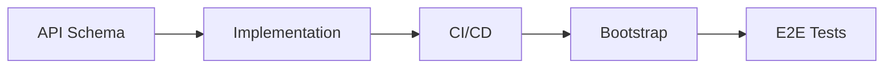

# New Service Development

This document describes the process for developing a new service from API schema to production deployment.

## Steps



| Step | Outcome |
|------|---------|
| [API Schema](#api-schema) | Proto definitions merged in `agynio/api` |
| [Implementation](#implementation) | Service repo with application code, Dockerfile, Helm chart, DevSpace config |
| [CI/CD](#cicd) | GitHub Actions publish image and chart to GHCR on every release |
| [Bootstrap](#bootstrap) | Service deployed in the local cluster via Argo CD |
| [E2E Tests](#e2e-tests) | Automated tests verify the service in a real cluster |

---

## API Schema

All API schemas live in `agynio/api`. The service repo does not contain schema definitions.

### Internal API (gRPC)

Add proto definitions under `proto/agynio/api/<service>/v1/`:

| Aspect | Convention |
|--------|-----------|
| Package | `agynio.api.<service>.v1` |
| Go package option | `github.com/agynio/api/gen/agynio/api/<service>/v1;<service>v1` |
| Linting | Buf `STANDARD` rules |
| Breaking change detection | Buf `FILE` policy |

Proto is published to `buf.build/agynio/api` via the existing `buf-publish` workflow in `agynio/api`.

### Workflow

1. Create a PR in `agynio/api` with the new proto definitions.
2. CI runs Buf lint + breaking change detection.
3. Merge. Buf publish pushes the updated module.

---

## Implementation

Create a new repo under `agynio/<service>`.

### Repository Structure

```
agynio/<service>/
├── .github/workflows/     # CI + release workflows
├── charts/<service>/      # Helm chart
│   ├── Chart.yaml         # Depends on service-base
│   ├── values.yaml
│   └── templates/
├── cmd/<service>/
│   └── main.go            # Entrypoint
├── internal/              # Application code
├── test/
│   └── e2e/               # E2E tests
├── buf.gen.yaml           # Proto code generation config
├── devspace.yaml          # DevSpace config: dev mode + E2E tests
├── Dockerfile
├── README.md
└── go.mod
```

### Dockerfile

Dockerfiles must produce images that run on both `linux/amd64` and `linux/arm64`. Follow the [Multi-Architecture Image Requirements](ci-cd.md#multi-architecture-image-requirements) when authoring images.

**Template (Go services):**

```Dockerfile
# syntax=docker/dockerfile:1
FROM --platform=$BUILDPLATFORM golang:1.22-alpine AS build
WORKDIR /src
COPY go.mod go.sum ./
RUN go mod download
COPY . .
ARG TARGETOS TARGETARCH
ENV CGO_ENABLED=0 GOOS=$TARGETOS GOARCH=$TARGETARCH
RUN go build -o /out/service ./cmd/service

FROM alpine:3.19
WORKDIR /app
COPY --from=build /out/service /app/service
ENTRYPOINT ["/app/service"]
```

**Rules:**
- Use multi-stage builds (builder + runtime).
- Set `CGO_ENABLED=0` for Go binaries.
- Declare `ARG TARGETOS TARGETARCH`.
- Use only official multi-arch base images for all stages.
- When downloading prebuilt tools, select by `TARGETARCH`.

### README

Each service README follows a standard structure:

~~~markdown
# <Service Name>

Short description of what the service does.

Architecture: [<Service Name>](https://github.com/agynio/architecture/blob/main/architecture/<service>.md)

## Local Development

Full setup: [Local Development](https://github.com/agynio/architecture/blob/main/architecture/operations/local-development.md)

### Prepare environment

```bash
git clone https://github.com/agynio/bootstrap.git
cd bootstrap
chmod +x apply.sh
./apply.sh -y
```

See [bootstrap](https://github.com/agynio/bootstrap) for details.

### Run from sources

Deploys the service from local source code. This patches the service pod — it does not affect other services or the test pod.

```bash
# Deploy once (exit when healthy)
devspace dev

# Watch mode (streams logs, re-syncs on changes)
devspace dev -w
```

### Run tests

Runs E2E tests in a separate test pod. This command only manages the test pod — it does not deploy or modify the service. Tests run against whatever is currently deployed: pinned release images by default, or source code if `devspace dev` was called first.

```bash
devspace run test-e2e
```

See [E2E Testing](https://github.com/agynio/architecture/blob/main/architecture/operations/e2e-testing.md).
~~~

### Proto Code Generation

The service generates Go code from `agynio/api` protos locally using `buf generate` with a `buf.gen.yaml` pointing at `buf.build/agynio/api`. Generated code is written to an internal `.gen/` directory. It is not committed — generated at build time (in Dockerfile and CI).

When using `buf generate` with `--path` filters, include `--include-imports` so dependent protos are generated.

### Helm Chart

The chart inherits from the shared base chart:

```yaml
# charts/<service>/Chart.yaml
dependencies:
  - name: service-base
    version: ">=0.1.4 <1.0.0"
    repository: oci://ghcr.io/agynio/charts
```

The base chart (`agynio/base-chart`) provides templates for Deployment, Service, ServiceAccount, HPA, and Ingress. Service charts override values.


### DevSpace

Each service provides a `devspace.yaml` with three commands:

| Command | Purpose |
|---------|---------|
| `devspace dev` | Deploy once: patch the service pod with a dev container, sync source, start the service, exit when healthy. Used by CI and scripts. |
| `devspace dev -w` | Watch mode: same as `devspace dev` but keeps running, streams logs, and re-syncs on file changes. Used during local development. |
| `devspace run test-e2e` | Run E2E tests in a separate test pod inside the cluster. Self-contained: deploys test pod → syncs source → runs tests → cleans up. |

`devspace dev` and `devspace dev -w` patch the existing service deployment with a dev container image, replacing the released image with source-based hot-reload. The `-w` flag is implemented via a pipeline flag (see gateway's `devspace.yaml` for the pattern).

`devspace run test-e2e` does not touch the service pod. It deploys a separate test pod, syncs test code into it, and executes the tests. See [E2E Testing](e2e-testing.md).

---

## CI/CD

Add GitHub Actions workflows under `.github/workflows/` in the service repo. All services follow the same pattern (see [CI/CD](ci-cd.md)).

### Workflows

| Workflow | Trigger | Artifacts |
|----------|---------|-----------|
| `ci.yml` | Pull requests, push to `main` | Lint, test, build |
| `release.yml` | `v*.*.*` tag | Container image + Helm chart to GHCR |

The `release.yml` workflow builds images for `linux/amd64` and `linux/arm64` using Docker Buildx and verifies the multi-architecture manifest list after pushing. See [Multi-Architecture Image Requirements](ci-cd.md#multi-architecture-image-requirements).

### Image Tags

| Condition | Tags |
|-----------|------|
| Push `v*.*.*` tag | `<semver>`, `latest`, `sha-<commit>` |

### Helm Chart Publishing

On `v*.*.*` tag push:

1. Package chart with version extracted from tag.
2. Push to `oci://ghcr.io/agynio/charts`.

---

## Bootstrap

Register the service in `agynio/bootstrap` so it is deployed in the local cluster. See [Local Development](local-development.md) for how bootstrap provisions the cluster.

---

## E2E Tests

Each service includes end-to-end tests that verify behavior against a running environment provisioned by bootstrap. Tests run **inside the cluster** in a dedicated test pod via DevSpace — the service pods run their pinned release images untouched. See [E2E Testing](e2e-testing.md) for the full methodology.

### Structure

- Tests live in `test/e2e/` within the service repo.
- Tests connect to services via Kubernetes DNS (e.g., `agents:50051`, `threads:50051`).
- A separate test pod is deployed by DevSpace using `component-chart`. The dev container image depends on the test language (Go, Node, Playwright, etc.).

### DevSpace Setup

Add E2E sections to `devspace.yaml`: a `deployments.e2e-runner` (component-chart), a `dev.e2e-runner` (sync), and a `pipelines.test-e2e` (deploy → sync → exec → cleanup). The user-facing command is `devspace run test-e2e`. Follow the pattern in [E2E Testing](e2e-testing.md).

### E2E Tests in CI

CI provisions the environment using bootstrap and runs E2E tests inside the cluster. No custom docker-compose or Kind-based setups — bootstrap is the single source of truth for the test environment.

The CI workflow has two modes:

**Pull requests** — deploy from source, then test:

```bash
devspace dev           # patch service pod with PR source code
devspace run test-e2e  # run tests against the modified cluster
```

**Push to `main`** — test pinned release images directly:

```bash
devspace run test-e2e  # services are already running released versions
```

These are separate sequential steps. The `test-e2e` command never deploys or modifies the service pod — it only manages the test pod. See [E2E Testing](e2e-testing.md) for the full rationale.
