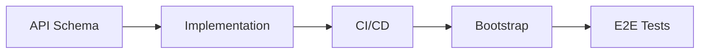

# New Service Development

This document describes the process for developing a new service from API schema to production deployment.

## Steps



| Step | Outcome |
|------|---------|
| [API Schema](#api-schema) | Proto definitions merged in `agynio/api` |
| [Implementation](#implementation) | Service repo with application code, Dockerfile, Helm chart, DevSpace config |
| [CI/CD](#cicd) | GitHub Actions publish image and chart to GHCR on every release |
| [Bootstrap](#bootstrap) | Service deployed in the local cluster via Argo CD |
| [E2E Tests](#e2e-tests) | Automated tests verify the service in a real cluster |

---

## API Schema

All API schemas live in `agynio/api`. The service repo does not contain schema definitions.

### Internal API (gRPC)

Add proto definitions under `proto/agynio/api/<service>/v1/`:

| Aspect | Convention |
|--------|-----------|
| Package | `agynio.api.<service>.v1` |
| Go package option | `github.com/agynio/api/gen/agynio/api/<service>/v1;<service>v1` |
| Linting | Buf `STANDARD` rules |
| Breaking change detection | Buf `FILE` policy |

Proto is published to `buf.build/agynio/api` via the existing `buf-publish` workflow in `agynio/api`.

### Workflow

1. Create a PR in `agynio/api` with the new proto definitions.
2. CI runs Buf lint + breaking change detection.
3. Merge. Buf publish pushes the updated module.

---

## Implementation

Create a new repo under `agynio/<service>`.

### Repository Structure

```
agynio/<service>/
├── .github/workflows/     # CI + release workflows
├── charts/<service>/      # Helm chart
│   ├── Chart.yaml         # Depends on service-base
│   ├── values.yaml
│   └── templates/
├── cmd/<service>/
│   └── main.go            # Entrypoint
├── internal/              # Application code
├── buf.gen.yaml           # Proto code generation config
├── devspace.yaml          # DevSpace config: dev mode
├── Dockerfile
├── README.md
└── go.mod
```

### Dockerfile

Dockerfiles must produce images that run on both `linux/amd64` and `linux/arm64`. Follow the [Multi-Architecture Image Requirements](ci-cd.md#multi-architecture-image-requirements) when authoring images.

**Template (Go services):**

```Dockerfile
# syntax=docker/dockerfile:1
FROM --platform=$BUILDPLATFORM golang:1.22-alpine AS build
WORKDIR /src
COPY go.mod go.sum ./
RUN go mod download
COPY . .
ARG TARGETOS TARGETARCH
ENV CGO_ENABLED=0 GOOS=$TARGETOS GOARCH=$TARGETARCH
RUN go build -o /out/service ./cmd/service

FROM alpine:3.19
WORKDIR /app
COPY --from=build /out/service /app/service
ENTRYPOINT ["/app/service"]
```

**Rules:**
- Use multi-stage builds (builder + runtime).
- Set `CGO_ENABLED=0` for Go binaries.
- Declare `ARG TARGETOS TARGETARCH`.
- Use only official multi-arch base images for all stages.
- When downloading prebuilt tools, select by `TARGETARCH`.

### README

Each service README follows a standard structure:

~~~markdown
# <Service Name>

Short description of what the service does.

Architecture: [<Service Name>](https://github.com/agynio/architecture/blob/main/architecture/<service>.md)

## Local Development

Full setup: [Local Development](https://github.com/agynio/architecture/blob/main/architecture/operations/local-development.md)

### Prepare environment

```bash
git clone https://github.com/agynio/bootstrap.git
cd bootstrap
chmod +x apply.sh
./apply.sh -y
```

See [bootstrap](https://github.com/agynio/bootstrap) for details.

### Run from sources

Deploys the service from local source code. This patches the service pod — it does not affect other services or the test pod.

```bash
# Deploy once (exit when healthy)
devspace dev

# Watch mode (streams logs, re-syncs on changes)
devspace dev -w
```

### Run E2E tests

E2E tests live in [agynio/e2e](https://github.com/agynio/e2e). Clone it alongside this repo and run:

```bash
# In the service repo: deploy this service from source
devspace dev

# In the agynio/e2e checkout: run suites with tests tagged for this service
devspace run test-e2e --tag svc_<service-name>
```

See [E2E Testing](https://github.com/agynio/architecture/blob/main/architecture/operations/e2e-testing.md).
~~~

### Proto Code Generation

The service generates Go code from `agynio/api` protos locally using `buf generate` with a `buf.gen.yaml` pointing at `buf.build/agynio/api`. Generated code is written to an internal `.gen/` directory. It is not committed — generated at build time (in Dockerfile and CI).

When using `buf generate` with `--path` filters, include `--include-imports` so dependent protos are generated.

### Helm Chart

The chart inherits from the shared base chart:

```yaml
# charts/<service>/Chart.yaml
dependencies:
  - name: service-base
    version: ">=0.1.4 <1.0.0"
    repository: oci://ghcr.io/agynio/charts
```

The base chart (`agynio/base-chart`) provides templates for Deployment, Service, ServiceAccount, HPA, and Ingress. Service charts override values.


### DevSpace

Each service provides a `devspace.yaml` with two commands:

| Command | Purpose |
|---------|---------|
| `devspace dev` | Deploy once: patch the service pod with a dev container, sync source, start the service, exit when healthy. Used by CI and scripts. |
| `devspace dev -w` | Watch mode: same as `devspace dev` but keeps running, streams logs, and re-syncs on file changes. Used during local development. |

`devspace dev` and `devspace dev -w` patch the existing service deployment with a dev container image, replacing the released image with source-based hot-reload. The `-w` flag is implemented via a pipeline flag (see gateway's `devspace.yaml` for the pattern).

E2E tests are not part of the service's `devspace.yaml`. They live in [`agynio/e2e`](https://github.com/agynio/e2e) and are driven by its own DevSpace config. See [E2E Testing](e2e-testing.md).

---

## CI/CD

Add GitHub Actions workflows under `.github/workflows/` in the service repo. All services follow the same pattern (see [CI/CD](ci-cd.md)).

### Workflows

| Workflow | Trigger | Artifacts |
|----------|---------|-----------|
| `ci.yml` | Pull requests, push to `main` | Lint, test, build |
| `release.yml` | `v*.*.*` tag | Container image + Helm chart to GHCR |

The `release.yml` workflow builds images for `linux/amd64` and `linux/arm64` using Docker Buildx and verifies the multi-architecture manifest list after pushing. See [Multi-Architecture Image Requirements](ci-cd.md#multi-architecture-image-requirements).

### Image Tags

| Condition | Tags |
|-----------|------|
| Push `v*.*.*` tag | `<semver>`, `latest`, `sha-<commit>` |

### Helm Chart Publishing

On `v*.*.*` tag push:

1. Package chart with version extracted from tag.
2. Push to `oci://ghcr.io/agynio/charts`.

---

## Bootstrap

Register the service in `agynio/bootstrap` so it is deployed in the local cluster. See [Local Development](local-development.md) for how bootstrap provisions the cluster.

---

## E2E Tests

E2E tests for every service live in a single repository: [`agynio/e2e`](https://github.com/agynio/e2e). The service repo contains no `test/e2e/` directory. When adding a new service:

1. Add cross-service scenarios as tests in `agynio/e2e` under the appropriate suite (`suites/go-core/tests/`, `suites/playwright/tests/`, …). If the new service's tests need a runtime no existing suite provides, add a new suite directory with its own `suite.yaml`.
2. Tag each test with `svc_<name>` for every service it exercises. The new service's PRs will re-run every test tagged with its `svc_<name>`.
3. Add the service's Kubernetes DNS address as a constant in the relevant suite's setup (e.g., `main_test.go` for a Go suite).

See [E2E Testing](e2e-testing.md) for the full methodology: repo layout, suite manifests, tagging, breaking-change model, DevSpace pipeline.

### E2E Tests in CI

The service's `ci.yml` e2e job composes two composite actions with a service-specific deploy step between them:

```yaml
jobs:
  e2e:
    runs-on: ubuntu-latest
    permissions:
      contents: read
      packages: write
    steps:
      - uses: actions/checkout@v4
      - uses: agynio/bootstrap/.github/actions/provision@main
      - name: Deploy this service from source
        run: devspace dev
      - uses: agynio/e2e/.github/actions/run-tests@main
        with:
          service: <service-name>
```

The first action — owned by [`agynio/bootstrap`](https://github.com/agynio/bootstrap) — stands up the cluster with every service at its pinned image and exports `KUBECONFIG`. The middle step is owned by the service: most services use `devspace dev`, but a service with custom bring-up (local image build, migrations, fixtures) does that here. The third action — owned by [`agynio/e2e`](https://github.com/agynio/e2e) — runs the suites tagged for this service and uploads artifacts. No image is built or pushed for the service under test.

See [CI/CD — E2E Job](ci-cd.md#e2e-job) and [E2E Testing — CI Integration](e2e-testing.md#ci-integration).
