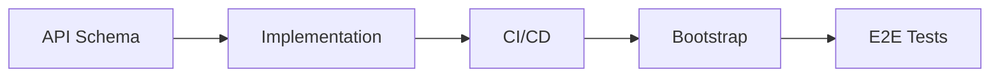

# New Service Development

This document describes the process for developing a new service from API schema to production deployment.

## Steps



| Step | Outcome |
|------|---------|
| [API Schema](#api-schema) | Proto and/or OpenAPI definitions merged in `agynio/api` |
| [Implementation](#implementation) | Service repo with application code, Dockerfile, Helm chart |
| [CI/CD](#cicd) | GitHub Actions publish image and chart to GHCR on every release |
| [Bootstrap](#bootstrap) | Service deployed in the local cluster via Argo CD |
| [E2E Tests](#e2e-tests) | Automated tests verify the service in a real cluster |

---

## API Schema

All API schemas live in `agynio/api`. The service repo does not contain schema definitions.

### Internal API (gRPC)

Add proto definitions under `proto/agynio/api/<service>/v1/`:

| Aspect | Convention |
|--------|-----------|
| Package | `agynio.api.<service>.v1` |
| Go package option | `github.com/agynio/api/gen/agynio/api/<service>/v1;<service>v1` |
| Linting | Buf `STANDARD` rules |
| Breaking change detection | Buf `FILE` policy |

Proto is published to `buf.build/agynio/api` via the existing `buf-publish` workflow in `agynio/api`.

### External API (OpenAPI)

Add an OpenAPI spec under `openapi/<service>/v1/`:

| Aspect | Convention |
|--------|-----------|
| Spec version | OpenAPI 3.0.3 |
| Structure | Modular — one YAML per component, referenced via `$ref` |
| Linting | Spectral (`.spectral.yaml` in `agynio/api`) |
| Pagination | Cursor-based on all list endpoints |
| Errors | `Problem` schema (RFC 7807) |

OpenAPI spec is published to GHCR via the existing `openapi-publish` workflow in `agynio/api`.

### Workflow

1. Create a PR in `agynio/api` with the new proto and/or OpenAPI definitions.
2. CI runs Buf lint + breaking change detection (proto) and Spectral lint (OpenAPI).
3. Merge. Buf publish pushes the updated module; OpenAPI publish pushes the spec artifact.

---

## Implementation

Create a new repo under `agynio/<service>`.

### Repository Structure

```
agynio/<service>/
├── .github/workflows/     # CI + release workflows
├── charts/<service>/      # Helm chart
│   ├── Chart.yaml         # Depends on service-base
│   ├── values.yaml
│   └── templates/
├── cmd/<service>/
│   └── main.go            # Entrypoint
├── internal/              # Application code
├── test/
│   └── e2e/               # E2E tests
├── buf.gen.yaml           # Proto code generation config
├── Dockerfile
├── Makefile
└── go.mod
```

### Proto Code Generation

The service generates Go code from `agynio/api` protos locally using `buf generate` with a `buf.gen.yaml` pointing at `buf.build/agynio/api`. Generated code is written to an internal `.gen/` directory. It is not committed — generated at build time (in Dockerfile and CI).

### Helm Chart

The chart inherits from the shared base chart:

```yaml
# charts/<service>/Chart.yaml
dependencies:
  - name: service-base
    version: ">=0.1.4 <1.0.0"
    repository: oci://ghcr.io/agynio/charts
```

The base chart (`agynio/base-chart`) provides templates for Deployment, Service, ServiceAccount, HPA, and Ingress. Service charts override values.

---

## CI/CD

Add GitHub Actions workflows under `.github/workflows/` in the service repo. All services follow the same pattern (see [CI/CD](ci-cd.md)).

### Workflows

| Workflow | Trigger | Artifacts |
|----------|---------|-----------|
| `ci.yml` | Pull requests | Lint, test, build |
| `release.yml` | Push to `main` or `v*.*.*` tag | Container image + Helm chart to GHCR |

### Image Tags

| Condition | Tags |
|-----------|------|
| Push to `main` | `edge` |
| Push `v*.*.*` tag | `<semver>`, `latest`, `sha-<commit>` |

### Helm Chart Publishing

On `v*.*.*` tag push:

1. Package chart with version extracted from tag.
2. Push to `oci://ghcr.io/agynio/charts`.

---

## Bootstrap

Register the service in `agynio/bootstrap_v2` so it is deployed in the local cluster. See [Local Development](local-development.md) for how bootstrap provisions the cluster.

---

## E2E Tests

Each service includes automated end-to-end tests that verify behavior against a running environment provisioned by bootstrap.

### In-Repo E2E Tests

Located in `test/e2e/` within the service repo. These tests run against the bootstrap cluster — the full platform environment with all services and dependencies running. Tests exercise the service's gRPC API and verify responses.

### E2E Tests in CI

A CI workflow provisions the environment using bootstrap and runs the E2E tests against it. No custom docker-compose or Kind-based setups — bootstrap is the single source of truth for the test environment.
