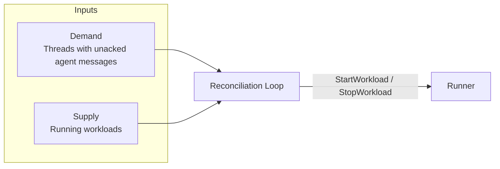
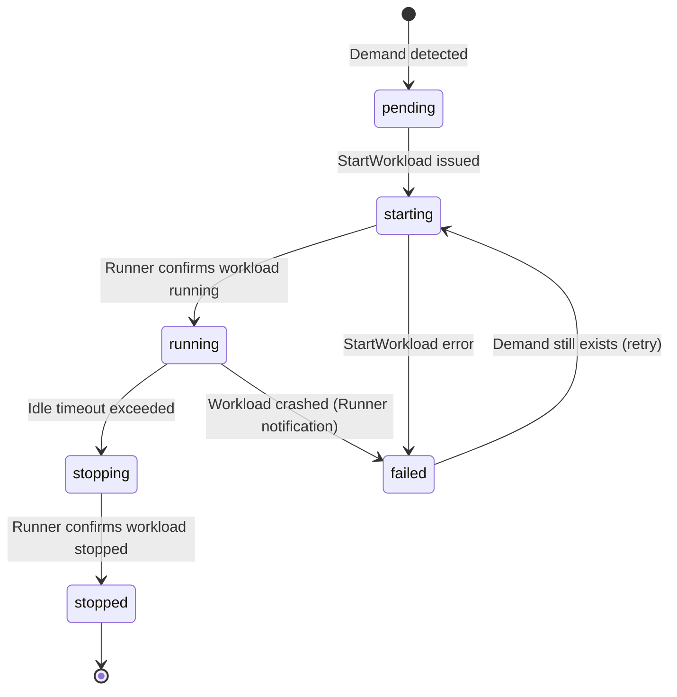
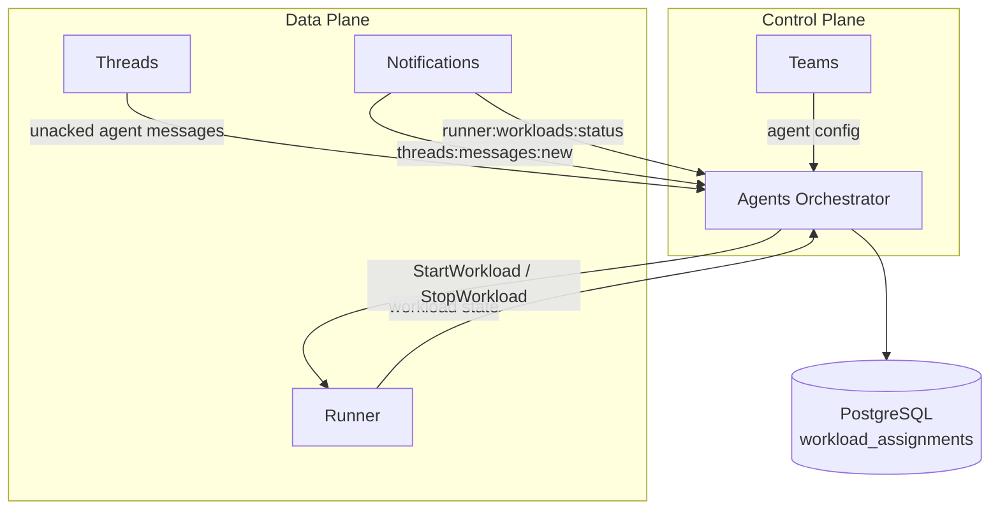

# Agents Orchestrator

## Overview

The Agents Orchestrator decides which agent workloads should be running and reconciles actual state toward that goal. It is the **only service** that starts and stops agent containers.

The orchestrator is a **control plane** service. It does not touch messages, proxy traffic, or hold user-facing connections. It observes demand (threads with unacknowledged messages for agent participants) and supply (running workloads), computes the diff, and acts through the [Runner](runner.md).

## Reconciliation

The orchestrator runs a periodic reconciliation loop backed by PostgreSQL (see [Reconciliation Approach](control-data-plane.md#reconciliation-approach)).

Each pass computes a diff between demand and supply, then acts on the result:

| Outcome | Condition | Action |
|---------|-----------|--------|
| **Start** | Thread has unacked messages for an agent participant, no workload running | `StartWorkload` via Runner |
| **Keep** | Thread has unacked messages, workload running | No action |
| **Stop** | No unacked messages, workload idle beyond timeout | `StopWorkload` via Runner |
| **Restart** | Demand exists, workload in failed/stopped state | `StartWorkload` via Runner |

### Demand: Threads with Unacked Agent Messages

The orchestrator needs to know which threads have unacknowledged messages for agent participants.

[Threads](threads.md) is participant-type-agnostic — it does not distinguish agents from users. The orchestrator maintains the set of agent identity IDs (received from the identity lifecycle — see [Workload Assembly](#workload-assembly)). It queries Threads for unacked messages scoped to those IDs.

**Interface:** `GetParticipantsWithUnackedMessages(participant_ids: []UUID) → []{participant_id, thread_id}`. Returns the set of (participant, thread) pairs that have at least one unacknowledged message. This is a bulk query — the orchestrator passes all known agent identity IDs and gets back the full demand set in one call.

**Sync mechanism:** Pull + Notifications ([Consumer Sync Protocol](notifications.md#consumer-sync-protocol)).

- **Pull:** Each reconciliation pass calls `GetParticipantsWithUnackedMessages` as the source of truth.
- **Notifications:** The orchestrator subscribes to the `threads:messages:new` room. Threads publishes to this room on every `SendMessage`. The notification wakes the orchestrator to run a reconciliation pass sooner rather than waiting for the next timer tick.

The notification reduces the latency between a user sending a message and the orchestrator starting an agent workload. The pull ensures correctness — notifications are fire-and-forget and may be lost.

### Supply: Running Workloads

The orchestrator maintains a synchronized view of workloads managed by the Runner.

**Sync mechanism:** Pull + Notifications ([Consumer Sync Protocol](notifications.md#consumer-sync-protocol)).

- **Pull:** The orchestrator queries the Runner for all workloads matching orchestrator-managed labels (e.g., `managed-by=orchestrator`). This returns the full supply set.
- **Notifications:** The orchestrator subscribes to the `runner:workloads:status` room. Runner publishes to this room on workload state transitions (started, stopped, failed). The notification triggers an immediate reconciliation pass.

The orchestrator maintains an in-memory supply map updated by both pull results and notification events. The periodic pull re-syncs the full state and corrects any drift.

## State

The orchestrator tracks workload assignments in PostgreSQL:

| Column | Type | Description |
|--------|------|-------------|
| `id` | UUID | Primary key |
| `agent_identity_id` | UUID | The agent's platform identity |
| `thread_id` | UUID | Thread being served |
| `runner_workload_id` | string | Workload ID returned by Runner (null while pending) |
| `status` | enum | `pending`, `starting`, `running`, `stopping`, `stopped`, `failed` |
| `last_activity_at` | timestamp | Last message timestamp on the thread |
| `created_at` | timestamp | When assignment was created |
| `updated_at` | timestamp | Last status change |
| `tenant_id` | UUID | Tenant scope |

This table makes the reconciliation loop idempotent. If the orchestrator crashes mid-loop, it restarts and diffs again — assignments in `pending` or `starting` states are reconciled against actual Runner state.

### Status Transitions

## Workload Assembly

When starting an agent workload, the orchestrator assembles the full `StartWorkloadRequest` for the Runner:

1. **Resolve agent config** from [Teams](teams.md) — image, model, system prompt, behavior settings, attached MCP servers, workspace configuration.
2. **Build container specs** — main agent container + MCP server sidecars + workspace volumes.
3. **Provision identity** — request an [OpenZiti identity](authn.md) for the agent container. The identity is created before the container starts and deleted when the container stops.
4. **Inject configuration** — thread ID, agent identity, platform service endpoints, OpenZiti enrollment token — passed as environment variables or mounted config.

The orchestrator does not fetch the full agent config on every reconciliation pass. Config is fetched when starting a new workload. For running workloads, config changes are not hot-reloaded — the agent runs with the config it was started with.

## Idle Timeout

The orchestrator owns idle timeout enforcement. During each reconciliation pass, it checks `last_activity_at` for running workloads against the configured timeout. If the timeout is exceeded and no unacknowledged messages remain for the agent participant, the orchestrator stops the workload via `Runner.StopWorkload`.

`last_activity_at` is derived from the demand query — if a thread has unacked messages, the agent is not idle. The absence of the agent's identity from the demand result, combined with elapsed time since the last demand was observed, determines idleness.

The agent container does not implement idle detection. It may exit naturally (process completion, crash), but the orchestrator is the authority for lifecycle management.

## Failure Handling

| Failure | Behavior |
|---------|----------|
| `StartWorkload` fails | Assignment marked `failed`. Retried on next reconciliation pass if demand still exists |
| Agent container crashes | Runner publishes workload status change. Orchestrator detects demand without supply on next pass → restarts |
| Runner unreachable | Orchestrator cannot confirm supply. Logs error, retries next pass. Running agents continue independently (they communicate with Threads/Notifications directly) |
| Orchestrator crashes | Restarts, loads assignments from PostgreSQL, queries Runner for actual state, reconciles the diff |

## Notification Rooms

The orchestrator introduces two source-oriented notification rooms:

| Room | Publisher | Event | Subscriber |
|------|-----------|-------|------------|
| `threads:messages:new` | Threads | New message sent | Orchestrator (+ any future consumer needing message-level events) |
| `runner:workloads:status` | Runner | Workload state transition | Orchestrator (+ any future consumer needing workload lifecycle events) |

These rooms are **broadcast topics** — any consumer interested in the event type can subscribe. They complement the existing per-recipient rooms (`thread_participant:{id}`, `workload:{id}`) which serve individual consumers.

## Interactions

The orchestrator reads from Threads, Teams, and Runner. It writes only to Runner (start/stop) and its own PostgreSQL database. It does not write messages, manage configs, or hold any user-facing connections.
