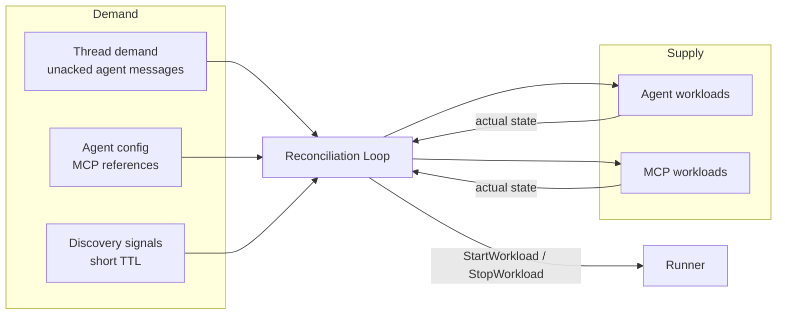
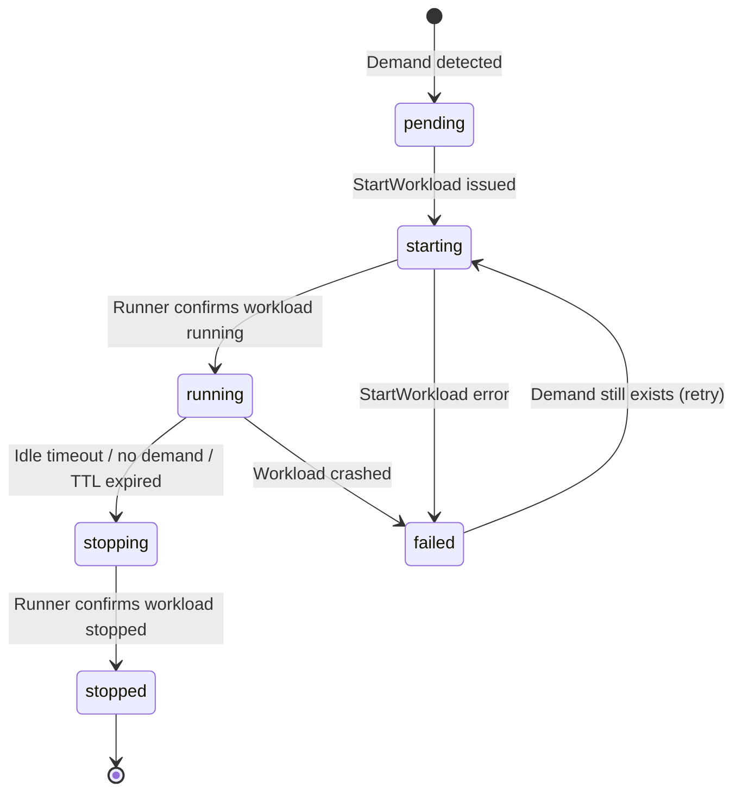
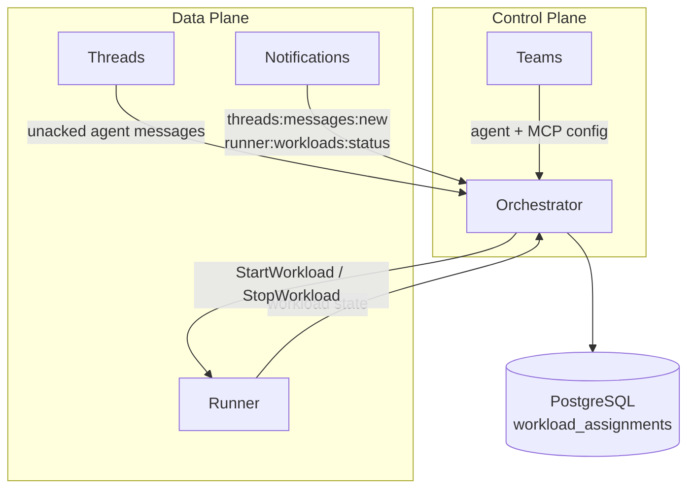

# Orchestrator

## Overview

The Orchestrator decides which workloads should be running and reconciles actual state toward that goal. It is the **only service** that starts and stops workloads through the [Runner](runner.md).

The Orchestrator is a **control plane** service. It does not touch messages, proxy traffic, or hold user-facing connections. It observes demand, compares it against running supply, computes the diff, and acts.

## Workload Types

The Orchestrator manages multiple workload types. Each type has its own demand source, but all share the same reconciliation pattern and Runner interface.

| Workload Type | Demand Source | Lifetime | Identity |
|---------------|--------------|----------|----------|
| **Agent** | Threads with unacked messages for agent participants | Until idle timeout or thread completes | Own [OpenZiti identity](authn.md) |
| **MCP Server** | Agent config references MCP server; or discovery signal | While referencing agents are running; or until discovery TTL expires | Own [OpenZiti identity](authn.md) |

Each workload is a separate Runner unit with its own OpenZiti network identity. Agents and MCP servers are **never co-located in the same workload** — they communicate over the network via gRPC (see [MCP Adapter](mcp-adapter.md)).

### Agent Workloads

An agent workload runs the agent process. Its demand comes from [Threads](threads.md) — specifically, threads with unacknowledged messages for agent participants.

```
Agent Workload
├── Main container: agent image (our implementation or wrapped 3rd-party CLI)
└── Sidecar: OpenZiti tunnel (network identity)
```

### MCP Server Workloads

An MCP server workload runs an MCP server behind the [MCP Adapter](mcp-adapter.md). The adapter is the container entrypoint — it launches the MCP server process, bridges its native transport (stdio or HTTP) to gRPC, and exposes a uniform gRPC interface over OpenZiti.

```
MCP Workload
├── Main container: MCP server image + adapter binary (entrypoint)
│   adapter --mode stdio --command "npx best-mcp-server" --grpc-port 50051
│   adapter --mode http  --command "uvx some-mcp --port 8080" --http-port 8080 --grpc-port 50051
└── Sidecar: OpenZiti tunnel (network identity)
```

MCP servers are separate workloads (not sidecars of the agent) because:
- Each workload has its own OpenZiti identity with independently scoped network access.
- An MCP server may be shared across multiple agents (singleton pattern).
- An MCP server may require different resources than the agent (e.g., GPU).

## Reconciliation

The Orchestrator runs a periodic reconciliation loop backed by PostgreSQL (see [Reconciliation Approach](control-data-plane.md#reconciliation)).

Each pass computes a diff between demand and supply per workload type, then acts on the result:

| Outcome | Condition | Action |
|---------|-----------|--------|
| **Start** | Demand exists, no workload running | `StartWorkload` via Runner |
| **Keep** | Demand exists, workload running | No action |
| **Stop** | No demand, workload idle beyond timeout | `StopWorkload` via Runner |
| **Restart** | Demand exists, workload in failed/stopped state | `StartWorkload` via Runner |

### Dependency Ordering

When an agent references MCP servers, the Orchestrator starts MCP server workloads first and waits for them to become ready before starting the agent workload. On shutdown, the agent workload is stopped first; MCP server workloads are stopped when no agents reference them.



### Agent Demand

The Orchestrator needs to know which threads have unacknowledged messages for agent participants.

[Threads](threads.md) is participant-type-agnostic — it does not distinguish agents from users. The Orchestrator maintains the set of agent identity IDs (from agent workload lifecycle). It queries Threads for unacked messages scoped to those IDs.

**Interface:** `GetParticipantsWithUnackedMessages(participant_ids: []UUID) → []{participant_id, thread_id}`. Returns (participant, thread) pairs that have at least one unacknowledged message. Bulk query — the Orchestrator passes all known agent identity IDs and gets back the full demand set in one call.

**Sync mechanism:** Pull + Notifications ([Consumer Sync Protocol](notifications.md#consumer-sync-protocol)).

- **Pull:** Each reconciliation pass calls `GetParticipantsWithUnackedMessages` as the source of truth.
- **Notifications:** The Orchestrator subscribes to the `threads:messages:new` room. Threads publishes to this room on every `SendMessage`. The notification wakes the Orchestrator to run a reconciliation pass immediately rather than waiting for the next timer tick.

The notification reduces latency between a user sending a message and the Orchestrator starting an agent workload. The pull ensures correctness — notifications are fire-and-forget and may be lost.

### MCP Server Demand

MCP server demand has two sources:

1. **Agent dependency.** The agent config (from [Teams](teams.md)) references MCP servers via [attachments](resource-definitions.md#attachment). When the Orchestrator determines that an agent workload should be running, it resolves the agent's attached MCP servers and ensures those workloads are running first.

2. **Discovery signal.** The UI can request MCP tool discovery by creating a short-TTL signal. The Orchestrator starts the MCP server workload, the UI queries it for tool listings through a dedicated platform service (the UI does not connect to the MCP workload directly), and the workload is automatically stopped when the TTL expires. See [Tool Discovery](#tool-discovery).

### Supply: Running Workloads

The Orchestrator maintains a synchronized view of all workloads it manages via the Runner.

**Sync mechanism:** Pull + Notifications ([Consumer Sync Protocol](notifications.md#consumer-sync-protocol)).

- **Pull:** The Orchestrator queries the Runner for all workloads matching orchestrator-managed labels (e.g., `managed-by=orchestrator`). This returns the full supply set.
- **Notifications:** The Orchestrator subscribes to the `runner:workloads:status` room. Runner publishes to this room on workload state transitions (started, stopped, failed). The notification triggers an immediate reconciliation pass.

The Orchestrator maintains an in-memory supply map updated by both pull results and notification events. The periodic pull re-syncs the full state and corrects any drift.

## State

The Orchestrator tracks workload assignments in PostgreSQL:

### workload_assignments

| Column | Type | Description |
|--------|------|-------------|
| `id` | UUID | Primary key |
| `workload_type` | enum | `agent`, `mcp_server` |
| `identity_id` | UUID | OpenZiti identity for this workload |
| `runner_workload_id` | string | Workload ID returned by Runner (null while pending) |
| `status` | enum | `pending`, `starting`, `running`, `stopping`, `stopped`, `failed` |
| `last_activity_at` | timestamp | Last demand observed |
| `created_at` | timestamp | When assignment was created |
| `updated_at` | timestamp | Last status change |
| `tenant_id` | UUID | Tenant scope |

### agent_assignments

| Column | Type | Description |
|--------|------|-------------|
| `workload_assignment_id` | UUID | FK to `workload_assignments` |
| `agent_identity_id` | UUID | The agent's platform identity |
| `thread_id` | UUID | Thread being served |

### mcp_assignments

| Column | Type | Description |
|--------|------|-------------|
| `workload_assignment_id` | UUID | FK to `workload_assignments` |
| `mcp_server_id` | UUID | Teams MCP server resource ID |
| `discovery` | boolean | `true` if started for tool discovery |
| `ttl_expires_at` | timestamp (nullable) | Discovery TTL expiration (null for agent-demand MCP) |

This structure makes the reconciliation loop idempotent. If the Orchestrator crashes mid-loop, it restarts and diffs again — assignments in `pending` or `starting` states are reconciled against actual Runner state.

### Status Transitions



## Workload Assembly

When starting a workload, the Orchestrator assembles the `StartWorkloadRequest` for the Runner.

### Agent Workload Assembly

1. **Resolve agent config** from [Teams](teams.md) — image, model, system prompt, behavior settings, workspace configuration.
2. **Resolve MCP server dependencies** — ensure all referenced MCP server workloads are running and ready.
3. **Provision identity** — create an [OpenZiti identity](authn.md) for the agent. The identity is created before the workload starts and deleted when it stops.
4. **Build container spec** — agent image, environment variables (thread ID, agent identity, platform service endpoints, MCP server gRPC endpoints, OpenZiti enrollment token).

### MCP Server Workload Assembly

1. **Resolve MCP server config** from [Teams](teams.md) — image, command, transport mode, workspace configuration.
2. **Provision identity** — create an [OpenZiti identity](authn.md) scoped to the network access this MCP server requires.
3. **Build container spec** — MCP server image with the [MCP Adapter](mcp-adapter.md) binary as entrypoint. Environment variables include the MCP server command, transport mode, gRPC port, and OpenZiti enrollment token.

The Orchestrator does not fetch configs on every reconciliation pass. Config is fetched when starting a new workload. Running workloads are not hot-reloaded.

## Idle Timeout

The Orchestrator owns idle timeout enforcement for agent workloads. During each reconciliation pass, it checks `last_activity_at` for running agent workloads against the configured timeout. If the timeout is exceeded and no unacknowledged messages remain for the agent participant, the Orchestrator stops the workload.

`last_activity_at` is derived from the demand query — if a thread has unacked messages, the agent is not idle. The absence of the agent's identity from the demand result, combined with elapsed time since the last demand was observed, determines idleness.

MCP server workloads are stopped when no agent workloads reference them (no remaining demand). Discovery MCP workloads are stopped when their TTL expires.

The agent container does not implement idle detection. It may exit naturally (process completion, crash), but the Orchestrator is the authority for lifecycle management.

## Tool Discovery

The UI can discover available tools from an MCP server without a running agent. The flow:

1. UI creates a **discovery signal** — a short-TTL request specifying the MCP server resource ID.
2. The Orchestrator's reconciliation loop picks up the signal and starts the MCP server workload with the `discovery` flag and a TTL.
3. The MCP server starts and the adapter exposes gRPC.
4. The UI queries the MCP server's tool listing through a dedicated platform service (the UI does not connect to the MCP workload directly).
5. When the TTL expires, the Orchestrator stops the MCP server workload.

This reuses the same reconciliation loop — no special synchronous path. The discovery signal is just another demand source for MCP server workloads.

## Failure Handling

| Failure | Behavior |
|---------|----------|
| `StartWorkload` fails | Assignment marked `failed`. Retried on next reconciliation pass if demand still exists |
| Workload crashes | Runner publishes workload status change. Orchestrator detects demand without supply on next pass → restarts |
| Runner unreachable | Orchestrator cannot confirm supply. Logs error, retries next pass. Running workloads continue independently |
| Orchestrator crashes | Restarts, loads assignments from PostgreSQL, queries Runner for actual state, reconciles the diff |
| MCP server fails to start | Agent workload start is deferred. MCP server restart is retried. Agent only starts when all dependencies are ready |

## Notification Rooms

The Orchestrator uses two source-oriented notification rooms:

| Room | Publisher | Event | Subscriber |
|------|-----------|-------|------------|
| `threads:messages:new` | Threads | New message sent | Orchestrator |
| `runner:workloads:status` | Runner | Workload state transition | Orchestrator |

These rooms are **broadcast topics** — any consumer interested in the event type can subscribe. They complement the existing per-recipient rooms (`thread_participant:{id}`, `workload:{id}`) which serve individual consumers.

## Interactions



The Orchestrator reads from Threads, Teams, and Runner. It writes only to Runner (start/stop) and its own PostgreSQL database. It does not write messages, manage configs, or hold any user-facing connections.
