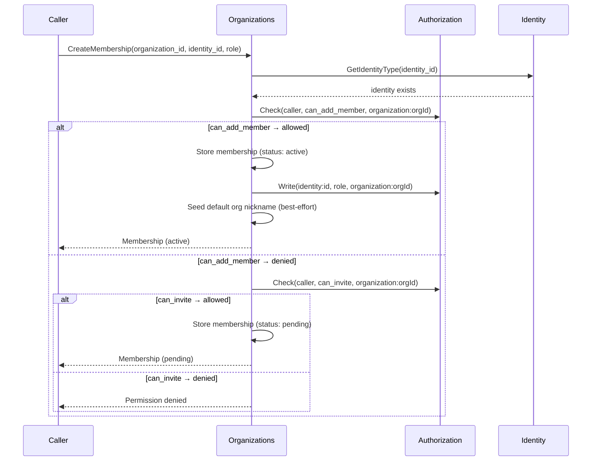
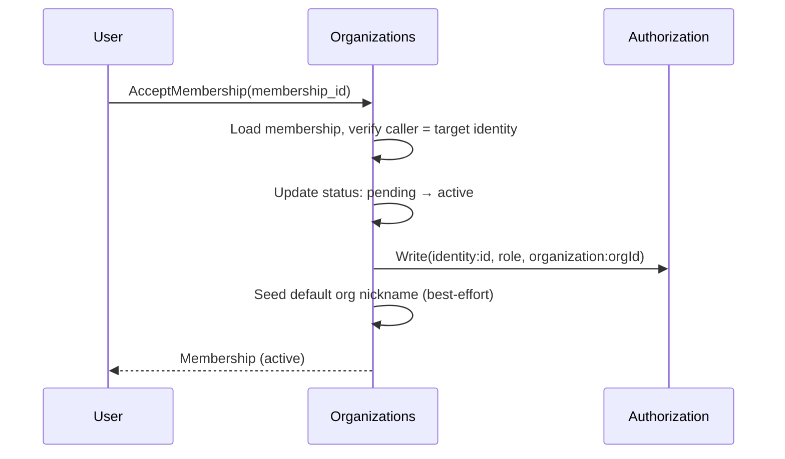

# Organizations

## Overview

The platform uses **organizations** as the grouping unit for configuration resources. An organization owns agents, LLM providers, models, secret providers, secrets, and chats. Resources that belong to an organization have an `organization_id` field.

Not all resources belong to organizations. Threads, files, agent state, and workloads are **independent resources** — access to them is governed by [ReBAC permissions](authz.md) rather than organizational membership. This separation reflects the domain: conversations (threads) and runtime artifacts (state, workloads) connect participants across organizational boundaries, while configuration resources (agents, providers, secrets) are organizational infrastructure.

## Organization Model

| Field | Type | Description |
|-------|------|-------------|
| `id` | string (UUID) | Unique organization identifier |
| `name` | string | Display name |
| `created_at` | timestamp | Creation time |

## Organizations Service

The Organizations service is a **control plane** service.

### Responsibilities

| Concern | Description |
|---------|-------------|
| **Organization CRUD** | Create, read, update, delete organizations |
| **List accessible organizations** | Return organizations an identity can access, based on active memberships in the `memberships` table |
| **Members management** | Add, remove, list members, update member roles, and manage membership invites. See [Members Management](#members-management) |

### Data Store

PostgreSQL — `organizations` and `memberships` tables.

## Organization Access

Organization access is managed through memberships. Each active membership corresponds to an [Authorization](authz.md) (OpenFGA) relationship tuple. See [Authorization — Organization Permissions](authz.md#organization-permissions) for the permission model and [Members Management](#members-management) for the membership lifecycle.

## Identities and Organizations

Any identity — user, agent, runner, or app — can have access to an organization. What an identity can do within an organization is determined by its [authorization relationships](authz.md), not by its type.

An identity can have access to multiple organizations. Membership is managed by the Organizations service — the [Users](users.md) service has no organization association.

See [Identity](identity.md) for the identity registry and [Authentication](authn.md) for how identity context is propagated.

## Members Management

The Organizations service manages organization membership. A **membership** is the relationship between an identity and an organization, with a role (`owner` or `member`).

### Membership Model

| Field | Type | Description |
|-------|------|-------------|
| `id` | string (UUID) | Unique membership identifier |
| `organization_id` | string (UUID) | Organization |
| `identity_id` | string (UUID) | Identity being granted membership |
| `role` | enum | `owner`, `member` |
| `status` | enum | `pending`, `active` |
| `expires_at` | timestamp, nullable | Optional expiration date. Null means no expiration |
| `created_at` | timestamp | Creation time |
| `updated_at` | timestamp | Last modification time |

### Status Lifecycle

| Status | Description |
|--------|-------------|
| **pending** | Invite — the target identity has not yet accepted. No OpenFGA tuple exists. The identity has no access to the organization |
| **active** | Effective membership — an OpenFGA relationship tuple exists (`identity:<identity_id>, <role>, organization:<organization_id>`). The identity has access to the organization |

A membership transitions from `pending` to `active` in two ways:
- **Invite acceptance** — the target identity calls `AcceptMembership`.
- **Direct creation** — a caller with `can_add_member` permission creates a membership that is immediately `active` (no invite step). See [Membership Authorization](#membership-authorization).

### Default Nickname on Activation

When a membership becomes `active` (either via `AcceptMembership` or direct creation), and the target identity is a user, the Organizations service seeds a default [org nickname](identity.md#nickname-index) for that user in the organization:

1. Read the user's current cluster-wide `username` from the [Users](users.md#username) service.
2. Call [Identity](identity.md) `SetNickname(org_id, identity_id, nickname=username)`.
3. On conflict (the nickname is already taken in that org), skip silently — the user can pick one later via the Console profile menu.

This step is best-effort: failures do not block activation. The seeded nickname is independent of the user's `username` going forward — renaming `username` does not cascade, and the user may change the org nickname freely.

### Membership Authorization

Who can do what is governed by the [authorization model](authz.md):

| Action | Required Permission | Who Has It | Behavior |
|--------|-------------------|------------|----------|
| **Create membership (direct)** | `can_add_member` on the organization | Cluster admins (via computed relation from `cluster:global admin`) | Creates membership with `status: active`. Writes OpenFGA tuple immediately |
| **Create membership (invite)** | `can_invite` on the organization | Organization owners (via `owner` implies `can_invite`) | Creates membership with `status: pending`. No OpenFGA tuple until accepted |
| **Accept membership** | Target identity matches the caller | The invited identity itself | Transitions `pending` → `active`. Writes OpenFGA tuple |
| **Decline membership** | Target identity matches the caller | The invited identity itself | Deletes the `pending` membership |
| **Remove member** | `can_manage_members` on the organization | Organization owners (via `owner` implies `can_manage_members`) | Deletes the membership (any status). Deletes OpenFGA tuple if `active` |
| **Update member role** | `can_manage_members` on the organization | Organization owners (via `owner` implies `can_manage_members`) | Updates the role. If `active`, deletes old OpenFGA tuple and writes new one |
| **List members** | `can_manage_members` on the organization | Organization owners | Returns memberships for the organization |
| **List my memberships** | Caller is the identity | Any identity | Returns the caller's own memberships across all organizations |

The Organizations service does not perform explicit identity type checks (e.g., "is the caller a cluster admin?"). All access decisions flow through [Authorization](authz.md) `Check` calls. See [Authorization — Organization Permissions](authz.md#organization-permissions) for how `can_add_member`, `can_invite`, and `can_manage_members` are defined.

### Interface

| Method | Description |
|--------|-------------|
| **CreateMembership** | Create a membership for an identity in an organization. Caller must have `can_add_member` (direct → `active`) or `can_invite` (invite → `pending`) on the organization. The identity must already exist in the [Identity](identity.md) registry. Console callers typically resolve the target identity via [Users — SearchUsers](users.md#user-directory) before invoking this method |
| **AcceptMembership** | Accept a pending membership. Caller must be the target identity. Transitions `pending` → `active` and writes the OpenFGA tuple |
| **DeclineMembership** | Decline a pending membership. Caller must be the target identity. Deletes the membership |
| **RemoveMembership** | Remove a membership (any status). Caller must have `can_manage_members`. Deletes the OpenFGA tuple if `active` |
| **UpdateMembershipRole** | Update the role of a membership. Caller must have `can_manage_members`. If `active`, updates the OpenFGA tuple |
| **ListMembers** | List memberships for an organization. Supports filtering by `status` (`pending`, `active`, or all). Caller must have `can_manage_members` |
| **ListMyMemberships** | List the calling identity's own memberships across all organizations. Supports filtering by `status`. Used by Chat for the organization switcher and by Console for pending invite display |

### CreateMembership Flow

### AcceptMembership Flow

### Expiration

Memberships can optionally carry an `expires_at` timestamp. The platform does not automatically remove expired memberships — expiration is informational and can be used by consumers (Console, Terraform) to display or enforce time-limited access. Enforcement of expiration (e.g., revoking access after the date passes) is a future extension.

## Resource Scoping

Resources are classified into two categories: **org-scoped** and **independent**.

### Org-Scoped Resources

Org-scoped resources belong to an organization. They have an `organization_id` field and are listed/queried within the context of an organization.

| Service | Resources | Notes |
|---------|-----------|-------|
| [Agents](agents-service.md) | Agents, Volumes | Direct `organization_id` on the resource |
| [Agents](agents-service.md) | MCPs, Skills, Hooks, ENVs, InitScripts, Volume Attachments | Inherit org scope through parent (agent, MCP, or hook). No `organization_id` column — org is resolved via the parent chain. Can be denormalized if query patterns require it |
| [LLM](llm.md) | LLM Providers, Models | `organization_id` on the resource |
| [Secrets](secrets.md) | Secret Providers, Secrets | `organization_id` on the resource |
| [Chat](chat.md) | Chats | `organization_id` for listing chats within an organization. The underlying [thread](threads.md) is independent |

### Independent Resources

Independent resources have no `organization_id`. Access is governed by [ReBAC permissions](authz.md) on the resource itself or on a related resource.

| Service | Resources | Access Model |
|---------|-----------|-------------|
| [Threads](threads.md) | Threads, Messages, MessageRecipients | ReBAC permissions on the thread |
| [Files](media.md) | File metadata and objects | ReBAC permissions via the thread that references the file |
| [Runner](runner.md) | Workloads | Owned by agent via ReBAC |
| [Identity](identity.md) | Identity records | System-wide, no org association |
| [Users](users.md) | User records and profiles | System-wide, no org association |
| [Notifications](notifications.md) | Room subscriptions | Room-based routing by resource ID, no org scoping |
| [Tracing](tracing.md) | Tracing data | Independent |

## Data Isolation

Org-scoped services include `organization_id` as a column on org-scoped tables. Queries filter by `organization_id` when listing resources within an organization.

Independent resources do not filter by organization. Access control is enforced through [Authorization](authz.md) checks on the specific resource or its parent.

Object storage (S3) keys are not prefixed by organization — files are independent resources identified by UUID.

## Request Flow

There is no organization header on requests. Services that operate on org-scoped resources accept `organization_id` as a request parameter on methods that need it (e.g., listing agents in an organization, creating a chat in an organization). The [Authorization](authz.md) model enforces that the caller has the appropriate relationship to the organization.

The [Gateway](gateway.md) authenticates the identity but does not validate organization membership — that responsibility belongs to the authorization model, checked by the service performing the operation.

## Future: System-Wide Providers

The current model scopes all providers (LLM, secrets) to organizations. A future extension may introduce **system-wide providers** — providers available to all organizations without per-org configuration. The mechanism (e.g., OpenFGA wildcard relationships, a dedicated `system` type) will be designed when the use case is concrete. The org-scoped model documented here is forward-compatible with this extension.
