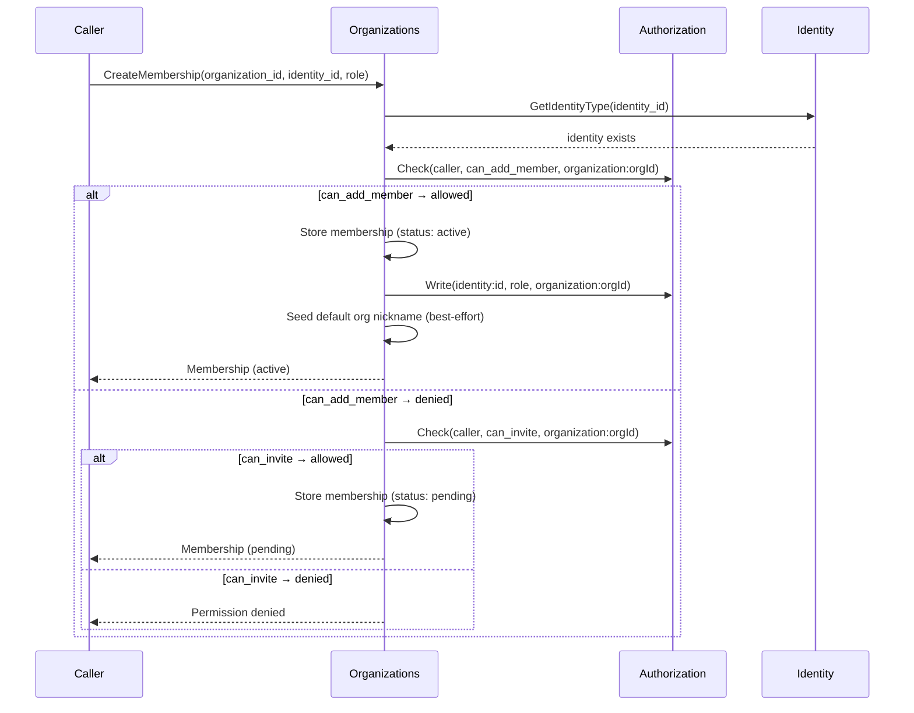
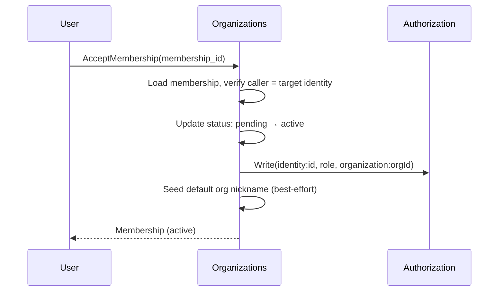

# Organizations

## Overview

The platform uses **organizations** as the grouping unit for configuration resources. An organization owns agents, sandboxes, environments, images, LLM providers, models, secret providers, secrets, and chats. Resources that belong to an organization have an `organization_id` field.

Not all resources belong to organizations. Threads, files, agent state, and workloads are **independent resources** — access to them is governed by [ReBAC permissions](authz.md) rather than organizational membership. This separation reflects the domain: conversations (threads) and runtime artifacts (state, workloads) connect participants across organizational boundaries, while configuration resources (agents, sandboxes, providers, secrets) are organizational infrastructure.

## Organization Model

| Field | Type | Description |
|-------|------|-------------|
| `id` | string (UUID) | Unique organization identifier |
| `name` | string | Display name |
| `slug` | string | Cluster-wide unique short name. Max 63 chars, pattern: `^[a-z0-9]([a-z0-9-]*[a-z0-9])?$`. See [Slug](#slug) |
| `state` | enum | `active` or `deleting`. See [Deletion](#deletion) |
| `sandbox_default_idle_timeout` | duration string | Idle timeout applied when the creator names none. Platform-bounded; default `30m` |
| `sandbox_max_idle_timeout` | duration string | Ceiling on an idle timeout a creator may ask for. Platform-bounded; defaults to the platform maximum |
| `sandbox_default_ttl` | duration string | Default hard lifetime snapshotted onto newly created sandboxes. Platform-bounded; default `72h`, maximum `336h` |
| `created_at` | timestamp | Creation time |

## Slug

Organizations carry a **cluster-wide unique** slug alongside their display name. Uniqueness is cluster-wide rather than per-anything, because the slug appears in identifiers that must resolve without an organization already in context:

| Consumer | Use |
|---|---|
| [Apps](apps.md#identification) | An app's globally unique address is `{org-slug}/{app-slug}` |
| [Image Proxy](image-proxy.md#reference-rewriting) | An image reference is `<proxy-host>/<org-slug>/<image-name>:<tag>` |
| [Expose](expose-service.md#hostname) | An exposed port's address is `<entity>.<org-slug>.agyn:<port>` |

The slug is constrained to a valid **DNS label** — at most 63 characters, no leading or trailing hyphen — because [Expose](expose-service.md#derivation) puts it in a hostname. The other two consumers accept anything the pattern allows; this one does not, so the tighter rule is enforced at the source rather than worked around downstream.

The slug is mutable — renaming an organization is a legitimate operation — but a rename is visible: app addresses change, image references change (costing a one-time container-image cache miss per node, since references are re-resolved at every workload start), and the address of every live port exposure in the organization changes. The first two break nothing, because neither consumer stores a resolved reference. The third does break already-shared exposure links, which the Expose service [rewrites but cannot forward](expose-service.md#stability).

Because slugs are cluster-wide and reusable, a released slug can be claimed by another organization. Anything that stored an app address as text rather than an ID would then resolve somewhere else. Addresses are for humans and CLI input; stored references use IDs.

A slug is released by a rename immediately, and by a [deletion](#deletion) only once the purge has finished. The asymmetry is deliberate: a rename leaves nothing behind on the old slug, while an organization being dismantled still has live exposures answering on `<entity>.<org-slug>.agyn` until its records are gone. Handing that name to a new organization in the meantime would put two organizations' entities in one hostname zone.

## Sandbox Settings

Organizations own the default sandbox lifecycle settings used by the [Agents service](agents-service.md) when creating [Sandboxes](resource-definitions.md#sandbox):

| Setting | Default | Bounds | Description |
|---------|---------|--------|-------------|
| `sandbox_default_idle_timeout` | `30m` | Platform minimum/maximum | How long a sandbox may remain detached before its workload is stopped, when the creator names no value. The sandbox record survives idle stop, as do the persistent volumes its [environment](resource-definitions.md#environment) declares |
| `sandbox_max_idle_timeout` | Platform maximum | Platform minimum/maximum | The largest idle timeout a creator may ask for. `CreateSandbox` rejects a larger value rather than clamping it, naming this ceiling |
| `sandbox_default_ttl` | `72h` | Platform maximum `336h` | Hard sandbox lifetime from creation. On expiry the sandbox is terminated and the volumes provisioned for it are deleted |

Updating these settings requires `can_manage_organization` — organization owners and cluster admins. Values are validated by Organizations before persistence. The Agents service snapshots the resolved values onto each sandbox at creation; changing organization settings never mutates existing sandboxes.

**Two settings for idle timeout, not one.** The default is what an engineer who has not thought about it gets; the maximum is what the organization is willing to pay for when someone has. Collapsing them would mean the default is also the most expensive option available, which inverts what a default is for. The ceiling defaults to the platform maximum — an organization narrows it deliberately, and `sandbox_default_ttl` remains the hard backstop underneath either way: an idle timeout can keep a sandbox alive, but never past its TTL.

## Organizations Service

The Organizations service is a **control plane** service.

### Responsibilities

| Concern | Description |
|---------|-------------|
| **Organization CRUD** | Create, read, update, delete organizations. Deletion is a lifecycle the service drives to completion across every org-scoped service — see [Deletion](#deletion) |
| **List accessible organizations** | Return organizations an identity can access, based on active memberships in the `memberships` table |
| **Members management** | Add, remove, list members, update member roles, and manage membership invites. See [Members Management](#members-management) |

### Data Store

PostgreSQL — `organizations` and `memberships` tables.

## Organization Access

Organization access is managed through memberships. Each active membership corresponds to an [Authorization](authz.md) (OpenFGA) relationship tuple. See [Authorization — Organization Permissions](authz.md#organization-permissions) for the permission model and [Members Management](#members-management) for the membership lifecycle.

## Identities and Organizations

Any identity — user, agent, runner, or app — can have access to an organization. What an identity can do within an organization is determined by its [authorization relationships](authz.md), not by its type.

An identity can have access to multiple organizations. Membership is managed by the Organizations service — the [Users](users.md) service has no organization association.

See [Identity](identity.md) for the identity registry and [Authentication](authn.md) for how identity context is propagated.

## Members Management

The Organizations service manages organization membership. A **membership** is the relationship between an identity and an organization, with a role (`owner` or `member`).

### Membership Model

| Field | Type | Description |
|-------|------|-------------|
| `id` | string (UUID) | Unique membership identifier |
| `organization_id` | string (UUID) | Organization |
| `identity_id` | string (UUID) | Identity being granted membership |
| `role` | enum | `owner`, `member` |
| `status` | enum | `pending`, `active` |
| `expires_at` | timestamp, nullable | Optional expiration date. Null means no expiration |
| `created_at` | timestamp | Creation time |
| `updated_at` | timestamp | Last modification time |

### Status Lifecycle

| Status | Description |
|--------|-------------|
| **pending** | Invite — the target identity has not yet accepted. No OpenFGA tuple exists. The identity has no access to the organization |
| **active** | Effective membership — an OpenFGA relationship tuple exists (`identity:<identity_id>, <role>, organization:<organization_id>`). The identity has access to the organization |

A membership transitions from `pending` to `active` in two ways:
- **Invite acceptance** — the target identity calls `AcceptMembership`.
- **Direct creation** — a caller with `can_add_member` permission creates a membership that is immediately `active` (no invite step). See [Membership Authorization](#membership-authorization).

### Default Nickname on Activation

When a membership becomes `active` (either via `AcceptMembership` or direct creation), and the target identity is a user, the Organizations service seeds a default [org nickname](identity.md#nickname-index) for that user in the organization:

1. Read the user's current cluster-wide `username` from the [Users](users.md#username) service.
2. Call [Identity](identity.md) `SetNickname(org_id, identity_id, nickname=username)`.
3. On conflict (the nickname is already taken in that org), skip silently — the user can pick one later via the Console profile menu.

This step is best-effort: failures do not block activation. The seeded nickname is independent of the user's `username` going forward — renaming `username` does not cascade, and the user may change the org nickname freely.

### Membership Authorization

Who can do what is governed by the [authorization model](authz.md):

| Action | Required Permission | Who Has It | Behavior |
|--------|-------------------|------------|----------|
| **Create membership (direct)** | `can_add_member` on the organization | Cluster admins (via computed relation from `cluster:global admin`) | Creates membership with `status: active`. Writes OpenFGA tuple immediately |
| **Create membership (invite)** | `can_invite` on the organization | Organization owners (via `owner` implies `can_invite`) | Creates membership with `status: pending`. No OpenFGA tuple until accepted |
| **Accept membership** | Target identity matches the caller | The invited identity itself | Transitions `pending` → `active`. Writes OpenFGA tuple |
| **Decline membership** | Target identity matches the caller | The invited identity itself | Deletes the `pending` membership |
| **Remove member** | `can_manage_members` on the organization | Organization owners and cluster admins | Deletes the membership (any status). Deletes OpenFGA tuple if `active` |
| **Update member role** | `can_manage_members` on the organization | Organization owners and cluster admins | Updates the role. If `active`, deletes old OpenFGA tuple and writes new one |
| **List members** | `can_manage_members` on the organization | Organization owners and cluster admins | Returns memberships for the organization |
| **List my memberships** | Caller is the identity | Any identity | Returns the caller's own memberships across all organizations |
| **Update sandbox settings** | `can_manage_organization` on the organization | Organization owners and cluster admins | Validates and stores new default sandbox TTL/idle-timeout values for future sandbox creation |
| **Rename organization or change slug** | `can_manage_organization` on the organization | Organization owners and cluster admins | Updates `name` and/or `slug`. See [Slug](#slug) for what a slug change moves |
| **Delete organization** | `can_manage_organization` on the organization | Organization owners and cluster admins | Moves the organization to `deleting` and starts the purge. See [Deletion](#deletion) |

The Organizations service does not perform explicit identity type checks (e.g., "is the caller a cluster admin?"). All access decisions flow through [Authorization](authz.md) `Check` calls. See [Authorization — Organization Permissions](authz.md#organization-permissions) for how `can_add_member`, `can_invite`, and `can_manage_members` are defined.

### Interface

| Method | Description |
|--------|-------------|
| **CreateMembership** | Create a membership for an identity in an organization. Caller must have `can_add_member` (direct → `active`) or `can_invite` (invite → `pending`) on the organization. The identity must already exist in the [Identity](identity.md) registry. Console callers typically resolve the target identity via [Users — SearchUsers](users.md#user-directory) before invoking this method |
| **AcceptMembership** | Accept a pending membership. Caller must be the target identity. Transitions `pending` → `active` and writes the OpenFGA tuple |
| **DeclineMembership** | Decline a pending membership. Caller must be the target identity. Deletes the membership |
| **RemoveMembership** | Remove a membership (any status). Caller must have `can_manage_members`. Deletes the OpenFGA tuple if `active` |
| **UpdateMembershipRole** | Update the role of a membership. Caller must have `can_manage_members`. If `active`, updates the OpenFGA tuple |
| **ListMembers** | List memberships for an organization. Supports filtering by `status` (`pending`, `active`, or all). Caller must have `can_manage_members` |
| **ListMyMemberships** | List the calling identity's own memberships across all organizations. Supports filtering by `status`. Used by Chat for the organization switcher and by Console for pending invite display |
| **UpdateOrganization** | Update the organization's name, [slug](#slug), and sandbox defaults. Caller must have `can_manage_organization`. A slug that another organization holds — including one in `deleting` — is rejected as taken |
| **DeleteOrganization** | Request deletion of the organization and everything scoped to it. Caller must have `can_manage_organization`. Returns once the organization is in `deleting`; the purge completes asynchronously. See [Deletion](#deletion) |

Every org-scoped service exposes the other half of the lifecycle: `DeleteOrganizationResources(organization_id)`, internal and callable only by Organizations, removing that service's records for the organization. See [Teardown Order](#teardown-order).

### CreateMembership Flow

```mermaid
sequenceDiagram
    participant Caller
    participant Orgs as Organizations
    participant Auth as Authorization
    participant I as Identity

    Caller->>Orgs: CreateMembership(organization_id, identity_id, role)
    Orgs->>I: GetIdentityType(identity_id)
    I-->>Orgs: identity exists
    Orgs->>Auth: Check(caller, can_add_member, organization:orgId)
    alt can_add_member → allowed
        Orgs->>Orgs: Store membership (status: active)
        Orgs->>Auth: Write(identity:id, role, organization:orgId)
        Orgs->>Orgs: Seed default org nickname (best-effort)
        Orgs-->>Caller: Membership (active)
    else can_add_member → denied
        Orgs->>Auth: Check(caller, can_invite, organization:orgId)
        alt can_invite → allowed
            Orgs->>Orgs: Store membership (status: pending)
            Orgs-->>Caller: Membership (pending)
        else can_invite → denied
            Orgs-->>Caller: Permission denied
        end
    end
```

### AcceptMembership Flow

```mermaid
sequenceDiagram
    participant User
    participant Orgs as Organizations
    participant Auth as Authorization

    User->>Orgs: AcceptMembership(membership_id)
    Orgs->>Orgs: Load membership, verify caller = target identity
    Orgs->>Orgs: Update status: pending → active
    Orgs->>Auth: Write(identity:id, role, organization:orgId)
    Orgs->>Orgs: Seed default org nickname (best-effort)
    Orgs-->>User: Membership (active)
```

### Expiration

Memberships can optionally carry an `expires_at` timestamp. The platform does not automatically remove expired memberships — expiration is informational and can be used by consumers (Console, Terraform) to display or enforce time-limited access. Enforcement of expiration (e.g., revoking access after the date passes) is a future extension.

## Resource Scoping

Resources are classified into two categories: **org-scoped** and **independent**.

### Org-Scoped Resources

Org-scoped resources belong to an organization. They have an `organization_id` field and are listed/queried within the context of an organization.

| Service | Resources | Notes |
|---------|-----------|-------|
| [Agents](agents-service.md) | Agents, Environments, Sandboxes | Direct `organization_id` on the resource |
| [Images](images-service.md) | Images | Direct `organization_id`. `public` images are additionally readable by every organization — see [Images Service — Visibility](images-service.md#visibility) |
| [Agents](agents-service.md) | Volumes, MCPs, Skills, ENVs, InitScripts | Inherit org scope through parent (environment, agent, or MCP). No `organization_id` column — org is resolved via the parent chain. Can be denormalized if query patterns require it |
| [LLM](llm.md) | LLM Providers, Models | `organization_id` on the resource |
| [Secrets](secrets.md) | Secret Providers, Secrets | `organization_id` on the resource |
| [Chat](chat.md) | Chats | `organization_id` for listing chats within an organization. The underlying [thread](threads.md) is independent |

### Independent Resources

Independent resources have no `organization_id`. Access is governed by [ReBAC permissions](authz.md) on the resource itself or on a related resource.

| Service | Resources | Access Model |
|---------|-----------|-------------|
| [Threads](threads.md) | Threads, Messages, MessageRecipients | ReBAC permissions on the thread |
| [Files](media.md) | File metadata and objects | ReBAC permissions via the thread that references the file |
| [Runner](runner.md) | Workloads | Owned by agent via ReBAC |
| [Identity](identity.md) | Identity records | System-wide, no org association |
| [Users](users.md) | User records and profiles | System-wide, no org association |
| [Notifications](notifications.md) | Room subscriptions | Room-based routing by resource ID, no org scoping |
| [Tracing](tracing.md) | Tracing data | Independent |

## Data Isolation

Org-scoped services include `organization_id` as a column on org-scoped tables. Queries filter by `organization_id` when listing resources within an organization.

Independent resources do not filter by organization. Access control is enforced through [Authorization](authz.md) checks on the specific resource or its parent.

Object storage (S3) keys are not prefixed by organization — files are independent resources identified by UUID.

## Deletion

Deleting an organization deletes its resources first and the organization last. That order is the specification, not an implementation detail: the organization record is what every one of those resources is scoped *by*, and an organization that outlives its contents is still a thing anyone can point at and finish, while contents that outlive their organization are unreachable, unlistable, and unowned.

**A non-empty organization is not refused.** The alternative — an owner emptying a dozen sections by hand before the button works — turns the platform's bookkeeping into the user's chore. The organization is the boundary; removing it removes what is inside it.

**The teardown is driven, not announced.** Organizations calls each org-scoped service in a fixed [order](#teardown-order) and waits for it, rather than publishing a fact and letting each service purge whenever it gets to it. Order is the whole reason: the platform's own deletion rules are ordered. An environment is refused while an agent or a sandbox references it. A group is named by private-resource grants. An image is named by environments and MCPs. Unordered purging would need every service to grow a *second* deletion path that skips its own invariants; a driven cascade uses the paths that already exist and hits them when their references are already gone.

### Phases

| Phase | What happens |
|---|---|
| **1. Close** | The organization moves to `deleting`. Its `member` and `owner` OpenFGA tuples are deleted. The call returns |
| **2. Cascade** | Organizations calls `DeleteOrganizationResources` on each org-scoped service in [teardown order](#teardown-order), retrying a failing step until it succeeds |
| **3. Remove** | Memberships, any tuples still on `organization:<id>`, and the organization row are deleted. The slug becomes claimable |

**Revoking access is not part of deleting the organization** — it is what makes deleting its resources safe. Without it, a member creates an agent into an organization the cascade has already walked past, and that agent outlives the organization. So the access tuples go first, at the request, while the memberships they were written from stay until phase 3 with the rest of the record.

An organization in `deleting` is excluded from `ListAccessibleOrganizations` and `ListMyMemberships` — which follows from the tuples being gone — and every write to it is refused. A repeated `DeleteOrganization` is a no-op, not an error.

Cluster admins are the exception, holding `can_manage_organization` through `admin from cluster` rather than through a tuple on the organization. `ListOrganizations` continues to return the organization with its `state` and the step the cascade has reached, which is what makes a stalled teardown visible.

### Teardown Order

Each step is one `DeleteOrganizationResources(organization_id)` call to the named service — an [internal RPC](authz.md#internal-rpc-authorization), callable only by Organizations. A step completes when the service has removed everything listed.

| Step | Service | Removes | Why here |
|---|---|---|---|
| 1 | [Agents](agents-service.md) | Sandboxes and their shares, agent instances and their state, agents and their sub-resources (MCPs, skills, ENVs, init scripts, volume declarations), environments | First. Almost everything else in the organization is either referenced by these or refuses to be deleted while they exist |
| 2 | [Runners](runners.md) | Workload records, provisioned volume records, org-scoped runners | After their owners. Removing the records is what makes the running pods and disks orphans, which the [Orchestrator](agents-orchestrator.md#reconciliation) then stops and deprovisions — no stop-everything path is added for a case reconciliation already covers |
| 3 | [Apps](apps-service.md) | Installations into the organization, apps published by it, and those apps' installations in *other* organizations | After the agents those installations could reach. Publishing an app is a commitment that outlives the publisher's own use of it, and deleting the publisher ends it |
| 4 | [Chat](chat.md), [Threads](threads.md) | Chats, then threads carrying the organization's `organization_id` and their messages | After the agent instances that participated in them |
| 5 | [Networks](networks-service.md), [EgressRules](egress-rules-service.md) | Networks, tunnel credentials, private resources, access grants and the OpenZiti objects behind them; egress rules and their agent attachments | After agents, whose attachments and grants name them |
| 6 | [Images](images-service.md), [LLM](llm.md), [Secrets](secrets.md) | Images — including `public` ones other organizations were reading; providers and models; secret providers and secret references | Last of the configuration, because environments, MCPs, and agents named all three |
| 7 | [Groups](groups-service.md) | Groups and their memberships | After the grants that named them |
| 8 | [Identity](identity.md) | `org_nicknames` entries for the organization | After the identities that held them. The identity records themselves are deleted by the services that registered them, in the steps above |

Secret *values* live in the external store the provider names and are not touched. The platform deletes its reference to them, not the credential.

### What Survives

| Not deleted | Why |
|---|---|
| [Metering](metering.md) and [tracing](tracing.md) data | Time series with their own retention. Deleting on request would rewrite billing history. Both are unreachable regardless — every query is org-scoped and the organization is gone |
| File objects | The [Files service](media.md) has no deletion path. Objects are keyed by UUID and become unreachable once the threads referencing them are deleted, but they stay in object storage |
| [User](users.md) records | System-wide. A user whose only organization was deleted keeps their account, profile, `username`, devices, and API tokens |

### Failure and Stalls

`DeleteOrganizationResources` is idempotent: a retried step finds nothing left and succeeds. A step that keeps failing is retried with backoff and the cascade does not advance past it, because advancing would delete the references that make the failed step possible at all.

A cascade that cannot finish leaves the organization in `deleting`, at a named step, visible to cluster admins and retryable. That is the failure mode to prefer over a row that disappears while its resources do not — a stuck teardown is finishable, an orphaned one is not.

The teardown order is a configured list. A service that owns org-scoped records and is not in it is never called, and its rows outlive the organization. Adding an org-scoped service means adding it here.

## Request Flow

There is no organization header on requests. Services that operate on org-scoped resources accept `organization_id` as a request parameter on methods that need it (e.g., listing agents in an organization, creating a chat in an organization). The [Authorization](authz.md) model enforces that the caller has the appropriate relationship to the organization.

The [Gateway](gateway.md) authenticates the identity but does not validate organization membership — that responsibility belongs to the authorization model, checked by the service performing the operation.

## Future: System-Wide Providers

The current model scopes all providers (LLM, secrets) to organizations. A future extension may introduce **system-wide providers** — providers available to all organizations without per-org configuration. The mechanism (e.g., OpenFGA wildcard relationships, a dedicated `system` type) will be designed when the use case is concrete. The org-scoped model documented here is forward-compatible with this extension.
