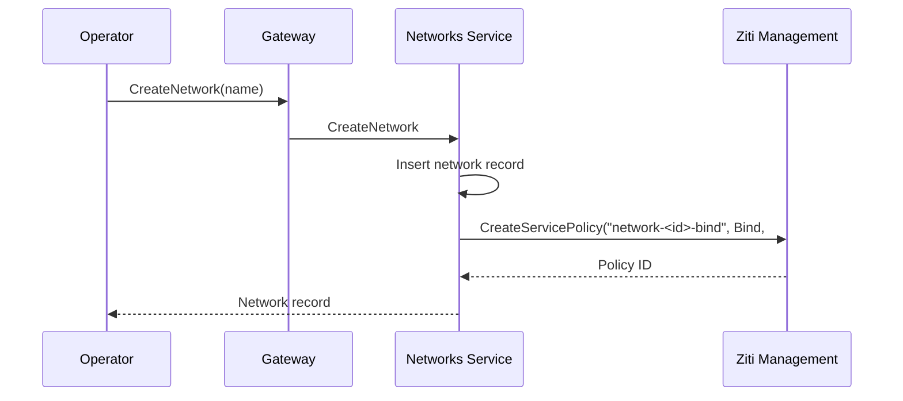
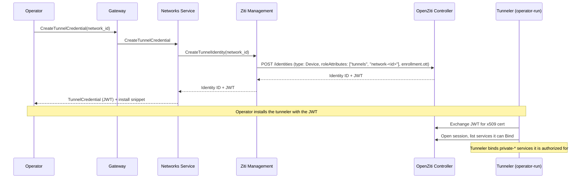
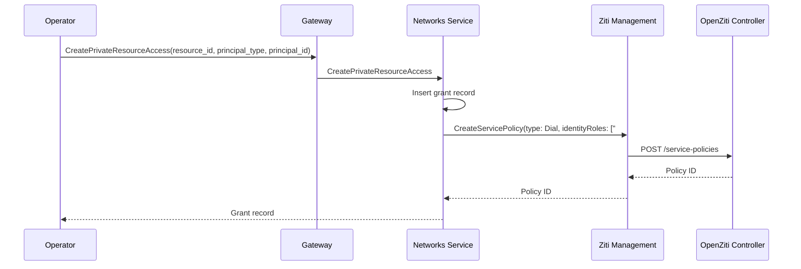
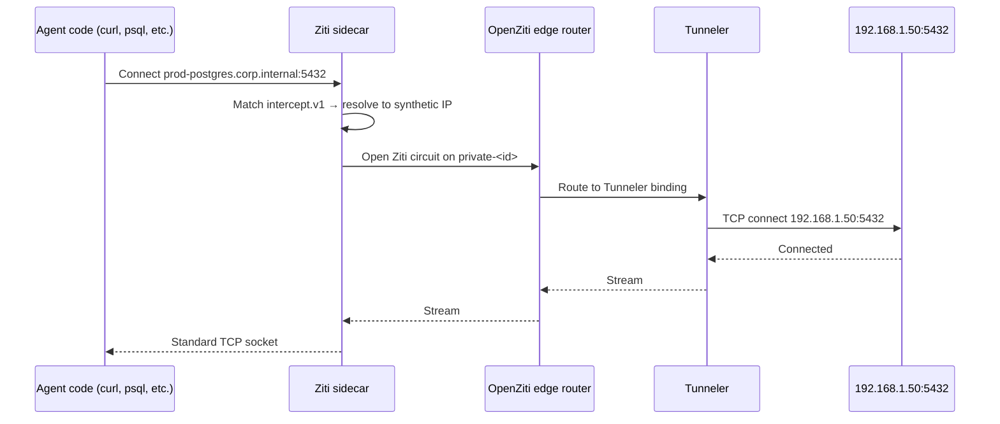

# Private Networks

## Overview

Private Networks let operators expose resources from their own private networks (a home lab, a corporate VPC, an on-prem datacenter) to agents on the platform. The operator runs a standard [OpenZiti](openziti.md) tunneler inside their network; the tunneler enrolls into the platform's overlay and binds platform-defined services. Agents granted access dial these resources by hostname over the OpenZiti overlay — no public exposure of the private host, no VPN, no inbound firewall rule.

This document describes the **resource model** (Network, Tunnel, PrivateResource, access grants), the **OpenZiti topology** that backs it, and the **lifecycle flows**. The control-plane companion is the [Networks service](networks-service.md), which owns CRUD, reconciliation, and OpenZiti resource provisioning.

For the user-facing model, see [Product — Private Networks](../product/private-networks/private-networks.md).

## Concepts

| Term | Definition |
|---|---|
| **Network** | An organization-scoped logical group that owns a set of [PrivateResources](#privateresource) and is reachable through one or more [Tunnels](#tunnel). Materialized as an OpenZiti role attribute (`network-<id>`) that backs the bind side of every resource in the network. Networks have no settings beyond a name and description; their purpose is to be the HA boundary and the OpenZiti binding unit. |
| **Tunnel** | A long-running OpenZiti tunneler instance inside the operator's private network. Enrolls into the platform via a one-time-token JWT issued from the [Networks service](networks-service.md), then phones home to the OpenZiti Controller and binds the services its network's resources expose. One Tunnel belongs to exactly one Network. A Network can have many Tunnels for HA. |
| **TunnelCredential** | The enrollment artifact issued by the platform for a new tunnel instance — a one-time-token JWT plus a recommended install snippet per supported tunneler distribution. Credentials are revocable; revocation deletes the underlying OpenZiti identity, severing any tunneler that holds it. |
| **PrivateResource** | A single addressable endpoint behind a Network: a `host:ports` target the Tunnel forwards to, exposed to agents as an `intercept_host:intercept_ports` hostname they dial. One resource has a single protocol (`tcp` / `http` / `https`). |
| **Resource access grant** | A `(PrivateResource, principal)` tuple authorizing the principal to dial the resource. Principals may be an `agent`, `user`, or `group`. Underneath, each grant materializes as an OpenZiti Dial policy. |

Networks, Tunnels, PrivateResources, and access grants are all organization-scoped. There is no cross-org reachability.

## Resource Shapes

For canonical field-by-field schemas see [Resource Definitions](resource-definitions.md). The summary below is enough to follow the rest of this doc.

### Network

| Field | Type | Description |
|---|---|---|
| `id` | string (UUID) | Unique identifier |
| `organization_id` | string (UUID) | Owning organization |
| `name`, `description` | string | Human-readable labels |
| `created_at`, `updated_at` | timestamp | |

### TunnelCredential

| Field | Type | Description |
|---|---|---|
| `id` | string (UUID) | Unique identifier |
| `network_id` | string (UUID) | Network this credential belongs to |
| `openziti_identity_id` | string | OpenZiti identity created at credential issuance (carries role attributes `["tunnels", "network-<network_id>"]`) |
| `enrollment_jwt` | string | One-time-token JWT, returned once at creation; not persisted in plaintext |
| `enrollment_jwt_expires_at` | timestamp | JWT expiry (controller-defined, typically 24h) |
| `enrolled_at` | timestamp \| null | Set when the tunneler completes enrollment |
| `last_seen_at` | timestamp \| null | Updated from the OpenZiti Controller's session info |
| `created_at` | timestamp | |

### PrivateResource

| Field | Type | Description |
|---|---|---|
| `id` | string (UUID) | Unique identifier |
| `network_id` | string (UUID) | Owning network |
| `name` | string | Free-form human-readable label. Not unique |
| `protocol` | enum | `tcp` \| `http` \| `https` |
| `target_host` | string | IP or DNS name the Tunnel forwards to. Resolved at the tunnel-side at connect time |
| `target_ports` | list of port specs | Single ports (`"5432"`), ranges (`"5432-5435"`), or mixed |
| `intercept_host` | string | Hostname the agent dials. Reserved zones (`*.ziti`, `*.svc`, `*.cluster.local`, OpenZiti synthetic CIDR) rejected |
| `intercept_ports` | list of port specs | Same shape as `target_ports`. Cardinality must match `target_ports` (1:1 mapping) |
| `openziti_service_id` | string | OpenZiti service for this resource |
| `created_at`, `updated_at` | timestamp | |

Uniqueness: `(organization_id, intercept_host, intercept_port)` — no two resources in the same org may claim the same intercept hostname + port (OpenZiti routing would be ambiguous for any identity authorized to dial both).

### PrivateResourceAccess

| Field | Type | Description |
|---|---|---|
| `id` | string (UUID) | Unique identifier |
| `private_resource_id` | string (UUID) | Reference to the PrivateResource |
| `principal_type` | enum | `agent` \| `user` \| `group` |
| `principal_id` | string (UUID) | Identity or group ID |
| `openziti_dial_policy_id` | string | OpenZiti Dial policy backing this grant |
| `created_at` | timestamp | |

Unique on `(private_resource_id, principal_type, principal_id)`. Grants are immutable — create and delete only.

## OpenZiti Topology

### Role Attributes

| Identity Type | Role Attributes |
|---|---|
| Tunnel | `["tunnels", "network-<network_id>"]` |
| Agent pod (Ziti sidecar) | Existing — `["agents", "agent-<agentId>", "workload-<workloadId>"]`, plus `"group-<groupId>"` for every group the agent belongs to (see [Groups service](groups-service.md)) |
| User device | Existing — `["devices", "user-<userId>"]`, plus `"group-<groupId>"` for every group the user belongs to |
| App | Existing — `["apps", "app-<appId>"]`, plus `"group-<groupId>"` for every group the app belongs to |

The `network-<id>` attribute on Tunnels is what lets multiple tunnel hosts share the same set of bindable services for HA. Resources bind by network role attribute, never by specific tunnel identity ID.

### Per-Resource OpenZiti Service

Each PrivateResource owns exactly one OpenZiti service named `private-<resource_id>`, with attached `intercept.v1` and `host.v1` configs. Provisioned and reconciled by the [Networks service](networks-service.md).

**`intercept.v1`** — captured by dialer-side Ziti sidecars:

```json
{
  "protocols": ["tcp"],
  "addresses": ["<resource.intercept_host>"],
  "portRanges": [
    { "low": <low>, "high": <high> }
    /* one entry per declared intercept port spec */
  ]
}
```

**`host.v1`** — the Tunnel forwards to the configured target:

```json
{
  "protocol": "tcp",
  "address": "<resource.target_host>",
  "portRanges": [
    { "low": <low>, "high": <high> }
    /* corresponding to target_ports, 1:1 with intercept_ports */
  ]
}
```

Both configs are TCP at the OpenZiti layer regardless of the resource's `protocol` field. The `protocol` field is platform metadata used to gate features like header injection (see [EgressRule Interaction](#egressrule-interaction)) — OpenZiti itself only sees a TCP stream.

### Bind Policy (per Network)

Created once per Network at Network creation time:

```
CreateServicePolicy(
  name:          "network-<network_id>-bind",
  type:          Bind,
  identityRoles: ["#network-<network_id>"],
  serviceRoles:  ["@private-<all-resources-in-network>"]
)
```

In practice the policy targets services by a per-network role attribute on the services themselves (`network-resources-<network_id>`), so the policy doesn't need to be rewritten when resources are added or removed — the role attribute is stamped on each new service.

### Dial Policy (per Access Grant)

Created on access grant creation:

```
CreateServicePolicy(
  type:          Dial,
  identityRoles: ["#<principal-role-attribute>"],
  serviceRoles:  ["@private-<resource_id>"]
)
```

Where `<principal-role-attribute>` resolves by principal type:

| Principal | Role attribute |
|---|---|
| `agent:<id>` | `agent-<id>` |
| `user:<id>` | `user-<id>` |
| `group:<id>` | `group-<id>` |

Static policies, networks, and resources don't conflict — each grant is its own policy.

## Lifecycle Flows

### Network Creation



The bind policy is created up front and stays for the network's lifetime. Adding/removing resources doesn't touch the policy — they just gain/lose the `network-resources-<id>` role attribute on their services.

### Tunnel Enrollment



After enrollment, the tunneler's standard service-discovery mechanism (controller-driven) picks up new resources as the [Networks service](networks-service.md) provisions them. No separate config push channel — the OpenZiti SDK / tunneler reads bindable services from the Controller via its role attributes.

### PrivateResource Creation

```mermaid
sequenceDiagram
    participant O as Operator
    participant GW as Gateway
    participant NS as Networks Service
    participant ZM as Ziti Management
    participant ZC as OpenZiti Controller

    O->>GW: CreatePrivateResource(network_id, name, protocol, target_host, target_ports, intercept_host, intercept_ports)
    GW->>NS: CreatePrivateResource
    NS->>NS: Validate intercept_host (reserved zones); insert record
    NS->>ZM: CreateService("private-<id>", roleAttributes: ["network-resources-<network_id>"], configs: [host.v1, intercept.v1])
    ZM->>ZC: POST /configs (host.v1: target_host, target_ports)
    ZM->>ZC: POST /configs (intercept.v1: intercept_host, intercept_ports)
    ZM->>ZC: POST /services (with config IDs)
    ZC-->>ZM: Service ID
    ZM-->>NS: Service ID
    NS-->>O: PrivateResource record
```

The existing network Bind policy already covers this service via its role attribute — no policy creation needed.

### Granting Access



Policy changes are live in OpenZiti — no agent restart needed. Propagation to in-pod Ziti sidecars is bounded by the SDK's service-list poll interval (≤15 seconds; see [Egress Gateway — Propagation Window](../product/egress-gateway/egress-gateway.md#attaching-rules-to-agents)).

### Agent Dialing a Private Resource



The agent's code observes a normal TCP connection. The intercept hostname is whatever the operator declared on the resource — there is no required `.ziti` suffix.

## EgressRule Interaction

PrivateResources and [EgressRules](egress-rules-service.md) are independent primitives in v1. An operator chooses one or the other per destination:

- Direct TCP/HTTP/HTTPS to a private host with no header injection → PrivateResource.
- HTTP/HTTPS with header injection (credentials, deny rules) → EgressRule with `domain_pattern`.

There is no automated composition in v1. If an operator creates an EgressRule whose `domain_pattern` matches a PrivateResource's `intercept_host`, the OpenZiti Controller will reject the second `CreateService` call due to intercept overlap on services any single identity is authorized to dial. The error surfaces as whatever the Controller returns.

### Future: Injection on Private Resources

The intended longer-term design (deferred from v1) extends EgressRule's matcher to accept a `private_resource_id` reference. When attached to a private resource, the PrivateResource's OpenZiti service bind flips from `#network-<network_id>` to `#egress-gateway-hosts`, and a second internal service is provisioned that the Egress Gateway dials to deliver traffic to the tunnel. The flip happens on first rule attached / last rule detached; existing connections reset, matching the existing EgressRule propagation behavior. Until this lands, operators wanting per-agent credentials to private hosts wire them through agent ENVs via the [Secrets](secrets.md) service.

See [open-questions.md](../open-questions.md) for the full list of deferred items.

## Reconciliation

The [Networks service](networks-service.md) runs a periodic reconciliation loop, structurally analogous to [EgressRules service — Reconciliation](egress-rules-service.md#reconciliation):

1. **Missing OpenZiti services for live resources.** For each `PrivateResource` row, verify the corresponding `private-<id>` service exists. If absent, re-create it; if its `intercept.v1` or `host.v1` drifts from the resource record, update the configs.
2. **Missing Dial policies for live access grants.** For each `PrivateResourceAccess` row, verify the corresponding Dial policy exists. If absent, re-create it.
3. **Missing Bind policy per Network.** For each `Network` row, verify the `network-<id>-bind` policy exists. If absent, re-create it.
4. **Orphaned OpenZiti services.** List OpenZiti services with role attribute `network-resources-<id>` for any live network. Services whose IDs do not correspond to a live `PrivateResource` row → delete.
5. **Orphaned Dial policies.** List Dial policies referencing a `@private-<id>` service. Policies whose `(resource_id, principal)` do not correspond to a live grant → delete.
6. **Orphaned Tunnel identities.** List OpenZiti identities with role attribute `tunnels`. Identities whose IDs do not correspond to a live `TunnelCredential` row → delete.

## Authorization

Authorization for Network/Tunnel/PrivateResource/PrivateResourceAccess operations is checked by the Networks service via the [Authorization](authz.md) service. The checks mirror the [EgressRules service — Authorization](egress-rules-service.md#authorization) shape — no new OpenFGA types are introduced for the resource layer (the new `group` type is introduced by the [Groups service](groups-service.md)).

| Operation | Check |
|---|---|
| Network CRUD (`CreateNetwork`, `UpdateNetwork`, `DeleteNetwork`) | `owner` on `organization:<org_id>` |
| Network read (`GetNetwork`, `ListNetworks`) | `member` on `organization:<org_id>` |
| TunnelCredential CRUD (`CreateTunnelCredential`, `DeleteTunnelCredential`) | `owner` on `organization:<org_id>` |
| TunnelCredential read (`ListTunnelCredentials`) | `member` on `organization:<org_id>` |
| PrivateResource CRUD (`CreatePrivateResource`, `UpdatePrivateResource`, `DeletePrivateResource`) | `owner` on `organization:<org_id>` |
| PrivateResource read (`GetPrivateResource`, `ListPrivateResources`) | `member` on `organization:<org_id>` |
| Access grant for an `agent` principal | `can_edit_config` on `agent:<agent_id>` (the existing per-agent role) |
| Access grant for a `user` principal | `owner` on `organization:<org_id>` |
| Access grant for a `group` principal | `owner` on `organization:<org_id>` |
| Access grant read (`ListPrivateResourceAccess`) | `member` on `organization:<org_id>` |

See [Authorization — Networks Service](authz.md#networks-service) for the full reference.

## Deletion Semantics

All deletes cascade through dependent resources within a single transactional operation from the operator's perspective:

| Delete | Cascades to |
|---|---|
| `Network` | All TunnelCredentials in the network (identities deleted from Controller), all PrivateResources in the network (services + configs deleted), all PrivateResourceAccess grants on those resources (policies deleted), the network's Bind policy |
| `TunnelCredential` | The corresponding OpenZiti identity. If the tunneler holding it is online, it loses its session immediately. Other credentials in the network are unaffected |
| `PrivateResource` | The OpenZiti service + configs, all PrivateResourceAccess grants on the resource (policies deleted) |
| `PrivateResourceAccess` | The corresponding Dial policy |

If the operator deletes the last `TunnelCredential` in a Network, the Network's resources become unreachable until a new credential is issued and a tunneler enrolls. The resources themselves remain configured.

## Notifications

The Networks service publishes events to the organization's [Notifications](notifications.md) room for cache invalidation and Console reactivity:

| Event | Emitted when |
|---|---|
| `network.updated` | A `Network` is created, updated, or deleted |
| `tunnel_credential.updated` | A `TunnelCredential` is created or deleted |
| `tunnel_status.changed` | A Tunnel transitions online/offline (sourced from Controller session info) |
| `private_resource.updated` | A `PrivateResource` is created, updated, or deleted |
| `private_resource_access.updated` | A `PrivateResourceAccess` is created or deleted |

## Observability

OpenZiti circuit metadata for traffic through PrivateResources is captured at the edge router. Platform-level tracing and metering for private-resource traffic are not part of v1 — see [open-questions.md](../open-questions.md).

## Related Architecture

- [Networks Service](networks-service.md) — control-plane CRUD, reconciliation, and OpenZiti resource lifecycle
- [Groups Service](groups-service.md) — Group/GroupMembership lifecycle and OpenZiti role-attribute sync
- [OpenZiti Integration](openziti.md) — the overlay, Ziti Management RPCs, and identity lifecycle
- [Authorization](authz.md) — OpenFGA types, relations, and permission checks
- [Resource Definitions](resource-definitions.md) — canonical schemas for all platform resources
- [Egress Gateway](egress-gateway.md) — sibling primitive for outbound HTTP/HTTPS to external destinations
- [Product — Private Networks](../product/private-networks/private-networks.md) — user-facing concepts and Console flow
