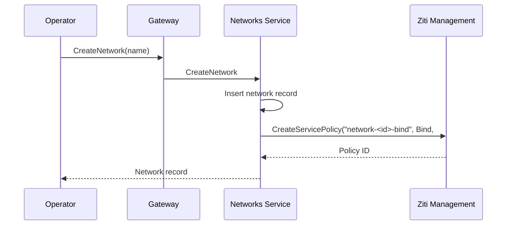
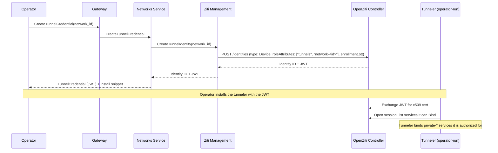
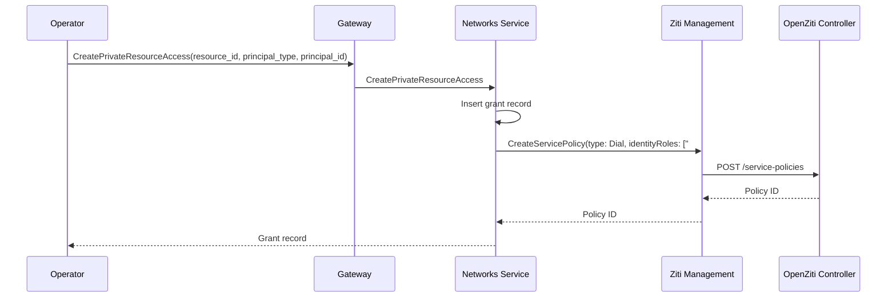
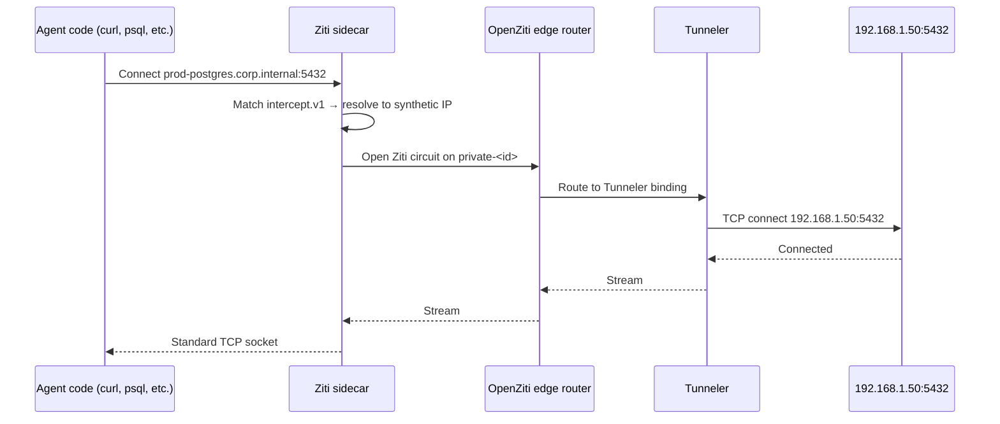
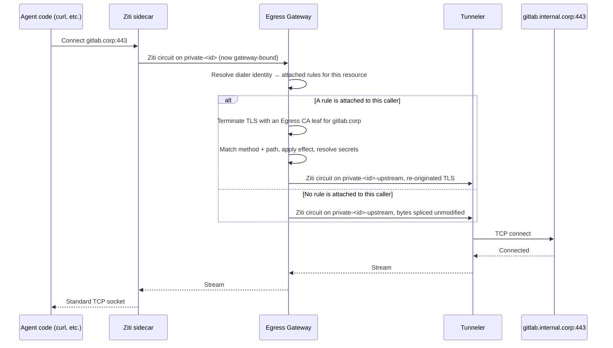

# Private Networks

## Overview

Private Networks let operators expose resources from their own private networks (a home lab, a corporate VPC, an on-prem datacenter) to agents on the platform. The operator runs a standard [OpenZiti](openziti.md) tunneler inside their network; the tunneler enrolls into the platform's overlay and binds platform-defined services. Agents granted access dial these resources by hostname over the OpenZiti overlay — no public exposure of the private host, no VPN, no inbound firewall rule.

This document describes the **resource model** (Network, Tunnel, PrivateResource, access grants), the **OpenZiti topology** that backs it, and the **lifecycle flows**. The control-plane companion is the [Networks service](networks-service.md), which owns CRUD, reconciliation, and OpenZiti resource provisioning.

For the user-facing model, see [Product — Private Networks](../product/private-networks/private-networks.md).

## Concepts

| Term | Definition |
|---|---|
| **Network** | An organization-scoped logical group that owns a set of [PrivateResources](#privateresource) and is reachable through one or more [Tunnels](#tunnel-enrollment). Materialized as an OpenZiti role attribute (`network-<id>`) that backs the bind side of every resource in the network. Networks have no settings beyond a name and description; their purpose is to be the HA boundary and the OpenZiti binding unit. |
| **Tunnel** | A long-running OpenZiti tunneler instance inside the operator's private network. Enrolls into the platform via a one-time-token JWT issued from the [Networks service](networks-service.md), then phones home to the OpenZiti Controller and binds the services its network's resources expose. One Tunnel belongs to exactly one Network. A Network can have many Tunnels for HA. |
| **TunnelCredential** | The enrollment artifact issued by the platform for a new tunnel instance — a one-time-token JWT plus a recommended install snippet per supported tunneler distribution. Credentials are revocable; revocation deletes the underlying OpenZiti identity, severing any tunneler that holds it. |
| **PrivateResource** | A single addressable endpoint behind a Network: a `target_host:target_ports` target the Tunnel forwards to, exposed to agents as an `intercept_host:intercept_ports` hostname they dial. One resource has a single protocol (`tcp` / `http` / `https`). UDP is not supported in v1. An `http`/`https` resource named by an [EgressRule](egress-rules-service.md) is [gateway-mediated](#gateway-mediation) — its traffic passes through the [Egress Gateway](egress-gateway.md) on the way to the Tunnel. |
| **Resource access grant** | A `(PrivateResource, principal)` tuple authorizing the principal to dial the resource. Principals may be an `agent`, `environment`, `user`, `app`, or `group`. Underneath, each grant materializes as exactly one OpenZiti Dial policy. An [EgressRule attachment](#two-ways-to-reach-one-resource) authorizes an agent or environment the same way, through a policy of the same shape. |

Networks, Tunnels, PrivateResources, and access grants are all organization-scoped. There is no cross-org reachability.

## Resource Shapes

For canonical field-by-field schemas see [Resource Definitions](resource-definitions.md). The summary below is enough to follow the rest of this doc.

### Network

| Field | Type | Description |
|---|---|---|
| `id` | string (UUID) | Unique identifier |
| `organization_id` | string (UUID) | Owning organization |
| `name`, `description` | string | Human-readable labels |
| `created_at`, `updated_at` | timestamp | |

### TunnelCredential

| Field | Type | Description |
|---|---|---|
| `id` | string (UUID) | Unique identifier |
| `network_id` | string (UUID) | Network this credential belongs to |
| `openziti_identity_id` | string | OpenZiti identity created at credential issuance (carries role attributes `["tunnels", "network-<network_id>"]`) |
| `enrollment_jwt` | string | One-time-token JWT, returned only in the `CreateTunnelCredential` response; omitted from `GetTunnelCredential` and `ListTunnelCredentials`; not persisted in plaintext |
| `enrollment_jwt_revealed` | bool | `true` after the JWT has been returned to a caller. Surfaced on reads so callers know the JWT was issued and cannot be retrieved again |
| `enrollment_jwt_expires_at` | timestamp | JWT expiry (controller-defined, typically 24h) |
| `enrollment_state` | enum | `pending` \| `enrolled` — sourced from the Controller's `enrollment.state` |
| `connectivity` | enum | `online` \| `offline` — sourced from the Controller's `hasEdgeRouterConnection` |
| `provisioning_state` | enum | `active` \| `failed` \| `removing` — reflects whether the OpenZiti identity was successfully created. See [Provisioning Status](#provisioning-status) |
| `enrolled_at` | timestamp \| null | Set the first time the Controller reports the identity as enrolled |
| `last_seen_at` | timestamp \| null | Updated each poll observing `hasEdgeRouterConnection: true` |
| `created_at` | timestamp | |

### PrivateResource

| Field | Type | Description |
|---|---|---|
| `id` | string (UUID) | Unique identifier |
| `network_id` | string (UUID) | Owning network |
| `name` | string | Free-form human-readable label. Not unique |
| `protocol` | enum | `tcp` \| `http` \| `https` (UDP not supported in v1) |
| `target_host` | string | IP or DNS name the Tunnel forwards to. Resolved at the tunnel-side at connect time |
| `target_ports` | list<uint16> | List of port numbers (e.g., `[5432]`, `[80, 443]`, `[9200, 9300]`). Port ranges are not supported in v1 |
| `intercept_host` | string | Hostname the agent dials. Reserved zones rejected at create time (see below) |
| `intercept_ports` | list<uint16> | Cardinality must match `target_ports`; positional 1:1 mapping |
| `provisioning_state` | enum | `active` \| `failed` \| `removing` — see [Provisioning Status](#provisioning-status) |
| `openziti_service_id` | string | OpenZiti service for this resource |
| `created_at`, `updated_at` | timestamp | |

Uniqueness: for each `port` in `intercept_ports`, the tuple `(organization_id, intercept_host, port)` must be unique across all PrivateResources in the organization — OpenZiti routing would be ambiguous for any identity authorized to dial both. Because v1 uses individual ports (not ranges), uniqueness checks are exact-match per port.

Reserved `intercept_host` patterns (rejected at create time):

- `*.agyn`
- `*.svc`, `*.cluster.local`
- Anything overlapping `100.64.0.0/10` (OpenZiti synthetic CIDR)
- `localhost`, `127.0.0.0/8`, `::1/128`

Public hostnames (e.g., `gitlab.com`) are not in the reserved list and are allowed with a warning — the operator may shadow real public DNS if they want, knowing that all agent traffic for that hostname will route through the tunnel.

### PrivateResourceAccess

| Field | Type | Description |
|---|---|---|
| `id` | string (UUID) | Unique identifier |
| `private_resource_id` | string (UUID) | Reference to the PrivateResource |
| `principal_type` | enum | `agent` \| `environment` \| `user` \| `app` \| `group` |
| `principal_id` | string (UUID) | Identity, environment, or group ID |
| `provisioning_state` | enum | `active` \| `failed` \| `removing` — reflects whether the backing OpenZiti Dial policy was successfully provisioned. See [Provisioning Status](#provisioning-status) |
| `openziti_dial_policy_id` | string | OpenZiti Dial policy backing this grant (one Dial policy per grant — simpler reconciliation and revocation) |
| `created_at` | timestamp | |

Unique on `(private_resource_id, principal_type, principal_id)`. Grants are immutable — create and delete only.

### Why an environment is a principal

Every other principal is an identity. An [environment](resource-definitions.md#environment) is not — it is a configuration resource, and it is a principal here because it is the only handle that reaches a [sandbox](resource-definitions.md#sandbox).

A sandbox workload carries no `agent-<id>` attribute: there is no agent class behind it. It cannot be a group member — groups collect users, agents, and apps. So under identity principals alone, nothing can grant a sandbox access to a private resource, and the engineer at a sandbox shell — the person most likely to want an internal database — is the one principal type the access model cannot express.

What agent workloads and sandbox workloads do share is the environment they run. The [Agents Orchestrator](agents-orchestrator.md#workload-spec-assembly) stamps `environment-<environmentId>` on every workload identity it creates, agent workloads and sandboxes alike, which is the same attribute [egress rule attachments](egress-rules-service.md) already target. Granting to an environment therefore needs no new OpenZiti mechanism and no new attribute — only a principal type that resolves to one.

**A grant to an environment reaches everyone who can start a sandbox in it.** Access follows the environment, not the person: any agent pointed at it and any sandbox started in it can dial the resource, and starting a sandbox requires only [`can_use`](authz.md#environment). This is the same reach an [EgressRule](egress-rules-service.md) attached to an environment already has, and it is why the grant is authorized by `can_edit_config` on the environment rather than by anything on the resource.

Agent instances and individual sandboxes as principals are deliberately out of scope. Both are narrower than an environment and would need their own role attributes — `workload-<id>` exists but dies with the workload, so neither is a grant that outlives a restart. Until that is designed, the environment is the unit.

## OpenZiti Topology

### Role Attributes

| Identity Type | Role Attributes |
|---|---|
| Tunnel | `["tunnels", "network-<network_id>"]` |
| Agent pod (Ziti sidecar) | Existing — `["agents", "agent-<agentId>", "workload-<workloadId>", "environment-<environmentId>"]`, plus `"group-<groupId>"` for every group the agent belongs to (see [Groups service](groups-service.md)) |
| Sandbox pod (Ziti sidecar) | Existing — `["agents", "workload-<workloadId>", "environment-<environmentId>"]`. No `agent-<id>`: a sandbox has no agent class behind it |
| User device | Existing — `["devices", "user-<userId>"]`, plus `"group-<groupId>"` for every group the user belongs to |
| App | Existing — `["apps", "app-<appId>"]`, plus `"group-<groupId>"` for every group the app belongs to |

The `network-<id>` attribute on Tunnels is what lets multiple tunnel hosts share the same set of bindable services for HA. Resources bind by network role attribute, never by specific tunnel identity ID.

`environment-<environmentId>` is stamped by the [Agents Orchestrator](agents-orchestrator.md#workload-spec-assembly) at workload spec assembly and is the only attribute a sandbox and an agent workload running the same environment have in common. Nothing new is introduced for [environment grants](#why-an-environment-is-a-principal) — the attribute already exists and already carries [egress rule attachments](egress-rules-service.md).

### Per-Resource OpenZiti Service

Each PrivateResource owns an OpenZiti service named `private-<resource_id>`, with attached `intercept.v1` and `host.v1` configs. Provisioned and reconciled by the [Networks service](networks-service.md). The shapes below are the unmediated (`mediation: tunnel`) state — a resource named by an [EgressRule](egress-rules-service.md) rebinds this service to the Egress Gateway and gains a second one, per [Gateway Mediation](#gateway-mediation).

**`intercept.v1`** — captured by dialer-side Ziti sidecars:

```json
{
  "protocols": ["tcp"],
  "addresses": ["<resource.intercept_host>"],
  "portRanges": [
    { "low": <low>, "high": <high> }
    /* one entry per declared intercept port spec */
  ]
}
```

**`host.v1`** — the Tunnel forwards to the configured target:

```json
{
  "protocol": "tcp",
  "address": "<resource.target_host>",
  "portRanges": [
    { "low": <low>, "high": <high> }
    /* corresponding to target_ports, 1:1 with intercept_ports */
  ]
}
```

Both configs are TCP at the OpenZiti layer regardless of the resource's `protocol` field. The `protocol` field is platform metadata that gates header injection — only `http` and `https` resources may be named by an [EgressRule](#egressrule-interaction) — because OpenZiti itself only sees a TCP stream.

### Bind Policy (per Network)

Created once per Network at Network creation time:

```
CreateServicePolicy(
  name:          "network-<network_id>-bind",
  type:          Bind,
  identityRoles: ["#network-<network_id>"],
  serviceRoles:  ["@private-<all-resources-in-network>"]
)
```

In practice the policy targets services by a per-network role attribute on the services themselves (`network-resources-<network_id>`), so the policy doesn't need to be rewritten when resources are added or removed — the role attribute is stamped on each new service.

### Dial Policy (per Access Grant)

Created on access grant creation:

```
CreateServicePolicy(
  type:          Dial,
  identityRoles: ["#<principal-role-attribute>"],
  serviceRoles:  ["@private-<resource_id>"]
)
```

Where `<principal-role-attribute>` resolves by principal type:

| Principal | Role attribute | Resolves to |
|---|---|---|
| `agent:<id>` | `agent-<id>` | Every workload of that agent |
| `environment:<id>` | `environment-<id>` | Every workload running that environment — agent workloads and [sandboxes](resource-definitions.md#sandbox) alike |
| `user:<id>` | `user-<id>` | The user's enrolled devices |
| `app:<id>` | `app-<id>` | The app's own identity |
| `group:<id>` | `group-<id>` | Every member transitively |

Static policies, networks, and resources don't conflict — each grant is its own policy.

An [EgressRule attachment](egress-rules-service.md) to an agent or environment writes a policy of exactly this shape against the same service, tagged to the EgressRules service. From the dialing identity's perspective the two are indistinguishable; from reconciliation's, the tag tells them apart.

A workload picks up a new grant on its SDK's next service-list poll (≤15s) — including a workload that was already running when the grant was made. Nothing restarts, because the attribute was stamped at workload creation and only the policy is new.

## Provisioning Status

`Network`, `PrivateResource`, `PrivateResourceAccess`, and `TunnelCredential` carry a `provisioning_state` enum reflecting whether their backing OpenZiti resources were successfully created.

| Value | Meaning |
|---|---|
| `active` | Local row + corresponding OpenZiti resource(s) both exist and are consistent |
| `failed` | Local row exists; OpenZiti provisioning failed. Reconciliation will retry |
| `removing` | Local row scheduled for deletion; OpenZiti cleanup pending. Reconciliation will remove orphans |

### API behavior

Create / Update / Delete calls persist desired state synchronously to the local database and attempt OpenZiti provisioning inline:

- **Provisioning succeeds**: row written with `provisioning_state: active`. API returns success.
- **Provisioning fails**: row written with `provisioning_state: failed`. **API returns success** — the desired state was recorded, the OpenZiti materialization will be retried by reconciliation. The response includes the `failed` state so callers see it.
- **Local DB write fails**: API returns error. Nothing was persisted, the caller retries.

The API does not roll back the local row when OpenZiti fails — the desired-state record is the canonical source of truth and reconciliation is the materialization mechanism. Operators see `provisioning_state: failed` in the Console / CLI / Terraform refresh and can investigate.

### Allowed transitions

```
                  Create API
                       │
                       ▼
        ┌────────────────────────┐
        │ Attempt OpenZiti ops   │
        └────────────────────────┘
                       │
              ┌────────┴────────┐
              ▼                 ▼
            active            failed
              │                 │
              │     Reconciler retry
              │   ┌─────────────┘
              ▼   ▼
            active ◄────────── Delete API ────────► removing
                                                       │
                                              Reconciler completes cleanup
                                                       │
                                                       ▼
                                                   (row deleted)
```

| From | To | Trigger |
|---|---|---|
| (none) | `active` | Create API + OpenZiti provisioning succeeded |
| (none) | `failed` | Create API + OpenZiti provisioning failed |
| `failed` | `active` | Reconciler re-provisioning succeeded, or operator-triggered retry |
| `active` | `failed` | Reconciler observed drift it could not repair |
| `active` or `failed` | `removing` | Delete API |
| `removing` | (row deleted) | Reconciler completed OpenZiti cleanup |

`Network` cascades through its dependents on `removing` — see [Deletion Semantics](#deletion-semantics).

### Retry

Failed provisioning is retried automatically by the reconciliation loop (default interval 60s). For faster feedback, operators can trigger an explicit retry:

- Console: "Retry" affordance on any resource showing `provisioning_state: failed`.
- CLI: `agyn <resource-type> reconcile <id>` triggers an out-of-band reconciliation pass scoped to the specified resource.
- Terraform: `terraform apply` re-attempts on the next refresh; if the resource is `failed`, the provider issues a retry call.

A persistent `failed` state across multiple reconciliation passes indicates a structural problem (e.g., OpenZiti Controller is unreachable, network configuration prevents binding). Operators investigate and may need to delete + recreate.

Operators see `provisioning_state` in the Console and CLI; persistent `failed` states surface as a warning badge. Tunnel reachability (a separate concern) is shown alongside but derived from the `connectivity` field on TunnelCredentials, not from `provisioning_state`.

## OpenZiti Resource Tagging

Every OpenZiti resource (service, identity, policy, config) that the Networks service creates is tagged for ownership identification. Reconciliation joins by tag, not by name conventions.

```json
{
  "agyn.managed_by": "networks-service",
  "agyn.resource_type": "private_resource | private_resource_upstream | tunnel_credential | network_bind_policy | resource_access | gateway_dial_policy | private_resource_config",
  "agyn.resource_id": "<uuid>",
  "agyn.network_id": "<uuid>"
}
```

The Networks service's reconciliation lists OpenZiti resources by `agyn.managed_by = networks-service`, joins each against the corresponding DB row by `agyn.resource_id`, and acts on mismatches:

- Orphaned OpenZiti resource (no matching DB row) → delete.
- Missing OpenZiti resource (DB row says `active` but no matching tag) → re-create.
- Drifted config (tags match but config differs from DB) → update.

Name prefixes (`private-<id>`, `tunnel-<network>-<id>`, etc.) are retained for human readability in the Controller UI but are not the authoritative ownership marker. The [Groups service](groups-service.md) and other future OpenZiti consumers follow the same tagging convention with `agyn.managed_by` set to their own service name.

## Lifecycle Flows

### Network Creation


```mermaid
sequenceDiagram
    participant O as Operator
    participant GW as Gateway
    participant NS as Networks Service
    participant ZM as Ziti Management

    O->>GW: CreateNetwork(name)
    GW->>NS: CreateNetwork
    NS->>NS: Insert network record
    NS->>ZM: CreateServicePolicy("network-<id>-bind", Bind, #network-<id>, @network-resources-<id>)
    ZM-->>NS: Policy ID
    NS-->>O: Network record
```

The bind policy is created up front and stays for the network's lifetime. Adding/removing resources doesn't touch the policy — they just gain/lose the `network-resources-<id>` role attribute on their services.

### Tunnel Enrollment


```mermaid
sequenceDiagram
    participant O as Operator
    participant GW as Gateway
    participant NS as Networks Service
    participant ZM as Ziti Management
    participant ZC as OpenZiti Controller
    participant T as Tunneler (operator-run)

    O->>GW: CreateTunnelCredential(network_id)
    GW->>NS: CreateTunnelCredential
    NS->>ZM: CreateTunnelIdentity(network_id)
    ZM->>ZC: POST /identities (type: Device, roleAttributes: ["tunnels", "network-<id>"], enrollment.ott)
    ZC-->>ZM: Identity ID + JWT
    ZM-->>NS: Identity ID + JWT
    NS-->>O: TunnelCredential (JWT) + install snippet

    Note over O,T: Operator installs the tunneler with the JWT
    T->>ZC: Exchange JWT for x509 cert
    T->>ZC: Open session, list services it can Bind
    Note over T: Tunneler binds private-* services it is authorized for
```

After enrollment, the tunneler's standard service-discovery mechanism (controller-driven) picks up new resources as the [Networks service](networks-service.md) provisions them. No separate config push channel — the OpenZiti SDK / tunneler reads bindable services from the Controller via its role attributes.

### PrivateResource Creation

```mermaid
sequenceDiagram
    participant O as Operator
    participant GW as Gateway
    participant NS as Networks Service
    participant ZM as Ziti Management
    participant ZC as OpenZiti Controller

    O->>GW: CreatePrivateResource(network_id, name, protocol, target_host, target_ports, intercept_host, intercept_ports)
    GW->>NS: CreatePrivateResource
    NS->>NS: Validate intercept_host (reserved zones); insert record
    NS->>ZM: CreateService("private-<id>", roleAttributes: ["network-resources-<network_id>"], configs: [host.v1, intercept.v1])
    ZM->>ZC: POST /configs (host.v1: target_host, target_ports)
    ZM->>ZC: POST /configs (intercept.v1: intercept_host, intercept_ports)
    ZM->>ZC: POST /services (with config IDs)
    ZC-->>ZM: Service ID
    ZM-->>NS: Service ID
    NS-->>O: PrivateResource record
```

The existing network Bind policy already covers this service via its role attribute — no policy creation needed.

### Granting Access


```mermaid
sequenceDiagram
    participant O as Operator
    participant GW as Gateway
    participant NS as Networks Service
    participant ZM as Ziti Management
    participant ZC as OpenZiti Controller

    O->>GW: CreatePrivateResourceAccess(resource_id, principal_type, principal_id)
    GW->>NS: CreatePrivateResourceAccess
    NS->>NS: Insert grant record
    NS->>ZM: CreateServicePolicy(type: Dial, identityRoles: ["#<principal-role>"], serviceRoles: ["@private-<resource_id>"])
    ZM->>ZC: POST /service-policies
    ZC-->>ZM: Policy ID
    ZM-->>NS: Policy ID
    NS-->>O: Grant record
```

Policy changes are live in OpenZiti — no agent restart needed. Propagation to in-pod Ziti sidecars is bounded by the SDK's service-list poll interval (≤15 seconds; see [Egress Gateway — Propagation Window](../product/egress-gateway/egress-gateway.md#attaching-rules-to-agents)).

### Agent Dialing a Private Resource


```mermaid
sequenceDiagram
    participant Code as Agent code (curl, psql, etc.)
    participant Sidecar as Ziti sidecar
    participant ZC as OpenZiti edge router
    participant T as Tunneler
    participant Target as 192.168.1.50:5432

    Code->>Sidecar: Connect prod-postgres.corp.internal:5432
    Sidecar->>Sidecar: Match intercept.v1 → resolve to synthetic IP
    Sidecar->>ZC: Open Ziti circuit on private-<id>
    ZC->>T: Route to Tunneler binding
    T->>Target: TCP connect 192.168.1.50:5432
    Target-->>T: Connected
    T-->>ZC: Stream
    ZC-->>Sidecar: Stream
    Sidecar-->>Code: Standard TCP socket
```

The agent's code observes a normal TCP connection. The intercept hostname is whatever the operator declared on the resource — there is no required `.agyn` suffix.

### Agent Dialing a Mediated Private Resource

When an [EgressRule](egress-rules-service.md) names the resource, the same dial lands on the Egress Gateway instead of the Tunnel. Nothing about the agent's call changes — same hostname, same port, same socket semantics.


```mermaid
sequenceDiagram
    participant Code as Agent code (curl, etc.)
    participant Sidecar as Ziti sidecar
    participant EG as Egress Gateway
    participant T as Tunneler
    participant Target as gitlab.internal.corp:443

    Code->>Sidecar: Connect gitlab.corp:443
    Sidecar->>EG: Ziti circuit on private-<id> (now gateway-bound)
    EG->>EG: Resolve dialer identity → attached rules for this resource
    alt A rule is attached to this caller
        EG->>EG: Terminate TLS with an Egress CA leaf for gitlab.corp
        EG->>EG: Match method + path, apply effect, resolve secrets
        EG->>T: Ziti circuit on private-<id>-upstream, re-originated TLS
    else No rule is attached to this caller
        EG->>T: Ziti circuit on private-<id>-upstream, bytes spliced unmodified
    end
    T->>Target: TCP connect
    Target-->>T: Connected
    T-->>EG: Stream
    EG-->>Sidecar: Stream
    Sidecar-->>Code: Standard TCP socket
```

## EgressRule Interaction

PrivateResource and [EgressRule](egress-rules-service.md) are two halves of one destination, not two alternatives. The resource says **where** the destination is; a rule naming that resource says **who reaches it and what happens** to their HTTP requests — deny, narrow by method and path, inject credentials. An `http` or `https` resource can carry a rule; a `tcp` one cannot, because there is nothing HTTP-shaped in the stream to act on.

### Two ways to reach one resource

An agent gets access to a private resource by either path, and both materialize the same way — one OpenZiti Dial policy on `@private-<resource_id>`:

| Path | Principals | Grants | Adds injection / deny |
|---|---|---|---|
| [PrivateResourceAccess](#privateresourceaccess) grant | agent, environment, user, app, group | ✓ | — |
| [EgressRule](egress-rules-service.md) attachment | agent, environment | ✓ | ✓ |

A rule attachment is the unified path for the two principal types that carry HTTP-shaped workloads. Grants remain the only way in for a user's device, an app, or a group, and the only way in at all for a `tcp` resource. A principal may hold both; each is revoked independently, and the resource's effective principal set is the union.

**Neither path can outrank the other in permission.** An agent-principal grant is authorized by `can_edit_config` on the agent plus a cross-org guard; an agent attachment is authorized by exactly the same pair. Same for an environment. Granting through a rule therefore opens nothing that the access list could not already open — it changes which surface writes the policy, not who may write it.

The two writers stay out of each other's way through the [ownership tag](#openziti-resource-tagging): each service's orphan sweep lists only policies tagged with its own `agyn.managed_by`, so a policy written by the EgressRules service survives the Networks service's reconciliation pass and vice versa.

### Hostname collisions

The collision the two primitives used to have is now a validation error with a fix attached. A rule whose `domain_pattern` equals an existing resource's `intercept_host`, and a resource whose `intercept_host` equals an existing rule's `domain_pattern`, are both rejected at create time — pointing the operator at a private-target rule instead of letting the OpenZiti Controller reject the second `CreateService` call.

## Gateway Mediation

A resource whose traffic must be inspected has to reach the [Egress Gateway](egress-gateway.md) before it reaches the tunnel. That is a property of the resource's OpenZiti service, not of any one dialer, so it is tracked on the resource as `mediation` and derived from one fact: whether any EgressRule names it.

| `mediation` | When | Path |
|---|---|---|
| `tunnel` | No rule names the resource | Agent → sidecar → edge router → Tunnel → target |
| `egress_gateway` | ≥1 rule names the resource | Agent → sidecar → edge router → **Egress Gateway** → edge router → Tunnel → target |

Mediation is derived, never set by an operator. The [EgressRules service](egress-rules-service.md) calls `SetPrivateResourceMediation` when it creates the first rule for a resource or deletes the last one; the [Networks service](networks-service.md) owns every write to the resource's OpenZiti objects and materializes the change. Reconciliation re-derives the desired value from `ListMediatedPrivateResources`, so a missed call self-heals rather than stranding a resource in the wrong topology.

### OpenZiti resources per mediation state

The front service `private-<resource_id>` keeps its `intercept.v1` in both states — the hostname agents dial never changes. What changes is who binds it and what it forwards to.

| | `tunnel` | `egress_gateway` |
|---|---|---|
| `private-<id>` role attribute | `network-resources-<network_id>` (bound by the network's Tunnels) | `egress-services` (bound by the Egress Gateway via the static `egress-gateway-bind` policy) |
| `private-<id>` `host.v1` | `address: target_host`, port ranges from `target_ports` | `forwardAddress: true`, `forwardPort: true`, `allowedAddresses: [intercept_host]`, `allowedPortRanges: intercept_ports` |
| `private-<id>-upstream` | — | Service with `host.v1` (`address: target_host`, `forwardPort: true`, port ranges from `target_ports`) and role attribute `network-resources-<network_id>`, so the network's existing Bind policy covers it |
| Gateway Dial policy | — | `identityRoles: ["#egress-gateway-hosts"]`, `serviceRoles: ["@<openziti_upstream_service_id>"]` |

The upstream service has no `intercept.v1`: nothing intercepts it. The gateway dials it by name (`private-<resource_id>-upstream`) through the OpenZiti SDK, which is derivable from the resource ID the gateway already has and keeps the gateway free of any Networks-owned identifier.

Dial policies — from access grants and from rule attachments alike — continue to target `@private-<resource_id>` in both states, so access survives a flip untouched. The identity dialing the front service is authorized the same way regardless of who binds it.

### What a flip costs

Creating the first rule for a resource, or deleting the last one, rebinds the front service. In-flight connections through it reset; callers reconnect and land on the new path. This is the same class of interruption a rule detach already causes, bounded by the same ≤15s propagation window, and it applies to **every** principal dialing the resource — not only the ones the rule is attached to. The Console states this on both the rule-create and rule-delete confirmations.

For a caller who reached the resource through an access grant rather than a rule, mediation is a hop, not an interception: the gateway resolves the caller's identity before any TLS handshake and splices the connection straight through to the upstream service when no attached rule names the resource. Nothing is decrypted, and a caller that does not trust the [Egress CA](egress-gateway.md#egress-ca) — a user's laptop dialing over its device identity — is unaffected by a rule written for an agent. See [Egress Gateway — Private Resource Targets](egress-gateway.md#private-resource-targets).

## Reconciliation

The [Networks service](networks-service.md) runs a periodic reconciliation loop, structurally analogous to [EgressRules service — Reconciliation](egress-rules-service.md#reconciliation):

1. **Missing OpenZiti services for live resources.** For each `PrivateResource` row, verify the corresponding `private-<id>` service exists. If absent, re-create it; if its `intercept.v1` or `host.v1` drifts from the resource record, update the configs.
2. **Drifted mediation.** Re-derive each resource's desired `mediation` from the [EgressRules service](egress-rules-service.md)'s `ListMediatedPrivateResources`. Where it differs from the row, apply the flip; where it matches, verify the state's OpenZiti objects (front-service role attribute and `host.v1`, upstream service, gateway Dial policy) and repair drift.
3. **Missing Dial policies for live access grants.** For each `PrivateResourceAccess` row, verify the corresponding Dial policy exists. If absent, re-create it.
4. **Missing Bind policy per Network.** For each `Network` row, verify the `network-<id>-bind` policy exists. If absent, re-create it.
5. **Orphaned OpenZiti services.** List OpenZiti services with role attribute `network-resources-<id>` for any live network. Services whose IDs do not correspond to a live `PrivateResource` row → delete. An `egress-services`-tagged service owned by this service (per [tagging](#openziti-resource-tagging)) whose resource is no longer mediated → return it to the tunnel state.
6. **Orphaned Dial policies.** List Dial policies tagged `agyn.managed_by: networks-service` that reference a `@private-<id>` service. Policies whose `(resource_id, principal)` do not correspond to a live grant → delete. Attachment policies on the same service belong to the [EgressRules service](egress-rules-service.md) and are skipped by the tag filter. The gateway Dial policy on `@private-<id>-upstream` is live exactly while the resource is mediated.
7. **Orphaned Tunnel identities.** List OpenZiti identities with role attribute `tunnels`. Identities whose IDs do not correspond to a live `TunnelCredential` row → delete.

## Authorization

The platform uses two distinct authorization layers and they enforce at different times:

| Layer | When checked | What it enforces |
|---|---|---|
| **OpenFGA** ([Authorization](authz.md)) | Management plane — at every API call to Networks / Groups | Who may create, read, update, or delete resources and grants. The caller's organization role determines what they can manage |
| **OpenZiti** policies | Data plane — at every connection attempt by a dialing identity | Whether an identity (agent workload, user device, app, tunnel) may bind or dial a specific service. Materialized as per-grant Dial policies and the per-network Bind policy |

OpenFGA never gates a network connection. OpenZiti never gates a management API call. A group-based grant materializes in **both** layers: the OpenFGA `group` type (consulted when granting/revoking, e.g., to validate the principal exists in the org) and an OpenZiti Dial policy targeting `#group-<id>` (consulted when an identity carrying that role attribute tries to dial the resource's service). The two layers are kept in sync by the [event-driven role-attribute propagation](groups-service.md#group-role-attribute-sync-via-events) — but a revocation in OpenFGA does not require waiting for OpenZiti to catch up because Dial policies are also synchronously deleted on revoke.

### Management-plane checks

Authorization for Network/Tunnel/PrivateResource/PrivateResourceAccess operations is checked by the Networks service via the [Authorization](authz.md) service. The checks mirror the [EgressRules service — Authorization](egress-rules-service.md#authorization) shape — no new OpenFGA types are introduced for the resource layer (the new `group` type is introduced by the [Groups service](groups-service.md)).

| Operation | Check |
|---|---|
| Network CRUD (`CreateNetwork`, `UpdateNetwork`, `DeleteNetwork`) | `owner` on `organization:<org_id>` |
| Network read (`GetNetwork`, `ListNetworks`) | `member` on `organization:<org_id>` |
| TunnelCredential CRUD (`CreateTunnelCredential`, `DeleteTunnelCredential`) | `owner` on `organization:<org_id>` |
| TunnelCredential read (`ListTunnelCredentials`) | `member` on `organization:<org_id>` |
| PrivateResource CRUD (`CreatePrivateResource`, `UpdatePrivateResource`, `DeletePrivateResource`) | `owner` on `organization:<org_id>` |
| PrivateResource read (`GetPrivateResource`, `ListPrivateResources`) | `member` on `organization:<org_id>` |
| Access grant for an `agent` principal | `can_edit_config` on `agent:<agent_id>` (the existing per-agent role) |
| Access grant for a `user` principal | `owner` on `organization:<org_id>` |
| Access grant for an `app` principal | `owner` on `organization:<org_id>` |
| Access grant for a `group` principal | `owner` on `organization:<org_id>` |
| Access grant read (`ListPrivateResourceAccess`) | `member` on `organization:<org_id>` |

See [Authorization — Networks Service](authz.md#networks-service) for the full reference.

## Deletion Semantics

All deletes cascade through dependent resources within a single transactional operation from the operator's perspective:

| Delete | Cascades to |
|---|---|
| `Network` | All TunnelCredentials in the network (identities deleted from Controller), all PrivateResources in the network (services + configs deleted), all PrivateResourceAccess grants on those resources (policies deleted), the network's Bind policy |
| `TunnelCredential` | The corresponding OpenZiti identity. If the tunneler holding it is online, it loses its session immediately. Other credentials in the network are unaffected |
| `PrivateResource` | The OpenZiti service + configs, all PrivateResourceAccess grants on the resource (policies deleted), and — while [mediated](#gateway-mediation) — the upstream service and the gateway's Dial policy. Refused while any [EgressRule](egress-rules-service.md) names the resource |
| `PrivateResourceAccess` | The corresponding Dial policy |

If the operator deletes the last `TunnelCredential` in a Network, the Network's resources become unreachable until a new credential is issued and a tunneler enrolls. The resources themselves remain configured.

## Notifications

The Networks service publishes events to the organization's [Notifications](notifications.md) room for cache invalidation and Console reactivity:

| Event | Emitted when |
|---|---|
| `network.updated` | A `Network` is created, updated, or deleted |
| `tunnel_credential.updated` | A `TunnelCredential` is created or deleted |
| `tunnel_status.changed` | A Tunnel transitions online/offline (sourced from Controller session info) |
| `private_resource.updated` | A `PrivateResource` is created, updated, or deleted |
| `private_resource_access.updated` | A `PrivateResourceAccess` is created or deleted |

## Observability

OpenZiti circuit metadata for traffic through PrivateResources is captured at the edge router. Platform-level tracing and metering for private-resource traffic are not part of v1 — see [open-questions.md](../open-questions.md).

## Related Architecture

- [Networks Service](networks-service.md) — control-plane CRUD, reconciliation, and OpenZiti resource lifecycle
- [Groups Service](groups-service.md) — Group/GroupMembership lifecycle and OpenZiti role-attribute sync
- [OpenZiti Integration](openziti.md) — the overlay, Ziti Management RPCs, and identity lifecycle
- [Authorization](authz.md) — OpenFGA types, relations, and permission checks
- [Resource Definitions](resource-definitions.md) — canonical schemas for all platform resources
- [Egress Gateway](egress-gateway.md) — the data-plane service that mediates rule-covered traffic, to public destinations and to the resources here
- [EgressRules Service](egress-rules-service.md) — owns the rules that name these resources and the mediation flips they trigger
- [Product — Private Networks](../product/private-networks/private-networks.md) — user-facing concepts and Console flow
