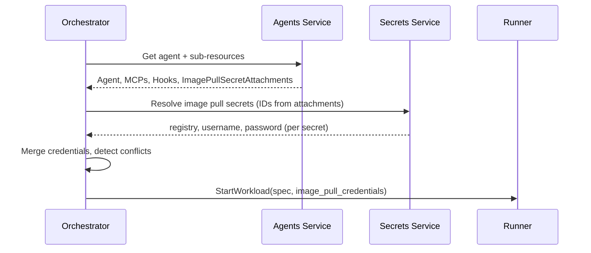

# Private Registry Support

## Overview

Agent workloads can reference container images from private registries. The platform provides image pull secrets — registry credentials that the [Agents Orchestrator](agents-orchestrator.md) collects, resolves, and passes to the [Runner](runner.md), which creates Kubernetes `imagePullSecrets` on the workload Pod.

Four container image fields can reference private registries:

| Resource | Field | Pod Role |
|----------|-------|----------|
| [Agent](resource-definitions.md#agent) | `image` | Main container |
| [Agent](resource-definitions.md#agent) | `init_image` | Init container |
| [MCP](resource-definitions.md#mcp) | `image` | Sidecar container |
| [Hook](resource-definitions.md#hook) | `image` | Sidecar container |

All containers in a workload run in the same Pod. Kubernetes applies `imagePullSecrets` at the Pod level — all containers in the Pod share the same set of registry credentials.

## Resource Model

### Image Pull Secret

An org-scoped resource managed by the [Secrets](secrets.md) service. Stores a registry credential: hostname, username, and password/token.

See [Providers, Models, and Secrets — Image Pull Secret](providers.md#image-pull-secret) for the resource definition.

### Image Pull Secret Attachment

A relationship between an Image Pull Secret and a target container (Agent, MCP, or Hook). Managed by the [Agents](agents-service.md) service. Follows the same polymorphic pattern as [VolumeAttachment](resource-definitions.md#volume-attachment).

See [Resource Definitions — Image Pull Secret Attachment](resource-definitions.md#image-pull-secret-attachment) for the schema.

### Ownership Boundaries

| Resource | Service | Reason |
|----------|---------|--------|
| Image Pull Secret | Secrets | Stores sensitive credential values (encrypted or remote-resolved) |
| Image Pull Secret Attachment | Agents | Links secrets to agent sub-resources, same as VolumeAttachment and ENV |

## Conflict Detection

All containers in a workload share one Pod, and Kubernetes supports only one credential per registry hostname per Pod. The [Agents Orchestrator](agents-orchestrator.md) enforces this constraint at workload assembly time.

During assembly, the orchestrator collects all image pull secret attachments across the agent and its MCPs and hooks. It resolves each referenced Image Pull Secret from the Secrets service to obtain the `registry` hostname. If two attachments resolve to image pull secrets with the **same `registry` hostname but different `image_pull_secret_id`**, the orchestrator rejects the workload with an error.

Two attachments referencing the **same** Image Pull Secret (same `image_pull_secret_id`) are not a conflict — the credential is deduplicated.

## Orchestrator Flow

The Agents Orchestrator assembles image pull credentials during the [Agent Start Flow](agents-orchestrator.md#agent-start-flow):



1. **Fetch attachments** — The orchestrator fetches all ImagePullSecretAttachments for the agent and its MCPs and hooks from the Agents service.
2. **Resolve credentials** — For each unique `image_pull_secret_id`, the orchestrator calls the Secrets service to resolve the full credential (registry, username, password).
3. **Detect conflicts** — If two different image pull secrets share the same `registry` hostname, the orchestrator fails the workload.
4. **Deduplicate** — Multiple attachments referencing the same image pull secret produce one credential entry.
5. **Pass to Runner** — The merged set of credentials is included in the `StartWorkload` request.

## Runner Flow

The Runner receives image pull credentials as part of the `StartWorkload` request. The [k8s-runner](k8s-runner.md) translates them into Kubernetes resources:

1. **Create Kubernetes Secret** — For each credential, the k8s-runner creates a Kubernetes Secret of type `kubernetes.io/dockerconfigjson` in the workload namespace. The secret contains a `.dockerconfigjson` with the registry hostname, username, and password.
2. **Attach to Pod** — The k8s-runner adds all created Kubernetes Secrets to the Pod's `imagePullSecrets` field.
3. **Cleanup** — When the workload is stopped or removed, the k8s-runner deletes the Kubernetes Secrets it created.

Kubernetes Secrets are created per-workload with a name derived from the workload ID to avoid collisions. They are not shared across workloads.

## Proto Changes

### Runner API

Add image pull credentials to `StartWorkloadRequest` in `agynio/api`:

```protobuf
message StartWorkloadRequest {
  ContainerSpec main = 1;
  repeated ContainerSpec sidecars = 2;
  repeated VolumeSpec volumes = 3;
  repeated ContainerSpec init_containers = 4;
  repeated ImagePullCredential image_pull_credentials = 5;
  map<string, string> additional_properties = 100;
}

message ImagePullCredential {
  string registry = 1;
  string username = 2;
  string password = 3;
}
```

The Runner receives resolved credentials — it does not interact with the Secrets service.

### Agents API

Add ImagePullSecretAttachment CRUD to the Agents service API:

| RPC | Description |
|-----|-------------|
| `CreateImagePullSecretAttachment` | Attach an image pull secret to an agent, MCP, or hook |
| `GetImagePullSecretAttachment` | Get an attachment by ID |
| `DeleteImagePullSecretAttachment` | Remove an attachment |
| `ListImagePullSecretAttachments` | List attachments (filterable by agent_id, mcp_id, hook_id) |

### Secrets API

Add Image Pull Secret CRUD and resolution to the Secrets service API:

| RPC | Description |
|-----|-------------|
| `CreateImagePullSecret` | Create an image pull secret (registry, username, value or provider reference) |
| `GetImagePullSecret` | Get an image pull secret by ID (password value is not returned) |
| `UpdateImagePullSecret` | Update an image pull secret |
| `DeleteImagePullSecret` | Delete an image pull secret |
| `ListImagePullSecrets` | List image pull secrets in an organization |
| `ResolveImagePullSecret` | Resolve an image pull secret ID to registry, username, and password |

## Kubernetes Mechanics

Kubelet uses `imagePullSecrets` to authenticate with registries. A Pod can list multiple secrets, and kubelet matches credentials to registries by the hostname in the `.dockerconfigjson` entry.

Kubernetes supports **one credential per registry hostname** per Pod. If multiple secrets contain entries for the same hostname, the behavior is undefined. The platform prevents this via [conflict detection](#conflict-detection) in the orchestrator.

### Pod Spec

```yaml
spec:
  imagePullSecrets:
    - name: workload-<id>-ghcr
    - name: workload-<id>-ecr
  containers:
    - name: agent
      image: 123456789.dkr.ecr.us-east-1.amazonaws.com/my-devcontainer:latest
    - name: mcp-github
      image: ghcr.io/my-org/mcp-github:v2
```

### Kubernetes Secret

```yaml
apiVersion: v1
kind: Secret
metadata:
  name: workload-<id>-ghcr
  namespace: agyn-workloads
type: kubernetes.io/dockerconfigjson
data:
  .dockerconfigjson: <base64-encoded {"auths":{"ghcr.io":{"auth":"..."}}}>
```

## Summary of Changes

| Component | Repository | Change |
|-----------|------------|--------|
| **Secrets proto** | `agynio/api` | Add `ImagePullSecret` resource messages, CRUD RPCs, and `ResolveImagePullSecret` RPC |
| **Agents proto** | `agynio/api` | Add `ImagePullSecretAttachment` resource messages and CRUD RPCs |
| **Runner proto** | `agynio/api` | Add `ImagePullCredential` message and `repeated ImagePullCredential image_pull_credentials` to `StartWorkloadRequest` |
| **Secrets service** | `agynio/secrets` | Implement Image Pull Secret CRUD and resolution. Implement local value encryption/decryption |
| **Agents service** | `agynio/agents` | Implement ImagePullSecretAttachment CRUD |
| **Orchestrator** | `agynio/agents-orchestrator` | Fetch ImagePullSecretAttachments, resolve credentials via Secrets service, detect conflicts, pass credentials in `StartWorkload` |
| **k8s-runner** | `agynio/k8s-runner` | Create Kubernetes Secrets from `image_pull_credentials`, add to Pod `imagePullSecrets`, cleanup on workload stop |
| **Terraform provider** | `agynio/terraform-provider-agyn` | Add `agyn_image_pull_secret` and `agyn_image_pull_secret_attachment` resources |
| **Architecture docs** | `agynio/architecture` | This document + updates to providers, secrets, resource-definitions, agents-orchestrator, k8s-runner, agents-service, terraform-provider |
