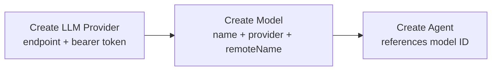
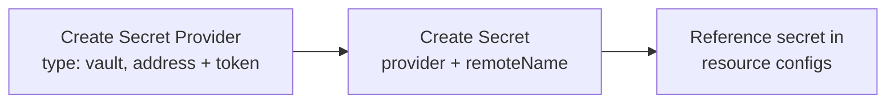

# Providers, Models, and Secrets

## Problem

Models and secrets are not owned resources — they are proxied from external systems (litellm for models, Vault for secrets). Resources like agents reference a model by raw string name, but the platform has no internal identifier for it. The model must be manually configured in litellm first, and the agent config uses a free-form string with no referential integrity.

The same applies to secrets. Vault secrets are referenced by path in environment variable configs (`kind: "vault"`, `path`, `key`), but there is no internal entity representing the secret. The reference resolver (`references.ts`) resolves them at runtime by calling the Vault API directly. If the path changes or the secret is deleted, the platform has no way to detect or report the broken reference ahead of time.

## Solution

Four new resource types managed by the Teams service:

1. **LLM Provider** — connection to an LLM service (endpoint + auth)
2. **Model** — internal model definition, referencing an LLM provider and a remote model name
3. **Secret Provider** — connection to a secret management system (Vault for now)
4. **Secret** — internal secret reference, pointing to a named secret in an external provider

Each has a stable internal UUID. Other resources reference models and secrets by ID.

---

## LLM Provider

An LLM provider represents a connection to an external LLM service. It stores the endpoint URL and authentication credentials needed to make API calls.

All LLM providers expose an OpenAI-compatible Responses API. The platform uses the same client for every provider — only the endpoint and auth differ.

### Resource Definition

| Field | Type | Description |
|-------|------|-------------|
| `endpoint` | string | Base URL of the provider API (e.g., `https://api.openai.com`, a litellm proxy URL, an OpenRouter URL) |
| `authMethod` | enum | Authentication method. Supported: `bearer` |
| `token` | string | Authentication token (used as Bearer token) |

`authMethod` is `bearer` for now. The field exists so other methods (API key header, mTLS, etc.) can be added later without schema changes.

### Provisioning Flow

1. User obtains an endpoint and token from a 3rd-party LLM service.
2. User creates an LLM Provider resource with endpoint, auth method, and token.
3. The provider is available for creating models.

---

## Model

A model is an internal resource that maps a human-readable name to a specific model on an LLM provider.

### Resource Definition

| Field | Type | Description |
|-------|------|-------------|
| `name` | string | Internal name used for display and reference (e.g., `"gpt-5"`, `"claude-sonnet"`) |
| `llmProvider` | string (UUID) | Reference to an LLM Provider resource |
| `remoteName` | string | Model identifier on the provider's side (e.g., `"gpt-5"`, `"anthropic/claude-sonnet-4-20250514"`) |

### Resolution Chain

```
Agent.model → Model.id → Model.llmProvider → LLM Provider (endpoint + token)
```

At runtime, the platform resolves: agent → model → LLM provider, then makes API calls using the provider's endpoint, token, and the model's remote name.

---

## Secret Provider

A secret provider represents a connection to an external secret management system. Currently only Vault is supported; the design allows adding other providers later.

### Resource Definition

| Field | Type | Description |
|-------|------|-------------|
| `type` | enum | Provider type. Supported: `vault` |
| `config` | object | Provider-specific connection configuration |

**Vault config:**

| Field | Type | Description |
|-------|------|-------------|
| `address` | string | Vault server address (e.g., `http://vault:8200`) |
| `token` | string | Authentication token |

---

## Secret

A secret is an internal resource that references a specific secret in an external provider. It gives the platform a stable ID for a secret value without storing the secret itself.

### Resource Definition

| Field | Type | Description |
|-------|------|-------------|
| `secretProvider` | string (UUID) | Reference to a Secret Provider resource |
| `remoteName` | string | Identifier of the secret in the external provider |

The format of `remoteName` is provider-specific. For Vault, it is a composite key: `<mount>/<path>/<key>` (e.g., `secret/platform/keys/api_key`).

### Relationship to Env Variable References

The existing env variable reference system already supports secrets via `kind: "vault"` references that are resolved at runtime by the reference resolver. The Secret resource does not replace that mechanism — it provides an internal identity layer on top of it.

Env variable configs can continue using inline vault references (`kind: "vault"`, `path`, `key`). The Secret resource gives the platform a way to track which secrets exist, which resources depend on them, and detect broken references before runtime.

---

## End-to-End Flows

### LLM Setup



### Secret Setup


