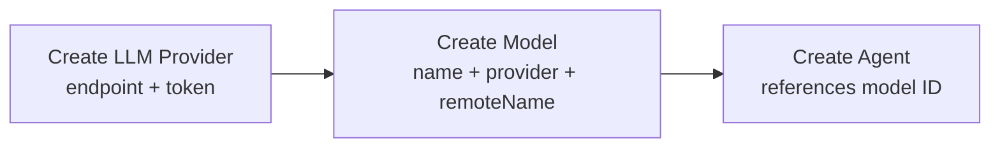
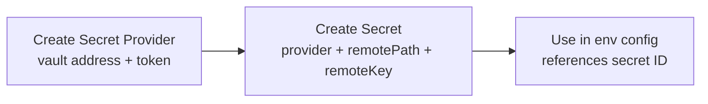

# Providers, Models, and Secrets

## Problem

Models and secrets exist in the platform UI but are not owned resources — they are proxied from external systems (litellm for models, Vault for secrets). This creates a dependency problem: resources like agents reference a model by name, but the platform has no internal identifier for it. The model must be manually configured in litellm first, and the agent config uses a raw string name with no referential integrity.

The same applies to secrets. Vault secrets are referenced by path in environment variable configs, but there is no internal entity representing the secret. If the Vault path changes or the secret is deleted, the platform has no way to detect or report the broken reference.

## Solution

Introduce **three new resource types** managed by the Teams service:

1. **LLM Provider** — connection to an LLM service (endpoint + credentials)
2. **Model** — an internal model definition, referencing an LLM provider and a remote model name
3. **Secret** — an internal secret reference, pointing to a secret in an external provider

Each has a stable internal ID. Other resources (agents, MCP servers, workspaces) reference models and secrets by ID, not by external name or path.

## LLM Provider

An LLM provider represents a connection to an external LLM service. It stores the endpoint URL and authentication token needed to make LLM calls.

### Resource Definition

| Field | Type | Description |
|-------|------|-------------|
| `type` | enum | Provider type. Supported values: `litellm`, `openrouter`, `openai` |
| `endpoint` | string | Base URL of the provider API |
| `token` | string | Authentication token for the provider API |

### Provisioning Flow

1. User obtains an endpoint and token from a 3rd-party LLM service (litellm, OpenRouter, OpenAI, etc.).
2. User creates an LLM Provider resource with endpoint and token.
3. The provider is now available for creating models.

## Model

A model is an internal resource that maps a human-readable name to a specific model on an LLM provider.

### Resource Definition

| Field | Type | Description |
|-------|------|-------------|
| `name` | string | Internal name used for display and reference (e.g., `"gpt-5"`, `"claude-sonnet"`) |
| `llmProvider` | string (UUID) | Reference to an LLM Provider resource |
| `remoteName` | string | Model identifier on the provider's side (e.g., `"gpt-5"`, `"anthropic/claude-sonnet-4-20250514"`) |

### Usage

The agent resource references a model by its internal ID:

```
Agent.model → Model.id → Model.llmProvider → LLM Provider (endpoint + token)
```

At runtime, the platform resolves the chain: agent → model → LLM provider, then makes LLM calls using the provider's endpoint, token, and the model's remote name.

## Secret Provider

A secret provider represents a connection to an external secret management system. Currently only Vault is supported, but the design allows adding more providers later.

### Resource Definition

| Field | Type | Description |
|-------|------|-------------|
| `type` | enum | Provider type. Supported values: `vault` |
| `config` | object | Provider-specific connection configuration |

**Vault config:**

| Field | Type | Description |
|-------|------|-------------|
| `address` | string | Vault server address |
| `token` | string | Authentication token |

## Secret

A secret is an internal resource that references a specific secret in an external provider. It gives the platform a stable ID for a secret value without storing the secret itself.

### Resource Definition

| Field | Type | Description |
|-------|------|-------------|
| `secretProvider` | string (UUID) | Reference to a Secret Provider resource |
| `remotePath` | string | Path to the secret in the external provider |
| `remoteKey` | string | Key within the secret at the given path |

### Usage

Environment variable configs reference a secret by its internal ID instead of embedding raw Vault paths:

**Current (vault reference by path):**
```json
{
  "name": "API_KEY",
  "value": {
    "kind": "vault",
    "mount": "secret",
    "path": "platform/keys",
    "key": "api_key"
  }
}
```

**New (reference by secret ID):**
```json
{
  "name": "API_KEY",
  "value": {
    "kind": "secret",
    "secretId": "<secret-uuid>"
  }
}
```

At runtime, the platform resolves the chain: secret ID → secret resource → secret provider → fetch value from the external system.

## End-to-End Flow

### LLM Setup



### Secret Setup



## Migration

Existing model references (raw string model names in agent configs) and vault references (inline vault paths in env configs) continue to work during migration. New resources are additive — they do not break existing configs.

The migration path:
1. Deploy LLM Provider, Model, Secret Provider, and Secret as new resource types in the Teams service.
2. Create provider and model/secret resources for existing external configurations.
3. Update agent configs to reference model IDs instead of raw names.
4. Update env configs to reference secret IDs instead of inline vault paths.
5. Deprecate raw string model names and inline vault references.
