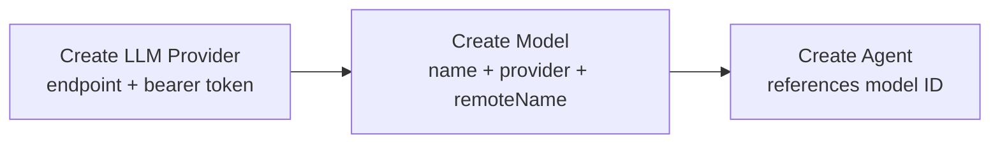
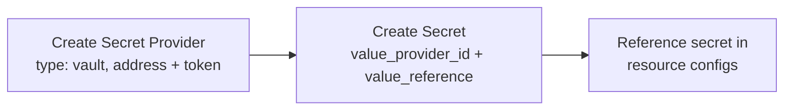
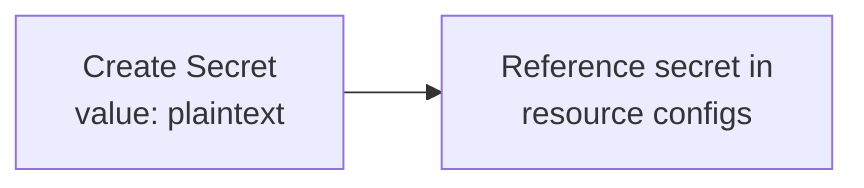
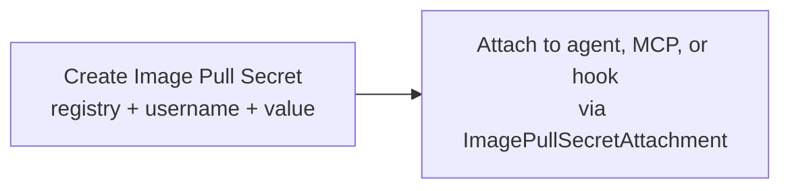

# Providers, Models, and Secrets

## LLM Provider

An LLM provider represents a connection to an external LLM service. Each provider declares which LLM API protocol it speaks — OpenAI Responses API or Anthropic Messages API. The [LLM Proxy](llm-proxy.md) uses the matching protocol when forwarding requests.

### Resource Definition

| Field | Type | Description |
|-------|------|-------------|
| `endpoint` | string | Base URL of the provider API (e.g., `https://api.openai.com`, a litellm proxy URL, an OpenRouter URL) |
| `protocol` | enum | LLM API protocol the provider speaks. Supported: `responses` (OpenAI Responses API), `anthropic_messages` (Anthropic Messages API) |
| `authMethod` | enum | Authentication method. Supported: `bearer`, `x_api_key` |
| `token` | string | Authentication token |

`protocol` determines how the [LLM Proxy](llm-proxy.md) communicates with the provider — which HTTP endpoint path, request/response format, and streaming event protocol to use. See [LLM Proxy — Protocols](llm-proxy.md#protocols) for the details of each protocol.

`authMethod` determines how the LLM Proxy authenticates with the provider:

| Value | Header | Format |
|-------|--------|--------|
| `bearer` | `Authorization` | `Bearer <token>` |
| `x_api_key` | `x-api-key` | `<token>` |

The auth method is independent of the protocol. An Anthropic-protocol provider typically uses `x_api_key`, but a proxy (e.g., litellm) may expose the Anthropic Messages API with `bearer` auth.

### Provisioning Flow

1. User obtains an endpoint and token from a 3rd-party LLM service.
2. User creates an LLM Provider resource with endpoint, auth method, and token.
3. The provider is available for creating models.

---

## Model

A model maps an internal name to a specific model on an LLM provider.

### Resource Definition

| Field | Type | Description |
|-------|------|-------------|
| `name` | string | Internal name used for display and reference (e.g., `"gpt-5"`, `"claude-sonnet"`) |
| `llmProvider` | string (UUID) | Reference to an LLM Provider resource |
| `remoteName` | string | Model identifier on the provider's side (e.g., `"gpt-5"`, `"anthropic/claude-sonnet-4-20250514"`) |

### Resolution Chain

```
Agent.model → Model.id → Model.llmProvider → LLM Provider (endpoint + token)
```

The platform resolves: agent → model → LLM provider, then makes API calls using the provider's endpoint, token, and the model's remote name.

---

## Secret Provider

A secret provider represents a connection to an external secret management system. Secret providers are used by secrets and image pull secrets that use remote value storage. Currently only Vault is supported; the design allows adding other providers.

### Resource Definition

| Field | Type | Description |
|-------|------|-------------|
| `type` | enum | Provider type. Supported: `vault` |
| `config` | object | Provider-specific connection configuration |

**Vault config:**

| Field | Type | Description |
|-------|------|-------------|
| `address` | string | Vault server address (e.g., `http://vault:8200`) |
| `token` | string | Authentication token |

---

## Secret

A secret stores a sensitive value. The value is either stored locally (encrypted at rest in the Secrets service database) or referenced from an external provider.

### Resource Definition

| Field | Type | Description |
|-------|------|-------------|
| `name` | string | Secret name |
| `value` | string | Direct secret value, encrypted at rest. Mutually exclusive with `value_provider_id` + `value_reference` |
| `value_provider_id` | string (UUID) | Reference to a Secret Provider. Mutually exclusive with `value`. Requires `value_reference` |
| `value_reference` | string | Identifier of the secret in the external provider. Required when `value_provider_id` is set |

Exactly one storage mode is set:

- **Local:** `value` is set. The Secrets service stores the value encrypted at rest using a symmetric encryption key from a Kubernetes Secret mounted into the service pod.
- **Remote:** `value_provider_id` + `value_reference` are set. The Secrets service resolves the value from the external provider at runtime.

The format of `value_reference` is provider-specific. For Vault, it is a composite key: `<mount>/<path>/<key>` (e.g., `secret/platform/keys/api_key`).

---

## Image Pull Secret

An image pull secret stores registry credentials for pulling container images from private registries. Managed by the [Secrets](secrets.md) service. Referenced by [ImagePullSecretAttachment](resource-definitions.md#image-pull-secret-attachment) resources.

### Resource Definition

| Field | Type | Description |
|-------|------|-------------|
| `registry` | string | Registry hostname (e.g., `ghcr.io`, `123456789.dkr.ecr.us-east-1.amazonaws.com`) |
| `username` | string | Registry username (e.g., `_json_key`, `AWS`, `oauth2accesstoken`, a plain username) |
| `value` | string | Direct password/token value, encrypted at rest. Mutually exclusive with `value_provider_id` + `value_reference` |
| `value_provider_id` | string (UUID) | Reference to a Secret Provider. Mutually exclusive with `value`. Requires `value_reference` |
| `value_reference` | string | Identifier of the password/token in the external provider. Required when `value_provider_id` is set |

The `registry` and `username` fields are plain text. The password/token uses the same dual storage model as [Secret](#secret) — local (encrypted at rest) or remote (resolved from a provider at runtime).

---

## End-to-End Flows

### LLM Setup



### Secret Setup (Remote)



### Secret Setup (Local)



### Image Pull Secret Setup


