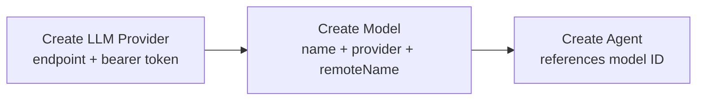
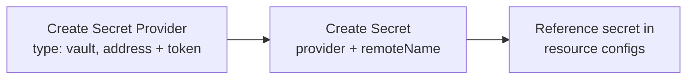

# Providers, Models, and Secrets

## LLM Provider

An LLM provider represents a connection to an external LLM service. All LLM providers expose an OpenAI-compatible Responses API. The [LLM Proxy](llm-proxy.md) uses the same client for every provider — only the endpoint and auth differ.

### Resource Definition

| Field | Type | Description |
|-------|------|-------------|
| `endpoint` | string | Base URL of the provider API (e.g., `https://api.openai.com`, a litellm proxy URL, an OpenRouter URL) |
| `authMethod` | enum | Authentication method. Supported: `bearer` |
| `token` | string | Authentication token (used as Bearer token) |

`authMethod` is `bearer` for now. The field exists so other methods (API key header, mTLS, etc.) can be added without schema changes.

### Provisioning Flow

1. User obtains an endpoint and token from a 3rd-party LLM service.
2. User creates an LLM Provider resource with endpoint, auth method, and token.
3. The provider is available for creating models.

---

## Model

A model maps an internal name to a specific model on an LLM provider.

### Resource Definition

| Field | Type | Description |
|-------|------|-------------|
| `name` | string | Internal name used for display and reference (e.g., `"gpt-5"`, `"claude-sonnet"`) |
| `llmProvider` | string (UUID) | Reference to an LLM Provider resource |
| `remoteName` | string | Model identifier on the provider's side (e.g., `"gpt-5"`, `"anthropic/claude-sonnet-4-20250514"`) |

### Resolution Chain

```
Agent.model → Model.id → Model.llmProvider → LLM Provider (endpoint + token)
```

The platform resolves: agent → model → LLM provider, then makes API calls using the provider's endpoint, token, and the model's remote name.

---

## Secret Provider

A secret provider represents a connection to an external secret management system. Currently only Vault is supported; the design allows adding other providers.

### Resource Definition

| Field | Type | Description |
|-------|------|-------------|
| `type` | enum | Provider type. Supported: `vault` |
| `config` | object | Provider-specific connection configuration |

**Vault config:**

| Field | Type | Description |
|-------|------|-------------|
| `address` | string | Vault server address (e.g., `http://vault:8200`) |
| `token` | string | Authentication token |

---

## Secret

A secret references a specific secret in an external provider. The platform stores a stable ID for the secret without storing the secret value itself.

### Resource Definition

| Field | Type | Description |
|-------|------|-------------|
| `secretProvider` | string (UUID) | Reference to a Secret Provider resource |
| `remoteName` | string | Identifier of the secret in the external provider |

The format of `remoteName` is provider-specific. For Vault, it is a composite key: `<mount>/<path>/<key>` (e.g., `secret/platform/keys/api_key`).

---

## End-to-End Flows

### LLM Setup



### Secret Setup


