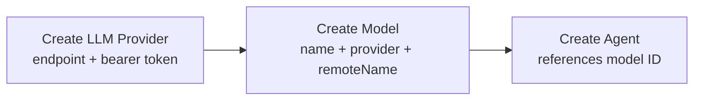
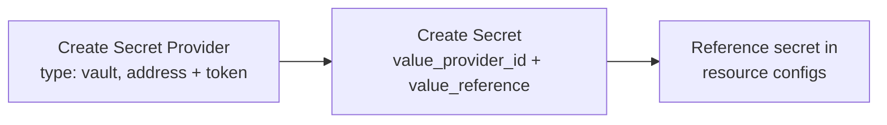
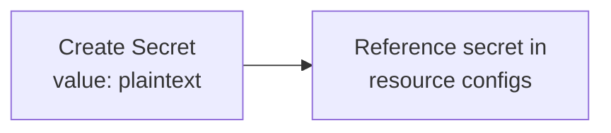
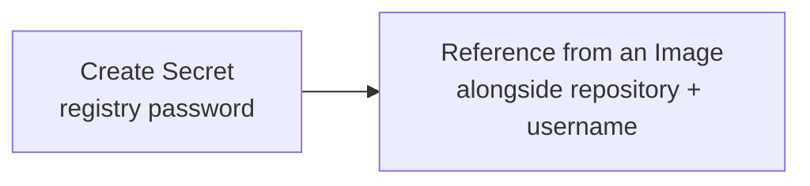

# Providers, Models, and Secrets

## LLM Provider

An LLM provider represents a connection to an external LLM service. Each provider declares which LLM API protocol it speaks — OpenAI Responses API or Anthropic Messages API. The [LLM Proxy](llm-proxy.md) uses the matching protocol when forwarding requests.

### Resource Definition

| Field | Type | Description |
|-------|------|-------------|
| `endpoint` | string | Base URL of the provider API (e.g., `https://api.openai.com`, a litellm proxy URL, an OpenRouter URL) |
| `protocol` | enum | LLM API protocol the provider speaks. Supported: `responses` (OpenAI Responses API), `anthropic_messages` (Anthropic Messages API) |
| `authMethod` | enum | Authentication method. Supported: `bearer`, `x_api_key`, `custom_headers` |
| `token` | string | Authentication token. Required when `authMethod` is `bearer` or `x_api_key`. Unused (must be empty) when `custom_headers` |
| `headers` | map<string, string> | Custom request headers injected on every forwarded request. Required (non-empty) when `authMethod` is `custom_headers`. Unused (must be empty) for `bearer` and `x_api_key` |

`protocol` determines how the [LLM Proxy](llm-proxy.md) communicates with the provider — which HTTP endpoint path, request/response format, and streaming event protocol to use. See [LLM Proxy — Protocols](llm-proxy.md#protocols) for the details of each protocol.

`authMethod` determines how the LLM Proxy authenticates with the provider:

| Value | Header(s) | Format |
|-------|-----------|--------|
| `bearer` | `Authorization` | `Bearer <token>` |
| `x_api_key` | `x-api-key` | `<token>` |
| `custom_headers` | each key in `headers` | each value in `headers`, verbatim |

The auth method is independent of the protocol. An Anthropic-protocol provider typically uses `x_api_key`, but a proxy (e.g., litellm) may expose the Anthropic Messages API with `bearer` auth. `custom_headers` covers providers that require non-standard auth headers (e.g., a gateway requiring a static `Authorization` plus an `x-org-id` tenant header, or APIs whose token format is not `Bearer <token>`).

Header names are case-insensitive and merged with the platform-injected headers — keys that would collide with hop-by-hop or routing headers (`Host`, `Content-Length`, `Connection`, `Transfer-Encoding`) are rejected on create/update. Values are stored encrypted at rest in the same way as `token`.

### Provisioning Flow

1. User obtains an endpoint and credentials from a 3rd-party LLM service.
2. User creates an LLM Provider resource with endpoint, auth method, and either `token` (for `bearer` / `x_api_key`) or `headers` (for `custom_headers`).
3. The provider is available for creating models.

---

## Model

A model maps an internal name to a specific model on an LLM provider.

### Resource Definition

| Field | Type | Description |
|-------|------|-------------|
| `name` | string | Internal name used for display and reference (e.g., `"gpt-5"`, `"claude-sonnet"`) |
| `llmProvider` | string (UUID) | Reference to an LLM Provider resource |
| `remoteName` | string | Model identifier on the provider's side (e.g., `"gpt-5"`, `"anthropic/claude-sonnet-4-20250514"`) |

### Resolution Chain

```
Agent.model → Model.id → Model.llmProvider → LLM Provider (endpoint + token)
```

The platform resolves: agent → model → LLM provider, then makes API calls using the provider's endpoint, token, and the model's remote name.

This chain applies to workloads in `platform` [LLM mode](resource-definitions.md#environment). In `native` mode there is no Model and no LLM Provider — see [Subscription](#subscription).

---

## Subscription

A subscription is a credential for an LLM vendor's own consumer plan, used by an agent CLI running in its **native** configuration: talking to the vendor's public API, with the vendor's model names, exactly as it would outside the platform. The [LLM Proxy](llm-proxy.md) still carries the traffic — a workload in `native` [LLM mode](resource-definitions.md#environment) has its vendor-bound traffic intercepted and terminated on the proxy, which replaces the placeholder credential in the container with the real one. See [LLM Proxy — Native Mode](llm-proxy.md#native-mode).

Managed by the [LLM](llm.md) service, alongside [LLM Providers](#llm-provider) and [Models](#model). A subscription is the same class of thing as a provider — a credential plus an upstream — differing in where the credential comes from and in the fact that the model namespace belongs to the vendor rather than to the platform.

### Resource Definition

| Field | Type | Description |
|-------|------|-------------|
| `name` | string | Internal name used for display and reference. Unique within the organization |
| `vendor` | enum | Which vendor's plan the credential belongs to. Supported: `anthropic`, `openai`. A closed set — each value fixes an intercepted host, an upstream, a protocol, and a header set (see [Vendors](#vendors)) |
| `secret_id` | string (UUID) | Reference to a [Secret](#secret) holding the token. Existence is validated on create/update; the value is resolved at binding time and never stored by the LLM service |
| `account_id` | string | `null` unless the vendor's API requires an account identifier alongside the token. Not a secret |

The token is held **by reference** rather than inline — unlike an [LLM Provider](#llm-provider)'s `token` — so it can live in Vault behind a [Secret Provider](#secret-provider), rotate in one place, and reuse the Secrets service's encryption at rest rather than a second copy of that machinery. The extra resolution hop costs nothing on the request path: a native-mode binding is resolved once per connection, not per request.

This leaves the LLM service holding credentials two ways, inline for providers and by reference for subscriptions. The divergence is accepted rather than allowed to propagate backwards; converging `LLMProvider.token` onto `secret_id` is a data migration, not a design question.

### Vendors

The vendor set is closed because each value determines three things the platform must know without configuration — what to intercept, where to send it, and what to inject:

| `vendor` | Intercepted host | Upstream | Protocol | Injected upstream | Placeholder |
|---|---|---|---|---|---|
| `anthropic` | `api.anthropic.com` | `https://api.anthropic.com` | `anthropic_messages` | `Authorization: Bearer <token>` | env var `CLAUDE_CODE_OAUTH_TOKEN` |
| `openai` | `chatgpt.com` | `https://chatgpt.com/backend-api/codex` | `responses` | `Authorization: Bearer <token>`, `chatgpt-account-id: <account_id>` | file `~/.codex/auth.json` |

A subscription-mode Codex CLI calls `https://chatgpt.com/backend-api/codex/responses`, which is why the OpenAI row intercepts `chatgpt.com` rather than `api.openai.com` — the latter is where an *API-key* Codex CLI goes, and pairing that host with a subscription credential is what made an earlier version of this table incoherent.

Adding a vendor is a platform change — a new enum value, a new intercept service, and a row here — not a configuration surface. An operator cannot point native mode at an arbitrary host, because native mode's whole premise is that the agent CLI is unmodified and therefore addresses only the hosts its vendor built it to address.

The platform does not refresh these credentials. `openai`'s in particular is a short-lived token pair where `anthropic`'s is long-lived, so an OpenAI subscription needs its [Secret](#secret) kept current by whatever minted it — the same limitation [egress rule injection](../product/egress-gateway/egress-gateway.md#constraints) documents. That is a property of the credential, not a reason to treat the vendor as unsupported.

### Placeholder Delivery

A vendor's placeholder is a dummy the agent CLI needs in order to start; the [LLM Proxy](llm-proxy.md#the-container-still-holds-a-placeholder) discards it and injects the real credential. Vendors differ in how their CLIs read one, and the difference decides who writes it:

| Kind | Written by | Why |
|---|---|---|
| Environment variable | [Agents Orchestrator](agents-orchestrator.md#workload-spec-assembly), onto the container spec | An interactive [sandbox](../product/sandboxes/sandboxes.md) session is started by the runner's `Exec` against the pod and inherits the *container spec's* environment. A variable set in any process — including `agynd`'s — is invisible to it |
| File | [`agynd`](agynd-cli.md#native-mode-configuration), at container start | The path is CLI-specific and resolves against `HOME`, which the platform deliberately does not manage — the orchestrator cannot compute it, and `agynd` reads the CLI from [`config.json`](agent-init.md#configjson). A file written before `agynd` idles persists on the container filesystem, so a session exec'd hours later sees it, which is exactly what the environment variable case cannot do |

Both kinds work in a sandbox, for opposite reasons — one because the container spec outlives every process, the other because the filesystem does. The [LLM service](llm.md#subscription-management) reports which kind a vendor uses, so neither writer holds a copy of this table.

### Provisioning Flow

1. User obtains a token from the vendor for their own plan.
2. User creates a [Secret](#secret) holding it.
3. User creates a Subscription naming the vendor and the secret.
4. User attaches it to an [Environment](resource-definitions.md#environment) whose `llm_mode` is `native`, or to an [Agent](resource-definitions.md#agent) running in one.

---

## Subscription Attachment

Binds a [Subscription](#subscription) to an [Agent](resource-definitions.md#agent) or an [Environment](resource-definitions.md#environment). One subscription may be attached to many targets. Managed by the [LLM](llm.md) service.

| Field | Type | Description |
|-------|------|-------------|
| `subscription_id` | string (UUID) | The subscription being attached |
| `agent_id` | string (UUID) | Target agent. Mutually exclusive with `environment_id` |
| `environment_id` | string (UUID) | Target environment. Mutually exclusive with `agent_id` |

Exactly one of `agent_id` or `environment_id` is set. Attachments are immutable — create and delete only — and a subscription cannot be deleted while any attachment exists.

**Uniqueness is on `(vendor, target)`, not `(subscription, target)`.** A target cannot accumulate two subscriptions for the same vendor. This is what makes `(caller, vendor)` a total function at resolution time: an intercepted request carries nothing that identifies a credential, so the request must never have to choose between two. Per-initiator credentials, when they arrive, extend that key with a third term rather than changing its shape.

An agent's attachment shadows its environment's for the same vendor — the same precedence [ENVs and MCP servers](../product/environments/environments.md#what-an-environment-contains) already follow. A [sandbox](resource-definitions.md#sandbox) has no agent, so it sees the environment's attachments and nothing else.

---

## Secret Provider

A secret provider represents a connection to an external secret management system. Secret providers are used by secrets that use remote value storage. Currently only Vault is supported; the design allows adding other providers.

### Resource Definition

| Field | Type | Description |
|-------|------|-------------|
| `type` | enum | Provider type. Supported: `vault` |
| `config` | object | Provider-specific connection configuration |

**Vault config:**

| Field | Type | Description |
|-------|------|-------------|
| `address` | string | Vault server address (e.g., `http://vault:8200`) |
| `token` | string | Authentication token |

---

## Secret

A secret stores a sensitive value. The value is either stored locally (encrypted at rest in the Secrets service database) or referenced from an external provider.

### Resource Definition

| Field | Type | Description |
|-------|------|-------------|
| `name` | string | Secret name |
| `value` | string | Direct secret value, encrypted at rest. Mutually exclusive with `value_provider_id` + `value_reference` |
| `value_provider_id` | string (UUID) | Reference to a Secret Provider. Mutually exclusive with `value`. Requires `value_reference` |
| `value_reference` | string | Identifier of the secret in the external provider. Required when `value_provider_id` is set |

Exactly one storage mode is set:

- **Local:** `value` is set. The Secrets service stores the value encrypted at rest using a symmetric encryption key from a Kubernetes Secret mounted into the service pod.
- **Remote:** `value_provider_id` + `value_reference` are set. The Secrets service resolves the value from the external provider at runtime.

The format of `value_reference` is provider-specific. For Vault, it is a composite key: `<mount>/<path>/<key>` (e.g., `secret/platform/keys/api_key`).

---

Registry credentials are not a resource here. A registry password is an ordinary [Secret](#secret) referenced by an [Image](resource-definitions.md#image), which is where the registry address lives; the [Image Proxy](image-proxy.md) is its only consumer and it is never delivered to a workload.

---

## End-to-End Flows

### LLM Setup


```mermaid
flowchart LR
    A[Create LLM Provider<br/>endpoint + bearer token] --> B[Create Model<br/>name + provider + remoteName]
    B --> C[Create Agent<br/>references model ID]
```

### Secret Setup (Remote)


```mermaid
flowchart LR
    A[Create Secret Provider<br/>type: vault, address + token] --> B[Create Secret<br/>value_provider_id + value_reference]
    B --> C[Reference secret in<br/>resource configs]
```

### Secret Setup (Local)


```mermaid
flowchart LR
    A[Create Secret<br/>value: plaintext] --> B[Reference secret in<br/>resource configs]
```

### Registry Credential Setup


```mermaid
flowchart LR
    A[Create Secret<br/>registry password] --> B[Reference from an Image<br/>alongside repository + username]
```
