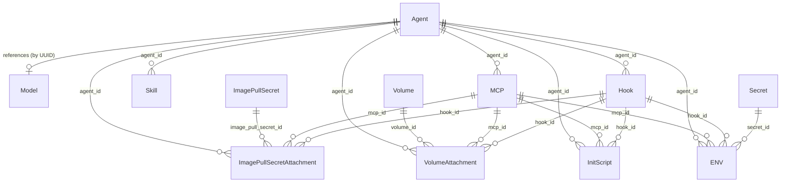

# Resource Definitions

Canonical schema for all agent-managed resources in the Agyn platform. This is the single source of truth for resource structure — the Terraform provider, Agents API, and UI should all align to these definitions.

Resources are managed by the [Agents](agents-service.md) service and stored in PostgreSQL. Agents and Volumes are scoped to an [organization](organizations.md) (direct `organization_id`). Sub-resources inherit organization scope through their parent. See [Organizations — Resource Scoping](organizations.md#resource-scoping).

All resources share a common envelope:

| Field | Type | Description |
|-------|------|-------------|
| `id` | string (UUID) | Unique identifier |
| `description` | string | Human-readable description (optional) |
| `created_at` | timestamp | Creation time |
| `updated_at` | timestamp | Last modification time |

Resource-specific fields are defined alongside the envelope — not nested inside a `config` object.

---

## Entity Diagram

---

## Agent

An agent definition that determines how an agent workload behaves when processing thread messages. The Agent is the central resource — it represents a single agent pod. Infrastructure concerns (image, compute resources) and behavioral concerns (LLM configuration) live on the agent directly.

| Field | Type | Default | Description |
|-------|------|---------|-------------|
| `name` | string | | Agent identity name (max 64 chars). Injected into the agent runtime |
| `nickname` | string | `null` | Optional `@mention` handle within the organization (max 32 chars, pattern: `^[a-z0-9_-]+$`). Set via the Agents service; uniqueness enforced by the [Identity](identity.md) service |
| `role` | string | | Agent role label (max 64 chars). Injected into the agent runtime |
| `model` | string (UUID) | | Reference to a [Model](providers.md#model) resource in the LLM service |
| `configuration` | JSON string | `"{}"` | Agent behavioral configuration. Opaque to the Agents service — interpreted by the agent runtime |
| `image` | string | | Container image for the agent pod (e.g., `ghcr.io/agynio/agent:latest`) |
| `init_image` | string | | Platform init image reference (e.g., `ghcr.io/agynio/agent-init-codex:v1.0.0`). Contains agynd + agent CLI. Runs as init container |
| `resources` | object | | Compute resources for the agent container (see [Compute Resources](#compute-resources)) |
| `runner_labels` | map<string, string> | `{}` | Labels that a runner must match for this agent's workloads to be scheduled on it. The [Agents Orchestrator](agents-orchestrator.md) filters eligible runners to those whose labels contain all key-value pairs specified here (exact match). Empty means no runner label constraints. See [Runner Selection](runners.md#runner-selection) |
| `idle_timeout` | duration string | `"5m"` | How long an agent workload can remain idle before the [Agents Orchestrator](agents-orchestrator.md) stops it. Measured from the last activity reported by [`agynd`](agynd-cli.md) via the [Runners](runners.md) service. Format: Go-style duration (e.g., `"30s"`, `"5m"`, `"1h"`) |
| `capabilities` | list<string> | `[]` | Named capabilities to enable for this agent. The runner injects the required sidecars and environment variables transparently — the agent does not configure them directly. Capability names are open strings; the runner is the registry. See [Capabilities](#capabilities) |
| `availability` | enum | | `internal` or `private`. Controls who can initiate threads with this agent. `internal` — any org member may add the agent as a thread participant. `private` — only identities holding an [agent role](agents-service.md#roles) (`owner`, `maintainer`, or `participant`) may add the agent. Required on `CreateAgent` — the API has no default. See [Agents Service — Availability](agents-service.md#availability) |

The `configuration` field contains agent implementation-specific behavioral parameters (system prompt, summarization settings, message buffering, etc.). Different agent implementations define different configuration schemas. The Agents service stores the field as an opaque JSON string without validation. See [Agent](agent/) for the platform's own agent implementation and its configuration schema.

---

## Volume

A volume definition. Volumes exist independently of agents. A volume is mounted into a container via a [VolumeAttachment](#volume-attachment).

| Field | Type | Default | Description |
|-------|------|---------|-------------|
| `persistent` | boolean | | `true` = named persistent volume (PVC). `false` = ephemeral (emptyDir) |
| `mount_path` | string | | Absolute container path for the volume mount (e.g., `"/workspace"`) |
| `size` | string | | Volume capacity (e.g., `"10Gi"`). Required when `persistent` is `true` |
| `ttl` | duration string | `null` | How long after the last workload on a thread stops before the volume instance for that thread is deleted (e.g., `"7d"`, `"24h"`). `null` means the volume is never deleted automatically. Only applies when `persistent` is `true` |

---

## Volume Attachment

A relationship between a [Volume](#volume) and a target container — an [Agent](#agent), [MCP](#mcp), or [Hook](#hook). Volumes are reusable infrastructure that may outlive any single agent and can be remounted when a resource is replaced.

| Field | Type | Description |
|-------|------|-------------|
| `id` | string (UUID) | Unique identifier |
| `volume_id` | string (UUID) | Reference to a Volume resource |
| `agent_id` | string (UUID) | Target agent. Mutually exclusive with `mcp_id` and `hook_id` |
| `mcp_id` | string (UUID) | Target MCP server. Mutually exclusive with `agent_id` and `hook_id` |
| `hook_id` | string (UUID) | Target hook. Mutually exclusive with `agent_id` and `mcp_id` |
| `created_at` | timestamp | Creation time |

Exactly one of `agent_id`, `mcp_id`, or `hook_id` is set. Volume attachments are immutable — they can be created and deleted, but not updated. Duplicate attachments (same volume_id + target) are rejected.

---

## Image Pull Secret Attachment

A relationship between an [Image Pull Secret](providers.md#image-pull-secret) and a target container — an [Agent](#agent), [MCP](#mcp), or [Hook](#hook). Image pull secrets are org-scoped resources managed by the [Secrets](secrets.md) service. The attachment lives in the [Agents](agents-service.md) service.

| Field | Type | Description |
|-------|------|-------------|
| `id` | string (UUID) | Unique identifier |
| `image_pull_secret_id` | string (UUID) | Reference to an Image Pull Secret resource in the Secrets service |
| `agent_id` | string (UUID) | Target agent. Mutually exclusive with `mcp_id` and `hook_id` |
| `mcp_id` | string (UUID) | Target MCP server. Mutually exclusive with `agent_id` and `hook_id` |
| `hook_id` | string (UUID) | Target hook. Mutually exclusive with `agent_id` and `mcp_id` |
| `created_at` | timestamp | Creation time |

Exactly one of `agent_id`, `mcp_id`, or `hook_id` is set. Image pull secret attachments are immutable — they can be created and deleted, but not updated. Duplicate attachments (same image_pull_secret_id + target) are rejected.

At workload assembly time, the [Agents Orchestrator](agents-orchestrator.md) collects all image pull secret attachments across the agent and its MCPs and hooks. If two attachments reference image pull secrets with the same `registry` hostname but different credentials, the orchestrator rejects the workload with an error.

---

## MCP

An MCP (Model Context Protocol) server definition. Runs as a sidecar container inside the agent pod, sharing the network namespace. See [MCP](mcp.md) for the full MCP architecture.

| Field | Type | Default | Description |
|-------|------|---------|-------------|
| `agent_id` | string (UUID) | | Reference to the [Agent](#agent) this MCP server belongs to |
| `name` | string | | MCP server name. Unique within agent. Max 63 characters, pattern: `^[a-z][a-z0-9_]{0,62}$`. Used as the server key in agent CLI MCP configuration and as the tool namespace prefix |
| `image` | string | | Container image for the MCP sidecar (e.g., `ghcr.io/agynio/mcp-filesystem:latest`) |
| `command` | string | | Startup command executed inside the container |
| `resources` | object | | Compute resources for the sidecar container (see [Compute Resources](#compute-resources)) |

Environment variables, initialization scripts, volumes, and image pull secrets for an MCP server are [ENV](#env), [InitScript](#initscript), [VolumeAttachment](#volume-attachment), and [ImagePullSecretAttachment](#image-pull-secret-attachment) resources that reference this MCP by `mcp_id`.

---

## Skill

A named, reusable prompt fragment. When belonging to an agent, the agent runtime appends the skill body to the conversation context (e.g., as an additional system message). Skills allow composing agent behavior from modular pieces without editing the agent's core system prompt.

| Field | Type | Default | Description |
|-------|------|---------|-------------|
| `agent_id` | string (UUID) | | Reference to the [Agent](#agent) this skill belongs to |
| `name` | string | | Skill name (unique within agent, max 64 chars) |
| `body` | string | | Skill content — prompt text, instructions, or behavioral directives |

---

## Capabilities

Named capabilities declared on an [Agent](#agent) via the `capabilities` field. The runner injects the required sidecars and environment variables transparently — the agent resource only declares intent, not implementation details.

Capability names are **open strings** — the platform does not maintain a closed registry. Any runner can implement any capability name it chooses. The [Agents Orchestrator](agents-orchestrator.md) routes workloads to runners that advertise the required capabilities (see [Runner Selection](runners.md#runner-selection)); if no eligible runner advertises a required capability, scheduling fails with a descriptive error.

Different runners may implement the same capability name differently depending on what the node supports. See [k8s-runner — Capability Implementations](k8s-runner.md#capability-implementations) for an example of how one runner implements the `docker` capability across multiple isolation levels.

---

## Hook

An event-driven function that runs in response to agent lifecycle events. Hooks run as sidecar containers inside the agent pod, sharing the network namespace. The platform triggers them when the specified event occurs.

| Field | Type | Default | Description |
|-------|------|---------|-------------|
| `agent_id` | string (UUID) | | Reference to the [Agent](#agent) this hook belongs to |
| `event` | string | | Lifecycle event that triggers this hook. Event names are agent implementation-specific |
| `function` | string | | Entrypoint command executed inside the container |
| `image` | string | | Container image for the hook execution environment |
| `resources` | object | | Compute resources for the hook container (see [Compute Resources](#compute-resources)) |

Environment variables, initialization scripts, volumes, and image pull secrets for a hook are [ENV](#env), [InitScript](#initscript), [VolumeAttachment](#volume-attachment), and [ImagePullSecretAttachment](#image-pull-secret-attachment) resources that reference this hook by `hook_id`.

---

## ENV

An environment variable injected into a container. Each ENV belongs to exactly one target — an [Agent](#agent), an [MCP](#mcp), or a [Hook](#hook) — identified by the corresponding foreign key.

| Field | Type | Default | Description |
|-------|------|---------|-------------|
| `agent_id` | string (UUID) | | Target agent. Mutually exclusive with `mcp_id` and `hook_id` |
| `mcp_id` | string (UUID) | | Target MCP server. Mutually exclusive with `agent_id` and `hook_id` |
| `hook_id` | string (UUID) | | Target hook. Mutually exclusive with `agent_id` and `mcp_id` |
| `name` | string | | Environment variable name (e.g., `"API_KEY"`) |
| `value` | string | | Plain-text value. Mutually exclusive with `secret_id` |
| `secret_id` | string (UUID) | | Reference to a [Secret](providers.md#secret) resource. Mutually exclusive with `value` |

Exactly one of `agent_id`, `mcp_id`, or `hook_id` is set (the target). Exactly one of `value` or `secret_id` is set (the source). When `secret_id` is set, the platform resolves the secret value at runtime before injecting it into the container.

---

## InitScript

A named shell script executed by [`agynd`](agynd-cli.md) during container initialization, before the agent CLI is spawned. Each InitScript belongs to exactly one target — an [Agent](#agent), an [MCP](#mcp), or a [Hook](#hook).

| Field | Type | Default | Description |
|-------|------|---------|-------------|
| `id` | string (UUID) | | Unique identifier |
| `name` | string | | Human-readable name for visibility in logs and the Console |
| `agent_id` | string (UUID) | | Target agent. Mutually exclusive with `mcp_id` and `hook_id` |
| `mcp_id` | string (UUID) | | Target MCP server. Mutually exclusive with `agent_id` and `hook_id` |
| `hook_id` | string (UUID) | | Target hook. Mutually exclusive with `agent_id` and `mcp_id` |
| `script` | string | | Shell script content |

When multiple init scripts target the same resource, they execute in creation order. Each script runs in its own shell invocation using the container's default shell. If a script exits with a non-zero code, the failure is printed to stderr and execution continues with the next script.

---

## Secret

A sensitive value with local or remote storage. Managed by the [Secrets](secrets.md) service. Referenced by [ENV](#env) resources via `secret_id`. See [Providers, Models, and Secrets](providers.md#secret) for the resource definition.

---

## Image Pull Secret

Registry credentials for pulling container images from private registries. Managed by the [Secrets](secrets.md) service. Attached to agents, MCPs, and hooks via [ImagePullSecretAttachment](#image-pull-secret-attachment). See [Providers, Models, and Secrets](providers.md#image-pull-secret) for the resource definition.

---

## LLM Provider

A connection to an external LLM service. Managed by the [LLM](llm.md) service. See [Providers, Models, and Secrets](providers.md#llm-provider) for the resource definition.

---

## Model

An internal model definition mapped to a remote model on an LLM provider. Managed by the [LLM](llm.md) service. See [Providers, Models, and Secrets](providers.md#model) for the resource definition.

---

## Egress Rule

A rule that mediates outbound HTTP/HTTPS traffic from agent workloads. Org-scoped (direct `organization_id`). Managed by the [EgressRules service](egress-rules-service.md). Attached to [Agents](#agent) via [EgressRuleAttachment](#egress-rule-attachment).

| Field | Type | Default | Description |
|-------|------|---------|-------------|
| `name` | string | | Human-readable label |
| `matcher` | object | | Which requests the rule applies to. See [Matcher](#matcher) |
| `effect` | object | | What happens to matching requests. See [Effect](#effect) |
| `openziti_service_id` | string | | OpenZiti service ID returned by Ziti Management for this rule. The OpenZiti service name is `egress-rule-<id>`; Dial policy selectors target the concrete ID as `@<openziti_service_id>`. Internal — not returned through the Gateway |

Uniqueness: `(organization_id, matcher.domain_pattern)`. Reserved domain patterns are rejected at create time: `*.ziti`, `*.svc`, `*.cluster.local`, and any pattern overlapping the OpenZiti synthetic range (`100.64.0.0/10`).

`effect` must have at least one of `action` or `inject` non-empty (a rule with neither does nothing useful — surfaced as a create-time warning).

### Matcher

| Field | Type | Default | Description |
|-------|------|---------|-------------|
| `domain_pattern` | string | | Hostname pattern. Examples: `api.github.com`, `*.github.com`. Single-segment wildcards supported. Required |
| `ports` | list<int> | `[80, 443]` | Destination ports to intercept. Each entry is a single TCP port number |
| `methods` | list<string> | `[]` (any) | HTTP methods the rule applies to (e.g., `["GET", "HEAD"]`) |
| `path_pattern` | string | `""` (any) | Glob over the request path (e.g., `/repos/**`, `/users/*/issues`) |

### Effect

| Field | Type | Default | Description |
|-------|------|---------|-------------|
| `action` | enum | `null` | `allow`, `deny`, or null. Null means the rule does not influence reachability (typical for injection-only rules) |
| `inject` | list<Header> | `[]` | Headers to inject on matching requests. Empty means no injection. See [Header](#header) |

### Header

| Field | Type | Default | Description |
|-------|------|---------|-------------|
| `name` | string | | HTTP header name (e.g., `Authorization`, `X-Api-Key`) |
| `scheme` | enum | `null` | Authentication scheme. `bearer`, `basic`, or null. When set, the emitted header value is `<Scheme> <credential>` (e.g., `Bearer <credential>`). When null, the credential is emitted verbatim |
| `value` | string | | Literal credential. Mutually exclusive with `secret_id` |
| `secret_id` | string (UUID) | | Reference to a [Secret](#secret), resolved at request time. Mutually exclusive with `value`. Must reference a Secret in the rule's organization |

Exactly one of `value` or `secret_id` is set per header entry (the *credential*). The emitted header value is the credential, prefixed with `<Scheme> ` when `scheme` is set.

| `scheme` | `value` / resolved `secret_id` | Emitted header |
|---|---|---|
| `bearer` | `ghp_xxx` | `Authorization: Bearer ghp_xxx` |
| `basic` | `dXNlcjpwYXNz` (caller-supplied base64 of `user:pass`) | `Authorization: Basic dXNlcjpwYXNz` |
| null | `ghp_xxx` | `X-Api-Key: ghp_xxx` |

For `basic`, the credential must already be the base64 encoding of `user:pass` — the platform does not encode it.

---

## Egress Rule Attachment

A relationship binding an [Egress Rule](#egress-rule) to an [Agent](#agent). One rule may be attached to many agents; one agent may have many rules attached. Managed by the [EgressRules service](egress-rules-service.md).

| Field | Type | Description |
|-------|------|-------------|
| `id` | string (UUID) | Unique identifier |
| `rule_id` | string (UUID) | Reference to an Egress Rule |
| `agent_id` | string (UUID) | Reference to an Agent |
| `openziti_dial_policy_id` | string | OpenZiti Dial policy ID created for this attachment. Internal — not returned through the Gateway |
| `created_at` | timestamp | Creation time |

Attachments are immutable — create and delete only. Unique on `(rule_id, agent_id)`. Both rule and agent must belong to the same organization — the [EgressRules service](egress-rules-service.md#authorization) enforces this on create.

---

## Network

An organization-scoped logical container for a private network reachable through one or more [Tunnels](#tunnel-credential). Holds [PrivateResources](#private-resource). Materialized as an OpenZiti role attribute (`network-<id>`) that the per-network Bind policy and tunnel identities reference. Managed by the [Networks service](networks-service.md).

| Field | Type | Default | Description |
|-------|------|---------|-------------|
| `name` | string | | Human-readable label. Unique within the organization |
| `description` | string | `""` | Free-form description |
| `provisioning_state` | enum | | `active` \| `failed` \| `removing`. Reflects whether the per-network Bind policy was successfully provisioned in OpenZiti. `failed` is retried by reconciliation |

Networks have no configuration beyond name and description. Their purpose is to be the HA boundary (multiple tunnels share `network-<id>`) and the OpenZiti binding unit.

---

## Tunnel Credential

An enrollment artifact for a single OpenZiti tunneler instance inside the operator's private network. Each credential maps 1:1 to an OpenZiti identity with role attributes `["tunnels", "network-<network_id>"]`. Managed by the [Networks service](networks-service.md).

| Field | Type | Description |
|-------|------|-------------|
| `network_id` | string (UUID) | Reference to the [Network](#network) this credential belongs to |
| `openziti_identity_id` | string | OpenZiti identity created at credential issuance. Internal — not returned through the Gateway |
| `enrollment_jwt` | string | One-time-token JWT. **Returned only in the `CreateTunnelCredential` response.** Omitted from `GetTunnelCredential` and `ListTunnelCredentials` responses. Not persisted in plaintext — if the operator loses it before enrolling, they must delete the credential and create a new one |
| `enrollment_jwt_revealed` | bool | `true` after `CreateTunnelCredential` has returned the JWT to a caller. Visible on reads as a hint that the JWT has been issued and cannot be retrieved again |
| `enrollment_jwt_expires_at` | timestamp | JWT expiry (Controller-defined, typically 24h) |
| `enrollment_state` | enum | `pending` (JWT issued, identity not yet enrolled) \| `enrolled` (Controller reports identity as enrolled). Sourced from the OpenZiti Controller's `enrollment.state` on the identity |
| `connectivity` | enum | `online` (Controller reports `hasEdgeRouterConnection: true`) \| `offline`. Polled every `TUNNEL_LIVENESS_INTERVAL` (default 30s) |
| `provisioning_state` | enum | `active` \| `failed` \| `removing`. Reflects whether the underlying OpenZiti identity was successfully created. `failed` is retried by reconciliation |
| `enrolled_at` | timestamp \| null | Set the first time the Controller reports the identity as enrolled |
| `last_seen_at` | timestamp \| null | Updated whenever the Controller poll observes `hasEdgeRouterConnection: true` |

Credentials are revocable. Revocation deletes the underlying OpenZiti identity, severing any tunneler that holds it. Other credentials in the same network are unaffected.

---

## Private Resource

A single addressable endpoint behind a [Network](#network): a `target_host:target_ports` target the Tunnel forwards to, exposed to agents as an `intercept_host:intercept_ports` hostname they dial. Managed by the [Networks service](networks-service.md). Access is granted via [PrivateResourceAccess](#private-resource-access).

| Field | Type | Default | Description |
|-------|------|---------|-------------|
| `network_id` | string (UUID) | | Reference to the owning [Network](#network) |
| `name` | string | | Human-readable label. Not unique |
| `protocol` | enum | | `tcp` \| `http` \| `https`. A resource has a single protocol for all its ports. UDP is not supported in v1 |
| `target_host` | string | | IP literal (v4/v6) or DNS name. Resolved at the tunnel-side at connect time |
| `target_ports` | list<uint16> | | Ports on the target. List of individual port numbers (e.g., `[5432]`, `[80, 443]`, `[9200, 9300]`). Port ranges are not supported in v1 |
| `intercept_host` | string | | Hostname the agent dials. Reserved zones (see below) are rejected at create time |
| `intercept_ports` | list<uint16> | | Ports the agent dials. Cardinality must match `target_ports` exactly; positional 1:1 mapping (i.e., `intercept_ports[i]` forwards to `target_ports[i]`) |
| `provisioning_state` | enum | | `active` \| `failed` \| `removing`. Reflects whether the backing OpenZiti service was successfully provisioned. `failed` is retried by reconciliation |
| `openziti_service_id` | string | | OpenZiti service ID created for this resource (`private-<id>`). Internal — not returned through the Gateway |

Uniqueness: for each `port` in `intercept_ports`, the tuple `(organization_id, intercept_host, port)` must be unique across all resources in the organization. Two resources in the same org may not claim the same intercept hostname on overlapping ports — OpenZiti routing would be ambiguous for any identity authorized to dial both.

Reserved `intercept_host` patterns rejected at create time: `*.ziti`, `*.svc`, `*.cluster.local`, anything overlapping `100.64.0.0/10` (OpenZiti synthetic CIDR), `localhost`, `127.0.0.0/8`, and `::1/128`.

The `protocol` field is platform metadata used to gate features like header injection (see [Private Networks — EgressRule Interaction](private-networks.md#egressrule-interaction)). OpenZiti itself sees only TCP streams.

---

## Private Resource Access

A relationship granting a principal (agent, user, or group) the ability to dial a [PrivateResource](#private-resource). Each grant materializes as an OpenZiti Dial policy. Managed by the [Networks service](networks-service.md).

| Field | Type | Description |
|-------|------|-------------|
| `private_resource_id` | string (UUID) | Reference to the [PrivateResource](#private-resource) |
| `principal_type` | enum | `agent` \| `user` \| `group` \| `app` |
| `principal_id` | string (UUID) | Identity or group ID |
| `provisioning_state` | enum | `active` \| `failed` \| `removing`. Reflects whether the backing OpenZiti Dial policy was successfully provisioned. `failed` is retried by reconciliation |
| `openziti_dial_policy_id` | string | OpenZiti Dial policy created for this grant (one Dial policy per grant). Internal — not returned through the Gateway |

Grants are immutable — create and delete only. Unique on `(private_resource_id, principal_type, principal_id)`. The resource and the principal must belong to the same organization — the [Networks service](networks-service.md#authorization) enforces this on create.

For `user` principals, the grant resolves to the user's enrolled device identities (any device with role attribute `user-<id>` can dial). For `app` principals, the grant resolves to the app's single OpenZiti identity (role attribute `app-<id>`). For `group` principals, the grant resolves to every member's identity transitively (any identity with role attribute `group-<id>` — includes apps, users' devices, and agent workloads that are members of the group).

---

## Group

An organization-scoped named collection of platform identities used to grant permissions and resource access in bulk. Managed by the [Groups service](groups-service.md). Members are tracked via [GroupMembership](#group-membership).

| Field | Type | Default | Description |
|-------|------|---------|-------------|
| `name` | string | | Human-readable handle. Unique within `(organization_id, source)`. Pattern: `^[a-z0-9_-]+$`, max 64 chars |
| `description` | string | `""` | Free-form description |
| `source` | enum | `platform` | `platform` \| `scim`. Immutable after creation. `scim` groups have user membership reconciled by an external IdP |
| `external_id` | string \| null | `null` | For `source: scim`, the IdP's group identifier. Null for `platform` groups |

Group membership grants permissions via OpenFGA `group#member` references on other types (e.g., `agent.editor`), and via OpenZiti role attributes (`group-<id>` on each member's network identity) for dial/bind policies.

---

## Group Membership

A relationship binding an identity to a [Group](#group). Managed by the [Groups service](groups-service.md).

| Field | Type | Description |
|-------|------|-------------|
| `group_id` | string (UUID) | Reference to the [Group](#group) |
| `member_type` | enum | `user` \| `agent` \| `app`. Runner identities are not eligible |
| `member_id` | string (UUID) | Reference to the member identity |
| `source` | enum | `platform` \| `scim`. Distinct from the parent group's `source` — a SCIM-managed group may carry platform-added non-user members that survive IdP syncs |

Memberships are immutable — create and delete only. Unique on `(group_id, member_id)`. The member must belong to the same organization as the group.

---

## Compute Resources

Kubernetes-style container resource requests and limits. Used by [Agent](#agent), [MCP](#mcp), and [Hook](#hook).

| Field | Type | Description |
|-------|------|-------------|
| `requests_cpu` | string | CPU request (e.g., `"250m"`, `"1"`) |
| `requests_memory` | string | Memory request (e.g., `"256Mi"`, `"1Gi"`) |
| `limits_cpu` | string | CPU limit |
| `limits_memory` | string | Memory limit |

All fields are optional.
