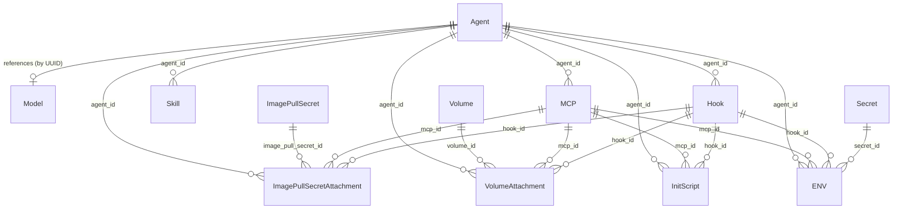

# Resource Definitions

Canonical schema for all agent-managed resources in the Agyn platform. This is the single source of truth for resource structure — the Terraform provider, Agents API, and UI should all align to these definitions.

Resources are managed by the [Agents](agents-service.md) service and stored in PostgreSQL. Agents and Volumes are scoped to an [organization](organizations.md) (direct `organization_id`). Sub-resources inherit organization scope through their parent. See [Organizations — Resource Scoping](organizations.md#resource-scoping).

All resources share a common envelope:

| Field | Type | Description |
|-------|------|-------------|
| `id` | string (UUID) | Unique identifier |
| `description` | string | Human-readable description (optional) |
| `created_at` | timestamp | Creation time |
| `updated_at` | timestamp | Last modification time |

Resource-specific fields are defined alongside the envelope — not nested inside a `config` object.

---

## Entity Diagram

---

## Agent

An agent definition that determines how an agent workload behaves when processing thread messages. The Agent is the central resource — it represents a single agent pod. Infrastructure concerns (image, compute resources) and behavioral concerns (LLM configuration) live on the agent directly.

| Field | Type | Default | Description |
|-------|------|---------|-------------|
| `name` | string | | Agent identity name (max 64 chars). Injected into the agent runtime |
| `role` | string | | Agent role label (max 64 chars). Injected into the agent runtime |
| `model` | string (UUID) | | Reference to a [Model](providers.md#model) resource in the LLM service |
| `configuration` | JSON string | `"{}"` | Agent behavioral configuration. Opaque to the Agents service — interpreted by the agent runtime |
| `image` | string | | Container image for the agent pod (e.g., `ghcr.io/agynio/agent:latest`) |
| `init_image` | string | | Platform init image reference (e.g., `ghcr.io/agynio/agent-init-codex:v1.0.0`). Contains agynd + agent CLI. Runs as init container |
| `resources` | object | | Compute resources for the agent container (see [Compute Resources](#compute-resources)) |
| `runner_labels` | map<string, string> | `{}` | Labels that a runner must match for this agent's workloads to be scheduled on it. The [Agents Orchestrator](agents-orchestrator.md) filters eligible runners to those whose labels contain all key-value pairs specified here (exact match). Empty means no runner label constraints. See [Runner Selection](runners.md#runner-selection) |
| `idle_timeout` | duration string | `"5m"` | How long an agent workload can remain idle before the [Agents Orchestrator](agents-orchestrator.md) stops it. Measured from the last activity reported by [`agynd`](agynd-cli.md) via the [Runners](runners.md) service. Format: Go-style duration (e.g., `"30s"`, `"5m"`, `"1h"`) |

The `configuration` field contains agent implementation-specific behavioral parameters (system prompt, summarization settings, message buffering, etc.). Different agent implementations define different configuration schemas. The Agents service stores the field as an opaque JSON string without validation. See [Agent](agent/) for the platform's own agent implementation and its configuration schema.

---

## Volume

A volume definition. Volumes exist independently of agents and sidecars. A volume is mounted into a container via a [VolumeAttachment](#volume-attachment).

| Field | Type | Default | Description |
|-------|------|---------|-------------|
| `persistent` | boolean | | `true` = named persistent volume (PVC). `false` = ephemeral (emptyDir) |
| `mount_path` | string | | Absolute container path for the volume mount (e.g., `"/workspace"`) |
| `size` | string | | Volume capacity (e.g., `"10Gi"`). Required when `persistent` is `true` |

---

## Volume Attachment

A relationship between a [Volume](#volume) and a target container — an [Agent](#agent), [MCP](#mcp), or [Hook](#hook). Volumes are reusable infrastructure that may outlive any single agent and can be remounted when a resource is replaced.

| Field | Type | Description |
|-------|------|-------------|
| `id` | string (UUID) | Unique identifier |
| `volume_id` | string (UUID) | Reference to a Volume resource |
| `agent_id` | string (UUID) | Target agent. Mutually exclusive with `mcp_id` and `hook_id` |
| `mcp_id` | string (UUID) | Target MCP server. Mutually exclusive with `agent_id` and `hook_id` |
| `hook_id` | string (UUID) | Target hook. Mutually exclusive with `agent_id` and `mcp_id` |
| `created_at` | timestamp | Creation time |

Exactly one of `agent_id`, `mcp_id`, or `hook_id` is set. Volume attachments are immutable — they can be created and deleted, but not updated. Duplicate attachments (same volume_id + target) are rejected.

---

## Image Pull Secret Attachment

A relationship between an [Image Pull Secret](providers.md#image-pull-secret) and a target container — an [Agent](#agent), [MCP](#mcp), or [Hook](#hook). Image pull secrets are org-scoped resources managed by the [Secrets](secrets.md) service. The attachment lives in the [Agents](agents-service.md) service.

| Field | Type | Description |
|-------|------|-------------|
| `id` | string (UUID) | Unique identifier |
| `image_pull_secret_id` | string (UUID) | Reference to an Image Pull Secret resource in the Secrets service |
| `agent_id` | string (UUID) | Target agent. Mutually exclusive with `mcp_id` and `hook_id` |
| `mcp_id` | string (UUID) | Target MCP server. Mutually exclusive with `agent_id` and `hook_id` |
| `hook_id` | string (UUID) | Target hook. Mutually exclusive with `agent_id` and `mcp_id` |
| `created_at` | timestamp | Creation time |

Exactly one of `agent_id`, `mcp_id`, or `hook_id` is set. Image pull secret attachments are immutable — they can be created and deleted, but not updated. Duplicate attachments (same image_pull_secret_id + target) are rejected.

At workload assembly time, the [Agents Orchestrator](agents-orchestrator.md) collects all image pull secret attachments across the agent and its MCPs and hooks. If two attachments reference image pull secrets with the same `registry` hostname but different credentials, the orchestrator rejects the workload with an error.

---

## MCP

An MCP (Model Context Protocol) server definition. Runs as a sidecar container inside the agent pod, sharing the network namespace. See [MCP](mcp.md) for the full MCP architecture.

| Field | Type | Default | Description |
|-------|------|---------|-------------|
| `agent_id` | string (UUID) | | Reference to the [Agent](#agent) this MCP server belongs to |
| `name` | string | | MCP server name. Unique within agent. Max 63 characters, pattern: `^[a-z][a-z0-9_]{0,62}$`. Used as the server key in agent CLI MCP configuration and as the tool namespace prefix |
| `image` | string | | Container image for the MCP sidecar (e.g., `ghcr.io/agynio/mcp-filesystem:latest`) |
| `command` | string | | Startup command executed inside the container |
| `resources` | object | | Compute resources for the sidecar container (see [Compute Resources](#compute-resources)) |

Environment variables, initialization scripts, volumes, and image pull secrets for an MCP server are [ENV](#env), [InitScript](#initscript), [VolumeAttachment](#volume-attachment), and [ImagePullSecretAttachment](#image-pull-secret-attachment) resources that reference this MCP by `mcp_id`.

---

## Skill

A named, reusable prompt fragment. When belonging to an agent, the agent runtime appends the skill body to the conversation context (e.g., as an additional system message). Skills allow composing agent behavior from modular pieces without editing the agent's core system prompt.

| Field | Type | Default | Description |
|-------|------|---------|-------------|
| `agent_id` | string (UUID) | | Reference to the [Agent](#agent) this skill belongs to |
| `name` | string | | Skill name (unique within agent, max 64 chars) |
| `body` | string | | Skill content — prompt text, instructions, or behavioral directives |

---

## Hook

An event-driven function that runs in response to agent lifecycle events. Hooks run as sidecar containers inside the agent pod, sharing the network namespace. The platform triggers them when the specified event occurs.

| Field | Type | Default | Description |
|-------|------|---------|-------------|
| `agent_id` | string (UUID) | | Reference to the [Agent](#agent) this hook belongs to |
| `event` | string | | Lifecycle event that triggers this hook. Event names are agent implementation-specific |
| `function` | string | | Entrypoint command executed inside the container |
| `image` | string | | Container image for the hook execution environment |
| `resources` | object | | Compute resources for the hook container (see [Compute Resources](#compute-resources)) |

Environment variables, initialization scripts, volumes, and image pull secrets for a hook are [ENV](#env), [InitScript](#initscript), [VolumeAttachment](#volume-attachment), and [ImagePullSecretAttachment](#image-pull-secret-attachment) resources that reference this hook by `hook_id`.

---

## ENV

An environment variable injected into a container. Each ENV belongs to exactly one target — an [Agent](#agent), an [MCP](#mcp), or a [Hook](#hook) — identified by the corresponding foreign key.

| Field | Type | Default | Description |
|-------|------|---------|-------------|
| `agent_id` | string (UUID) | | Target agent. Mutually exclusive with `mcp_id` and `hook_id` |
| `mcp_id` | string (UUID) | | Target MCP server. Mutually exclusive with `agent_id` and `hook_id` |
| `hook_id` | string (UUID) | | Target hook. Mutually exclusive with `agent_id` and `mcp_id` |
| `name` | string | | Environment variable name (e.g., `"API_KEY"`) |
| `value` | string | | Plain-text value. Mutually exclusive with `secret_id` |
| `secret_id` | string (UUID) | | Reference to a [Secret](providers.md#secret) resource. Mutually exclusive with `value` |

Exactly one of `agent_id`, `mcp_id`, or `hook_id` is set (the target). Exactly one of `value` or `secret_id` is set (the source). When `secret_id` is set, the platform resolves the secret value at runtime before injecting it into the container.

---

## InitScript

A shell script executed during container initialization (`/bin/sh -lc`). Each InitScript belongs to exactly one target — an [Agent](#agent), an [MCP](#mcp), or a [Hook](#hook).

| Field | Type | Default | Description |
|-------|------|---------|-------------|
| `agent_id` | string (UUID) | | Target agent. Mutually exclusive with `mcp_id` and `hook_id` |
| `mcp_id` | string (UUID) | | Target MCP server. Mutually exclusive with `agent_id` and `hook_id` |
| `hook_id` | string (UUID) | | Target hook. Mutually exclusive with `agent_id` and `mcp_id` |
| `script` | string | | Shell script content |

When multiple init scripts target the same resource, they execute in creation order.

---

## Secret

A sensitive value with local or remote storage. Managed by the [Secrets](secrets.md) service. Referenced by [ENV](#env) resources via `secret_id`. See [Providers, Models, and Secrets](providers.md#secret) for the resource definition.

---

## Image Pull Secret

Registry credentials for pulling container images from private registries. Managed by the [Secrets](secrets.md) service. Attached to agents, MCPs, and hooks via [ImagePullSecretAttachment](#image-pull-secret-attachment). See [Providers, Models, and Secrets](providers.md#image-pull-secret) for the resource definition.

---

## LLM Provider

A connection to an external LLM service. Managed by the [LLM](llm.md) service. See [Providers, Models, and Secrets](providers.md#llm-provider) for the resource definition.

---

## Model

An internal model definition mapped to a remote model on an LLM provider. Managed by the [LLM](llm.md) service. See [Providers, Models, and Secrets](providers.md#model) for the resource definition.

---

## Compute Resources

Kubernetes-style container resource requests and limits. Used by [Agent](#agent), [MCP](#mcp), and [Hook](#hook).

| Field | Type | Description |
|-------|------|-------------|
| `requests_cpu` | string | CPU request (e.g., `"250m"`, `"1"`) |
| `requests_memory` | string | Memory request (e.g., `"256Mi"`, `"1Gi"`) |
| `limits_cpu` | string | CPU limit |
| `limits_memory` | string | Memory limit |

All fields are optional.
