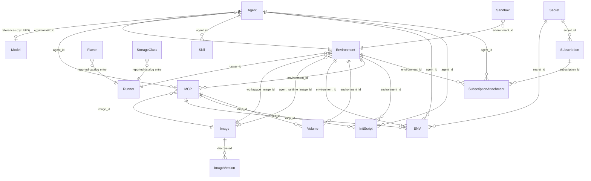

# Resource Definitions

Canonical schema for all agent-managed resources in the Agyn platform. This is the single source of truth for resource structure — the Terraform provider, Agents API, and UI should all align to these definitions.

Resources are managed by the [Agents](agents-service.md) service and stored in PostgreSQL, except [Flavors](#flavor) and [Storage Classes](#storage-class), which are reported by runners and stored in the [Runners](runners.md#runner-catalog) service as part of the runner's catalog, and [Images](#image) and [Image Versions](#image-version), which are owned by the [Images](images-service.md) service. Agents, Environments, Sandboxes, and Images are scoped to an [organization](organizations.md) (direct `organization_id`). Sub-resources inherit organization scope through their parent. See [Organizations — Resource Scoping](organizations.md#resource-scoping).

All resources share a common envelope:

| Field | Type | Description |
|-------|------|-------------|
| `id` | string (UUID) | Unique identifier |
| `description` | string | Human-readable description (optional) |
| `created_at` | timestamp | Creation time |
| `updated_at` | timestamp | Last modification time |

Resource-specific fields are defined alongside the envelope — not nested inside a `config` object.

---

## Entity Diagram

```mermaid
erDiagram
    Agent ||--o| Model : "references (by UUID)"
    Agent }o--|| Environment : "environment_id"
    Sandbox }o--|| Environment : "environment_id"
    Environment }o--|| Runner : "runner_id"
    Environment }o--|| Image : "workspace_image_id"
    Environment }o--o| Image : "agent_runtime_image_id"
    MCP }o--|| Image : "image_id"
    Image ||--o{ ImageVersion : "discovered"
    Flavor }o--|| Runner : "reported catalog entry"
    StorageClass }o--|| Runner : "reported catalog entry"

    Environment ||--o{ ENV : "environment_id"
    Environment ||--o{ Volume : "environment_id"
    Environment ||--o{ MCP : "environment_id"
    Environment ||--o{ InitScript : "environment_id"

    Agent ||--o{ MCP : "agent_id"
    Agent ||--o{ Skill : "agent_id"
    Agent ||--o{ ENV : "agent_id"
    Agent ||--o{ InitScript : "agent_id"

    MCP ||--o{ ENV : "mcp_id"
    MCP ||--o{ InitScript : "mcp_id"
    MCP ||--o{ Volume : "mcp_id"

    Environment ||--o{ SubscriptionAttachment : "environment_id"
    Agent ||--o{ SubscriptionAttachment : "agent_id"
    Subscription ||--o{ SubscriptionAttachment : "subscription_id"

    Secret ||--o{ ENV : "secret_id"
    Secret ||--o{ Subscription : "secret_id"
```

---

## Agent

An agent definition that determines how an agent workload behaves when processing thread messages. The Agent is the central resource — it represents a single agent pod. Behavioral concerns (LLM configuration) live on the agent directly; infrastructure concerns (image, compute resources, placement) come from the referenced [Environment](#environment).

| Field | Type | Default | Description |
|-------|------|---------|-------------|
| `name` | string | | Agent identity name (max 64 chars). Injected into the agent runtime |
| `nickname` | string | `null` | Optional `@mention` handle within the organization (max 32 chars, pattern: `^[a-z0-9_-]+$`). Set via the Agents service; uniqueness enforced by the [Identity](identity.md) service |
| `role` | string | | Agent role label (max 64 chars). Injected into the agent runtime |
| `model` | string (UUID) | | Reference to a [Model](providers.md#model) resource in the LLM service. Required when the environment's [`llm_mode`](#environment) is `platform`; rejected when it is `native`, where the platform owns no model namespace |
| `model_name` | string | `null` | Vendor model name (e.g., `claude-sonnet-4-6`) passed to the agent CLI through its own model setting. Accepted only when the environment's `llm_mode` is `native`, and optional there — `null` leaves the CLI on its own default, which is usually the right answer. Opaque to the platform: it is the vendor's namespace, so a wrong value fails at the vendor rather than at create time |
| `configuration` | JSON string | `"{}"` | Agent behavioral configuration. Opaque to the Agents service — interpreted by the agent runtime |
| `environment_id` | string (UUID) | | Reference to the [Environment](#environment) this agent runs in. Supplies the workspace image, the agent runtime image, the runner, the workload's [storage](#volume), and — via the environment's [flavor name](#flavor), resolved at workload start — the compute resources, plus any MCPs, init scripts, and ENVs attached to it. Must name an environment that has an agent runtime image; an agent has no agent CLI otherwise. See [Runner Selection](runners.md#runner-selection) |
| `idle_timeout` | duration string | `"5m"` | How long an agent workload can remain idle before the [Agents Orchestrator](agents-orchestrator.md) stops it. Measured from the last activity reported by [`agynd`](agynd-cli.md) via the [Runners](runners.md) service. Format: Go-style duration (e.g., `"30s"`, `"5m"`, `"1h"`) |
| `instance_idle_ttl` | duration string | `"720h"` (30 days) | How long an [agent instance](agent-instances.md) can go without new inbox items before the Agents service transitions it `active → paused`. Distinct from `idle_timeout`, which stops workloads (seconds-to-minutes scale); this pauses the instance itself (days scale). Format: Go-style duration; minimum `1h`. Read live — changing the value applies to all existing instances of the class on the next [idle GC](agents-service.md#idle-gc) tick |
| `default_thread` | enum | `origin` | `origin` or `none`. Whether an instance created from a thread takes that thread as its [`default_thread_id`](agent-instances.md#default-thread). `origin` — the joining thread is assigned automatically, so every instance has a fallback destination. `none` — instances start with no default; every send names its thread, and `final_message` has nowhere to post. Governs the automatic path only — `agyn agents instantiate --default-thread` and [`SetInstanceDefaultThread`](agents-service.md#agent-instance-api) are deliberate acts and still apply. See [Agent Instances — Default thread](agent-instances.md#default-thread) |
| `final_message` | enum | `discard` | `discard` or `default_thread`. Controls what becomes of the agent CLI's final turn text, which carries no thread target of its own. `discard` — dropped; the agent's output reaches threads only through explicit sends. `default_thread` — [`agynd`](agynd-cli.md) posts it to the instance's [`default_thread_id`](agent-instances.md#default-thread) after the turn, which is how a plain conversational agent answers a user in [Chat](chat.md) without tracking thread ids. Posts nothing when the default thread is NULL or the text is empty. See [Agent Instances — Final turn message](agent-instances.md#final-turn-message) |
| `capabilities` | list<string> | `[]` | Named capabilities to enable for this agent. The runner injects the required sidecars and environment variables transparently — the agent does not configure them directly. Capability names are open strings; the runner is the registry. See [Capabilities](#capabilities) |
| `availability` | enum | | `internal` or `private`. Controls who can initiate threads with this agent. `internal` — any org member may add the agent as a thread participant. `private` — only identities holding an [agent role](agents-service.md#roles) (`owner`, `maintainer`, or `participant`) may add the agent. Required on `CreateAgent` — the API has no default. See [Agents Service — Availability](agents-service.md#availability) |

The `configuration` field contains agent implementation-specific behavioral parameters (system prompt, summarization settings, message buffering, etc.). Different agent implementations define different configuration schemas. The Agents service stores the field as an opaque JSON string without validation. See [Agent](agent/) for the platform's own agent implementation and its configuration schema.

---

## Flavor

A named compute size offered by a specific runner — an entry in the runner's [reported catalog](runners.md#runner-catalog), declared in the runner's own deployment configuration, not managed through platform APIs. Referenced **by name** from [Environments](#environment); the reference is late-bound at workload start. See [Flavors and Environments](../product/environments/environments.md).

| Field | Type | Default | Description |
|-------|------|---------|-------------|
| `runner_id` | string (UUID) | | The runner offering this flavor. A flavor belongs to exactly one runner |
| `name` | string | | Flavor name (e.g., `small`, `standard`, `large`). Unique per runner. Max 64 chars, pattern: `^[a-z0-9-]+$` |
| `resources` | object | | Compute resources this flavor allocates (see [Compute Resources](#compute-resources)) |
| `default` | boolean | `false` | At most one flavor per runner. Used when an environment names no flavor |
| `deprecated` | boolean | `false` | Soft signal: Console and CLI pickers warn against new references. Deprecated flavors still resolve and schedule |

Flavor visibility follows runner visibility: flavors on cluster-scoped runners are usable by environments in any organization; flavors on org-scoped runners only by that organization's environments. There is no referential integrity between environments and flavors — an entry that disappears from the runner's report leaves referencing environments unschedulable (flagged, not broken) until it reappears.

---

## Storage Class

A named storage tier offered by a specific runner — an entry in the runner's [reported catalog](runners.md#runner-catalog), like a [Flavor](#flavor). What backs a class is runner-internal (the [k8s-runner](k8s-runner.md#runner-catalog) maps each class to a Kubernetes StorageClass in its configuration). Referenced **by name** from [Volumes](#volume); the reference is late-bound — resolved against the catalog of the runner the workload lands on when the volume is provisioned.

| Field | Type | Default | Description |
|-------|------|---------|-------------|
| `runner_id` | string (UUID) | | The runner offering this storage class |
| `name` | string | | Storage class name (e.g., `standard`, `fast-ssd`). Unique per runner. Max 64 chars, pattern: `^[a-z0-9-]+$` |
| `default` | boolean | `false` | At most one storage class per runner. Used when a volume names no class |
| `deprecated` | boolean | `false` | Soft signal: Console and CLI pickers warn against new references. Deprecated classes still resolve and provision |

Visibility and lifecycle follow the same rules as flavors. Already-provisioned volumes are unaffected by catalog changes — the class is applied at provisioning time and recorded on the [provisioned volume record](runners.md#volume-resource).

---

## Image

An organization-scoped record naming an upstream container repository and the credential to read it. The only resource in the platform that holds a registry address. Managed by the [Images](images-service.md) service. See [Images](../product/images/images.md).

| Field | Type | Default | Description |
|-------|------|---------|-------------|
| `name` | string | | Image name. Unique within the organization. Max 64 chars, pattern: `^[a-z0-9-]+$` |
| `type` | enum | | `workspace`, `agent_runtime`, or `mcp`. Which slot in a workload the image is built for. Immutable |
| `repository` | string | | Upstream repository (e.g., `ghcr.io/agynio/devcontainer-go`). Immutable — changing it would silently redefine every environment referencing the record |
| `username` | string | `null` | Registry username. `null` for anonymously readable repositories |
| `secret_id` | string (UUID) | `null` | Reference to a [Secret](providers.md#secret) holding the registry password |
| `visibility` | enum | | `public` or `internal`. `internal` is readable by the owning organization; `public` by any authenticated identity. Same values and meanings as [App visibility](apps.md#visibility) |
| `tag_filter` | string | `null` | Optional pattern limiting which tags appear in pickers |
| `stale_since` | timestamp \| null | `null` | Set when discovery cannot reach the repository. Stored versions continue to be served |

Deleting an image is permitted regardless of references — see [Images Service — Deletion](images-service.md#deletion).

---

## Image Version

A tag observed in an [Image](#image)'s upstream repository. **Discovered, never authored**: there is no create, update, or delete API. Owned by the [Images](images-service.md) service.

| Field | Type | Default | Description |
|-------|------|---------|-------------|
| `image_id` | string (UUID) | | Owning image |
| `tag` | string | | The tag as it appears upstream |
| `pushed_at` | timestamp | | Read from the upstream manifest |
| `description` | string | `null` | The image's `org.opencontainers.image.description`, when declared |
| `state` | enum | `present` | `present` or `gone`. A tag no longer listed upstream is marked `gone` rather than deleted, so references to it can be reported instead of dangling |
| `discovered_at` | timestamp | | First time the platform observed this tag |

Digests are not recorded. A reference names a tag and the tag is resolved at each workload start, so repointing a tag upstream changes what runs — see [Images — Versions Are Discovered](../product/images/images.md#versions-are-discovered).

---

## Environment

An organization-scoped runtime definition: a runner, a flavor name on that runner, and the images a workload runs. Agents and [Sandboxes](#sandbox) run in environments. Managed by the [Agents](agents-service.md) service. See [Flavors and Environments](../product/environments/environments.md).

| Field | Type | Default | Description |
|-------|------|---------|-------------|
| `name` | string | | Environment name. Unique within the organization. Max 64 chars, pattern: `^[a-z0-9-]+$` |
| `runner_id` | string (UUID) | | Reference to the [Runner](runners.md#runner-resource) workloads run on. The runner must be visible to the organization (cluster-scoped, or org-scoped to the same org) — validated on create/update. Fully determines placement |
| `flavor` | string | `null` | Name of a [Flavor](#flavor) in the runner's catalog. Late-bound: not validated on create/update (Console and CLI warn when the name is not currently reported); resolved at workload start, and unresolvable names leave the environment unschedulable. `null` resolves to the runner's `default` flavor at each workload start |
| `workspace_image_id` | string (UUID) | | Reference to an [Image](#image) of type `workspace`. Runs as the workload's main container |
| `workspace_image_tag` | string | | Tag within that image. Validated against the image's discovered [versions](#image-version) on write; resolved again at each workload start |
| `agent_runtime_image_id` | string (UUID) | `null` | Reference to an [Image](#image) of type `agent_runtime`. Runs as an init container and supplies the agent CLI. `null` means a workspace-only environment — usable by [sandboxes](#sandbox), rejected by `CreateAgent` |
| `agent_runtime_image_tag` | string | `null` | Tag within that image. Same validation and resolution as the workspace tag |
| `availability` | enum | | `internal` or `private`. Controls who may **run** workloads in the environment — start a sandbox in it, or point an agent at it. `internal` — any org member. `private` — only identities holding an [environment role](agents-service.md#environment-roles) (`owner`, `maintainer`, or `user`). Required on `CreateEnvironment` — the API has no default. Same values, and the same `internal_access` mechanism, as [Agent](#agent) availability. See [Authorization — environment](authz.md#environment) |
| `llm_mode` | enum | `platform` | How workloads in this environment reach an LLM. `platform` — [`agynd`](agynd-cli.md#llm-endpoint-configuration) points the agent CLI at the [LLM Proxy](llm-proxy.md) and models are platform [Model](providers.md#model) IDs. `native` — the CLI is left in its stock configuration and its vendor traffic is intercepted onto the proxy, which injects the credential from an attached [Subscription](providers.md#subscription). See [LLM Access](../product/environments/environments.md#llm-access) |
| `llm_allowed_models` | list<string> | `[]` | Vendor model names a `native`-mode workload may request, enforced by the [LLM Proxy](llm-proxy.md#guardrails) against the model name in each request body. Empty means no restriction. Ignored in `platform` mode, where model access is governed by `can_use` on the [Model](providers.md#model) resource instead. Reaches the proxy on the [`ResolveSubscription`](llm.md#resolvesubscription) response — the LLM service reads it from here, so the proxy never reads an environment |

`llm_mode` is a property of the environment rather than of the agent for three reasons: a [sandbox](#sandbox) has no agent and would otherwise have nowhere to read it from; it is a mode rather than an additive attachment, so the union semantics that let egress rules live on both would be a contradiction rather than a merge; and it decides what the [Agents Orchestrator](agents-orchestrator.md#workload-spec-assembly) stamps on the workload identity, which is assembly-time infrastructure in the same class as the agent runtime image. Two agents needing different modes need two environments — the same duplication the agent runtime image already implies.

Changing `llm_mode` on an environment referenced by any agent is **rejected**: every such agent's `model` / `model_name` becomes invalid in the other mode, and unlike an unresolvable flavor name this is something the platform can check at the moment of the change rather than discovering at workload start.

Environments hold no registry addresses. Both references resolve through the [Images](images-service.md) service, and the [Agents Orchestrator](agents-orchestrator.md) rewrites them to [image proxy](image-proxy.md) references at workload assembly.

An environment defines **what a workload in it contains**, through sub-resources that reference it by `environment_id`:

| Sub-resource | Effect on every workload running the environment |
|---|---|
| [Volume](#volume) | Mounted into the main container. An environment with no volumes gives its workloads no storage beyond the container's own ephemeral disk |
| [MCP](#mcp) | Runs as a sidecar |
| [InitScript](#initscript) | Executed by [`agynd`](agynd-cli.md) during container initialization |
| [ENV](#env) | Injected into the main container |
| [EgressRuleAttachment](#egress-rule-attachment) | Applied to the workload's outbound traffic |
| [SubscriptionAttachment](#subscription-attachment) | Supplies the vendor credential for `native` mode. At most one per vendor |

All of them apply to agent workloads and [sandboxes](#sandbox) alike — a sandbox is the environment's contents without the agent loop. [Agents](#agent) may add MCPs, init scripts, and ENVs of their own; volumes are environment-level only. An environment referenced by any agent or sandbox cannot be deleted.

Because everything above is *reachable from a shell* by anyone who can start a sandbox in the environment — secret-backed ENVs, credential-injecting egress rules, and the contents of its volumes — running in an environment is a privilege of its own, gated by `can_use` and governed by `availability`. Editing an environment and using one are separate permissions.

An environment naming an image that was deleted, whose tag is `gone` upstream, or whose visibility no longer reaches the organization becomes **unschedulable and is flagged** — the same treatment as an unresolvable flavor name.

---

## Sandbox

An on-demand workload started by a user rather than by inbox traffic, running an [Environment](#environment). Org-scoped, owned by the creating user. Managed by the [Agents](agents-service.md) service; reconciled by the [Agents Orchestrator](agents-orchestrator.md). See [Sandboxes](../product/sandboxes/sandboxes.md).

| Field | Type | Default | Description |
|-------|------|---------|-------------|
| `name` | string | | Sandbox name. Unique within the organization. Auto-generated (`adjective-noun`) when omitted. Max 63 chars, pattern: `^[a-z0-9-]+$` |
| `environment_id` | string (UUID) | | Reference to the [Environment](#environment) the sandbox runs. Immutable after creation |
| `owner_id` | string (UUID) | | Identity of the creating user. Immutable |
| `status` | enum | | `starting` \| `running` \| `stopped` \| `failed` \| `terminated`. `terminated` is a soft state: the record is retained for audit and usage history, hidden from default lists. See [Sandboxes — Lifecycle](../product/sandboxes/sandboxes.md#lifecycle) |
| `idle_timeout` | duration string | org default | How long after the last shell session detaches before the workload is stopped. The sandbox record survives the stop, as do the persistent volumes its environment defines. **Settable on `CreateSandbox`**: an explicit value is accepted up to the organization's `sandbox_max_idle_timeout` and rejected above it, naming the ceiling; omitted, the organization's `sandbox_default_idle_timeout` applies. Stored on the sandbox at creation — later changes to the org settings do not affect existing sandboxes |
| `ttl` | duration string | `"72h"` | Hard lifetime from creation. On expiry the sandbox is terminated and its provisioned volumes deleted, regardless of state. Resolved from the organization's sandbox settings at creation (platform bounds: max `336h`) and stored on the sandbox — later changes to the org default do not affect existing sandboxes |
| `last_session_at` | timestamp \| null | `null` | Updated every time a shell session detaches. Display/bookkeeping only — idle enforcement uses workload activity (`last_activity_at` on the [workload record](runners.md#workload-resource)), not this field |

Sandboxes are first-class runtime owners: their workload and volume records in the [Runners](runners.md) service carry `owner_kind=sandbox` — no agent instance is created for a sandbox. A sandbox has no storage of its own: it mounts the [Volumes](#volume) its environment defines, provisioned per sandbox, and an environment defining none gives its sandboxes nothing that survives a stop. The platform provisions no implicit workspace volume.

`ConnectSandbox` flows go through `EnsureSandboxRunning`: a no-op when the sandbox is `running`, a restart when `stopped`, and a fresh user-driven start attempt when `failed` (sandboxes have no background retry loop — nothing demands a sandbox run while nobody is connecting). Terminal tickets are issued only after `EnsureSandboxRunning` succeeds.

A sandbox carries no share list as a field. Collaborators are OpenFGA tuples on the [`sandbox` type](authz.md#sandbox), written and read through `ShareSandbox` / `UnshareSandbox` / `ListSandboxShares` — the same treatment agent and environment roles get, and for the same reason: authorization state has one home. See [Agents Service — Sandbox Sharing](agents-service.md#sandbox-sharing).

---

## Volume

A disk mounted into a container. Each volume belongs to exactly one target — an [Environment](#environment) or an [MCP](#mcp) — identified by the corresponding foreign key. There is no free-standing volume resource and no attachment relationship: a volume is declared where it is mounted.

| Field | Type | Default | Description |
|-------|------|---------|-------------|
| `environment_id` | string (UUID) | | Target environment. Mounted into the main container of every workload (agent or sandbox) running the environment. Mutually exclusive with `mcp_id` |
| `mcp_id` | string (UUID) | | Target MCP server. Mounted into that sidecar only. Mutually exclusive with `environment_id` |
| `name` | string | | Volume name. Unique within the target. Max 64 chars, pattern: `^[a-z0-9-]+$`. Names the volume for an MCP's [`shared_volumes`](#mcp) and labels it in the Console and metering |
| `mount_path` | string | | Absolute container path for the mount (e.g., `"/workspace"`). Unique within the target |
| `persistent` | boolean | `false` | `true` = a provisioned disk (PVC) that survives workload stops. `false` = ephemeral scratch (emptyDir), discarded with the workload |
| `size` | string | `null` | Volume capacity (e.g., `"10Gi"`). Required when `persistent` is `true`, rejected otherwise |
| `storage_class` | string | `null` | Name of a [Storage Class](#storage-class) in the catalog of the runner the workload lands on. Late-bound: not validated on create/update; resolved at provisioning time, and an unresolvable name fails scheduling. `null` resolves to the runner's `default` class. Only applies when `persistent` is `true`; applied when the volume is first provisioned — existing disks keep their class |
| `ttl` | duration string | `null` | How long after the last workload for an owner stops before that owner's disk is deleted (e.g., `"7d"`, `"24h"`). `null` means it is never deleted automatically. Only applies when `persistent` is `true`. Sandbox-owned disks are deleted on sandbox termination regardless of this value |

Exactly one of `environment_id` or `mcp_id` is set.

**A volume is a definition, not a disk.** A persistent volume materializes as one provisioned disk **per owner** — per [agent instance](agent-instances.md) or per [sandbox](#sandbox) — recorded in the [Runners](runners.md#volume-resource) service. Two agents running the same environment get the same layout and separate disks; so does every sandbox started against it. Nothing is shared between owners: the volume model carries no cross-workload sharing, and an operator wanting that reaches for external storage or an MCP that fronts it.

Sharing *within* one workload is the reason volumes and mounts are not the same thing. An MCP sidecar sees:

- its own volumes (`mcp_id`), which no other container mounts, and
- the environment volumes named in its [`shared_volumes`](#mcp), mounted at the same paths the main container sees them — the case where an agent writes a file and an MCP server reads it.

Both are the same pod-level volume the main container mounts, so sharing works for ephemeral volumes exactly as it does for persistent ones: an `emptyDir` scratch directory is shared for the life of the pod.

**Names are a contract, which is why they are referenced rather than IDs.** A name is unique within its target and deliberately *reusable across environments*: if `dev`, `staging`, and `gpu` each declare a volume named `workspace`, an agent-level MCP asking for `workspace` runs in all three, and repointing an agent from one to another needs no edit. Resolution is late-bound at workload assembly, exactly like a [Flavor](#flavor) or [Storage Class](#storage-class) name; a name that does not resolve fails scheduling and flags the environment. A `volume_id` would weld each MCP to one environment.

Uniqueness and collisions:

| Scope | Rule | Enforced |
|---|---|---|
| `name` within one target | Unique | On write |
| `mount_path` within one target | Unique | On write |
| `mount_path` within one *container* — an MCP's own volumes plus its `shared_volumes` | Unique | At workload assembly: an agent-level MCP does not know its environment until then |
| `name` across targets — an MCP volume and an environment volume both called `workspace` | Allowed; distinct namespaces | The Orchestrator namespaces pod-level volume names at assembly |

**There are no default volumes.** An environment that declares none runs workloads whose every write lands on the container's ephemeral disk and is gone when the workload stops. This is deliberate: persistence is something an operator asks for, per environment, and [agent state](agent/state.md) survives restarts only in environments that provide for it.

---

## MCP

An MCP (Model Context Protocol) server definition. Runs as a sidecar container inside the workload's pod, sharing the network namespace. Belongs to exactly one target — an [Environment](#environment) or an [Agent](#agent). See [MCP](mcp.md) for the full MCP architecture.

| Field | Type | Default | Description |
|-------|------|---------|-------------|
| `environment_id` | string (UUID) | | Target environment. Runs in every workload (agent or sandbox) running the environment. Mutually exclusive with `agent_id` |
| `agent_id` | string (UUID) | | Target agent. Runs only in that agent's workloads. Mutually exclusive with `environment_id` |
| `name` | string | | MCP server name. Unique within the target. Max 63 characters, pattern: `^[a-z][a-z0-9_]{0,62}$`. Used as the server key in agent CLI MCP configuration and as the tool namespace prefix |
| `image_id` | string (UUID) | | Reference to an [Image](#image) of type `mcp` or `workspace`. A purpose-built MCP server image and a devcontainer are both legitimate ways to host one |
| `image_tag` | string | | Tag within that image. Validated against discovered [versions](#image-version) on write; resolved again at each workload start |
| `command` | string | | Startup command executed inside the container |
| `resources` | object | | Compute resources for the sidecar container (see [Compute Resources](#compute-resources)) |
| `shared_volumes` | list<string> | `[]` | Names of [Volumes](#volume) on the environment this MCP runs in, mounted into the sidecar at the same paths the main container sees them. A name that does not resolve at workload start fails scheduling |

Exactly one of `environment_id` or `agent_id` is set. Environment-level and agent-level MCPs compose as a union; on a name collision the agent-level server wins, the same rule [ENV](#env) follows.

Environment variables, initialization scripts, and the sidecar's own volumes are [ENV](#env), [InitScript](#initscript), and [Volume](#volume) resources that reference this MCP by `mcp_id`.

---

## Skill

A named, reusable prompt fragment. When belonging to an agent, the agent runtime appends the skill body to the conversation context (e.g., as an additional system message). Skills allow composing agent behavior from modular pieces without editing the agent's core system prompt.

| Field | Type | Default | Description |
|-------|------|---------|-------------|
| `agent_id` | string (UUID) | | Reference to the [Agent](#agent) this skill belongs to |
| `name` | string | | Skill name (unique within agent, max 64 chars) |
| `body` | string | | Skill content — prompt text, instructions, or behavioral directives |

---

## Capabilities

Named capabilities declared on an [Agent](#agent) via the `capabilities` field. The runner injects the required sidecars and environment variables transparently — the agent resource only declares intent, not implementation details.

Capability names are **open strings** — the platform does not maintain a closed registry. Any runner can implement any capability name it chooses; each runner advertises the names it implements as part of its [catalog report](runners.md#catalog-reporting). At workload start the [Agents Orchestrator](agents-orchestrator.md) checks that the environment's runner advertises every capability the agent requires (see [Runner Selection](runners.md#runner-selection)); if not, scheduling fails with a descriptive error.

Different runners may implement the same capability name differently depending on what the node supports. See [k8s-runner — Capability Implementations](k8s-runner.md#capability-implementations) for an example of how one runner implements the `docker` capability across multiple isolation levels.

---

## ENV

An environment variable injected into a container. Each ENV belongs to exactly one target — an [Agent](#agent), an [MCP](#mcp), or an [Environment](#environment) — identified by the corresponding foreign key.

| Field | Type | Default | Description |
|-------|------|---------|-------------|
| `agent_id` | string (UUID) | | Target agent. Mutually exclusive with the other targets |
| `mcp_id` | string (UUID) | | Target MCP server. Mutually exclusive with the other targets |
| `environment_id` | string (UUID) | | Target environment. Injected into the main container of every workload (agent or sandbox) running the environment. Mutually exclusive with the other targets |
| `name` | string | | Environment variable name (e.g., `"API_KEY"`) |
| `value` | string | | Plain-text value. Mutually exclusive with `secret_id` |
| `secret_id` | string (UUID) | | Reference to a [Secret](providers.md#secret) resource. Mutually exclusive with `value` |

Exactly one of `agent_id`, `mcp_id`, or `environment_id` is set (the target). Exactly one of `value` or `secret_id` is set (the source). When `secret_id` is set, the platform resolves the secret value at runtime before injecting it into the container. When an agent-level and an environment-level ENV share the same `name`, the agent-level value wins.

---

## InitScript

A named shell script executed by [`agynd`](agynd-cli.md) during container initialization, before the agent CLI is spawned. Each InitScript belongs to exactly one target — an [Environment](#environment), an [Agent](#agent), or an [MCP](#mcp).

| Field | Type | Default | Description |
|-------|------|---------|-------------|
| `id` | string (UUID) | | Unique identifier |
| `name` | string | | Human-readable name for visibility in logs and the Console |
| `environment_id` | string (UUID) | | Target environment. Runs in the main container of every workload (agent or sandbox) running the environment. Mutually exclusive with the other targets |
| `agent_id` | string (UUID) | | Target agent. Mutually exclusive with the other targets |
| `mcp_id` | string (UUID) | | Target MCP server. Mutually exclusive with the other targets |
| `script` | string | | Shell script content |

Exactly one of `environment_id`, `agent_id`, or `mcp_id` is set. In an agent workload the main container runs the environment's scripts first, then the agent's; within each group, creation order. Names do not collide — every script runs. Each script runs in its own shell invocation using the container's default shell. If a script exits with a non-zero code, the failure is printed to stderr and execution continues with the next script.

---

## Secret

A sensitive value with local or remote storage. Managed by the [Secrets](secrets.md) service. Referenced by [ENV](#env) resources via `secret_id`. See [Providers, Models, and Secrets](providers.md#secret) for the resource definition.

---

## LLM Provider

A connection to an external LLM service. Managed by the [LLM](llm.md) service. See [Providers, Models, and Secrets](providers.md#llm-provider) for the resource definition.

---

## Model

An internal model definition mapped to a remote model on an LLM provider. Managed by the [LLM](llm.md) service. See [Providers, Models, and Secrets](providers.md#model) for the resource definition.

---

## Subscription

A credential for an LLM vendor's own consumer plan, used by workloads whose environment is in `native` [LLM mode](#environment). Org-scoped. Managed by the [LLM](llm.md) service. Attached to [Agents](#agent) or [Environments](#environment) via [SubscriptionAttachment](#subscription-attachment). See [Providers, Models, and Secrets](providers.md#subscription) for the resource definition.

---

## Subscription Attachment

Binds a [Subscription](#subscription) to an agent or an environment. Managed by the [LLM](llm.md) service. Unique on `(vendor, target)` — a target carries at most one subscription per vendor. See [Providers, Models, and Secrets](providers.md#subscription-attachment) for the resource definition.

---

## Egress Rule

A rule that mediates outbound HTTP/HTTPS traffic from workloads. Org-scoped (direct `organization_id`). Managed by the [EgressRules service](egress-rules-service.md). Attached to [Agents](#agent) or [Environments](#environment) via [EgressRuleAttachment](#egress-rule-attachment).

| Field | Type | Default | Description |
|-------|------|---------|-------------|
| `name` | string | | Human-readable label |
| `matcher` | object | | Which requests the rule applies to. See [Matcher](#matcher) |
| `effect` | object | | What happens to matching requests. See [Effect](#effect) |
| `openziti_service_id` | string | | OpenZiti service ID returned by Ziti Management for this rule. The OpenZiti service name is `egress-rule-<id>`; Dial policy selectors target the concrete ID as `@<openziti_service_id>`. Internal — not returned through the Gateway |

Uniqueness: `(organization_id, matcher.domain_pattern)`. Reserved domain patterns are rejected at create time: `*.agyn`, `*.svc`, `*.cluster.local`, and any pattern overlapping the OpenZiti synthetic range (`100.64.0.0/10`).

`effect` must have at least one of `action` or `inject` non-empty (a rule with neither does nothing useful — surfaced as a create-time warning).

### Matcher

| Field | Type | Default | Description |
|-------|------|---------|-------------|
| `domain_pattern` | string | | Hostname pattern. Examples: `api.github.com`, `*.github.com`. Single-segment wildcards supported. Required |
| `ports` | list<int> | `[80, 443]` | Destination ports to intercept. Each entry is a single TCP port number |
| `methods` | list<string> | `[]` (any) | HTTP methods the rule applies to (e.g., `["GET", "HEAD"]`) |
| `path_pattern` | string | `""` (any) | Glob over the request path (e.g., `/repos/**`, `/users/*/issues`) |

### Effect

| Field | Type | Default | Description |
|-------|------|---------|-------------|
| `action` | enum | `null` | `allow`, `deny`, or null. Null means the rule does not influence reachability (typical for injection-only rules) |
| `inject` | list<Header> | `[]` | Headers to inject on matching requests. Empty means no injection. See [Header](#header) |

### Header

| Field | Type | Default | Description |
|-------|------|---------|-------------|
| `name` | string | | HTTP header name (e.g., `Authorization`, `X-Api-Key`) |
| `scheme` | enum | `null` | Authentication scheme. `bearer`, `basic`, or null. When set, the emitted header value is `<Scheme> <credential>` (e.g., `Bearer <credential>`). When null, the credential is emitted verbatim |
| `value` | string | | Literal credential. Mutually exclusive with `secret_id` |
| `secret_id` | string (UUID) | | Reference to a [Secret](#secret), resolved at request time. Mutually exclusive with `value`. Must reference a Secret in the rule's organization |

Exactly one of `value` or `secret_id` is set per header entry (the *credential*). The emitted header value is the credential, prefixed with `<Scheme> ` when `scheme` is set.

| `scheme` | `value` / resolved `secret_id` | Emitted header |
|---|---|---|
| `bearer` | `ghp_xxx` | `Authorization: Bearer ghp_xxx` |
| `basic` | `dXNlcjpwYXNz` (caller-supplied base64 of `user:pass`) | `Authorization: Basic dXNlcjpwYXNz` |
| null | `ghp_xxx` | `X-Api-Key: ghp_xxx` |

For `basic`, the credential must already be the base64 encoding of `user:pass` — the platform does not encode it.

---

## Egress Rule Attachment

A relationship binding an [Egress Rule](#egress-rule) to an [Agent](#agent) or an [Environment](#environment). One rule may be attached to many targets; one target may have many rules attached. Environment attachments apply to every workload (agent or sandbox) running the environment; the effective rules for a workload are the union of its agent's attachments (if any) and its environment's attachments. Managed by the [EgressRules service](egress-rules-service.md).

| Field | Type | Description |
|-------|------|-------------|
| `id` | string (UUID) | Unique identifier |
| `rule_id` | string (UUID) | Reference to an Egress Rule |
| `agent_id` | string (UUID) | Target agent. Mutually exclusive with `environment_id` |
| `environment_id` | string (UUID) | Target environment. Mutually exclusive with `agent_id` |
| `openziti_dial_policy_id` | string | OpenZiti Dial policy ID created for this attachment. Internal — not returned through the Gateway |
| `created_at` | timestamp | Creation time |

Attachments are immutable — create and delete only. Exactly one of `agent_id` or `environment_id` is set. Unique on `(rule_id, target)`. Both rule and target must belong to the same organization — the [EgressRules service](egress-rules-service.md#authorization) enforces this on create.

---

## Network

An organization-scoped logical container for a private network reachable through one or more [Tunnels](#tunnel-credential). Holds [PrivateResources](#private-resource). Materialized as an OpenZiti role attribute (`network-<id>`) that the per-network Bind policy and tunnel identities reference. Managed by the [Networks service](networks-service.md).

| Field | Type | Default | Description |
|-------|------|---------|-------------|
| `name` | string | | Human-readable label. Unique within the organization |
| `description` | string | `""` | Free-form description |
| `provisioning_state` | enum | | `active` \| `failed` \| `removing`. Reflects whether the per-network Bind policy was successfully provisioned in OpenZiti. `failed` is retried by reconciliation |

Networks have no configuration beyond name and description. Their purpose is to be the HA boundary (multiple tunnels share `network-<id>`) and the OpenZiti binding unit.

---

## Tunnel Credential

An enrollment artifact for a single OpenZiti tunneler instance inside the operator's private network. Each credential maps 1:1 to an OpenZiti identity with role attributes `["tunnels", "network-<network_id>"]`. Managed by the [Networks service](networks-service.md).

| Field | Type | Description |
|-------|------|-------------|
| `network_id` | string (UUID) | Reference to the [Network](#network) this credential belongs to |
| `openziti_identity_id` | string | OpenZiti identity created at credential issuance. Internal — not returned through the Gateway |
| `enrollment_jwt` | string | One-time-token JWT. **Returned only in the `CreateTunnelCredential` response.** Omitted from `GetTunnelCredential` and `ListTunnelCredentials` responses. Not persisted in plaintext — if the operator loses it before enrolling, they must delete the credential and create a new one |
| `enrollment_jwt_revealed` | bool | `true` after `CreateTunnelCredential` has returned the JWT to a caller. Visible on reads as a hint that the JWT has been issued and cannot be retrieved again |
| `enrollment_jwt_expires_at` | timestamp | JWT expiry (Controller-defined, typically 24h) |
| `enrollment_state` | enum | `pending` (JWT issued, identity not yet enrolled) \| `enrolled` (Controller reports identity as enrolled). Sourced from the OpenZiti Controller's `enrollment.state` on the identity |
| `connectivity` | enum | `online` (Controller reports `hasEdgeRouterConnection: true`) \| `offline`. Polled every `TUNNEL_LIVENESS_INTERVAL` (default 30s) |
| `provisioning_state` | enum | `active` \| `failed` \| `removing`. Reflects whether the underlying OpenZiti identity was successfully created. `failed` is retried by reconciliation |
| `enrolled_at` | timestamp \| null | Set the first time the Controller reports the identity as enrolled |
| `last_seen_at` | timestamp \| null | Updated whenever the Controller poll observes `hasEdgeRouterConnection: true` |

Credentials are revocable. Revocation deletes the underlying OpenZiti identity, severing any tunneler that holds it. Other credentials in the same network are unaffected.

---

## Private Resource

A single addressable endpoint behind a [Network](#network): a `target_host:target_ports` target the Tunnel forwards to, exposed to agents as an `intercept_host:intercept_ports` hostname they dial. Managed by the [Networks service](networks-service.md). Access is granted via [PrivateResourceAccess](#private-resource-access).

| Field | Type | Default | Description |
|-------|------|---------|-------------|
| `network_id` | string (UUID) | | Reference to the owning [Network](#network) |
| `name` | string | | Human-readable label. Not unique |
| `protocol` | enum | | `tcp` \| `http` \| `https`. A resource has a single protocol for all its ports. UDP is not supported in v1 |
| `target_host` | string | | IP literal (v4/v6) or DNS name. Resolved at the tunnel-side at connect time |
| `target_ports` | list<uint16> | | Ports on the target. List of individual port numbers (e.g., `[5432]`, `[80, 443]`, `[9200, 9300]`). Port ranges are not supported in v1 |
| `intercept_host` | string | | Hostname the agent dials. Reserved zones (see below) are rejected at create time |
| `intercept_ports` | list<uint16> | | Ports the agent dials. Cardinality must match `target_ports` exactly; positional 1:1 mapping (i.e., `intercept_ports[i]` forwards to `target_ports[i]`) |
| `provisioning_state` | enum | | `active` \| `failed` \| `removing`. Reflects whether the backing OpenZiti service was successfully provisioned. `failed` is retried by reconciliation |
| `openziti_service_id` | string | | OpenZiti service ID created for this resource (`private-<id>`). Internal — not returned through the Gateway |

Uniqueness: for each `port` in `intercept_ports`, the tuple `(organization_id, intercept_host, port)` must be unique across all resources in the organization. Two resources in the same org may not claim the same intercept hostname on overlapping ports — OpenZiti routing would be ambiguous for any identity authorized to dial both.

Reserved `intercept_host` patterns rejected at create time: `*.agyn`, `*.svc`, `*.cluster.local`, anything overlapping `100.64.0.0/10` (OpenZiti synthetic CIDR), `localhost`, `127.0.0.0/8`, and `::1/128`.

The `protocol` field is platform metadata used to gate features like header injection (see [Private Networks — EgressRule Interaction](private-networks.md#egressrule-interaction)). OpenZiti itself sees only TCP streams.

---

## Private Resource Access

A relationship granting a principal (agent, user, or group) the ability to dial a [PrivateResource](#private-resource). Each grant materializes as an OpenZiti Dial policy. Managed by the [Networks service](networks-service.md).

| Field | Type | Description |
|-------|------|-------------|
| `private_resource_id` | string (UUID) | Reference to the [PrivateResource](#private-resource) |
| `principal_type` | enum | `agent` \| `user` \| `group` \| `app` |
| `principal_id` | string (UUID) | Identity or group ID |
| `provisioning_state` | enum | `active` \| `failed` \| `removing`. Reflects whether the backing OpenZiti Dial policy was successfully provisioned. `failed` is retried by reconciliation |
| `openziti_dial_policy_id` | string | OpenZiti Dial policy created for this grant (one Dial policy per grant). Internal — not returned through the Gateway |

Grants are immutable — create and delete only. Unique on `(private_resource_id, principal_type, principal_id)`. The resource and the principal must belong to the same organization — the [Networks service](networks-service.md#authorization) enforces this on create.

For `user` principals, the grant resolves to the user's enrolled device identities (any device with role attribute `user-<id>` can dial). For `app` principals, the grant resolves to the app's single OpenZiti identity (role attribute `app-<id>`). For `group` principals, the grant resolves to every member's identity transitively (any identity with role attribute `group-<id>` — includes apps, users' devices, and agent workloads that are members of the group).

---

## Group

An organization-scoped named collection of platform identities used to grant permissions and resource access in bulk. Managed by the [Groups service](groups-service.md). Members are tracked via [GroupMembership](#group-membership).

| Field | Type | Default | Description |
|-------|------|---------|-------------|
| `name` | string | | Human-readable handle. Unique within `(organization_id, source)`. Pattern: `^[a-z0-9_-]+$`, max 64 chars |
| `description` | string | `""` | Free-form description |
| `source` | enum | `platform` | `platform` \| `scim`. Immutable after creation. `scim` groups have user membership reconciled by an external IdP |
| `external_id` | string \| null | `null` | For `source: scim`, the IdP's group identifier. Null for `platform` groups |

Group membership grants permissions via OpenFGA `group#member` references on other types (e.g., `agent.editor`), and via OpenZiti role attributes (`group-<id>` on each member's network identity) for dial/bind policies.

---

## Group Membership

A relationship binding an identity to a [Group](#group). Managed by the [Groups service](groups-service.md).

| Field | Type | Description |
|-------|------|-------------|
| `group_id` | string (UUID) | Reference to the [Group](#group) |
| `member_type` | enum | `user` \| `agent` \| `app`. Runner identities are not eligible |
| `member_id` | string (UUID) | Reference to the member identity |
| `source` | enum | `platform` \| `scim`. Distinct from the parent group's `source` — a SCIM-managed group may carry platform-added non-user members that survive IdP syncs |

Memberships are immutable — create and delete only. Unique on `(group_id, member_id)`. The member must belong to the same organization as the group.

---

## Compute Resources

Kubernetes-style container resource requests and limits. Used by [Flavor](#flavor) and [MCP](#mcp). Agents no longer carry compute resources directly — they come from the agent's [Environment](#environment) via its flavor.

| Field | Type | Description |
|-------|------|-------------|
| `requests_cpu` | string | CPU request (e.g., `"250m"`, `"1"`) |
| `requests_memory` | string | Memory request (e.g., `"256Mi"`, `"1Gi"`) |
| `limits_cpu` | string | CPU limit |
| `limits_memory` | string | Memory limit |

All fields are optional.
