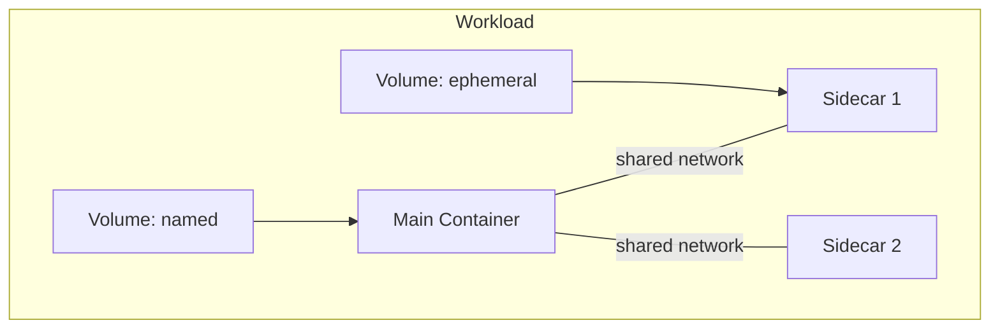

# Runner

## Overview

The Runner executes workloads (agent containers, workspace containers, sidecars). It is a **data plane** service — it does not decide what to run, it executes what it is told.

Multiple implementations exist for different backends:

| Implementation | Backend | Status |
|----------------|---------|--------|
| `docker-runner` | Docker Engine | Existing (`agynio/platform`) |
| `k8s-runner` | Kubernetes | Planned |

## gRPC API

Defined in `agynio/api` at `proto/agynio/api/runner/v1/runner.proto`.

### Workload Lifecycle

| RPC | Description |
|-----|-------------|
| `StartWorkload` | Start a workload (main container + optional sidecars with shared network) |
| `StopWorkload` | Stop a running workload |
| `RemoveWorkload` | Remove a workload and optionally its volumes |
| `InspectWorkload` | Inspect workload state (id, image, labels, mounts, status) |
| `TouchWorkload` | Update last-used timestamp (TTL keepalive) |

### Query

| RPC | Description |
|-----|-------------|
| `GetWorkloadLabels` | Get labels for a workload |
| `FindWorkloadsByLabels` | Find workloads matching a label set |
| `ListWorkloadsByVolume` | List workloads using a specific volume |

### Execution

| RPC | Description |
|-----|-------------|
| `Exec` | Bidirectional streaming exec |
| `CancelExecution` | Cancel a running execution |

Exec supports:
- Interactive (TTY) and non-interactive modes.
- Wall timeout, idle timeout, kill-on-timeout.
- Stdin streaming, stdout/stderr separation.
- Exit code and reason (completed, timeout, idle_timeout, cancelled, error).

### Streaming

| RPC | Description |
|-----|-------------|
| `StreamWorkloadLogs` | Server-streaming log output (follow mode) |
| `StreamEvents` | Server-streaming runtime events |

### Storage

| RPC | Description |
|-----|-------------|
| `PutArchive` | Upload a tar archive into a workload filesystem |
| `RemoveVolume` | Remove a named volume |

## Workload Model

A workload consists of:
- **Main container** — the primary process.
- **Sidecars** — optional containers sharing the same network namespace.
- **Volumes** — ephemeral or named (persistent), mounted into containers.

## Authentication

The docker-runner currently uses HMAC-based authentication with a shared secret (`DOCKER_RUNNER_SHARED_SECRET`). The target architecture uses OpenZiti network identity — the Runner enrolls using a service token and then authenticates all connections via mTLS. See [Authentication](authn.md).

The Runner also manages OpenZiti identities for agent workloads: creating an identity scoped to `agentId + threadId` before starting the pod and deleting it when the pod stops. MCP server sidecars within the agent workload share the agent's OpenZiti identity.
