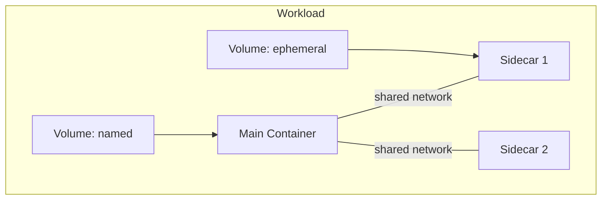

# Runner

## Overview

The Runner executes workloads (agent containers, workspace containers, sidecars). It is a **data plane** service — it does not decide what to run, it executes what it is told.

Multiple implementations exist for different backends:

| Implementation | Backend | Status |
|----------------|---------|--------|
| `docker-runner` | Docker Engine | Existing (`agynio/docker-runner`) |
| [`k8s-runner`](k8s-runner.md) | Kubernetes | Planned |

## gRPC API

Defined in `agynio/api` at `proto/agynio/api/runner/v1/runner.proto`.

### Workload Lifecycle

| RPC | Description |
|-----|-------------|
| `StartWorkload` | Start a workload (main container + optional sidecars with shared network) |
| `StopWorkload` | Stop a running workload |
| `RemoveWorkload` | Remove a workload and optionally its volumes |
| `InspectWorkload` | Inspect workload state (id, image, labels, mounts, status) |
| `TouchWorkload` | Update last-used timestamp (TTL keepalive) |

### Query

| RPC | Description |
|-----|-------------|
| `GetWorkloadLabels` | Get labels for a workload |
| `FindWorkloadsByLabels` | Find workloads matching a label set |
| `ListWorkloadsByVolume` | List workloads using a specific volume |

### Execution

| RPC | Description |
|-----|-------------|
| `Exec` | Bidirectional streaming exec |
| `CancelExecution` | Cancel a running execution |

Exec supports:
- Interactive (TTY) and non-interactive modes.
- Wall timeout, idle timeout, kill-on-timeout.
- Stdin streaming, stdout/stderr separation.
- Exit code and reason (completed, timeout, idle_timeout, cancelled, error).

### Streaming

| RPC | Description |
|-----|-------------|
| `StreamWorkloadLogs` | Server-streaming log output (follow mode) |
| `StreamEvents` | Server-streaming runtime events |

### Storage

| RPC | Description |
|-----|-------------|
| `PutArchive` | Upload a tar archive into a workload filesystem |
| `RemoveVolume` | Remove a named volume |

## Workload Model

A workload consists of:
- **Main container** — the primary process.
- **Sidecars** — optional containers sharing the same network namespace.
- **Volumes** — ephemeral or named (persistent), mounted into containers.

## Authentication

The Runner embeds the [OpenZiti Go SDK](https://github.com/openziti/sdk-golang) and binds the `runner` OpenZiti service. The Agents Orchestrator dials runners via OpenZiti — this is the same protocol for both internal and external runners, eliminating transport branching in the Orchestrator. See [Authentication — SDK Embedding](authn.md#sdk-embedding).

**Internal runners** (deployed as part of the platform) receive their OpenZiti identity from infrastructure provisioning — Terraform creates and enrolls the identity, stores the certificate and key as a Kubernetes Secret, and the runner pod mounts it on startup. No manual admin action is required.

**External runners** (operator-managed, outside the cluster) use a service token flow to obtain their OpenZiti identity. See [OpenZiti Integration — Runner Provisioning](openziti.md#runner-provisioning).

The Runner does not manage OpenZiti identities for agents. It receives the enrollment JWT from the Orchestrator as opaque configuration and passes it to the container. Identity creation and deletion are managed by the Agents Orchestrator via the Ziti Management service. See [OpenZiti Integration](openziti.md).
